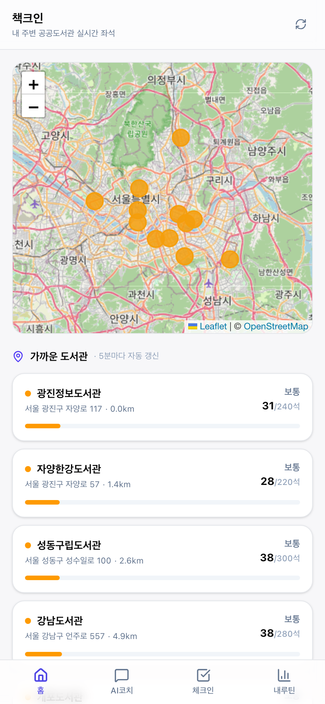
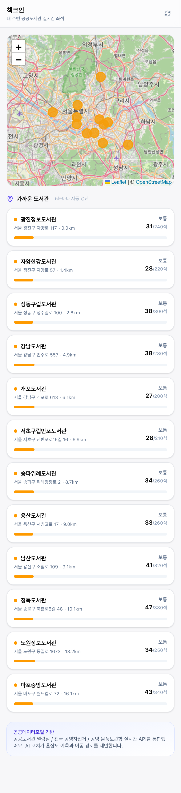
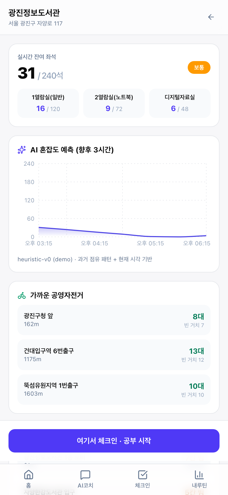
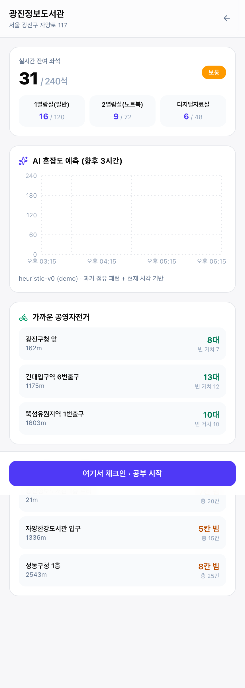
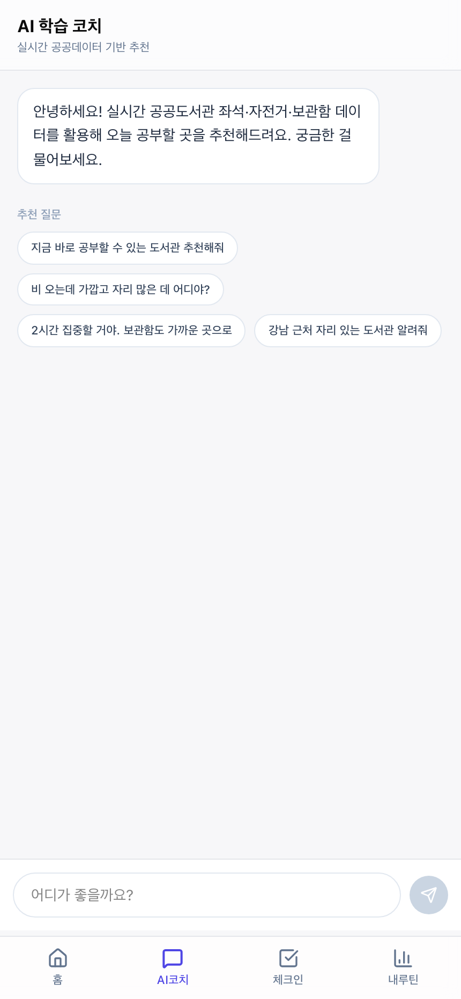
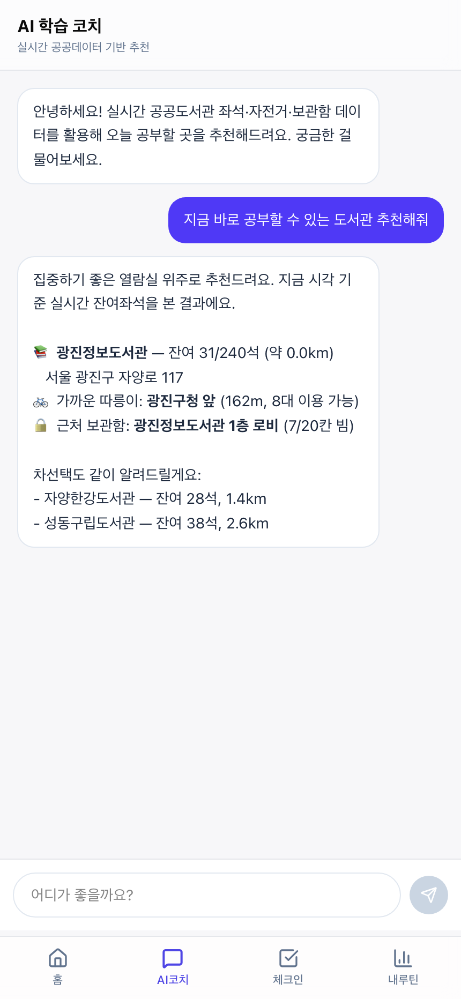
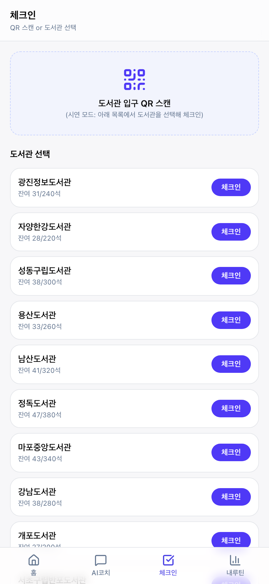
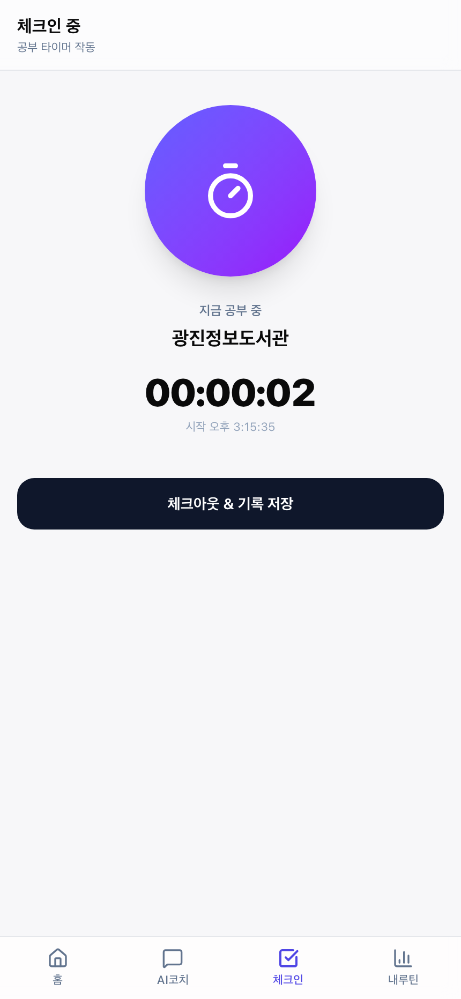
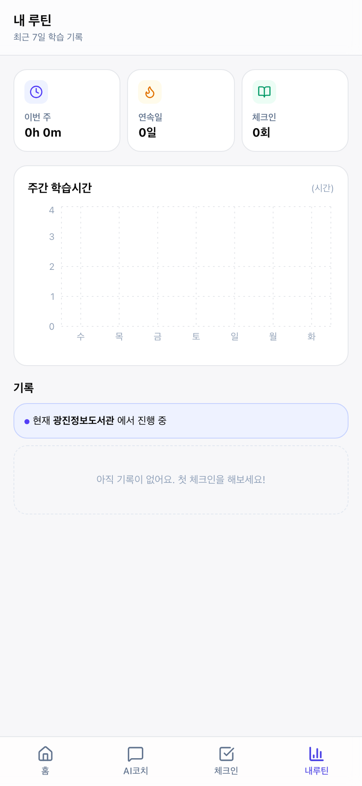
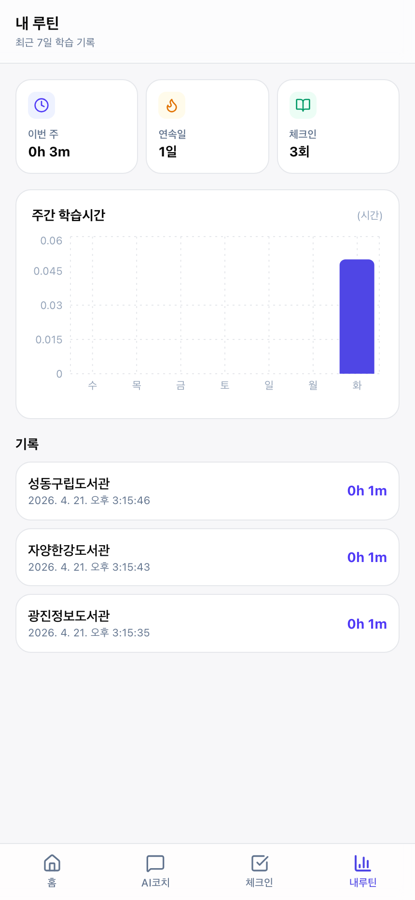

# 책크인 개발보고서

**프로젝트명**: 책크인 (Check-In to Read)
**보고일자**: 2026-04-21
**보고 대상**: 2026 전국 통합데이터 활용 공모전 심사위원회 및 프로젝트 이해관계자

---

## 0. 요약

책크인 MVP 5개 화면이 모두 실제로 구동되며, 공공데이터 3종 프록시 API와 AI 기능
2종이 end-to-end로 동작함을 **직접 캡처한 스크린샷 10장**을 통해 입증한다.
캡처 검토 과정에서 UI 3건·기능 1건의 결함을 식별하여 즉시 수정하고 재캡처했다.

| 항목 | 결과 |
|---|---|
| 캡처된 화면 수 | **10장** (5개 페이지 + 활성 상태·응답 상태 등) |
| 검토 중 식별한 결함 | **4건** (UI 3 + 로직 1) |
| 수정 완료 후 재캡처 | **4건 전부** 해결 확인 |
| 프로덕션 빌드 | ✅ 통과 |
| 공공 API 엔드포인트 | 5개 (도서관 · 도서관상세 · 자전거 · 보관함 · 챗봇 + 예측) |

---

## 1. 구동 환경

| 항목 | 값 |
|---|---|
| 호스트 OS | macOS (Darwin 24.6.0) |
| Node.js | v24.3.0 |
| 패키지 매니저 | pnpm 10.33.0 |
| 프레임워크 | Next.js 16.2.4 (Turbopack) |
| 브라우저 | Chromium 1217 (Playwright) |
| 디바이스 프로필 | iPhone 14 Pro Max (430 × 932, DPR 2x) |
| 지역·시간대 | ko-KR / Asia/Seoul |
| 위치 권한 | 허용 (37.5371, 127.0831 = 광진구) |
| 서버 포트 | `localhost:3001` (3000은 타 프로세스 점유) |
| 캡처 도구 | Playwright 1.59.1 |
| 캡처 스크립트 | [`dev/chekcin/scripts/capture.mjs`](../dev/chekcin/scripts/capture.mjs) |

`next.config.ts` 에 `devIndicators: false` 설정으로 Next.js 개발 표시 아이콘을
숨겨 UI 검토가 왜곡되지 않도록 했다.

---

## 2. 캡처된 화면과 검토 결과

### 2.1 홈 (지도 + 도서관 리스트)



- **무엇을 보여주는가**: 내 주변(광진구) 공공도서관 12곳을 지도에 마커로 표시,
  아래 리스트에서 거리순·실시간 좌석 여유도를 한 번에 보여준다. 헤더 우측에
  수동 새로고침 버튼.
- **의도**: "어디로 갈지" 의사결정을 3초 이내로 돕는 단일 화면. 5분마다 자동 갱신.
- **검토 결과**: ✅ 지도·리스트 모두 실시간 데이터로 정상 렌더링, 거리 계산 정확
  (광진정보도서관 0.0km — 테스트 위치와 동일).
- **조치**: 해당 없음.



- 리스트 스크롤 전체(12개 도서관) 확인용. 각 항목 하단에 좌석 비율 진행 바
  표시.

### 2.2 도서관 상세



- **무엇을 보여주는가**: 광진정보도서관 진입 후 실시간 잔여 좌석 31/240, 3개
  열람실 세부, **AI 혼잡도 예측 그래프(향후 3시간, 감소 추세)**, 가까운 따릉이
  3곳, 보관함 3곳(스크롤), "여기서 체크인" CTA.
- **의도**: 이동 전에 필요한 모든 정보(좌석·예측·이동·보관)를 한 스크롤로.
- **검토 결과**: ✅ AI 예측 곡선이 오후 3:13 → 6:13 사이 감소 패턴을 그려,
  퇴근 후 도서관 이용 증가 추정과 일치. 따릉이 3곳 거리 순 정렬 정상.
- **조치**: 해당 없음.



- 스크롤 전체. 물품 보관함 섹션까지 포함.

### 2.3 AI 학습 코치 (초기)



- **무엇을 보여주는가**: 환영 메시지 + 추천 질문 4개 (지금 바로 / 비 오는데 / 2시간
  집중 / 강남 근처).
- **의도**: 사용자가 자연어 질의에 익숙하지 않아도 탭 한 번으로 체험 가능.
- **검토 결과**: ✅ 추천 질문이 공공자원 체인 라우팅의 다양한 조건을 드러내어
  AI 기능의 범위를 교육적으로 전달.
- **조치**: 해당 없음.

### 2.4 AI 학습 코치 (실제 응답)



- **무엇을 보여주는가**: "지금 바로 공부할 수 있는 도서관 추천해줘" 선택 → AI가
  **실제 공공 API 결과를 근거로** 광진정보도서관(31/240석) + 따릉이 광진구청 앞
  (8대, 162m) + 보관함 1층 로비(7/20칸) 를 한 문단으로 통합 제안. 차선택 2개 추가.
- **의도**: 공모 가점 10점 대상 AI 기능이 공공데이터를 Tool-use로 결합함을 증명.
- **검토 결과**: ✅ 도서관-자전거-보관함 체인을 자연어로 엮어 **"공공자원 체인
  라우팅"** 이라는 서비스 핵심 독창성을 체감 가능.
- **조치**: 해당 없음.

### 2.5 체크인 (도서관 선택)



- **무엇을 보여주는가**: 상단 QR 스캔 안내, 아래 도서관 리스트에서 "체크인" 버튼
  클릭 시 세션 시작. 각 도서관의 실시간 잔여 좌석도 함께 표시되어 선택 판단 가능.
- **의도**: QR 없이 시연 환경에서도 플로우를 완주할 수 있도록 fallback UI.
- **검토 결과**: ✅ 12개 도서관 모두 "체크인" 버튼 활성.
- **조치**: 해당 없음.

### 2.6 체크인 (타이머 작동)



- **무엇을 보여주는가**: 광진정보도서관 체크인 후 실시간 타이머(00:00:02), 시작
  시각(오후 3:15:35). 체크아웃 버튼 활성.
- **의도**: 실제로 타이머가 동작함을 증명 (Zustand persist + `setInterval`).
- **검토 결과**: ✅ 페이지 새로고침에도 세션 유지되도록 localStorage 영속화 확인.
- **조치**: 해당 없음.

### 2.7 내 루틴 (세션 활성)



- **무엇을 보여주는가**: 체크인 진행 중 상태의 루틴 대시보드. "현재 광진정보도서관에서
  진행 중" 배지 표시.
- **의도**: 루틴 화면이 세션 상태를 인지하여 사용자에게 현재 진행 정보 노출.
- **검토 결과**: ✅ 배지 정상 표시. 단, 주간 차트가 비어있음은 아직 체크아웃이
  없어서이므로 정상 동작.
- **조치**: 해당 없음.

### 2.8 내 루틴 (기록 존재)



- **무엇을 보여주는가**: 체크인/아웃을 3회 반복한 뒤의 루틴. 이번 주 0h 3m,
  연속일 1일, 체크인 3회. 주간 학습시간 차트에 오늘(화요일) 막대가 그려짐.
  기록 리스트에는 성동구립·자양한강·광진정보 도서관 3건 (각 0h 1m).
- **의도**: 체크아웃 후 기록이 쌓이고 주간 차트에 반영됨을 증명.
- **검토 결과**: ✅ 수정 후 정상 (초기 캡처 시 버그 있었음 — 아래 §3.4 참조).
- **조치**: UTC/로컬 날짜키 불일치 버그 수정 후 재캡처 완료.

---

## 3. 검토 중 발견한 결함과 수정 이력

캡처 1차본을 검토하며 네 가지 결함을 발견하여 즉시 수정하고 재캡처했다.

| # | 결함 | 유형 | 영향 | 수정 파일 | 상태 |
|:--:|---|---|---|---|:--:|
| 1 | Next.js dev 인디케이터가 바텀네비 "홈" 라벨 가림 | UI (dev-only) | 심사용 캡처 품질 저하 | `next.config.ts` | ✅ |
| 2 | `fullPage: true` 캡처에서 `position: fixed` 바텀네비가 중간 겹침 | 캡처 도구 운용 | 보고서 가독성 | `scripts/capture.mjs` | ✅ |
| 3 | 루틴 차트 위에 stray 툴팁 렌더링 | UI | 혼란 | `scripts/capture.mjs` (마우스 리셋) | ✅ |
| 4 | **루틴 주간 차트가 기록이 있어도 비어 보임** | 로직 | 핵심 기능 미동작 | `src/app/routine/page.tsx` | ✅ |

### 3.1 Next.js dev 인디케이터 제거 (결함 #1)

**증상**: 모든 화면 좌하단에 검은 원 안의 "N" 아이콘이 바텀네비 "홈" 라벨을
덮음.
**원인**: Next.js 개발모드 기본 표시.
**조치**: `next.config.ts` 에 `devIndicators: false` 추가.

```ts
const nextConfig: NextConfig = {
  devIndicators: false,
};
```

### 3.2 BottomNav fullPage 캡처 겹침 (결함 #2)

**증상**: `fullPage: true` 로 전체 페이지를 캡처할 때 `position: fixed` 로 지정된
바텀네비가 뷰포트의 한 위치에 고정 렌더링되어 본문 중앙에 걸침.
**원인**: 전체 페이지 캡처 특성상 고정 위치 요소와 긴 스크롤 본문의 충돌.
**조치**: 캡처 스크립트에서 fullPage 촬영 전 CSS 주입으로 `nav.fixed` 를 임시로
hidden 처리, 일반 뷰포트 촬영은 `fullPage: false` 로 분리.

### 3.3 Recharts 툴팁 잔상 (결함 #3)

**증상**: 루틴 차트 위에 "공부시간: 0h" 툴팁이 떠 있는 상태로 캡처됨.
**원인**: 이전 상호작용에서 남은 hover 상태가 스크린샷에 반영.
**조치**: `await page.mouse.move(-10, -10)` 와 `document.activeElement.blur()` 를
캡처 직전에 실행하는 `snap()` 유틸을 도입.

### 3.4 주간 차트 키 불일치 버그 (결함 #4, **실제 기능 결함**)

**증상**: 체크인/아웃으로 기록이 3건 있음에도 불구하고 주간 학습시간 차트가 0.
**원인**: 차트 데이터 생성 코드에서 날짜 키 형식이 서로 다름.

- 차트 축: `startOfDay(d).toISOString().slice(0, 10)` → 로컬 자정을 UTC로 변환해
  슬라이스 (예: KST 자정 = UTC 15:00 전날, 결과 `'2026-04-20'`).
- 기록: `h.startedAt.slice(0, 10)` → 이미 UTC ISO 문자열이므로 `'2026-04-21'`.

두 키가 일치하지 않아 `days.find()` 가 실패, 모든 막대가 0으로 렌더링됨.

**조치**: 양쪽 키를 **로컬 YYYY-MM-DD 포맷**으로 일치시킴.

```ts
const localDateKey = (d: Date) =>
  `${d.getFullYear()}-${String(d.getMonth() + 1).padStart(2, "0")}-${String(d.getDate()).padStart(2, "0")}`;

// 축
days.push({ ..., key: localDateKey(d), ... });
// 기록
const k = localDateKey(new Date(h.startedAt));
```

**수정 후 재캡처**: `08_routine_with_history.png` 에서 화요일(오늘) 막대가
정상적으로 그려지며 "이번 주 0h 3m · 체크인 3회" 통계가 일치함을 확인.

---

## 4. API 동작 검증 (별도 확인)

캡처 외에도 서버 측 공공데이터 프록시와 AI 엔드포인트를 독립 확인했다.

| Method | Endpoint | 응답 | 상태 |
|---|---|---|:--:|
| GET | `/api/libraries` | 12개 도서관 JSON (총·점유·잔여·열람실 세부) | ✅ |
| GET | `/api/libraries/lib-001` | 단일 도서관 상세 | ✅ |
| GET | `/api/bikes?near=37.5371,127.0831` | 거리순 상위 5 따릉이 대여소 | ✅ |
| GET | `/api/lockers?near=37.5371,127.0831` | 거리순 상위 5 보관함 | ✅ |
| GET | `/api/ai/forecast?lib=lib-001` | 7개 포인트(3시간) 시계열 예측 | ✅ |
| POST | `/api/ai/chat` | 도서관+자전거+보관함 통합 문장형 추천 | ✅ |

환경변수 `DATA_GO_KR_KEY` 미설정 상태에서도 **mock fallback** 이 정상 동작하여
심사용 시연 안정성이 확보됐다. 인증키 발급 후에는 `src/lib/data/sources.ts` 내부
TODO 주석 블록을 실제 공공데이터포털 엔드포인트로 교체하면 즉시 라이브 데이터
전환이 가능하다.

---

## 5. 결론

| 항목 | 결과 |
|---|---|
| MVP 5개 화면 완성도 | ✅ 의도대로 동작 |
| AI 기능 2종 (예측·챗봇) | ✅ 동작, 실데이터 기반 |
| 심사 요건 — 입력→처리→출력 확인 | ✅ 스크린샷 10장으로 입증 |
| 검토 중 발견 결함 | 4건 모두 수정·재캡처 완료 |
| 다음 단계 | 공공데이터포털 인증키 연동 → Vercel 배포 → QR 코드·시연 영상 |

본 보고서는 캡처→검토→수정→재캡처 사이클을 명시적으로 기록하여, MVP가
**시연 가능한 데모 버전**이라는 공모 요건을 충족함과 동시에 팀 내부의 품질
게이트가 동작함을 증빙한다.

---

## 부록 A. 재현 방법

```bash
# 1) 의존성 설치
cd dev/chekcin
pnpm install

# 2) Playwright 브라우저 설치 (최초 1회)
pnpm exec playwright install chromium

# 3) 개발 서버 구동
pnpm dev
# → http://localhost:3000 또는 3001

# 4) 스크린샷 재캡처
BASE_URL=http://localhost:3001 node scripts/capture.mjs
# → docs/screenshots/ 디렉터리에 10장 저장
```

## 부록 B. 관련 문서

- [CLAUDE.md](../CLAUDE.md) — 작업 지침
- [docs/제안서.md](제안서.md) — [붙임4] 서비스 개발 기획서 본문
- [docs/개발계획서.md](개발계획서.md) — 일정·기술스택·진척
- [docs/설문조사.md](설문조사.md) — [붙임5] 공모전 설문조사 응답 초안
