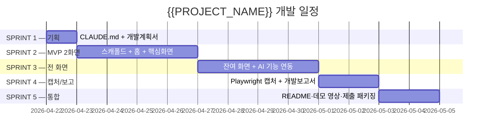

# {{PROJECT_NAME}} — 개발계획서

> 이 파일은 `_여분_공유/templates/개발계획서.md` 템플릿에서 생성됐습니다.
> `last_updated: YYYY-MM-DD HH:MM` 헤더를 매 갱신 시 수정하세요.

**last_updated**: YYYY-MM-DD HH:MM
**진척도**: 0% (0 / N 완료)

---

## 1. 기술 스택

| 계층 | 기술 | 버전 | 선정 사유 |
|---|---|---|---|
| 프레임워크 | {{FRAMEWORK}} | {{VERSION}} | {{WHY}} |
| 스타일 | Tailwind CSS v4 + a11y 토큰 | 4.x | `_여분_공유/tailwind-a11y.config.ts` 상속 |
| 상태 관리 | {{STATE}} | - | - |
| LLM (로컬) | Ollama `{{LLM_ALIAS}}` → {{LLM_MODEL}} | latest | CLAUDE.md §7, `_여분_공유/lib/local_llm.py` |
| 구조화 출력 | outlines / llama.cpp grammar | - | JSON 스키마 강제 |
| STT (선택) | whisper.cpp / MLX Whisper large-v3 | - | `_여분_공유/lib/local_stt.py` |
| TTS (선택) | Kokoro (ko) / XTTS-v2 | - | `_여분_공유/lib/local_tts.py` |
| 지도 (선택) | Leaflet + OSM | 1.9+ | `_여분_공유/components/Map.tsx` |
| 배포 | 로컬 + 시연 영상 | - | 오프라인 시연 가능 |

---

## 2. 개발 일정 (Gantt)

| 스프린트 | 시작 | 종료 | 산출물 | 상태 |
|---|---|---|---|---|
| S1 | 2026-04-22 | 2026-04-22 | CLAUDE.md, 개발계획서 | ⬜ 예정 |
| S2 | 2026-04-23 | 2026-04-26 | MVP 2화면 빌드 통과 | ⬜ 예정 |
| S3 | 2026-04-27 | 2026-04-30 | 전 화면 + AI 연동 | ⬜ 예정 |
| S4 | 2026-05-01 | 2026-05-02 | 캡처 5+, 개발보고서 | ⬜ 예정 |
| S5 | 2026-05-03 | 2026-05-04 | 제출 패키징 | ⬜ 예정 |

상태값: `✅ 완료 / 🟡 진행중 / ⬜ 예정 / ⚠️ 지연`

---

## 3. 마일스톤

| 일자 | 산출물 | 검증 방법 | 달성 |
|---|---|---|---|
| 2026-04-22 | CLAUDE.md + 개발계획서 | Markdown lint | ⬜ |
| 2026-04-26 | MVP 2화면 빌드 통과 | `pnpm build` / `streamlit run` | ⬜ |
| 2026-04-30 | 전 화면 + 로컬 AI 연동 | E2E 수동 테스트 | ⬜ |
| 2026-05-02 | 캡처 5+ & 개발보고서 | 파일 존재 + 검토 체크 | ⬜ |
| 2026-05-04 | 제출 패키지 | README 갱신 + 영상 | ⬜ |

---

## 4. 스프린트 진척

### S1
- [ ] CLAUDE.md 작성
- [ ] 개발계획서 작성 (본 문서)

### S2
- [ ] 프레임워크 스캐폴드
- [ ] 공공 API 프록시 연결
- [ ] 홈 + 핵심 1화면 구현
- [ ] Mock 폴백 동작

### S3
- [ ] 잔여 화면 3~4개
- [ ] 로컬 LLM 연동 (`LocalLLM`)
- [ ] 필요 시 STT/TTS 연동

### S4
- [ ] `capture.mjs` 실행
- [ ] 캡처 검토 → 수정 → 재캡처
- [ ] 개발보고서 작성

### S5
- [ ] README 갱신
- [ ] 시연 영상 녹화
- [ ] 최종 커밋·푸시

---

## 5. 현재 상황

**last_updated: YYYY-MM-DD HH:MM**

현재 진행 중: 없음 (S1 시작 전)

완료: -
다음 작업: S1.1 CLAUDE.md 치환 및 커밋

---

## 6. 위험·이슈

| ID | 발생일 | 위험 | 영향 | 대응 |
|---|---|---|---|---|
| R1 | - | 로컬 LLM 응답 지연 | 中 | Metal/MLX 가속, 프롬프트 캐싱 |
| R2 | - | 공공 API 키 미발급 | 高 | mock fixture 폴백, 사전 신청 |
| R3 | - | 메모리 초과 (동시 LLM) | 中 | `ollama stop` 전환, 단일 로드 원칙 |
| R4 | - | 심사 환경 네트워크 차단 | 高 | 완전 오프라인 시연 영상 확보 |

---

## 7. 자원 사용

| 자원 | 예상치 | 비고 |
|---|---|---|
| LLM 호출당 tokens | 500~2,000 | Ollama 로컬 |
| 로컬 RAM 점유 | {{RAM_ESTIMATE}} GB | 모델 로드 시 |
| API 요금 | **$0** | 모두 로컬 |
| 스토리지 | 모델 + 데이터 | {{STORAGE}} GB |

---

*`{{PROJECT_SLUG}}/docs/개발계획서.md` · v1 · 2026-04-22*
