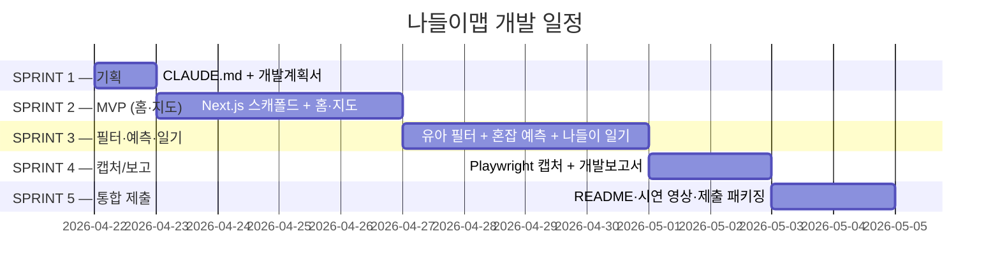

# 나들이맵 — 개발계획서

> 본 문서는 `_여분_공유/templates/개발계획서.md` 템플릿을 기반으로 작성됐다.
> 제안서([`../제안서.md`](../제안서.md)) §5.1 기술 스택 규격을 준수한다.
> 갱신 시 **§5 현재 상황** 의 `last_updated` 헤더를 반드시 수정한다.

**last_updated**: 2026-04-22
**진척도**: 10% (1 / 10 완료 — S1.1 CLAUDE.md 작성)

---

## 1. 기술 스택

제안서 §5.1 표를 그대로 따른다. 로컬 LLM 제약(루트 CLAUDE.md §7)을 엄수.

| 계층 | 기술 | 버전 | 선정 사유 |
|---|---|---|---|
| 프레임워크 | Next.js App Router + TypeScript | 16.x | SSR, 로컬 빌드 즉시 배포 |
| 스타일 | Tailwind CSS v4 + a11y 토큰 | 4.x | `_여분_공유/tailwind-a11y.config.ts` 상속 |
| 지도 | Leaflet + OpenStreetMap | 1.9+ | 무료, API 키 불필요 |
| 상태 관리 | TanStack Query + Zustand persist | latest | 자동 리페치, 체크인 영속 |
| 차트 | Recharts | latest | 혼잡 예측 막대 그래프 (제안서 §2.2 ④) |
| LLM (로컬) | Ollama `chat` → `llama3.3:70b-instruct-q4_K_M` | latest | CLAUDE.md §7, 온디바이스 Tool-use |
| 구조화 출력 | `outlines` | latest | 5단계 동선 JSON 스키마 강제 |
| 혼잡 예측 (초기) | 휴리스틱(요일·시간·날씨) + 이동평균 | - | 제안서 §2.2 (2) 초기 전략 |
| 공공 API 프록시 | Next.js API Route + 5분 TTL 캐시 | - | `_여분_공유/lib/public-api-proxy.ts` |
| DB (Phase 2) | Supabase (PostgreSQL, RLS) | - | 체크인 로그, 선택 적용 |
| 배포 | 로컬 + 시연 영상 | - | 오프라인 시연 가능 |

---

## 2. 개발 일정 (Gantt)

| 스프린트 | 시작 | 종료 | 산출물 | 상태 |
|---|---|---|---|---|
| S1 | 2026-04-22 | 2026-04-22 | CLAUDE.md, 개발계획서 | 🟡 진행중 |
| S2 | 2026-04-23 | 2026-04-26 | 홈(오늘 나들이) + 지도 화면 빌드 통과 | ⬜ 예정 |
| S3 | 2026-04-27 | 2026-04-30 | 유아 필터 + 혼잡 예측 + 나들이 일기 + LLM 연동 | ⬜ 예정 |
| S4 | 2026-05-01 | 2026-05-02 | 캡처 5+, 개발보고서 | ⬜ 예정 |
| S5 | 2026-05-03 | 2026-05-04 | 제출 패키징 | ⬜ 예정 |

상태값: `✅ 완료 / 🟡 진행중 / ⬜ 예정 / ⚠️ 지연`

---

## 3. 마일스톤

| 일자 | 산출물 | 검증 방법 | 달성 |
|---|---|---|---|
| 2026-04-22 | CLAUDE.md + 개발계획서 | Markdown lint + 커밋 확인 | 🟡 |
| 2026-04-26 | 홈·지도 2화면 빌드 통과 | `pnpm build` 성공, Mock 동작 | ⬜ |
| 2026-04-30 | 5화면 전체 + 로컬 LLM 연동 | E2E 수동 테스트, 5단계 카드 생성 | ⬜ |
| 2026-05-02 | 캡처 5장 이상 + 개발보고서 | 파일 존재 + 캡처 검토 체크 | ⬜ |
| 2026-05-04 | 제출 패키지 | README 갱신 + 시연 영상 | ⬜ |

---

## 4. 스프린트 진척 (5화면 분해 — 제안서 §2.1)

### S1 (기획)
- [x] CLAUDE.md 작성
- [ ] 개발계획서 작성 (본 문서)

### S2 (MVP — 화면 ①·②)
- [ ] Next.js 16 App Router 스캐폴드 (`dev/outing-map/`)
- [ ] Tailwind v4 + a11y 토큰 적용
- [ ] 공공 API 프록시 라우트: `/api/parking`, `/api/toilets`, `/api/nursing`, `/api/kidslib`, `/api/parks`
- [ ] Mock fixture 폴백 (인증키 부재 시)
- [ ] **화면 ① 홈 (오늘 나들이)**: 목적지 입력 + 5단계 카드 플레이스홀더
- [ ] **화면 ② 지도**: Leaflet + 반경 2km POI 마커 (3단계 색상 코드)

### S3 (화면 ③·④·⑤ + AI)
- [ ] **화면 ③ 유아 필터**: 기저귀교환대·유아좌변기·수유실·휠체어·엘리베이터 토글
- [ ] **화면 ④ 혼잡 예측**: Recharts 막대 그래프 (현재 + 1·2시간 후)
  - 초기: 요일·시간·날씨 기반 휴리스틱 + 이동평균
- [ ] **화면 ⑤ 나들이 일기**: 체크인 + 사진·메모 + "오늘의 코스" 카드
- [ ] `/api/ai/plan` — Ollama `llama3.3:70b-q4` + `outlines` 로 5단계 동선 JSON 생성
- [ ] `/api/ai/forecast` — 혼잡도 예측 엔드포인트
- [ ] 기상청 API허브 연동 (실내/실외 전환 로직)

### S4 (캡처·보고)
- [ ] `node _여분_공유/scripts/capture.mjs http://localhost:3000 docs/screenshots`
- [ ] 5화면 각 1장 이상 캡처 (총 5+)
- [ ] 캡처 검토 → 결함 수정 → 재캡처
- [ ] `docs/개발보고서.md` 작성 (캡처당 "의도/검토/조치" 형식)

### S5 (제출 패키징)
- [ ] `README.md` 갱신 (실행 방법, 로컬 LLM 설치 포함)
- [ ] 시연 영상 녹화 (오프라인 모드 확인)
- [ ] 최종 커밋·푸시

---

## 5. 현재 상황

**last_updated: 2026-04-22**

현재 진행 중: **S1 (기획)** — CLAUDE.md 커밋 완료, 본 개발계획서 초안 작성 중.

완료:
- `_여분_전국통합데이터_나들이맵/CLAUDE.md` 작성 및 커밋

다음 작업:
- S1.2 개발계획서 v1 커밋
- S2.1 `dev/outing-map/` Next.js 16 스캐폴드 생성

---

## 6. 위험·이슈

| ID | 발생일 | 위험 | 영향 | 대응 |
|---|---|---|---|---|
| R1 | 2026-04-22 | **혼잡 예측 초기 데이터 부족** (체크인 로그가 없어 학습 불가) | 높음 | Phase 1 는 요일·시간·날씨 휴리스틱 + 이동평균으로 대체. 정확도 지표는 "현재 혼잡 단계" 판정 기준으로만 보고. Phase 2에서 LightGBM 전환 (제안서 §5.4) |
| R2 | 2026-04-22 | **수유실 데이터 최신성** (갱신 주기 길어 폐쇄·이전 누락 가능) | 중간 | 월 1회 정기 동기화 스케줄러 + 사용자 제보 엔드포인트 마련. 제안서 §4.3, §5.3 명시 |
| R3 | 2026-04-22 | 공공 API 일시 장애 | 높음 | 5분 TTL 캐시 + stale-while-revalidate + Mock fixture 폴백 |
| R4 | 2026-04-22 | 지자체별 POI 속성 스키마 상이 | 중간 | 표준화 어댑터 레이어 (`lib/adapters/*.ts`) |
| R5 | 2026-04-22 | 로컬 LLM 응답 지연 (70B Q4 RAM 점유 약 45GB) | 중간 | Metal/MLX 가속, 자주 쓰는 동선 결과 캐싱, 단일 모델 원칙 |
| R6 | 2026-04-22 | 위치 정보(PII) 노출 | 높음 | 클라이언트에서만 사용, 서버 저장 금지 (제안서 §5.3) |
| R7 | 2026-04-22 | 심사 환경 네트워크 차단 | 높음 | 완전 오프라인 시연 영상 확보, Mock 데이터 번들 |

---

## 7. 자원 사용

| 자원 | 예상치 | 비고 |
|---|---|---|
| LLM 호출당 tokens | 800~2,500 | 5단계 동선 생성 시 도구 호출 포함 |
| 로컬 RAM 점유 | 약 45GB | `llama3.3:70b-instruct-q4_K_M` 단일 로드 |
| API 요금 | **$0** | 모든 추론 로컬 (제안서 §5.3) |
| 스토리지 | 약 45GB | 모델 + Mock fixture 번들 |
| 공공 API 쿼터 | 일 10,000회 내외 | 5분 TTL 캐시로 수렴 |

---

*`_여분_전국통합데이터_나들이맵/docs/개발계획서.md` · v1 · 2026-04-22*
