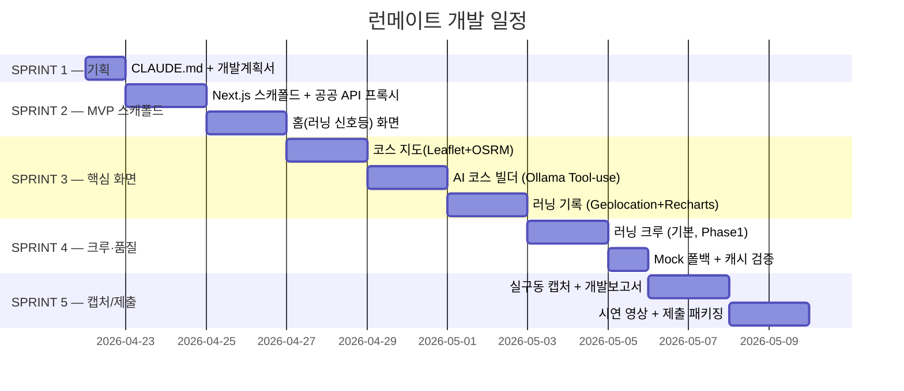

# 런메이트 — 개발계획서

> 이 파일은 `_여분_공유/templates/개발계획서.md` 템플릿에서 생성됐습니다.
> `last_updated` 헤더를 매 갱신 시 수정하세요.
> 본 문서의 기술 스택·화면 구성·리스크는 **제안서(§5.1·§2.2·§5.3)** 를 규격으로 삼으며,
> 충돌 시 제안서가 우선한다.

**last_updated**: 2026-04-22
**진척도**: 5% (1 / 20 완료) — S1-1 CLAUDE.md 작성 완료

---

## 1. 기술 스택 (제안서 §5.1 동일 규격)

| 계층 | 기술 | 버전 | 선정 사유 |
|---|---|---|---|
| 프레임워크 | Next.js 16 App Router + TypeScript | 16.x | SSR, API Routes 프록시 구축, Vercel 즉시 배포 |
| 스타일 | Tailwind CSS v4 + a11y 토큰 | 4.x | 빠른 프로토타이핑, `_여분_공유/tailwind-a11y.config.ts` 상속 |
| 지도·경로 | Leaflet + OpenStreetMap + **OSRM** | Leaflet 1.9+ | 무료, API 키 불필요, 공원·하천 POI 그래프 |
| 고도 프로파일 | OSM + SRTM DEM (국토지리정보원) | - | 평지/오르막 분류, Recharts 그래프 입력 |
| 상태 관리 | TanStack Query + Zustand persist | TQ 5.x / Z 4.x | 공공 API 캐시, 러닝 로그 영속 |
| 차트 | **Recharts** | 2.x | 페이스·거리·**고도 그래프** 렌더링 |
| LLM (로컬) | Ollama `ko` → **`qwen2.5:32b-instruct-q4_K_M`** | latest | 한국어 코스 설명 품질 우수, Metal 가속, 오프라인 동작 (CLAUDE.md §3) |
| 구조화 출력 | `outlines` 또는 `llama.cpp grammar` | - | Tool-use 코스 JSON 스키마 강제 |
| GPS | **Geolocation API** + Kalman 평활화 | 표준 | 모바일 브라우저 내장, 추가 권한 없음 |
| API 캐시 | 5분 TTL + stale-while-revalidate | - | 상류 공공 API 단기 장애 대응 |
| 테스트 | Vitest + Playwright (캡처) | - | 유닛 + 실구동 캡처 |
| 배포 | 로컬 시연 + 사전 녹화 영상 | - | 심사 환경 오프라인 대비 (CLAUDE.md §7.6) |

**공공데이터** (제안서 §4.1): 에어코리아 통합대기환경지수(CAI), 기상청 API허브
(초단기·단기·자외선), 국토교통부·지자체 도시공원·하천 자전거길, 행정안전부·KLID
전국 공영자전거 통합 API, 국토지리정보원 DEM.

---

## 2. 개발 일정 (Gantt)

| 스프린트 | 시작 | 종료 | 산출물 | 상태 |
|---|---|---|---|---|
| S1 | 2026-04-22 | 2026-04-22 | CLAUDE.md, 개발계획서 | 🟡 진행중 |
| S2 | 2026-04-23 | 2026-04-26 | Next.js 스캐폴드 + 공공 API 프록시 + 홈(신호등) | ⬜ 예정 |
| S3 | 2026-04-27 | 2026-05-02 | 코스 지도 + AI 코스 빌더 + 러닝 기록 | ⬜ 예정 |
| S4 | 2026-05-03 | 2026-05-05 | 러닝 크루(기본) + Mock 폴백 + 캐시 검증 | ⬜ 예정 |
| S5 | 2026-05-06 | 2026-05-09 | 캡처 5+ / 개발보고서 / 시연 영상 / 제출 | ⬜ 예정 |

상태값: `✅ 완료 / 🟡 진행중 / ⬜ 예정 / ⚠️ 지연`

---

## 3. 마일스톤

| 일자 | 산출물 | 검증 방법 | 달성 |
|---|---|---|---|
| 2026-04-22 | CLAUDE.md + 개발계획서 | Markdown lint + 커밋 2개 | 🟡 |
| 2026-04-26 | 홈(신호등) 화면 빌드 통과 | `pnpm build` + 수동 스모크 | ⬜ |
| 2026-05-02 | 5대 화면 중 4개 연동 완료 | 수동 E2E (홈·지도·빌더·기록) | ⬜ |
| 2026-05-05 | 5대 화면 + Mock 폴백 | 네트워크 차단 상태 전 화면 동작 | ⬜ |
| 2026-05-07 | 캡처 5+ & 개발보고서 v1 | `docs/screenshots/` ≥ 5 PNG | ⬜ |
| 2026-05-09 | 제출 패키지 | README 갱신 + 시연 영상 | ⬜ |

---

## 4. 스프린트 진척 — 제안서 5화면 분해

### S1 — 기획 (CLAUDE.md §2 작업 흐름)
- [x] CLAUDE.md 작성 (치환값 반영)
- [ ] 개발계획서 v1 작성 (본 문서)
- [ ] `docs/` 디렉터리 구조 확정

### S2 — MVP 스캐폴드 + 화면 ① 홈(러닝 신호등) (제안서 §2.2 ①)
- [ ] `dev/run-mate/` Next.js 16 + Tailwind v4 스캐폴드
- [ ] 공공 API 프록시 4종 (`/api/aq`, `/api/weather`, `/api/parks`, `/api/bikes`) + 5분 TTL 캐시
- [ ] Mock fixture 연결 (`_여분_공유/mock-fixtures/*.json`) — 키 없을 때 폴백
- [ ] 🟢/🟡/🔴 신호등 카드 + 이유 1줄 컴포넌트
- [ ] 아침·저녁·야간 3블록 추천 시간대
- [ ] `/api/ai/signal` — 규칙 기반 가중치(WHO 야외활동 권고 §9 기준선)

### S3 — 화면 ② 코스 지도 / ③ AI 코스 빌더 / ④ 러닝 기록
- 화면 ② (제안서 §2.2 ②)
  - [ ] Leaflet + OSM 타일 + Marker 클러스터
  - [ ] 공원·하천 POI + 3km/5km/10km 추천 루트 (OSRM)
  - [ ] 공영자전거 반납소 마커 + 편도 귀가 매칭 표시
- 화면 ③ (제안서 §2.2 ③ · AI 가점 10점 대상)
  - [ ] Ollama `qwen2.5:32b-instruct-q4_K_M` 연결 (`_여분_공유/lib/local-llm.ts`)
  - [ ] Tool-use 6종: `nearby_parks`, `nearby_trails`, `elevation_profile`,
        `nearby_bikes`, `air_quality_now`, `weather_now`
  - [ ] outlines / grammar 로 코스 JSON 스키마 강제
  - [ ] 자연어 입력 → 코스 카드 렌더
- 화면 ④ (제안서 §2.2 ④)
  - [ ] Geolocation API 트래킹 + Kalman 5초 평균 평활화
  - [ ] 페이스·거리·**고도 그래프** (Recharts)
  - [ ] 체크인 + PR(Personal Record) 자동 갱신
  - [ ] Zustand persist 로 러닝 로그 영속

### S4 — 화면 ⑤ 러닝 크루 + 품질 (제안서 §2.2 ⑤)
- [ ] 이벤트 생성/참여 (기본 CRUD)
- [ ] 신호등 조건 문자열 저장(예: "미세먼지 나쁨 시 취소") — **UI만**, 자동 취소는 Phase 2
- [ ] 네트워크 차단 상태에서 5화면 전부 동작 확인
- [ ] 상류 API 장애 주입 → stale-while-revalidate 동작 검증

### S5 — 캡처·보고·제출 (저장소 루트 CLAUDE.md §2.3·§5)
- [ ] `capture.mjs` 실행 (해상도 명시, 5화면 각 1장 이상)
- [ ] 캡처 검토 → 의도와 다른 UI 수정 → 재캡처
- [ ] `docs/개발보고서.md` 작성 (무엇/의도/검토/조치 형식)
- [ ] README 갱신 + 시연 영상 녹화 (네트워크 차단 상태)
- [ ] 최종 커밋·푸시 / Co-Authored-By: Claude 트레일러 0건 확인

---

## 5. 현재 상황

**last_updated: 2026-04-22**

현재 진행 중: S1 — 기획 문서화

완료:
- S1-1 CLAUDE.md 작성 (치환값 반영, 커밋 `docs(런메이트): add CLAUDE.md 작업 지침`)

다음 작업:
- S1-2 개발계획서 커밋 (본 문서)
- S2-1 `dev/run-mate/` Next.js 스캐폴드 + 공공 API 프록시 4종

---

## 6. 위험·이슈 (제안서 §5.3 확장)

| ID | 발생일 | 위험 | 영향 | 대응 |
|---|---|---|---|---|
| R1 | - | **GPS 정확도 편차** (터널·고층 빌딩 구간) | 中 | Kalman 필터 + 5초 평균, 이상치 트리밍, 화면 ④ 주의 문구 |
| R2 | - | **대기질 국지적 편차** (측정소 간 거리) | 中 | 최근접 측정소 **2개 가중 평균**(거리 역수), 신호등 이유 1줄에 측정소명 표기 |
| R3 | - | 공공 API 키 미발급 / Rate Limit 초과 | 高 | `_여분_공유/mock-fixtures/` 폴백 + 5분 TTL 캐시 + stale-while-revalidate |
| R4 | - | 로컬 LLM 응답 지연 (`qwen2.5:32b` 로드) | 低 | Metal/MLX 가속, 날씨·대기질별 프롬프트 캐싱, 스트리밍 렌더 |
| R5 | - | **러닝 크루 스마트 취소 범위** (조건 파싱·재공지) | 中 | MVP 에서는 UI 만, **Phase 2로 이연** (제안서 §2.2 (2)·§5.4) |
| R6 | - | 메모리 초과 (동시 LLM + 지도 타일 캐시) | 中 | 단일 LLM 로드 원칙, `ollama stop` 전환 |
| R7 | - | 심사 환경 네트워크 차단 | 高 | 완전 오프라인 시연 영상 + Mock 폴백 확인 |
| R8 | - | 개인정보 (러닝 경로) 유출 | 高 | 기본 비공개, 공유 시 시작/종료점 블러 (제안서 §5.3) |

---

## 7. 자원 사용

| 자원 | 예상치 | 비고 |
|---|---|---|
| LLM 호출당 tokens | 500~2,000 | Ollama 로컬, 스트리밍 |
| 로컬 RAM 점유 | 약 22 GB | `qwen2.5:32b-q4_K_M` 로드 시 (저장소 루트 §7.3 기준 잔여 충분) |
| API 요금 | **$0** | 모두 로컬 + 공공데이터 |
| 스토리지 | 모델 ~20GB + OSM 타일 캐시 ~2GB | 합산 ~22GB |
| 공공 API 호출 | 에어/기상 1h, 자전거 2min, 공원 24h | 캐시로 Rate Limit 준수 |

---

*`_여분_전국통합데이터_런메이트/docs/개발계획서.md` · v1 · 2026-04-22*
