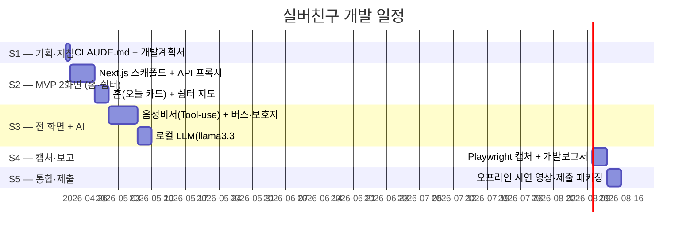

# 실버친구 — 개발계획서

> 본 문서는 `_여분_공유/templates/개발계획서.md` 에서 생성한 뒤 프로젝트 실제 내용으로 커스텀했습니다.
> 갱신 시 **§5 현재 상황** 의 `last_updated: YYYY-MM-DD HH:MM` 헤더를 반드시 수정합니다.
> 기술 스택의 진실 소스는 [`../제안서.md`](../제안서.md) 입니다. 문서·구현이 제안서와 어긋나면 제안서를 먼저 수정합니다.

**last_updated**: 2026-04-22
**진척도**: 0% (0 / 24 완료)

---

## 1. 기술 스택

제안서 §5.1 의 스택 표를 준수한다. 모든 AI 추론은 **로컬**(저장소 CLAUDE.md §7)에서 수행한다.

| 계층 | 기술 | 버전 | 선정 사유 |
|---|---|---|---|
| 프레임워크 | Next.js 16 App Router + TypeScript | 16.x | SSR 초기 로딩, Vercel 즉시 배포 |
| 스타일 | Tailwind CSS v4 + 고령자 a11y 토큰 | 4.x | 최소 18px·7:1 대비·48dp 터치 디폴트, `_여분_공유/tailwind-a11y.config.ts` |
| 상태 관리 | TanStack Query + Zustand(persist) | latest | 자동 리페치, 비회원 외출 로그 영속화 |
| 지도 | Leaflet + OpenStreetMap | 1.9+ | 무료·API 키 불필요, 컬러블라인드 팔레트 |
| LLM (로컬) | Ollama `chat` → `llama3.3:70b-instruct-q4_K_M` | latest | 한국어 품질 + Tool-use JSON, 오프라인 시연 |
| 구조화 출력 | `outlines` 또는 `llama.cpp grammar` | latest | Tool-use JSON 스키마 강제 |
| STT (1차) | 브라우저 Web Speech API | - | 의존성 최소, 즉시 동작 |
| STT (폴백) | whisper.cpp (large-v3) / MLX Whisper | latest | 고령자 발화 인식률 확보, 온디바이스 |
| TTS | Kokoro TTS (한국어) | latest | 자연스러운 한국어 합성, 오프라인 |
| 알림 | SMS Gateway (NHN Toast) | - | 보호자 앱 설치 불필요, 웹 링크 |
| 배포 | Vercel + 로컬 시연 영상 | - | 심사 환경 네트워크 차단 대비 |

**금지 의존성**: `anthropic`, `openai`, `@anthropic-ai/sdk`, `@google/genai`, Clova Voice 등 클라우드 AI API 클라이언트 일체.

---

## 2. 개발 일정 (Gantt)

| 스프린트 | 시작 | 종료 | 산출물 | 상태 |
|---|---|---|---|---|
| S1 | 2026-04-22 | 2026-04-22 | CLAUDE.md, 개발계획서 | 🟡 진행중 |
| S2 | 2026-04-23 | 2026-04-30 | Next.js 스캐폴드 + 홈·쉼터 2화면 + Mock 폴백 | ⬜ 예정 |
| S3 | 2026-05-01 | 2026-05-09 | 음성비서·버스·보호자 3화면 + 로컬 LLM 연동 | ⬜ 예정 |
| S4 | 2026-05-10 | 2026-05-15 | 캡처 5+, 개발보고서 v1 | ⬜ 예정 |
| S5 | 2026-05-16 | 2026-05-20 | 오프라인 시연 영상 + 제출 패키지 | ⬜ 예정 |

상태값: `✅ 완료 / 🟡 진행중 / ⬜ 예정 / ⚠️ 지연`

---

## 3. 마일스톤

| 일자 | 산출물 | 검증 방법 | 달성 |
|---|---|---|---|
| 2026-04-22 | CLAUDE.md + 개발계획서 v1 | Markdown lint, git log 2커밋 | 🟡 |
| 2026-04-30 | MVP 2화면(홈·쉼터) 빌드 통과 | `pnpm build`, Mock 모드 동작 | ⬜ |
| 2026-05-09 | 전 5화면 + 로컬 LLM Tool-use | E2E 수동 테스트, `ollama run` 로그 | ⬜ |
| 2026-05-15 | 캡처 5+ & 개발보고서 v1 | `docs/screenshots/*.png` 존재 | ⬜ |
| 2026-05-20 | 오프라인 시연 영상 + 제출 | 네트워크 차단 상태 녹화 확인 | ⬜ |

---

## 4. 스프린트 진척 (총 24 체크)

### S1 — 기획·지침 (2 체크)
- [x] CLAUDE.md 치환·작성 → 커밋
- [ ] 개발계획서 v1 작성 → 커밋 (본 문서)

### S2 — MVP 2화면 (6 체크)
- [ ] Next.js 16 App Router 스캐폴드 (`dev/silver-friend/`)
- [ ] Tailwind v4 + 고령자 a11y 토큰 적용
- [ ] 공공 API 프록시 레이어 (`/api/shelters`, `/api/seniorhalls`) — 5분 TTL 캐시
- [ ] Mock fixture 폴백 (`_여분_공유/mock-fixtures/` 참조)
- [ ] **화면 ① 홈 (오늘 카드)**: 추천 1장 + 날씨·미세먼지 뱃지
- [ ] **화면 ② 가까운 쉼터·경로당**: Leaflet 지도 + 반경 1km 리스트

### S3 — 전 화면 + AI (9 체크)
- [ ] 공공 API 프록시 확장 (`/api/bus/arrival`, `/api/parks`, `/api/clinics`)
- [ ] **화면 ③ 음성 비서**: Web Speech API 입력 + whisper.cpp 폴백 훅
- [ ] **화면 ④ 버스 알림**: 저상버스 실시간 도착시간 + 3분 전 Kokoro TTS 알림
- [ ] **화면 ⑤ 보호자 공유**: SMS 웹 링크 발송 + 해시 저장 (PII 클라이언트 보관)
- [ ] `ollama pull llama3.3:70b-instruct-q4_K_M`
- [ ] `/api/ai/today` — 로컬 LLM + outlines JSON 스키마 랭킹
- [ ] `/api/ai/chat` — LLM Tool-use (`nearby_shelters`, `bus_arrival`, `nearby_parks`, `nearby_clinics`, `weather_now`)
- [ ] Kokoro TTS 로컬 파이프라인 연결
- [ ] `pnpm build` 성공 (타입·ESLint 경고 0)

### S4 — 캡처·보고 (4 체크)
- [ ] `capture.mjs` 실행 → `docs/screenshots/` 5장+
- [ ] 캡처 검토 → 의도 불일치 UI 수정 → 재캡처 (이력 기록)
- [ ] 로컬 LLM 실행 로그 스크린샷 1장
- [ ] 개발보고서 v1 작성 (화면별 "무엇/의도/검토/조치" 서술)

### S5 — 통합·제출 (3 체크)
- [ ] 네트워크 차단(오프라인) 상태 시연 영상 녹화
- [ ] README 갱신 + Vercel 배포 URL·QR 정리
- [ ] 제출 패키지 최종 커밋 (Co-Authored-By: Claude 트레일러 0건 확인)

---

## 5. 현재 상황

**last_updated: 2026-04-22**

- 진행 중: S1 — CLAUDE.md 작업 지침 작성 완료, 개발계획서 v1 초안 작성 중.
- 완료: (진행 중 커밋으로 곧 갱신)
- 다음 작업: S2.1 Next.js 16 스캐폴드 생성(`dev/silver-friend/`) 및 Tailwind v4 고령자 토큰 적용.
- 주요 의사결정: LLM 은 `llama3.3:70b-instruct-q4_K_M`(RAM 약 42GB) 단일 로드 원칙. 동시 로드 시 `ollama stop` 후 교체.

---

## 6. 위험·이슈

제안서 §5.3 의 리스크 표를 반영하고, 로컬 LLM·개발 환경 관련 항목을 추가했다.

| ID | 위험 | 영향 | 발생 가능성 | 대응 |
|---|---|:---:|:---:|---|
| R1 | **고령자 발화 인식률 한계** (사투리·쉰 목소리·저속 발화) | 高 | 高 | Web Speech 실패 시 **whisper.cpp(large-v3) 로컬 폴백**, 짧은 명령어·버튼 대체 UX, 자주 쓰는 명령 프리셋(음성 + 큰 버튼 이중 제공) |
| R2 | 공공 API 일시 장애·키 발급 지연 | 高 | 中 | 5분 TTL + stale-while-revalidate, `_여분_공유/mock-fixtures/*` 폴백, 데모 모드 내장 |
| R3 | 로컬 LLM 응답 지연(Tool-use 왕복 2~4회) | 中 | 中 | Metal 가속, 프롬프트 캐싱, 스트리밍 응답, 짧은 system prompt |
| R4 | 메모리 초과 (LLM + whisper.cpp + Kokoro 동시 로드) | 中 | 中 | 단일 로드 원칙, `ollama stop` 후 교체, Kokoro 는 요청 시 로딩 |
| R5 | 지자체별 경로당·쉼터 스키마 상이 | 中 | 高 | 표준화 어댑터 레이어, 수도권 3개 지자체 우선 |
| R6 | 보호자 개인정보(휴대폰번호) 유출 | 高 | 低 | 해시 저장, 번호 평문은 클라이언트에만, PII 서버 최소화 |
| R7 | 심사 환경 네트워크 차단 | 高 | 中 | 완전 오프라인 시연 영상 사전 녹화, `ollama serve` 로컬 데모 |
| R8 | Co-Authored-By: Claude 트레일러 실수 삽입 | 低 | 中 | 커밋 직전 `git log --format=%B -n 1` 점검, pre-commit 훅 검토 |

---

## 7. 자원 사용

| 자원 | 예상치 | 비고 |
|---|---|---|
| LLM 호출당 tokens | 600 ~ 2,500 | Tool-use 왕복 포함, Ollama 로컬 |
| 로컬 RAM 점유 (LLM) | 약 42 GB | `llama3.3:70b-instruct-q4_K_M` 단일 로드 |
| 로컬 RAM 점유 (STT 폴백) | 약 3 GB | whisper.cpp large-v3 GGUF |
| 로컬 RAM 점유 (TTS) | 약 2 GB | Kokoro |
| API 요금 | **$0** | 모든 추론 로컬 |
| 스토리지 | 약 55 GB | 모델 + 시연 셋 + 영상 |
| 공공데이터 API 호출 | 갱신 주기 존중 | 경로당 일 1회 / 쉼터 시간당 / 버스 30초 |

---

*`_여분_전국통합데이터_실버친구/docs/개발계획서.md` · v1 · 2026-04-22*
