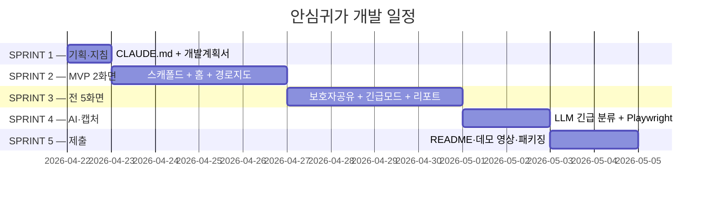

# 안심귀가 (Safe Return) — 개발계획서

> 이 파일은 `_여분_공유/templates/개발계획서.md` 템플릿에서 생성됐습니다.
> `last_updated` 헤더를 매 갱신 시 수정하세요.

**last_updated**: 2026-04-22
**진척도**: 5% (1 / 20 완료 — S1 착수)

---

## 1. 기술 스택

제안서 §5.1 규격과 루트 CLAUDE.md §7 로컬 LLM 원칙을 반드시 일치시킨다.

| 계층 | 기술 | 버전 | 선정 사유 |
|---|---|---|---|
| 프레임워크 | Next.js 16 App Router + TypeScript | 16.x | SSR, PWA 설치 없이 URL 접속, Vercel 즉시 배포 |
| 스타일 | Tailwind CSS v4 + a11y 토큰 | 4.x | 긴급 UI 고대비, `_여분_공유/tailwind-a11y.config.ts` 상속 |
| 상태 관리 | Zustand + persist | latest | 최근 경로·보호자 목록 로컬 보존 (PII 최소) |
| 지도 렌더 | Leaflet | 1.9+ | OSM 타일, 경량·커스텀 마커 자유 |
| 경로 엔진 | **OSRM self-host** (도커) | 5.27+ | 밝기 점수 가중치 **후처리** 를 자유롭게 합성 |
| 경로 가중치 | 순수 TS 함수 (`/api/ai/safepath`) | - | CCTV·가로등·편의점·지구대 밀도 → 밝기 점수 S∈[0,1] |
| LLM (로컬) | Ollama `small` → **qwen2.5:7b-instruct-q4_K_M** | latest | 긴급 3단계 분류 경량·저지연 (제안서 §5.1) |
| 구조화 출력 | **outlines** (또는 llama.cpp grammar) | latest | "일상 불안/잠재 위협/즉시 긴급" JSON 스키마 강제 |
| 긴급 센서 | **DeviceMotion API** + Geolocation | 브라우저 네이티브 | 흔들기 감지 + 3초 카운트다운 (오탐 방지) |
| SMS | **NHN Toast SMS Gateway** | REST v3.0 | 보호자 링크 발송, 키 없을 때 mock fallback |
| 보호자 토큰 | JWT (짧은 만료) | - | 서버 영구 저장 없음, PII 최소화 |
| 배포 | Vercel + 사전녹화 영상 | - | 오프라인 시연 가능 |

**AI 사용 제약 준수 매핑** (루트 CLAUDE.md §7.4):

| 제안서 상 | 실제 구현 |
|---|---|
| "긴급 자연어 분류 에이전트" | Ollama `qwen2.5:7b-q4_K_M` + outlines JSON 스키마 |
| "AI 밝기 점수" | 순수 TS 가중 합산 (AI 아님, 규칙 기반) |
| 클라우드 LLM | **전면 금지** — 전부 로컬 |

---

## 2. 개발 일정 (Gantt)

| 스프린트 | 시작 | 종료 | 산출물 | 상태 |
|---|---|---|---|---|
| S1 | 2026-04-22 | 2026-04-22 | CLAUDE.md, 개발계획서 | 🟡 진행중 |
| S2 | 2026-04-23 | 2026-04-26 | 홈 + 경로지도, 공공 API 프록시 6종, 밝기 점수 계산 | ⬜ 예정 |
| S3 | 2026-04-27 | 2026-04-30 | 보호자공유·긴급모드·리포트 3화면 | ⬜ 예정 |
| S4 | 2026-05-01 | 2026-05-02 | 로컬 LLM 긴급 분류 + 캡처 5+, 개발보고서 | ⬜ 예정 |
| S5 | 2026-05-03 | 2026-05-04 | README·시연 영상·제출 패키지 | ⬜ 예정 |

상태값: `✅ 완료 / 🟡 진행중 / ⬜ 예정 / ⚠️ 지연`

---

## 3. 마일스톤

| 일자 | 산출물 | 검증 방법 | 달성 |
|---|---|---|---|
| 2026-04-22 | CLAUDE.md + 개발계획서 v1 | Markdown lint, 커밋 2개 | 🟡 |
| 2026-04-26 | MVP 2화면 (홈·경로지도) 빌드 통과 | `pnpm build` 성공 + mock API 응답 | ⬜ |
| 2026-04-30 | 전 5화면 통과 + 보호자 SMS mock | E2E 수동 시나리오 (귀가 시작 → 도착) | ⬜ |
| 2026-05-02 | 캡처 5+ & 개발보고서 | 파일 존재 + 검토 체크리스트 7 ✅ | ⬜ |
| 2026-05-04 | 제출 패키지 | README 갱신 + 영상 + Vercel URL | ⬜ |

---

## 4. 스프린트 진척

### S1 — 기획·지침 (🟡 진행중)
- [x] 제안서 §5.1 스택 규격 확정
- [x] CLAUDE.md 작성
- [x] 개발계획서 v1 작성 (본 문서)
- [ ] 아이디어.md 와 제안서 정합성 재확인

### S2 — MVP 2화면 (⬜ 예정)
- [ ] Next.js 16 + Tailwind v4 스캐폴드 (`dev/safe-return`)
- [ ] 공공 API 프록시 6종 (`/api/{scouts,cctv,lamps,cvs,stations}` + 유동인구)
- [ ] Mock fixture 폴백 동작 (키 없이 시연 가능)
- [ ] 홈 화면: 도착지 입력 → 3개 경로 후보 (🟢🟡🔴) 카드 UI
- [ ] 경로 지도 화면: Leaflet + OSRM 결과 + CCTV/가로등/편의점 마커
- [ ] 밝기 점수 계산기 (반경 50m 커널 밀도 → S∈[0,1])

### S3 — 잔여 3화면 (⬜ 예정)
- [ ] 보호자 공유 화면: JWT 만료 URL + SMS(NHN Toast) mock
- [ ] 3분 단위 위치 스냅샷 전송 루프 + 도착 시 자동 종료
- [ ] 긴급 모드 화면: DeviceMotion 흔들기 감지 → 3초 카운트다운 → 해제 버튼
- [ ] `tel:112` 딥링크 폴백 + 보호자 동시 SMS
- [ ] 리포트 화면: 최근 귀가 평균 밝기 점수 + 이용 인프라 집계

### S4 — AI·캡처 (⬜ 예정)
- [ ] `ollama pull qwen2.5:7b-instruct-q4_K_M`
- [ ] `/api/ai/triage` 엔드포인트 + outlines JSON 스키마 ("일상 불안/잠재 위협/즉시 긴급")
- [ ] 오탐 방지 테스트 (정상 대화 10건 + 위험 대화 10건 라벨 검증)
- [ ] `node _여분_공유/scripts/capture.mjs http://localhost:3000 docs/screenshots` 실행
- [ ] 캡처 5장+ 검토 → 수정 → 재캡처
- [ ] 개발보고서 작성 (캡처별 의도/검토/조치 형식)

### S5 — 제출 (⬜ 예정)
- [ ] README 갱신 (환경변수·실행 순서·mock 모드)
- [ ] 시연 영상 녹화 (5화면 순회, 긴급 시나리오 포함)
- [ ] Vercel 배포 URL + QR
- [ ] 최종 커밋 (Co-Authored-By: Claude 0건 확인)

---

## 5. 현재 상황

**last_updated: 2026-04-22**

현재 진행 중: **S1 — 기획·지침**

완료:
- 제안서·아이디어 기반 스택 확정
- CLAUDE.md 작성 · 커밋 (`docs(안심귀가): add CLAUDE.md 작업 지침`)
- 개발계획서 v1 초안 (본 문서)

다음 작업:
1. S1 마무리 — 아이디어.md / 제안서.md 정합성 점검
2. S2.1 `dev/safe-return` Next.js 16 스캐폴드
3. S2.2 공공 API 프록시 + mock fixture 연결

---

## 6. 위험·이슈

제안서 §5.3 리스크표를 본 계획의 운영 리스크로 승격.

| ID | 발생일 | 위험 | 영향 | 대응 |
|---|---|---|---|---|
| R1 | 2026-04-22 | **112 자치경찰 API 미승인** | 높음 | `tel:112` 딥링크 + 문자 폴백으로 대체, 제안서 표기 일치 |
| R2 | 2026-04-22 | **흔들기 오탐 (주머니·도보 진동)** | 높음 | 임계치 튜닝 + **3초 카운트다운 + 해제 버튼 2스텝** 확정 |
| R3 | 2026-04-22 | **CCTV·가로등 스키마가 지자체별 상이 + 분기별 갱신** | 중간 | 표준화 어댑터 레이어 + 월 1회 정기 동기화 + 사용자 제보형 보정 |
| R4 | - | 공공 API 키 미발급 | 高 | `_여분_공유/mock-fixtures/` 폴백, 사전 신청 병행 |
| R5 | - | 로컬 LLM(qwen2.5:7b-q4) 응답 지연 | 中 | Metal 가속, 프롬프트 캐싱, 첫 토큰 스트리밍 |
| R6 | - | 메모리 초과 (동시 LLM) | 低 | 7B Q4(약 4.7GB)라 여유, 단일 로드 원칙 |
| R7 | - | 심사 환경 네트워크 차단 | 高 | 완전 오프라인 시연 영상 사전 녹화 |
| R8 | - | 보호자 공유 링크의 PII 유출 | 치명 | JWT 짧은 만료 + 서버 영구 저장 금지 (제안서 §5.3) |

---

## 7. 자원 사용

| 자원 | 예상치 | 비고 |
|---|---|---|
| LLM 호출당 tokens | 200~800 (긴급 분류 짧은 문장) | Ollama 로컬 |
| 로컬 RAM 점유 (LLM) | ~4.7 GB | qwen2.5:7b-q4_K_M 로드 시 |
| OSRM self-host RAM | ~2 GB | 서울 추출본 기준 |
| API 요금 | **$0** (LLM 전부 로컬) | NHN Toast SMS만 건당 과금, mock 기본 |
| 스토리지 | 모델 4.7GB + OSM 추출본 ~500MB | 합 ~6 GB |

---

*`_여분_전국통합데이터_안심귀가/docs/개발계획서.md` · v1 · 2026-04-22*
