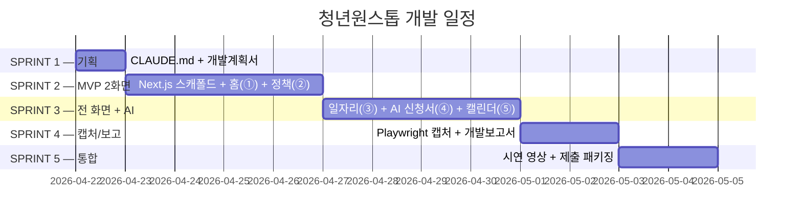

# 청년원스톱 — 개발계획서

> 제안서 §5.1 스택 규격과 §2.2 5개 화면 분해를 반영한 v1 초안.
> `last_updated` 는 매 갱신 시 수정.

**last_updated**: 2026-04-22
**진척도**: 5% (S1 문서 2종 작성 중)

---

## 1. 기술 스택

| 계층 | 기술 | 버전 | 선정 사유 (제안서 §5.1) |
|---|---|---|---|
| 프레임워크 | Next.js (App Router) + TypeScript | 16.x | SSR, Vercel 즉시 배포, 팀 표준 |
| 스타일 | Tailwind CSS v4 + a11y 토큰 | 4.x | `_여분_공유/tailwind-a11y.config.ts` 상속 |
| 상태 관리 | TanStack Query + Zustand persist | 5.x / 4.x | "내 조건" 영속화 · API 캐시 |
| 차트 | Recharts | 2.x | 마감·적합도 시각화 |
| **LLM (로컬)** | **Ollama `large` → `devstral-2:123b`** | latest | 74GB 단일 로드 · 긴 컨텍스트 RAG · 한국어 정확도 · 네트워크 불필요 |
| 구조화 출력 | `outlines` 또는 `llama.cpp grammar` | latest | JSON 스키마 강제 → 환각 억제 |
| 임베딩 | Ollama `nomic-embed-text` | latest | 로컬 임베딩, 서버 전송 없음 |
| 벡터 DB | **FAISS (로컬)** | 1.8.x | 법제처 법령·시행령 인덱스 |
| DB | SQLite (로컬) | 3.x | 사용자 프로필·매칭 로그 |
| 공공 API 게이트웨이 | `_여분_공유/lib/public-api-proxy.ts` | - | 온통청년·고용24·LH·SH·HRD-Net·서민금융진흥원 |
| 배포 | 로컬 구동 + 심사 시연 영상 | - | 완전 오프라인 동작 |

**AI 제약 원천**: 저장소 루트 `CLAUDE.md §7`. 본 프로젝트는 로컬 LLM 전용이며 외부 AI API SDK 를 **import 하지 않는다**.

---

## 2. 개발 일정 (Gantt)

| 스프린트 | 시작 | 종료 | 산출물 | 상태 |
|---|---|---|---|---|
| S1 | 2026-04-22 | 2026-04-22 | CLAUDE.md, 개발계획서 v1 | 🟡 진행중 |
| S2 | 2026-04-23 | 2026-04-26 | ① 홈(내 매칭) · ② 정책 탐색 빌드 통과 | ⬜ 예정 |
| S3 | 2026-04-27 | 2026-04-30 | ③ 일자리·훈련 · ④ AI 신청서 · ⑤ 마감 캘린더 + 로컬 LLM 연동 | ⬜ 예정 |
| S4 | 2026-05-01 | 2026-05-02 | 캡처 5+ · 개발보고서 1차 | ⬜ 예정 |
| S5 | 2026-05-03 | 2026-05-04 | 시연 영상 · README · 제출 패키징 | ⬜ 예정 |

상태값: `✅ 완료 / 🟡 진행중 / ⬜ 예정 / ⚠️ 지연`

---

## 3. 마일스톤

| 일자 | 산출물 | 검증 방법 | 달성 |
|---|---|---|---|
| 2026-04-22 | CLAUDE.md + 개발계획서 v1 | Markdown lint · 두 파일 존재 | 🟡 |
| 2026-04-26 | MVP 2화면 빌드 통과 | `pnpm build` 0 에러 · Mock 모드 렌더 | ⬜ |
| 2026-04-30 | 5화면 + 로컬 AI 연동 | E2E 수동 테스트 (매칭·초안 1건씩) | ⬜ |
| 2026-05-02 | 캡처 5+ & 개발보고서 | `docs/screenshots/*.png` 5개 이상 + 체크리스트 | ⬜ |
| 2026-05-04 | 제출 패키지 | README 갱신 + 시연 영상 + 커밋 트레일러 0건 | ⬜ |

---

## 4. 스프린트 진척

### S1 — 기획 (2026-04-22)
- [x] 저장소 루트 CLAUDE.md §7 재확인
- [x] 제안서.md / 아이디어.md 검토
- [~] CLAUDE.md 작성 (본 커밋에서 완료)
- [~] 개발계획서 v1 작성 (본 문서)

### S2 — MVP 2화면 (2026-04-23 ~ 04-26)
- [ ] Next.js 16 App Router 스캐폴드 (`dev/youth-onestop/`)
- [ ] Tailwind v4 + a11y 토큰 연결
- [ ] Zustand persist 로 "내 조건" 스키마 확정
- [ ] `/api/youth/policies`, `/api/jobs` 프록시 (TTL 5분)
- [ ] Mock 폴백 (키 미발급 시) — `_여분_공유/mock-fixtures/`
- [ ] ① 홈(내 매칭) 카드 Top 20
- [ ] ② 정책 탐색 (카테고리 · 마감 임박순)

### S3 — 전 화면 + AI (2026-04-27 ~ 04-30)
- [ ] ③ 일자리·훈련 (고용24 + HRD-Net 교차)
- [ ] ⑤ 마감 캘린더 (4종 통합 · D-7/D-1)
- [ ] `_여분_공유/lib/local-llm.ts` 래퍼 연결
- [ ] `/api/ai/match` 랭킹 엔드포인트 — outlines JSON 스키마
- [ ] `/api/ai/draft` 신청서 초안 — devstral-2 Tool-use
- [ ] 법령 FAISS 인덱스 빌드 스크립트 (`_여분_공유` 유틸 활용)
- [ ] ④ AI 신청서 화면 (사용자 검수 UI 포함)

### S4 — 캡처/보고 (2026-05-01 ~ 05-02)
- [ ] `capture.mjs` 5화면 자동 캡처
- [ ] 캡처 검토 → UI 결함 수정 → 재캡처
- [ ] 개발보고서 "의도 / 검토 결과 / 조치" 기재

### S5 — 통합 (2026-05-03 ~ 05-04)
- [ ] README.md 갱신 (실행 방법 · 로컬 LLM 요구사항 명시)
- [ ] 시연 영상 녹화 (오프라인 모드)
- [ ] 최종 커밋 · 푸시 · 제출 체크리스트 마감

---

## 5. 현재 상황

**last_updated: 2026-04-22**

- 현재 진행 중: **S1** — CLAUDE.md 작성 완료, 개발계획서 v1 초안 작성 중 (본 파일).
- 완료: 저장소 루트 §7 재확인, 제안서/아이디어 재독.
- 다음 작업: S2.1 Next.js 16 스캐폴드 (`dev/youth-onestop/`).
- 블로커: 없음. 공공 API 키 미발급 상태여도 Mock fixture 로 S2 ~ S3 진행 가능.

---

## 6. 위험·이슈

| ID | 발생일 | 위험 | 영향 | 대응 |
|---|---|---|---|---|
| R1 | 2026-04-22 | **`devstral-2:123b` 메모리 74GB 단독 로드 필수 — 동시 LLM 금지** | 높음 | 다른 LLM 로드 전 `ollama stop devstral-2:123b` 필수. `nomic-embed-text` 만 병행. 동시 실행 금지를 CLAUDE.md §3 에 명문화. |
| R2 | 2026-04-22 | 법령 RAG 정확도 — 시행령·고시 해석 오류 | 높음 | 원문 링크 병기 + "사용자 최종 확인" 배너 상시 표시. outlines JSON 스키마로 출력 필드 고정. 제안서 §5.3 리스크 원본 준수. |
| R3 | 2026-04-22 | **온통청년 API 스펙 변경** | 중간 | 어댑터 레이어 분리, 월 1회 정기 점검 스케줄. 스키마 변경 시 Mock fixture 를 먼저 갱신. |
| R4 | 2026-04-22 | 공공 API 키 미발급 / 발급 지연 | 중간 | `_여분_공유/mock-fixtures/` 폴백으로 데모 보장. 사전 신청 todo 등록. |
| R5 | 2026-04-22 | 로컬 LLM 응답 지연 (123B 모델) | 중간 | Metal 가속, 스트리밍 UI, 자주 쓰는 질의 결과 SQLite 캐싱. API 요금은 $0 이므로 운영비 리스크 없음. |
| R6 | 2026-04-22 | 심사 환경 네트워크 차단 | 높음 | 완전 오프라인 시연 영상 사전 녹화. 로컬 SQLite + FAISS 로 오프라인 동작 보장. |
| R7 | 2026-04-22 | 자격 요건 해석 오류 (정책 자격 DSL) | 높음 | JSON 규칙 엔진 유닛 테스트, 원문 링크 동시 노출, 사용자 확인 필수 UI. |

---

## 7. 자원 사용

| 자원 | 예상치 | 비고 |
|---|---|---|
| LLM 호출당 tokens | 1,000 ~ 8,000 | devstral-2 긴 컨텍스트 RAG (법령 스니펫 포함) |
| **로컬 RAM 점유 (모델 합산)** | **~ 80 GB** | devstral-2:123b ≈ 74GB + nomic-embed-text ≈ 1GB + Next.js 런타임 ≈ 2 ~ 5GB |
| **API 요금** | **$0** | 전량 로컬 추론, 외부 AI SDK 미사용 |
| 스토리지 | ~ 90 GB | 모델 ~ 80GB + 법령 FAISS 인덱스 ~ 2GB + SQLite ~ 0.5GB |
| 기준 머신 여유 RAM | ~ 48 GB | 128GB 중 LLM 80GB 차감 후 여유 — Next.js · 브라우저 동작 충분 |

---

## 8. 참조

- 제안서: [`../제안서.md`](../제안서.md) (§5.1 기술 스택 · §2.2 5개 화면 · §5.3 리스크)
- 아이디어: [`../아이디어.md`](../아이디어.md)
- 프로젝트 지침: [`../CLAUDE.md`](../CLAUDE.md)
- 저장소 AI 제약: [`../../CLAUDE.md`](../../CLAUDE.md) §7

---

*`_여분_전국통합데이터_청년원스톱/docs/개발계획서.md` · v1 · 2026-04-22*
