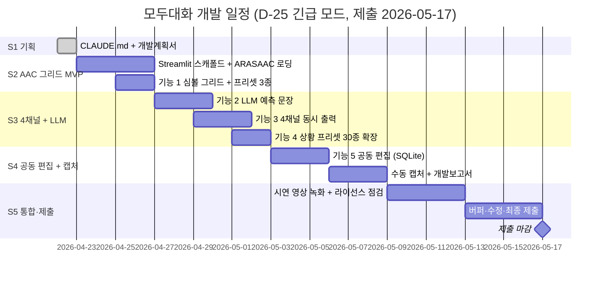

# 모두대화 (Talk For All) — 개발계획서

> 심볼·음성·자막·수어 4채널 AAC 의사소통 브릿지. **제출 마감 2026-05-17 (D-25 긴급 모드)**.
> 본 문서는 `_여분_공유/templates/개발계획서.md` 템플릿을 상속합니다.

**last_updated**: 2026-04-22
**진척도**: 0% (0 / 5 스프린트 완료)
**모드**: 🚨 D-25 긴급 모드 (기능 1~3 최우선)

---

## 1. 기술 스택

제안서 §8 를 규격으로 준수. 모든 AI 구성요소는 **로컬 전용**.

| 계층 | 기술 | 버전 | 선정 사유 |
|---|---|---|---|
| PoC 프레임워크 | **Streamlit** | 1.33+ | D-25 긴급 모드 · Flutter 네이티브 대신 웹 PoC 로 심사 시연 우선 |
| 심볼셋 | **ARASAAC 한국어 픽토그램** (CC 라이선스, 로컬) | 2025 스냅샷 | 공개 라이선스, 오프라인 번들, 제안서 §8 |
| 로컬 LLM | **Ollama `aac` → `gemma3:27b-instruct-q4_K_M`** | Q4_K_M | 한국어 조사·어미 보정, 27B Q4 ≈ 18GB RAM |
| LLM 폴백 | Ollama `qwen2.5:32b-instruct-q4_K_M` | Q4_K_M | 한국어 장문 처리 백업 |
| 구조화 출력 | `outlines` / `llama.cpp grammar` | - | 심볼 시퀀스 → 문장 JSON 스키마 강제 |
| TTS (로컬) | **Kokoro TTS (한국어)** | latest | 자연스러운 한국어 합성, 오프라인 |
| TTS 폴백 | **Coqui XTTS-v2** | 2.0.3 | 화자 복제·다국어 확장 백업 |
| KSL 수어 | **glTF 30문장 프리셋** (병원·관공서) | - | 국립국어원 한국수어사전 참고, 오프라인 재생 |
| DB | **SQLite** (Supabase 로컬 대체) | 3.40+ | 공동 편집 메타·사용 로그, 오프라인 시연 가능 |
| UI 접근성 | Streamlit + 커스텀 CSS (고대비·큰 글씨) | - | AAC 사용자 저시력·운동 제약 대응 |
| Python | 3.11+ | - | 저장소 루트 CLAUDE.md §3.1 |
| 패키지 관리 | `uv` 또는 `pip` + `pyproject.toml` | - | 표준 |
| 배포 | 로컬 시연 + 사전 녹화 영상 | - | 심사 환경 네트워크 차단 대비 |

**금지 (저장소 CLAUDE.md §7.1 상속)**: OpenAI/Anthropic/Gemini/Clova Voice/Google TTS API 일체.

---

## 2. 개발 일정 (Gantt)

| 스프린트 | 시작 | 종료 | 산출물 | 상태 |
|---|---|---|---|---|
| S1 기획 | 2026-04-22 | 2026-04-22 | CLAUDE.md, 개발계획서 | 🟡 진행중 |
| S2 AAC 그리드 MVP | 2026-04-23 | 2026-04-26 | Streamlit 스캐폴드 + 심볼 그리드 + 프리셋 3종 | ⬜ 예정 |
| S3 4채널 + LLM | 2026-04-27 | 2026-05-02 | LLM 예측·TTS·자막·KSL 동기화 + 프리셋 30종 | ⬜ 예정 |
| S4 공동 편집 + 캡처 | 2026-05-03 | 2026-05-08 | SQLite 공동 편집 + 캡처 5장+ + 개발보고서 | ⬜ 예정 |
| S5 통합·제출 | 2026-05-09 | 2026-05-17 | 시연 영상 + 최종 제출 패키지 | ⬜ 예정 |

상태값: `✅ 완료 / 🟡 진행중 / ⬜ 예정 / ⚠️ 지연`

---

## 3. 마일스톤

| 일자 | 산출물 | 검증 방법 | 달성 |
|---|---|---|---|
| 2026-04-22 | CLAUDE.md + 개발계획서 | Markdown lint + 제안서 §8 정합 검토 | 🟡 |
| 2026-04-26 | 기능 1 AAC 그리드 Streamlit 기동 | `streamlit run app.py` 성공 + 심볼 탭 동작 | ⬜ |
| 2026-05-02 | 기능 2·3·4 통합 (LLM·4채널·프리셋 30종) | 심볼→문장→음성+자막+KSL 4채널 동시 재생 | ⬜ |
| 2026-05-08 | 기능 5 공동 편집 + 캡처 5장+ | SQLite 어휘 추가·동기화 + 개발보고서 | ⬜ |
| 2026-05-14 | 시연 영상 (오프라인) | MP4 재생, 네트워크 차단 환경 재현 | ⬜ |
| 2026-05-17 | **최종 제출** | 제출 시스템 완료 확인 | ⬜ |

---

## 4. 스프린트 진척

### S1 기획 (2026-04-22)
- [x] 저장소 루트 CLAUDE.md §7 재확인
- [x] 제안서 §6·§8 재확인
- [ ] CLAUDE.md 작성 (본 커밋)
- [ ] 개발계획서 작성 (본 문서)

### S2 AAC 그리드 MVP (2026-04-23 ~ 04-26)
- [ ] `src/talkforall/` 디렉터리 스캐폴드 + `pyproject.toml`
- [ ] Streamlit 엔트리 `app.py` 최소 기동
- [ ] ARASAAC 한국어 심볼셋 로컬 번들 준비 (CC 라이선스 파일 동봉)
- [ ] `aac_grid.py` — 카테고리(음식·감정·몸·학교·병원·가족) 그리드
- [ ] 상황 프리셋 3종 (병원 통증 / 학교 일과 / 관공서 민원) 시드
- [ ] Mock 폴백: LLM·TTS 미탑재 시에도 그리드·프리셋 UI 동작

### S3 4채널 + LLM (2026-04-27 ~ 05-02)
- [ ] `predictor.py` — LocalLLM(alias="aac") 심볼 시퀀스 → 한국어 문장 보완
- [ ] **사용자 확정 버튼** (LLM 문장 검토·수정 후 확정, R1 대응)
- [ ] `tts.py` — Kokoro TTS (ko) 합성, XTTS-v2 fallback
- [ ] 자막 출력 + 심볼 시퀀스 하이라이트 + KSL glTF 재생 **동시 동기화**
- [ ] KSL 30문장 glTF 프리셋 로더 (`ksl.py`)
- [ ] 상황 프리셋 30종 확장 (병원·학교·관공서·은행·교통·가족)

### S4 공동 편집 + 캡처 (2026-05-03 ~ 05-08)
- [ ] `db.py` — SQLite 스키마 (어휘·사용 로그·역할)
- [ ] 보호자·치료사 공동 편집 UI (어휘 추가·삭제·정렬)
- [ ] 역할 기반 권한 + 편집 로그 (R4 대응)
- [ ] 수동 캡처 5장+ (`docs/captures/`)
  - 홈 / AAC 그리드 / 상황 프리셋 / 4채널 출력 / 공동 편집
- [ ] 개발보고서 §4 화면 캡처 + §5 검증 결과
- [ ] 검토 체크리스트 7항목 ✅

### S5 통합·제출 (2026-05-09 ~ 05-17)
- [ ] README 갱신 (설치·구동·라이선스 표기)
- [ ] 시연 영상 녹화 (오프라인 환경, 네트워크 차단 재현)
- [ ] ARASAAC · KSL 라이선스 표기 최종 점검
- [ ] 버퍼 기간 수정·재캡처
- [ ] 최종 제출

---

## 5. 현재 상황

**last_updated: 2026-04-22 15:00**

현재 진행 중: **S1 기획 — CLAUDE.md 및 개발계획서 초기 작성**

완료:
- 제안서.md §6·§8 검토
- 저장소 루트 CLAUDE.md §7 로컬 LLM 제약 확인
- `docs/captures/` 디렉터리 선행 생성
- CLAUDE.md 커밋 (`docs(모두대화): add CLAUDE.md 작업 지침`)

다음 작업:
1. 개발계획서 v1 초안 커밋 (본 문서, `docs(모두대화): add 개발계획서 v1 초안`)
2. S2 착수 — `src/talkforall/` 스캐폴드 + Streamlit 기동
3. ARASAAC 한국어 심볼셋 로컬 번들 준비 (라이선스 파일 동봉)

---

## 6. 위험·이슈

D-25 긴급 모드에서 **R1·R5·R7** 최우선 관리.

| ID | 발생일 | 위험 | 영향 | 대응 |
|---|---|---|---|---|
| R1 | - | **LLM 한국어 문장 오류** (조사·어미 부정확) | 高 | 예측 문장 표시 후 **사용자 확정 버튼** 필수, 수정 로그 저장, few-shot 한국어 예시 프롬프트 내장 |
| R2 | - | **4채널 동시 동기화 복잡성** (음성·자막·심볼·KSL 타이밍 어긋남) | 高 | Streamlit 단일 이벤트 루프 + `st.session_state` 기반 재생 큐, 각 채널 독립 재생 + 시작 시각 정렬, 최악의 경우 자막+음성 2채널로 축소 |
| R3 | - | **심볼 부적합** (ARASAAC 한국 문화·상황 일치 부족) | 中 | 심볼 **대체 후보 3개** 표시 + 보호자 공동 편집으로 추가, 한국 공공 상황(관공서·병원) 자체 심볼 보강 |
| R4 | - | 개인정보 (아동 발화 로그) | 致命 | 보호자 동의 필수, 로그 로컬 SQLite 저장, **외부 서버 전송 0건**, 저장소 루트 CLAUDE.md §7 준수 |
| R5 | - | **D-25 일정 압박** — 기능 5종 전부 완성 난이도 | 高 | 기능 1~3 최우선 확보(제출 필수), 기능 4 프리셋 3종→30종 점진 확장, 기능 5 축소 시연(편집 1건) |
| R6 | - | Kokoro TTS 한국어 품질·설치 이슈 | 中 | XTTS-v2 fallback 상시 대기, 최악의 경우 pyttsx3 시스템 TTS 로 재폴백 |
| R7 | - | **심사 환경 네트워크 차단** | 高 | ARASAAC·KSL·LLM·TTS 전부 로컬 번들, 오프라인 시연 영상 병행 |
| R8 | - | 공동 편집 권한 오남용 | 中 | SQLite 역할(parent/therapist) + 편집 로그 필수, 사용자 삭제 기능 |
| R9 | - | 메모리 초과 (gemma3:27b Q4 ≈ 18GB + TTS 동시) | 中 | 단일 모델 로드 원칙, 필요 시 `ollama stop` 전환, M4 Max 128GB 여유 확보 |
| R10 | - | ARASAAC CC 라이선스 표기 누락 | 中 | 제안서·앱 About·README 3곳 표기 + 번들에 라이선스 원문 동봉 |

---

## 7. 자원 사용

| 자원 | 예상치 | 비고 |
|---|---|---|
| LLM 호출당 tokens | 100 ~ 400 | 심볼 시퀀스 짧음, few-shot 포함 |
| Ollama 모델 RAM | ~18 GB | `gemma3:27b-instruct-q4_K_M` 로드 시 |
| TTS RAM | ~1~3 GB | Kokoro 소형, XTTS-v2 폴백 시 증가 |
| 동시 최대 RAM | ~25 GB | LLM + TTS + Streamlit 동시, M4 Max 128GB 여유 충분 |
| API 요금 | **$0** | 모두 로컬, 저장소 루트 CLAUDE.md §7 준수 |
| 스토리지 | ~22 GB | gemma3 Q4(~18GB) + ARASAAC 번들(~1GB) + KSL glTF(~300MB) + 데이터 |
| 네트워크 | **0** (시연 시) | 전 구성요소 오프라인 동작 |

---

*`_여분_현대오토에버_모두대화/docs/개발계획서.md` · v1 · last_updated 2026-04-22*
