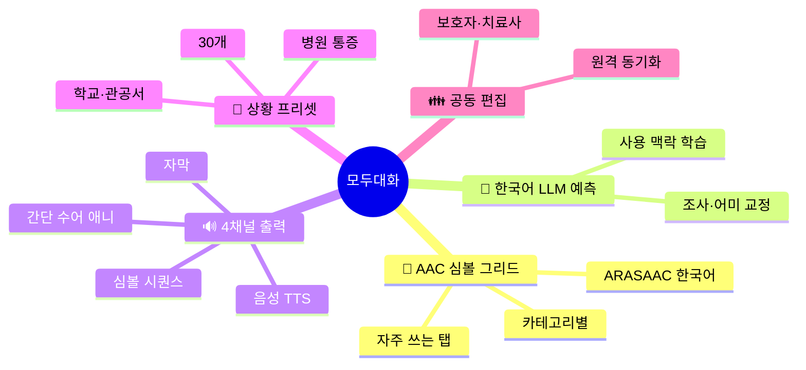
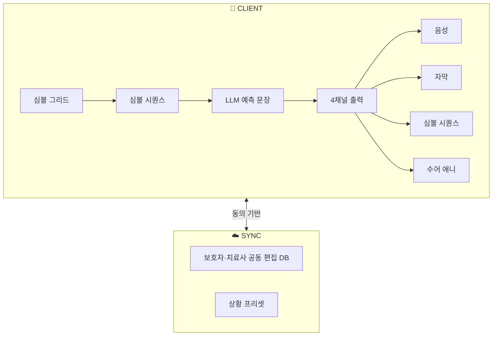

# 모두대화 (Talk For All)
## 심볼·음성·수어·자막을 엮은 범용 의사소통 브릿지

> 언어장애인·발달장애인·뇌졸중 후 실어증 환자 등 말하기 곤란군을 위한 AAC 기반 대화 앱

| 항목 | 내용 |
|---|---|
| 콘테스트 | 2026 현대오토에버 배리어프리 앱 개발 콘테스트 |
| 카테고리 | 의사소통 · 접근성 |
| 타깃 | 등록 언어장애인·발달장애인 + 후천성 실어증 환자 + 자녀 AAC 사용자 [^1][^2] |
| 핵심 차별점 | **AAC 심볼 + 음성 + 자막 + 간단 수어 4채널 동시** + **한국어 예측 문장 LLM** + **보호자 공동 편집** |
| 핵심 기술 | AAC 그리드 UI · ARASAAC 한국어 심볼셋 · LLM 예측 문장 · TTS · KSL 모션카드 |
| 작성일 | 2026.04.21 |

---

## 목차

1. [사업 배경·문제 정의](#1-사업-배경문제-정의)
2. [시장 분석·경쟁 환경](#2-시장-분석경쟁-환경)
3. [해외 모범사례 비교](#3-해외-모범사례-비교)
4. [타깃 페르소나](#4-타깃-페르소나)
5. [솔루션 개요](#5-솔루션-개요)
6. [핵심 기능 5종](#6-핵심-기능-5종)
7. [시스템 아키텍처](#7-시스템-아키텍처)
8. [기술 스택](#8-기술-스택)
9. [기대 효과·사회적 임팩트](#9-기대-효과사회적-임팩트)
10. [정책 정합성](#10-정책-정합성)
11. [위험 관리](#11-위험-관리)
12. [근거자료·출처](#12-근거자료출처)

---

## 1. 사업 배경·문제 정의

### 1.1 핵심 수치 (모두 1차 출처 기반)

| 영역 | 지표 | 수치 | 출처 |
|---|---|---|---|
| 인구 | 등록 언어장애인 (2023) | **약 2만 명대** | 보건복지부 등록장애인 [^1] |
| 인구 | 등록 발달장애인 (소통 곤란 중복) | **약 25만 명** | 보건복지부 [^1] |
| 인구 | 뇌졸중 유병·실어증 위험군 | 노인 다수 | 대한뇌졸중학회 / 질병관리청 [^3] |
| 표준 | ARASAAC 픽토그램 세트 (공개) | CC 라이선스 | ARASAAC [^4] |
| 법제 | 「발달장애인 권리보장법」 — 의사소통 지원 | 시행 | 국가법령정보센터 [^2] |
| 법제 | 「한국수화언어법」 | 시행 (2016) | 국가법령정보센터 [^5] |
| 보조공학 | 보조공학기기 지원사업 — AAC 기기 포함 | 시행 | 한국장애인개발원 [^6] |
| UN | CRPD 제21조 "alternative forms of communication" | 국제 의무 | UN CRPD [^7] |

### 1.2 문제 정의

#### ① 말이 어려운 사람들은 한 종류가 아니다.
AAC(보완대체의사소통) 필요 인구는 **발달장애인·언어장애인·뇌졸중 후 실어증·근위축
환자·선천성 뇌성마비** 등 **이질적**이다. 각 집단은 기능·인지·문해 수준이 달라
**단일 UI로 대응**이 어렵다.

#### ② 한국어 특화 AAC 앱이 부족하다.
해외에는 Proloquo2Go·TouchChat 등 성숙한 AAC 앱이 존재하나 [^8][^9], **한국어 어휘
체계·문화·공공 상황 용어**에 최적화된 범용 AAC 앱은 제한적이다. 한국어 조사·어미
변화가 단순 단어 심볼 조합으로 자연스러운 문장을 만들기 어렵다.

#### ③ "말 못 함"이 "못 들음"과 혼재된 경우가 많다.
발달장애·뇌성마비 중 일부는 **말도 어렵고 필담도 어렵다**. 이 경우 **자막·음성·
심볼·간단 수어**의 **동시 출력**이 소통 성공률을 높인다. 현재 앱은 대체로 **한
채널**에 집중한다.

#### ④ 보호자·치료사 공동 편집 기능 부재.
부모·언어치료사는 매일 **새로운 어휘·자주 쓰는 문장**을 추가할 수 있어야 한다. 그러나
많은 AAC 앱은 편집 권한·동기화가 제한적이다.

### 1.3 본 사업의 통찰

> 의사소통은 "한 채널의 완벽함"보다 "여러 채널의 동시성"으로 훨씬 잘 전달된다.

---

## 2. 시장 분석·경쟁 환경

### 2.1 국내 기존 서비스

| 서비스 | 운영 주체 | 기능 | 4채널 동시 |
|---|---|---|---|
| **마이토키** (일부 AAC 앱) | 민간 | 심볼 기반 | ⚠️ (일부 기능) |
| **엔젤닷톡 · 나의 AAC** 등 | 민간·공공 | 심볼 출력 | ❌ |
| **수어 학습 앱** (콘테스트 역대) [^10] | 민간 | KSL 단어 학습 | ❌ |
| **장애인 보조공학기기 지원사업** [^6] | 공공 | 하드웨어 AAC 기기 | ⚠️ (고가) |
| **▶ 모두대화 (제안)** | 본 사업 | **심볼 + 음성 + 자막 + 수어 동시** | **✅** |

### 2.2 시장 갭

| 축 | 기존 | 모두대화 |
|---|---|---|
| 채널 | 대부분 단일 | **4채널 동시** |
| 한국어 | 제한적 | **특화 + 예측 문장 LLM** |
| 편집 | 사용자 전용 | **보호자·치료사 공동 편집** |
| 상황 프리셋 | 없음 | **병원·관공서·학교 30종** |

---

## 3. 해외 모범사례 비교

| 서비스 | 국가 | 특징 |
|---|---|---|
| **Proloquo2Go** [^8] | 🇺🇸 | iPad AAC 최대 채택 |
| **TouchChat** [^9] | 🇺🇸 | 영어권 AAC 광범위 |
| **LetMeTalk** (무료) [^11] | 🇩🇪 | ARASAAC 기반 무료 AAC |
| **Avaz** [^12] | 🇮🇳 | 다국어 AAC |
| **모두대화 (한국)** | 🇰🇷 | **한국어 예측 문장 + 4채널 동시** |

### 3.1 UN CRPD 제21조 정합

UN 장애인권리협약 제21조는 **"alternative modes and formats of communication"**
사용을 장려한다 [^7]. 본 사업은 심볼·음성·자막·수어를 묶어 이 원칙을 구현한다.

---

## 4. 타깃 페르소나

### Persona 1 — 민○○ (8세, 발달장애, 비구어)
- 유치원·학교 생활에서 의사표현 어려움.
- **🔥 PAIN** 교사가 아이 요구 파악 어려움.
- **🎯 NEED** 심볼 탭 → 음성 + 자막 + 간단 수어 동시 출력, 교사도 쉽게 이해.

### Persona 2 — 박○○ (67세, 뇌졸중 후 실어증)
- 가족·의료진과 소통 곤란.
- **🔥 PAIN** 진료실에서 아픈 부위·강도 표현 어려움.
- **🎯 NEED** 병원 프리셋(통증 위치·강도·시간) + 음성 + 보호자 실시간 공유.

### Persona 3 — 이○○ (45세, 언어치료사)
- 다수 아동 개별 AAC 관리.
- **🔥 PAIN** 아동별 어휘 개별 관리 부담.
- **🎯 NEED** 원격 공동 편집·치료 계획별 프리셋 저장.

---

## 5. 솔루션 개요

### 5.1 한 줄 정의

> 심볼을 탭하면 **"음성 + 자막 + 핵심어 수어 애니메이션"** 이 동시에 재생되어
> 누구와도 대화할 수 있게 만드는 **한국어 AAC 브릿지**.

### 5.2 핵심 축

---

## 6. 핵심 기능 5종

### 기능 1 · 🧩 AAC 심볼 그리드
- ARASAAC 한국어 심볼셋 [^4] + 한국 공공 상황 심볼 자체 추가.
- 카테고리(음식·감정·몸·학교·병원·가족) + 자주 쓰는 문장 상단.

### 기능 2 · 🧠 한국어 예측 문장 (LLM)
- 탭된 심볼 시퀀스 → LLM이 **자연스러운 한국어 문장**으로 조사·어미 보완.
- 사용자·상황별 사용 이력 학습으로 점차 정확도 향상 (온디바이스 학습).

### 기능 3 · 🔊 4채널 동시 출력
- **음성 TTS** + **자막** + **심볼 시퀀스** + **간단 KSL 수어 애니메이션** (병원·
  관공서 30문장 프리셋) 동시 표시 [^13].
- 청자가 누구든 **적어도 한 채널은 이해**할 수 있도록 설계.

### 기능 4 · 🏥 상황 프리셋
- 병원(통증 위치·강도), 학교(수업·화장실·식사), 관공서(민원·신분증), 은행, 교통,
  가족 일상 30종 프리셋.
- 각 프리셋 선택 시 심볼 그리드가 재구성된다.

### 기능 5 · 👪 보호자·치료사 공동 편집
- 원격으로 어휘 추가·제거·정렬 가능.
- 치료 목표·주간 과제 설정·사용 로그 리포트.
- 사용자 동의 필요 (프라이버시 보호).

---

## 7. 시스템 아키텍처

---

## 8. 기술 스택

| 계층 | 기술 | 선정 근거 |
|---|---|---|
| Mobile | Flutter 3.x | iOS/Android 동시 |
| 심볼 | ARASAAC [^4] + 한국어 확장 | 공개 라이선스 |
| LLM | Claude Haiku 4.5 [^14] (Tool-use) | 저비용, 한국어 문법 정확 |
| TTS | Clova Voice / Google TTS [^15] | 자연스러운 한국어 |
| 수어 | KSL 병원·관공서 30문장 3D 애니메이션 (glTF) | 오픈소스 합성 |
| Sync | Supabase Realtime | 공동 편집 |
| 데이터 | 국립국어원 한국수어사전 [^13] | 공공 KSL |

---

## 9. 기대 효과·사회적 임팩트

### 9.1 정량 목표 (출시 + 1년)

| 지표 | 목표 | 산정 근거 |
|---|---|---|
| 다운로드 | **10만+** | 발달장애 25만 [^1] + 언어장애 + 가족·치료사 |
| 일 평균 발화 세션 | 30만 | 아이·환자 1일 다수 발화 |
| 공동 편집 계정 | 3만 | 치료사·보호자 |
| 상황 프리셋 사용 | 20만 | 병원·관공서·학교 |

### 9.2 사회 변화

| | BEFORE | AFTER |
|---|---|---|
| 대화 채널 | 단일 | **4채널 동시** |
| 한국어 AAC | 제한 | **예측 문장 LLM 내장** |
| 병원 진료 | 보호자 통역 | **통증 프리셋 + 음성 + 자막** |
| 치료사 협업 | 수기 | **원격 공동 편집** |

---

## 10. 정책 정합성

| 정책 | 본 사업 정합 |
|---|---|
| 「발달장애인 권리보장·지원법」 [^2] | 의사소통 지원 구현 |
| 「한국수화언어법」 [^5] | KSL 채널 병기 |
| 「장애인·노인·임산부 등 편의증진법」 [^16] | 보조공학 디지털화 |
| 보조공학기기 지원 [^6] | 소프트웨어형 AAC 확산 |
| UN CRPD 제21조 [^7] | 대체 의사소통 방식 보장 |

---

## 11. 위험 관리

| ID | 위험 | 영향 | 대응 |
|---|---|---|---|
| R1 | LLM 한국어 문장 오류 | 高 | 사용자 확정 버튼, 수정 로그 |
| R2 | 심볼 표기 부적합 | 中 | 심볼 대체 후보 3개 표시 |
| R3 | 개인정보 (아동) | 致命 | 보호자 동의, 로그 최소화 |
| R4 | 공동 편집 권한 오남용 | 中 | 역할 기반 권한 + 로그 |
| R5 | 오프라인 동작 | 中 | 기본 프리셋 로컬 내장 |

---

## 12. 근거자료·출처

[^1]: **보건복지부 「등록장애인 현황」** — 언어장애·발달장애 등록. [https://www.mohw.go.kr/menu.es?mid=a10712010200](https://www.mohw.go.kr/menu.es?mid=a10712010200)

[^2]: **「발달장애인 권리보장 및 지원에 관한 법률」**. [https://www.law.go.kr/법령/발달장애인권리보장및지원에관한법률](https://www.law.go.kr/법령/발달장애인권리보장및지원에관한법률)

[^3]: **대한뇌졸중학회 / 질병관리청 뇌졸중 유병 통계**. [https://www.stroke.or.kr/](https://www.stroke.or.kr/)

[^4]: **ARASAAC 픽토그램 (CC)**. [https://arasaac.org/](https://arasaac.org/)

[^5]: **「한국수화언어법」**. [https://www.law.go.kr/법령/한국수화언어법](https://www.law.go.kr/법령/한국수화언어법)

[^6]: **한국장애인개발원 — 보조공학기기 지원사업**. [https://www.koddi.or.kr/data/research_01.jsp](https://www.koddi.or.kr/data/research_01.jsp)

[^7]: **UN CRPD 제21조**. [https://www.un.org/development/desa/disabilities/convention-on-the-rights-of-persons-with-disabilities/article-21-freedom-of-expression-and-opinion-and-access-to-information.html](https://www.un.org/development/desa/disabilities/convention-on-the-rights-of-persons-with-disabilities/article-21-freedom-of-expression-and-opinion-and-access-to-information.html)

[^8]: **Proloquo2Go (AssistiveWare)**. [https://www.assistiveware.com/products/proloquo2go](https://www.assistiveware.com/products/proloquo2go)

[^9]: **TouchChat HD (Prentke Romich)**. [https://touchchatapp.com/](https://touchchatapp.com/)

[^10]: **본 콘테스트 공고 붙임2 「역대 앱 개발 콘테스트 리스트」**. 콘테스트 공고 PDF 분석.

[^11]: **LetMeTalk (free AAC based on ARASAAC)**. [https://www.letmetalk.info/](https://www.letmetalk.info/)

[^12]: **Avaz AAC**. [https://www.avazapp.com/](https://www.avazapp.com/)

[^13]: **국립국어원 한국수어사전**. [https://sldict.korean.go.kr/](https://sldict.korean.go.kr/)

[^14]: **Anthropic Claude Haiku 4.5**. [https://docs.anthropic.com/](https://docs.anthropic.com/)

[^15]: **NAVER Clova Voice**. [https://www.ncloud.com/product/aiService/clovaVoice](https://www.ncloud.com/product/aiService/clovaVoice)

[^16]: **「장애인·노인·임산부 등의 편의증진 보장에 관한 법률」**. [https://www.law.go.kr/법령/장애인·노인·임산부등의편의증진보장에관한법률](https://www.law.go.kr/법령/장애인·노인·임산부등의편의증진보장에관한법률)

---

*모두대화 · 제안서.md · 2026.04.21*
