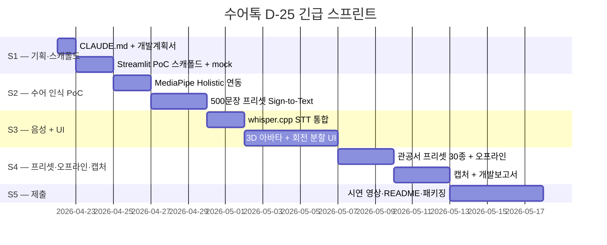

# 수어톡 (SuEoTalk) — 개발계획서

> 2026 현대오토에버 배리어프리 앱 개발 콘테스트 출품작 · **D-25 긴급 스프린트**
> 상위 지침: [../CLAUDE.md](../CLAUDE.md) · [../제안서.md](../제안서.md) (기술 스택 규격)

**last_updated**: 2026-04-22 15:30
**제출 마감**: 2026-05-17 (D-25)
**진척도**: 5% (S1 기획 시작)

---

## 0. 요약

| 항목 | 내용 |
|---|---|
| 프로젝트 | 수어톡 (SuEoTalk) — 한 폰 양방향 수어·음성 통역 앱 |
| 카테고리 | 청각장애 · 의사소통 접근성 |
| 타깃 | 등록 청각장애인 약 43만 명 + 관공서·병원·매장 직원 [^1] |
| 핵심 기능 5종 | KSL 실시간 인식 / 음성→수어 아바타 / 회전 분할 UI / 관공서·병원 프리셋 / 오프라인 모드 |
| 주 추론 | 온디바이스 비전 + STT (주 LLM 없음, 보조로 로컬 LLM 문장 교정) |
| 1차 구현 | **Streamlit PoC** (SPRINT 우선) |
| 2차 구현 | Flutter Phase 2 (iOS/Android 단일 코드) |

---

## 1. 기술 스택

제안서 §8 규격을 그대로 따른다. 루트 CLAUDE.md §7 (로컬 LLM·로컬 ML 전용) 준수.

| 계층 | 기술 | 버전 / 모델 | 선정 사유 |
|---|---|---|---|
| PoC UI (1차) | **Streamlit** | 1.36+ | 카메라·마이크 권한 간단, 빠른 반복 |
| 모바일 (2차) | **Flutter** | 3.x | iOS/Android 단일 코드, 제안서 §8 |
| 수어 포즈 추출 | **MediaPipe Holistic** [^12] | Google 최신 | 손·얼굴·몸 동시 추적, 온디바이스 |
| Sign-to-Text | **경량 Transformer** (PyTorch → CoreML/TFLite) | 자체 학습 | 500문장 프리셋 우선, 온디바이스 |
| STT (로컬) | **whisper.cpp** 또는 **MLX Whisper large-v3** [^13] | ggml v3 / MLX 최신 | 네트워크 불필요, 한국어 WER 낮음, 루트 §7 준수 |
| 3D 아바타 | **glTF + Skeleton** (Three.js 웹 / Unity Embed 모바일) | glTF 2.0 | 단어 단위 모션 합성 |
| 문장 교정 (보조) | Ollama `llama3.3:70b` | Meta 최신 | 관공서 용어·존대 보정, 공용어 ↔ 구어 변환 |
| 임베딩 (사전 검색) | Ollama `nomic-embed-text` | latest | 500문장 프리셋 매칭 |
| 벡터 DB | **FAISS** | 1.8+ | 로컬·오프라인 동작 |
| 데이터셋 | **국립국어원 한국수어사전** [^14] + **KETI 수어 말뭉치** [^15] | 공공 | 공공 한국수어 1차 출처 |
| 배포 | 로컬 Streamlit + 시연 영상 | - | 오프라인 시연 가능 (루트 §7.6) |

### 1.1 금지 의존성 (루트 CLAUDE.md §7.1)

- ❌ OpenAI API (Whisper **API**, GPT, Embeddings) — whisper.cpp / MLX Whisper **로컬** 실행은 허용
- ❌ Anthropic Claude API / Google Gemini API / Azure OpenAI / Bedrock
- ❌ Clova Voice · Google TTS (상용 클라우드 TTS)
- ❌ 카메라·마이크 원본을 서버 전송하는 모든 경로

---

## 2. 개발 일정 (D-25 긴급 스프린트)

| 스프린트 | 시작 | 종료 | 기간 | 산출물 | 상태 |
|---|---|---|---|---|---|
| **S1** | 2026-04-22 | 2026-04-24 | 3일 | CLAUDE.md · 개발계획서 · Streamlit 스캐폴드 + mock | 🟡 진행중 |
| **S2** | 2026-04-25 | 2026-04-29 | 5일 | MediaPipe Holistic 연동 + 500문장 프리셋 Sign-to-Text PoC | ⬜ 예정 |
| **S3** | 2026-04-30 | 2026-05-06 | 7일 | whisper.cpp STT + 3D 아바타 + 회전 분할 UI | ⬜ 예정 |
| **S4** | 2026-05-07 | 2026-05-12 | 6일 | 관공서 프리셋 30종 + 오프라인 모드 + 캡처 5+ + 개발보고서 | ⬜ 예정 |
| **S5** | 2026-05-13 | 2026-05-17 | 5일 | 시연 영상 · README · 최종 제출 패키징 | ⬜ 예정 |

상태값: `✅ 완료 / 🟡 진행중 / ⬜ 예정 / ⚠️ 지연`

---

## 3. 마일스톤

| 일자 | 산출물 | 검증 방법 | 달성 |
|---|---|---|---|
| 2026-04-22 | CLAUDE.md + 개발계획서 v1 | Markdown lint · 커밋 존재 | 🟡 |
| 2026-04-24 | Streamlit PoC 스캐폴드 + mock 폴백 | `streamlit run app.py` 무오류 기동 | ⬜ |
| 2026-04-29 | MediaPipe Holistic + 500문장 Sign-to-Text | 10문장 수어 영상 → 자막 정확도 기록 | ⬜ |
| 2026-05-06 | whisper.cpp STT + 3D 아바타 + 회전 분할 UI | 음성 10문장 → 아바타 애니 재생 | ⬜ |
| 2026-05-12 | 관공서 30 프리셋 + 오프라인 + 캡처 5+ | 네트워크 차단 상태 시연 · `docs/captures/` PNG 5+ | ⬜ |
| 2026-05-17 | 제출 패키지 (제안서 · 개발계획서 · 개발보고서 · 시연 영상) | 공모전 플랫폼 업로드 | ⬜ |

---

## 4. 스프린트 진척

### S1 — 기획·스캐폴드 (2026-04-22 ~ 2026-04-24)
- [x] CLAUDE.md 작성·커밋
- [x] 개발계획서 v1 작성·커밋
- [ ] `src/sueotalk/` Streamlit 스캐폴드 (app.py · pyproject.toml · .env.example)
- [ ] Mock 폴백 구조 (카메라·마이크 없이 녹화 영상으로 시연 가능)
- [ ] `_여분_공유/lib/local_stt.py`·`local_llm.py` 참조 확인

### S2 — 수어 인식 PoC (2026-04-25 ~ 2026-04-29)
- [ ] MediaPipe Holistic 설치·연동 (손 21점 + 얼굴 478점 + 포즈 33점)
- [ ] **500문장 프리셋 정의** (주민센터·병원·매장 상황별)
- [ ] 경량 Transformer Sign-to-Text 학습 스크립트 (PyTorch)
- [ ] CoreML / TFLite 변환 파이프라인
- [ ] 정확도 측정 (프리셋 문장 10건 → 자막)

### S3 — 음성 + UI (2026-04-30 ~ 2026-05-06)
- [ ] whisper.cpp 바이너리 번들 (ggml-large-v3.bin) 또는 MLX Whisper
- [ ] STT 응답 지연 측정 (목표: 1초 미만, 제안서 §9.1)
- [ ] glTF 3D 아바타 수급·적재
- [ ] 핵심어 단위 수어 모션 합성 (단어 → 스켈레톤 애니 매핑)
- [ ] 회전 분할 UI (Streamlit 컬럼 + CSS transform)

### S4 — 프리셋·오프라인·캡처 (2026-05-07 ~ 2026-05-12)
- [ ] 관공서·병원·매장 30개 상황 프리셋 UI
- [ ] FAISS 기반 오프라인 사전 매칭
- [ ] 네트워크 차단 상태 통합 테스트
- [ ] **실제 구동 캡처 5+** (`docs/captures/` PNG)
  - [ ] 초기 화면 / 수어 인식 중 / 자막 결과
  - [ ] 음성 입력 / 아바타 재생 / 관공서 프리셋 / 오프라인 모드
- [ ] 개발보고서 v1 (현대오토에버 CLAUDE.md §2.4-D 구조 준수)

### S5 — 제출 (2026-05-13 ~ 2026-05-17)
- [ ] 시연 영상 1편 (오프라인 네트워크 차단 상태 포함, 3~5분)
- [ ] README 갱신 (재현 가능한 실행 명령)
- [ ] 개발보고서 체크리스트 7항목 ✅
- [ ] 최종 커밋·제출 패키지

---

## 5. 현재 상황

**last_updated: 2026-04-22 15:30**

- 진행 중: **S1.2** — 개발계획서 작성 완료 후 Streamlit 스캐폴드 착수 예정
- 완료:
  - S1.1 CLAUDE.md 작성·커밋 (`docs(수어톡): add CLAUDE.md 작업 지침`)
  - S1.2 개발계획서 v1 작성 (본 문서)
- 다음 작업: S1.3 `src/sueotalk/` Streamlit 스캐폴드 + mock 폴백 설계

---

## 6. 위험·이슈

| ID | 발생일 | 위험 | 영향 | 대응 |
|---|---|---|---|---|
| R1 | 2026-04-22 | **KSL 공개 데이터셋 규모 한계** (어휘·문장 수 서구 대비 작음) [^14][^15] | 高 | **500문장 프리셋 우선 확보** (관공서·병원·매장 실사용 장면), 사용자 제보 기반 점진 확장 |
| R2 | 2026-04-22 | **농인 자문단 확보 지연** (수어 자연성·문화적 적합성 검증 불가) | 高 | 한국농아인협회 [^3]·수어통역센터 사전 컨택, 자문 불가 시 자막 + 단어 중심 모션으로 폴백 |
| R3 | 2026-04-22 | 조도·거리·배경 노이즈로 인식 정확도 저하 | 高 | "이 각도/조도로 찍어주세요" 가이드 UI, 인식 실패 시 필담 폴백 상시 노출 |
| R4 | 2026-04-22 | D-25 압축 일정상 Flutter 모바일 구현 불가 가능성 | 中 | **Streamlit PoC 우선**, Flutter는 Phase 2로 분리 명시 |
| R5 | 2026-04-22 | 3D 아바타 모션 비자연성 | 中 | 농인 자문단 리뷰 (R2 의존), 문장 전체보다 **단어 중심 모션** 우선 |
| R6 | 2026-04-22 | 개인정보 (카메라·음성 원본) 유출 | 致命 | **온디바이스 원칙**, 서버 미전송, 녹화 금지 디폴트 (제안서 §5.2) |
| R7 | 2026-04-22 | whisper.cpp 한국어 WER 불확실 | 中 | large-v3 우선 사용, MLX Whisper 벤치마크 비교, 필요 시 faster-whisper 대안 |
| R8 | 2026-04-22 | 심사 환경 네트워크 차단 | 高 | **완전 오프라인 시연 영상** 사전 확보, 로컬 모델 · 프리셋 · 아바타 에셋 번들링 |

---

## 7. 자원 사용

| 자원 | 예상치 | 비고 |
|---|---|---|
| MediaPipe 추론 | 실시간 30fps | CPU/GPU 혼합, 온디바이스 |
| Sign-to-Text 추론 | 문장당 < 500ms | 경량 Transformer, TFLite/CoreML |
| whisper.cpp large-v3 | 10초 음성 < 3초 [추정] | M4 Max Metal 가속 기준, S3 실측 필요 |
| llama3.3:70b 문장 교정 | 문장당 1~2초 [추정] | Ollama 로컬, 보조 경로만 |
| 로컬 RAM 점유 | Holistic ~1GB + Whisper ~3GB + LLM ~45GB [추정] | 동시 실행 시 50GB 수준, 루트 §7.3 100GB 한도 이내 |
| API 요금 | **$0** | 전면 로컬 실행 |
| 스토리지 | whisper 모델 3GB + LLM 45GB + 프리셋 · 아바타 500MB [추정] | 약 50GB |

---

## 8. 데이터 정직성 선언

본 개발계획서의 통계·법적 주장은 **제안서 §12 근거자료**의 각주 번호를 그대로
참조한다 (각주 형식: `[^번호]: **기관명 「자료명」** (발표연월). 핵심 수치 인용. URL.`).
상세 출처는 [../제안서.md](../제안서.md) §12 참조.

검증되지 않은 수치는 본문에 **`[추정]`** 으로 명시했으며, 실측은 S3 이후 측정 결과로 갱신한다.

### 8.1 본 문서에서 인용한 각주 (제안서 §12 번호 승계)

- [^1] 보건복지부 「등록장애인 현황」 — 청각장애 등록인 2023년 약 43만 명
- [^3] 한국농아인협회 — 전국 수어통역센터 현황
- [^12] Google MediaPipe Holistic — 손·얼굴·몸 포즈 동시 추적
- [^13] whisper.cpp (Georgi Gerganov) · MLX Whisper (Apple) — 온디바이스 STT
- [^14] 국립국어원 한국수어사전 — 공공 KSL 어휘
- [^15] KETI 수어 말뭉치 / 공공데이터포털 — 공공 KSL 말뭉치

---

*`_여분_현대오토에버_수어톡/docs/개발계획서.md` · v1 · 2026-04-22*
