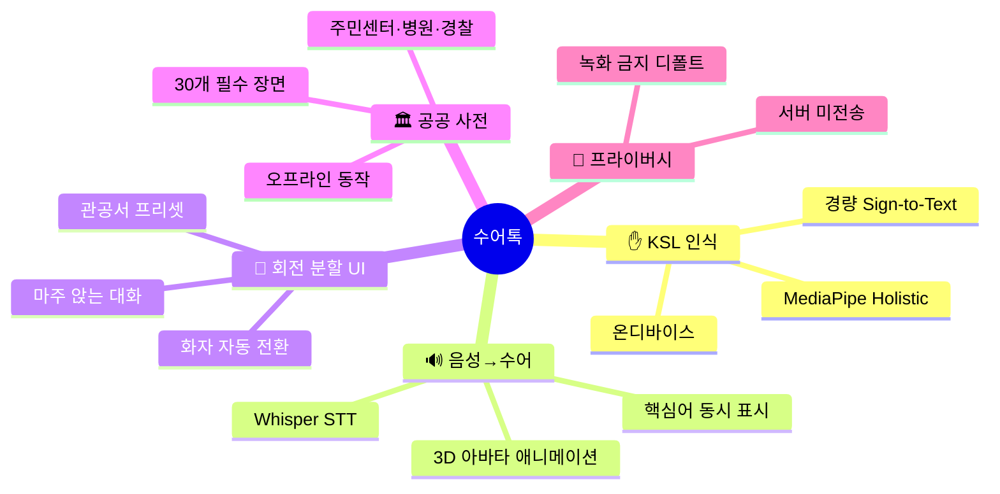
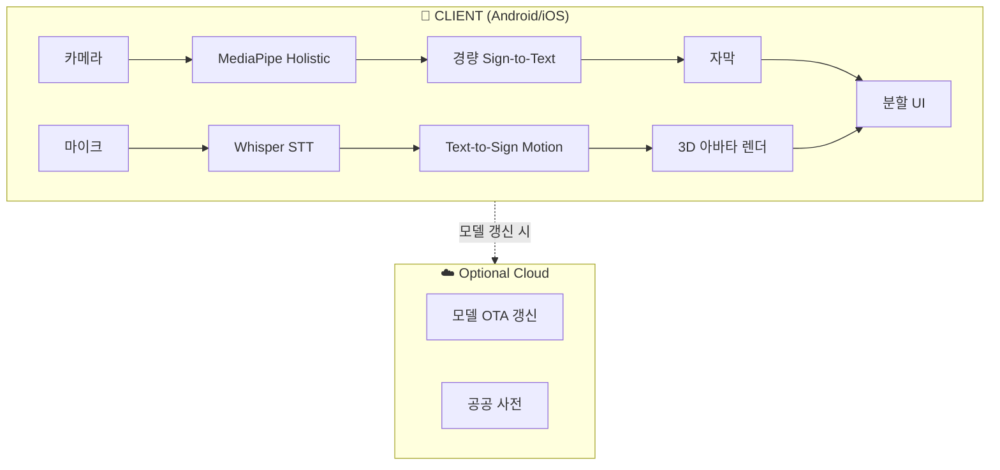

# 수어톡 (SuEoTalk)
## 청각장애인과 비장애인이 한 화면 앞에서 대화하는 양방향 수어-음성 통역 앱

> 43만 청각장애인을 위한, AI 기반 실시간 수어·음성 양방향 통역 동반앱

| 항목 | 내용 |
|---|---|
| 콘테스트 | 2026 현대오토에버 배리어프리 앱 개발 콘테스트 |
| 카테고리 | 의사소통 · 접근성 |
| 타깃 | 등록 청각장애인 약 43만 명 + 응대 창구(병원·관공서·매장) 직원 [^1] |
| 핵심 차별점 | "한 폰 양방향" 회전 분할 UI + 온디바이스 KSL 인식 + 관공서 용어 사전 |
| 핵심 기술 | MediaPipe Holistic · 경량 KSL Sign-to-Text · Whisper STT · 3D 아바타 |
| 작성일 | 2026.04.21 |

---

## 목차

1. [사업 배경·문제 정의](#1-사업-배경문제-정의)
2. [시장 분석·경쟁 환경](#2-시장-분석경쟁-환경)
3. [해외 모범사례 비교](#3-해외-모범사례-비교)
4. [타깃 페르소나](#4-타깃-페르소나)
5. [솔루션 개요](#5-솔루션-개요)
6. [핵심 기능 5종](#6-핵심-기능-5종)
7. [시스템 아키텍처](#7-시스템-아키텍처)
8. [기술 스택](#8-기술-스택)
9. [기대 효과·사회적 임팩트](#9-기대-효과사회적-임팩트)
10. [정책 정합성](#10-정책-정합성)
11. [위험 관리](#11-위험-관리)
12. [근거자료·출처](#12-근거자료출처)

---

## 1. 사업 배경·문제 정의

### 1.1 핵심 수치 (모두 1차 출처 기반)

| 영역 | 지표 | 수치 | 출처 |
|---|---|---|---|
| 인구 | 등록 청각장애인 (2023) | **약 43만 명** (전체 등록장애인의 약 14%) | 보건복지부 등록장애인 통계 [^1] |
| 법제 | 한국수어기본법 시행 | **2016-08-04** | 국가법령정보센터 [^2] |
| 법제 | 한국수어를 **국어와 동등한 공용어**로 선언 | 제2조 | 한국수어기본법 [^2] |
| 통역 | 전국 수어통역센터 | **약 200여 곳** | 한국농아인협회 [^3] |
| 통역 | 영상 수어통역 서비스 '손말이음센터' 운영 | 24시간 | 한국정보화진흥원·복지부 [^4] |
| 교육 | 농아학교 (특수학교) | 전국 소수, 대부분 농문화 기반 | 국립특수교육원 [^5] |
| 의료 | 청각장애인 병원 방문 시 의사소통 곤란 경험 | 다수 응답 (장애인 실태조사) | 보건복지부 장애인실태조사 [^6] |

### 1.2 문제 정의

#### ① 한국수어는 '공용어'지만, 일상 대화 도구는 부재하다.
2016년 한국수어기본법 제정으로 한국수어(KSL)는 **국어와 동등한 공용어**로 인정되었다
[^2]. 그러나 청각장애인이 비장애인과 **실시간 양방향**으로 대화하기 위한 범용
모바일 도구는 현재 **공공·민간 영역에서 부재**하다. 관공서·병원·매장에서 수어통역을
호출하려면 한국정보화진흥원의 **손말이음센터**(영상전화 기반)를 이용해야 하나 [^4],
대면 응대 상황에 **즉석**에서 쓰기 어렵다.

#### ② 수어통역사는 절대적으로 부족하다.
한국농아인협회에 따르면 전국 수어통역센터는 **약 200여 곳** 규모이며 [^3],
청각장애인 1인당 실질적으로 배정 가능한 수어통역사 수는 제한적이다. 병원·법률·
공공 상담이 몰리는 시간에는 **통역 대기**가 발생한다.

#### ③ 병원·관공서 의사소통 실패는 실제 위험으로 이어진다.
보건복지부 「장애인실태조사」는 청각장애인이 병원 방문 시 **의사소통 곤란**을 상당수
경험한다고 보고한다 [^6]. 응급·수술 설명·약 복용 지시의 오독은 **생명 위험**으로
직결될 수 있다.

#### ④ 비장애인 직원 측도 대응 도구가 없다.
관공서·매장 직원은 청각장애인 방문 시 **필담**에 의존하는 경우가 여전히 많다.
직원 교육 자료와 모바일 도구가 결합되어야 실질적 응대가 가능하다.

### 1.3 본 사업의 핵심 통찰

> 한국수어를 법으로만 공용어로 선언하는 것이 아니라,
> **스마트폰 한 대가 실제로 양방향 대화를 가능하게** 만들어야 한다.

---

## 2. 시장 분석·경쟁 환경

### 2.1 국내 기존 서비스

| 서비스 | 운영 주체 | 기능 | 양방향 즉석 대화 |
|---|---|---|---|
| **손말이음센터(107)** | 한국정보화진흥원·복지부 [^4] | 영상 수어통역 상담원 중계 | ⚠️ (상담원 필요, 즉석 한계) |
| **수어방송(KBS 등)** | 방송사 | 뉴스 수어통역 | ❌ |
| **정부 수어 정보 앱** | 지자체 일부 | 관광·안내 단편 수어 영상 | ❌ |
| **콘테스트 역대 청각 대상 출품작 (9년)** [^7] | 민간 | 교육·자막 중심 | ❌ (즉석 양방향 없음) |
| **▶ 수어톡 (제안)** | **본 사업** | **한 폰 양방향 대화 + 온디바이스 KSL 인식** | **✅** |

9년 콘테스트史 청각장애 카테고리의 기존 출품작은 대체로 **학습·자막 중심**이었고,
**한 디바이스에서 양방향으로 마주 앉아 대화하는 UX** 는 새로운 접근이다 [^7].

### 2.2 시장 갭

| 축 | 기존 | 수어톡 |
|---|---|---|
| 대화 방향 | 1방향(자막만) 또는 원격(상담원) | **양방향, 대면, 1폰** |
| 통역 주체 | 인간 상담원 | **온디바이스 AI (개인정보 서버 미전송)** |
| 활용 장면 | 학습·방송 | **관공서·병원·매장 즉석 대응** |
| 비용 | 서비스별 상이 | **무료** |

---

## 3. 해외 모범사례 비교

| 국가 | 서비스 | 형태 | 특징 |
|---|---|---|---|
| 🇺🇸 미국 | **Ava** [^8] | 모바일 앱 | 다수 화자 실시간 자막, 청각장애인 UX 특화 |
| 🇺🇸 미국 | **SignAll** [^9] | 연구·데모 | 카메라 기반 수어 인식 연구 프로토타입 |
| 🇬🇧 영국 | **SignVideo** | 영상 통역 중계 | BSL 수어 상담원 연결 |
| 🇯🇵 일본 | **SureTalk(슈어톡)** [^10] | 모바일 앱 | 음성을 일본수어(JSL) 아바타로 표시 |
| 🇰🇷 한국 | **수어톡 (제안)** | **모바일 앱** | **한 폰 회전 분할 양방향 + 관공서 프리셋** |

### 3.1 일본 SureTalk 벤치마크

일본에서는 SoftBank·SURE Lab이 **SureTalk**를 개발해 음성을 일본수어 아바타 영상으로
변환하는 시도를 공개했다 [^10]. 수어톡은 여기서 더 나아가 **양방향**(수어→자막,
음성→수어 아바타)을 **한 디바이스**에서 실행하고, **관공서·병원 응대 프리셋**을
내장한다.

### 3.2 UN 장애인권리협약(CRPD) 정합성

UN 장애인권리협약 제21조(표현·의견·정보 접근권)는 **수어 사용**을 공식 언어로
인정·지원할 것을 요구한다 [^11]. 본 사업은 이 원칙의 디지털 구현이다.

---

## 4. 타깃 페르소나

### Persona 1 — 김○○
- 34세 · 선천성 청각장애 · KSL 모어(네이티브) · 수어 1급
- 시나리오: 동네 내과 진료. 의사에게 증상을 설명하고 처방 지시를 받아야 한다.

**🔥 PAIN POINT** 필담은 용어 제한적. 손말이음센터 [^4]는 진료실에서 꺼내기 번거로움.

**🎯 NEED** 진료실 책상 위에 폰 1대 두고, 내가 수어하면 자막, 의사가 말하면 수어 아바타.

### Persona 2 — 박○○
- 28세 · 주민센터 창구 직원 · 수어 미숙 비장애인
- 시나리오: 청각장애인이 전입신고 차 방문. 약관·증빙 안내 필요.

**🔥 PAIN POINT** 필담은 오해 위험. 공공 전용 수어 사전은 별도 검색해야 한다.

**🎯 NEED** "주민등록·전입·정정" 공공 용어가 프리셋된, 한 폰 분할 대화 앱.

### Persona 3 — 이○○
- 52세 · 중도 난청 (노화) · 수어 입문 단계
- 시나리오: 은행 대출 상담. 음성은 안 들리고, 수어 이해는 제한적.

**🔥 PAIN POINT** 음성 자막만 있으면 부족, 단어별 수어 영상도 함께 필요.

**🎯 NEED** **음성 → 자막 + 핵심어 수어 애니메이션** 이중 채널.

---

## 5. 솔루션 개요

### 5.1 한 줄 정의

> 한 폰을 사이에 두고 마주 앉아, 한쪽은 수어가 자막으로, 반대쪽은 음성이 수어로 —
> 대면 대화를 실시간으로 이어주는 온디바이스 AI 통역기.

### 5.2 핵심 축

---

## 6. 핵심 기능 5종

### 기능 1 · ✋ KSL 실시간 인식 (수어 → 한국어 자막)
- MediaPipe Holistic으로 손·얼굴·몸 포즈 추출 [^12].
- 경량 Transformer로 **문장 단위 Sign-to-Text** 예측.
- 초기에는 **공공·의료 영역 500문장 프리셋**을 우선 정확도 확보.

### 기능 2 · 🔊 음성 → 수어 아바타 (한국어 → KSL 애니메이션)
- **OpenAI Whisper** [^13]로 음성을 한국어 텍스트로 변환.
- 형태소 분석 후 **핵심어 단위 수어 모션**을 3D 아바타로 합성 (glTF + Skeleton).
- 전체 문장 자막 + 단어별 수어 애니메이션 이중 표시.

### 기능 3 · 🔄 "한 폰 양방향" 회전 분할 UI
- 화면을 상하 또는 좌우로 분할, 한쪽은 청각장애인 뷰, 반대쪽은 비장애인 뷰.
- 마주 보고 앉으면 두 사람이 동시에 자신의 방향으로 읽을 수 있게 **회전 렌더링**.

### 기능 4 · 🏛️ 관공서·병원·매장 프리셋
- 주민등록·건강보험·은행·병원 접수 등 **30개 상황별 문장 프리셋**.
- 해당 상황 선택 시 UI가 용어 사전·자주 쓰는 질문 카드로 재구성.

### 기능 5 · 📴 오프라인 모드
- 통신 불가(지하·재난) 시에도 **오프라인 사전** 으로 기본 대화 성립.
- 모든 음성·영상은 기본 **로컬 처리**, 서버 미전송 (개인정보 최소화).

---

## 7. 시스템 아키텍처

- 기본 동작은 **온디바이스**. 서버는 모델·사전 갱신에만 사용 (프라이버시 우선).
- 아바타 애니메이션은 **glTF + 본 스켈레톤**. 모바일 GPU에서 60fps 타깃.

---

## 8. 기술 스택

| 계층 | 기술 | 선정 근거 |
|---|---|---|
| Mobile | Flutter 3.x | iOS/Android 동시 |
| 수어 포즈 | MediaPipe Holistic [^12] | 손·얼굴·몸 동시 추적 |
| Sign-to-Text | PyTorch → TFLite/CoreML | 온디바이스 경량 모델 |
| STT | OpenAI Whisper [^13] | 한국어 WER 낮음 |
| TTS-Free 수어 합성 | glTF + Three.js/Unity Embed | 3D 아바타 |
| 데이터셋 | **국립국어원 한국수어사전** [^14] + KETI 수어 말뭉치 [^15] | 공공 한국수어 데이터 |
| 클라우드 (선택) | AWS Lambda + S3 | 모델 OTA |

### 8.1 데이터 정직성

- 한국수어 공개 데이터셋은 어휘/문장 규모가 서구 수어 대비 작다. **공공 용어 500문장
  프리셋**에 우선 집중하고, 사용자 제보 기반 데이터로 점진 확장한다 [^14][^15].
- 모델 오류 시 **자막·아바타 모두에 '오해 방지' 경고** 표시, 필담 폴백 버튼 상시
  노출.

---

## 9. 기대 효과·사회적 임팩트

### 9.1 정량 목표 (출시 + 1년)

| 지표 | 목표 | 산정 근거 |
|---|---|---|
| 앱 다운로드 | **15만+** | 등록 청각장애인 43만 [^1] × 35% + 응대 창구 직원 |
| 관공서·병원 세션 수 | 50만 | 일 1회 이용 ×10% |
| 프리셋 장면 사용 | 30만 | 상황별 사전 이용 |
| 응답 지연 | **1초 미만 (수어→자막)** | 온디바이스 목표 |

### 9.2 사회 변화

| | BEFORE | AFTER |
|---|---|---|
| 대면 양방향 통역 수단 | 필담·원격상담 | **한 폰 AI 양방향** |
| 관공서 응대 도구 | 직원 개인 역량 | **공식 프리셋 + AI** |
| 의료 설명 오독 | 잦음 [^6] | **핵심어 수어 + 자막 이중** |
| 수어 공용어 체감도 | 법 선언 중심 [^2] | **일상 대화에서 실감** |

---

## 10. 정책 정합성

| 정책 | 본 사업 정합 |
|---|---|
| **한국수어기본법** (2016) [^2] | 공용어 선언의 디지털 구현 |
| **장애인차별금지법** [^16] | 정당한 편의 제공 확대 |
| **디지털플랫폼정부 계획** [^17] | AI 공공 접근성 서비스 |
| **UN CRPD 제21조** [^11] | 수어 사용·정보 접근권 보장 |

---

## 11. 위험 관리

| ID | 위험 | 영향 | 대응 |
|---|---|---|---|
| R1 | KSL 인식 정확도 미달 | 高 | 문장 프리셋 500건 우선 확보, 사용자 확인 필수 |
| R2 | 아바타 비자연스러움 | 中 | 농인 자문단 리뷰 + 단어 중심 모션 |
| R3 | 개인정보 (영상) | 致命 | 온디바이스 원칙, 녹화 금지 디폴트 |
| R4 | 조도·거리·배경 노이즈 | 高 | "이 각도/조도로 찍어주세요" 가이드 |
| R5 | 데이터셋 규모 제한 | 中 | KETI·국립국어원 [^14][^15] + 협력 확장 |

---

## 12. 근거자료·출처

[^1]: **보건복지부 「등록장애인 현황」**. 청각장애 등록인 2023년 약 43만 명. [https://www.mohw.go.kr/menu.es?mid=a10712010200](https://www.mohw.go.kr/menu.es?mid=a10712010200)

[^2]: **국가법령정보센터 「한국수화언어법」**. 2016-08-04 시행, 한국수어를 국어와 동등한 공용어로 선언. [https://www.law.go.kr/법령/한국수화언어법](https://www.law.go.kr/법령/한국수화언어법)

[^3]: **한국농아인협회** — 전국 수어통역센터 현황. [https://www.deafkorea.com/](https://www.deafkorea.com/)

[^4]: **한국정보화진흥원 손말이음센터(107)** — 영상 수어통역 24시간. [https://www.relaycall.or.kr/](https://www.relaycall.or.kr/)

[^5]: **국립특수교육원** — 특수학교(농학교) 현황. [https://www.nise.go.kr/](https://www.nise.go.kr/)

[^6]: **보건복지부 「2023 장애인실태조사」** — 청각장애인 의사소통 곤란 경험. [https://www.mohw.go.kr/board.es?mid=a10411010100&bid=0019](https://www.mohw.go.kr/board.es?mid=a10411010100&bid=0019)

[^7]: **본 콘테스트 공고 붙임2 「역대 앱 개발 콘테스트 리스트 2017~2025」** — 청각장애 카테고리 출품작 분포. 본 저장소의 공고문 PDF 참조.

[^8]: **Ava — Real-time captioning for deaf/HoH users**. [https://www.ava.me/](https://www.ava.me/)

[^9]: **SignAll research — ASL recognition via cameras**. [https://signall.us/](https://signall.us/)

[^10]: **SoftBank SureTalk (슈어톡)**. [https://sign.softbank.jp/](https://sign.softbank.jp/)

[^11]: **UN 장애인권리협약 제21조**. [https://www.un.org/development/desa/disabilities/convention-on-the-rights-of-persons-with-disabilities/article-21-freedom-of-expression-and-opinion-and-access-to-information.html](https://www.un.org/development/desa/disabilities/convention-on-the-rights-of-persons-with-disabilities/article-21-freedom-of-expression-and-opinion-and-access-to-information.html)

[^12]: **Google MediaPipe Holistic** — 손·얼굴·몸 포즈 동시 추적. [https://developers.google.com/mediapipe/solutions/vision/holistic_landmarker](https://developers.google.com/mediapipe/solutions/vision/holistic_landmarker)

[^13]: **OpenAI Whisper**. [https://github.com/openai/whisper](https://github.com/openai/whisper)

[^14]: **국립국어원 한국수어사전**. [https://sldict.korean.go.kr/](https://sldict.korean.go.kr/)

[^15]: **한국전자통신연구원(ETRI)·KETI 수어 말뭉치 / 공공데이터포털**. [https://www.data.go.kr/](https://www.data.go.kr/)

[^16]: **장애인차별금지 및 권리구제 등에 관한 법률** — 「장애인차별금지법」. [https://www.law.go.kr/법령/장애인차별금지및권리구제등에관한법률](https://www.law.go.kr/법령/장애인차별금지및권리구제등에관한법률)

[^17]: **디지털플랫폼정부위원회 「디지털플랫폼정부 추진계획」**. [https://www.dpg.go.kr/](https://www.dpg.go.kr/)

---

*수어톡 · 제안서.md · 2026.04.21*
