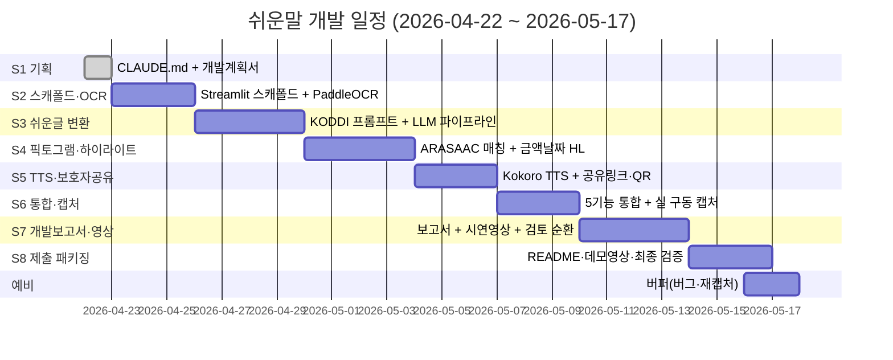

# 쉬운말 (Easy-Read) — 개발계획서

> 본 문서는 `_여분_공유/templates/개발계획서.md` 를 기반으로 작성되었으며, 제안서.md §6(핵심 기능 5종)·§8(기술 스택)·§11(위험 관리)을 규격으로 한다.
> 제출 마감: **2026-05-17 (D-25)** — 긴급 모드(S5 제출 패키징까지 25일).

**last_updated**: 2026-04-22
**진척도**: 4% (1 / 25 TODO 완료 — CLAUDE.md 작성만 완료)

---

## 0. 문서 위치 및 상속

- 저장소 루트 지침: [`../../CLAUDE.md`](../../CLAUDE.md) — §7 AI 사용 제약(로컬 LLM 전용)
- 공모전 상위 지침: [`../../현대오토에버_배리어프리/CLAUDE.md`](../../현대오토에버_배리어프리/CLAUDE.md)
- 프로젝트 지침: [`../CLAUDE.md`](../CLAUDE.md)
- 제안서(규격): [`../제안서.md`](../제안서.md)

---

## 1. 기술 스택 (제안서 §8 준수)

| 계층 | 기술 | 버전 | 선정 사유 |
|---|---|---|---|
| UI (PoC) | **Streamlit** | 1.37+ | 심사 시연·캡처에 최적, Python 단일 스택 |
| UI (최종 비전) | Flutter 3.x | 3.24+ | 제안서 §8 — iOS/Android 동시. D-25 내 구현 범위 아님 (Streamlit PoC로 대체) |
| OCR (주) | **PaddleOCR** | 2.7+ | 한글 정확도, 로컬, 표·레이아웃 인식 강함 |
| OCR (보) | Tesseract (lang=`kor`) | 5.3+ | fallback, CLI 간편 |
| 문서 구조 | PyMuPDF + OpenCV | 1.24+ / 4.9+ | 표·도장·서명란 영역 검출 |
| LLM (한국어) | **Ollama `qwen2.5:32b-instruct-q4_K_M`** (alias `ko`) | latest | 한국어 쉬운말 품질, Q4_K_M ≈ 19GB |
| LLM (품질 보강) | Ollama `devstral-2:123b` (alias `large`) | latest | 장문·복잡 문서, 74GB (단독 실행) |
| 가이드 프롬프트 | **KODDI 「쉬운 글 작성 가이드」** | 공식 | 제안서 [^5]. 3문장·능동태·한자어 풀기 |
| 구조화 출력 | `outlines` / `llama-cpp-python` grammar | 0.0.46+ | 원문↔쉬운글 1:1 단락 JSON |
| 픽토그램 | **ARASAAC (CC-BY-NC-SA)** 로컬 세트 | 최신 덤프 | 제안서 [^6]. 오프라인 매칭 |
| 임베딩 | Ollama `nomic-embed-text` | latest | 픽토그램·가이드 매칭, 274MB |
| 하이라이트 | 정규식(금액/날짜) + LLM 구조화 | - | 금액·날짜·서명·마감 자동 검출 |
| TTS (한국어) | **Kokoro TTS** | 최신 | 제안서 [^16]. 경량·오프라인 |
| TTS (보) | Coqui XTTS-v2 | 0.22+ | fallback, 다국어 |
| 공유 | Streamlit 웹 링크 + QR | - | 보호자에게 링크 전달 (SMS는 mock) |
| 배포·시연 | 로컬 + 시연 영상 (MP4) | - | 오프라인 심사 대비 |

**로컬 RAM 점유 추정** (M4 Max 128GB 기준):
- `qwen2.5:32b-q4_K_M` 단독: 약 19GB
- `nomic-embed-text` 동시 로드: +0.3GB
- PaddleOCR + Streamlit: +2GB
- 동시 점유 ≈ 22GB (충분한 여유)
- `devstral-2:123b` 전환 시 단독 74GB (동시 사용 금지, `ollama stop qwen` 후 전환)

---

## 2. 개발 일정 (Gantt) — D-25 긴급 모드

제출 마감 **2026-05-17**. 마지막 2일은 예비일로 유보.

| 스프린트 | 시작 | 종료 | 산출물 | 상태 |
|---|---|---|---|---|
| S1 | 2026-04-22 | 2026-04-22 | CLAUDE.md, 개발계획서 | 🟡 진행중 |
| S2 | 2026-04-23 | 2026-04-25 | Streamlit 스캐폴드 + OCR 동작 | ⬜ 예정 |
| S3 | 2026-04-26 | 2026-04-29 | 쉬운글 변환 (qwen2.5:32b) | ⬜ 예정 |
| S4 | 2026-04-30 | 2026-05-03 | 픽토그램 매칭 + 하이라이트 | ⬜ 예정 |
| S5 | 2026-05-04 | 2026-05-06 | Kokoro TTS + 보호자 공유 | ⬜ 예정 |
| S6 | 2026-05-07 | 2026-05-09 | 5기능 통합 + 캡처 5+ | ⬜ 예정 |
| S7 | 2026-05-10 | 2026-05-13 | 개발보고서 + 시연영상 | ⬜ 예정 |
| S8 | 2026-05-14 | 2026-05-16 | 제출 패키지 확정 | ⬜ 예정 |
| 예비 | 2026-05-16 | 2026-05-17 | 버그·재캡처 버퍼 | ⬜ 예정 |

상태값: `✅ 완료 / 🟡 진행중 / ⬜ 예정 / ⚠️ 지연`

---

## 3. 마일스톤

| 일자 | 산출물 | 검증 방법 | 달성 |
|---|---|---|---|
| 2026-04-22 | CLAUDE.md + 개발계획서 v1 | Markdown lint, 상호 참조 링크 | 🟡 |
| 2026-04-25 | Streamlit + OCR 동작 | `streamlit run app.py` → 샘플 안내문 OCR 성공 | ⬜ |
| 2026-04-29 | 쉬운글 변환 품질 확인 | 샘플 3종(복지·병원·학교) 변환 결과 KODDI 가이드 준수 | ⬜ |
| 2026-05-03 | 픽토그램 + 하이라이트 | ARASAAC 매칭 상위 3 중 적절 아이콘 ≥1, 금액·날짜 100% 검출 | ⬜ |
| 2026-05-06 | TTS + 공유 | Kokoro 한국어 음성 재생, QR 링크 생성 | ⬜ |
| 2026-05-09 | 캡처 5장+ | `docs/captures/` PNG 존재, 한글 미깨짐 | ⬜ |
| 2026-05-13 | 개발보고서 + 시연영상 | 검토 체크리스트 7항목 ✅, 영상 3분 이내 | ⬜ |
| 2026-05-17 | **제출 패키지** | README + 영상 + 오프라인 시연 검증 | ⬜ |

---

## 4. 스프린트 진척 (제안서 §6 5기능 매핑)

### S1 — 기획 (2026-04-22)
- [x] CLAUDE.md 작성
- [ ] 개발계획서 v1 작성 (본 문서)
- [ ] docs/captures/ 선행 생성

### S2 — 스캐폴드 + OCR 구조 파싱 (제안서 기능 1)
- [ ] `src/easy-read/` Streamlit 스캐폴드 (`app.py`, `pyproject.toml`)
- [ ] PaddleOCR 한글 모델 로드
- [ ] 문서 구조 파싱 (제목·단락·표·서명란·첨부목록)
- [ ] 샘플 안내문 3종 준비(복지 재심사·병원 처방·학교 가정통신문)
- [ ] mock 모드(모델 부재) 동작 확인

### S3 — 쉬운 글 자동 변환 (제안서 기능 2)
- [ ] Ollama `qwen2.5:32b-instruct-q4_K_M` pull
- [ ] `prompts/koddi_easy_korean.md` 프롬프트 작성 (3문장·능동태·한자어 풀기)
- [ ] 원문↔쉬운글 1:1 단락 대응 JSON 스키마 강제(outlines/grammar)
- [ ] **원문 병기 UI** (R1 대응)
- [ ] 확인 배너 고정 표시

### S4 — 픽토그램 매칭 + 하이라이트 (제안서 기능 3·4)
- [ ] ARASAAC 한국어 라벨 덤프 로컬화 + CC 표기
- [ ] `nomic-embed-text` 임베딩 + FAISS 인덱스
- [ ] 매칭 신뢰도 임계치(예: cosine ≥ 0.6) 미만 시 미표시
- [ ] 금액(숫자+원/만원) · 날짜(YYYY-MM-DD·○월 ○일) 정규식 검출
- [ ] 서명란·첨부목록 LLM 구조화 검출

### S5 — TTS + 보호자 공유 (제안서 기능 4·5)
- [ ] Kokoro TTS 한국어 음성 합성
- [ ] 한 줄 하이라이트 동기화 (문장 단위 타임코드)
- [ ] 속도 조절 (0.7x / 1.0x / 1.3x)
- [ ] 요약 카드 공유 링크 + QR (SMS 전송은 mock)
- [ ] 당사자 "이해했다" 자기 확인 버튼

### S6 — 통합·캡처
- [ ] 5기능 통합 플로우 검증 (입력→OCR→쉬운글→픽토그램→하이라이트→TTS→공유)
- [ ] 실 구동 PNG 캡처 5장+ (`docs/captures/`)
- [ ] 한글 미깨짐·에러 미노출 확인
- [ ] 캡처 검토 → 수정 → 재캡처 순환

### S7 — 개발보고서 + 시연영상
- [ ] `docs/개발보고서.md` 작성 (구현범위·환경·실행·캡처·검증·미흡)
- [ ] 검토 체크리스트 7항목 ✅
- [ ] 3분 이내 시연 영상(MP4)

### S8 — 제출 패키징
- [ ] README 갱신 (구동 방법·모델 사전 pull 안내)
- [ ] 네트워크 차단 상태에서 오프라인 시연 검증
- [ ] 최종 커밋·푸시

---

## 5. 현재 상황 (Status)

**last_updated: 2026-04-22**

- 🟡 **진행중**: S1 기획 — CLAUDE.md 작성 완료, 본 개발계획서 v1 작성 중.
- ✅ **완료**:
  - `_여분_현대오토에버_쉬운말/CLAUDE.md` 작성·커밋 (`docs(쉬운말): add CLAUDE.md 작업 지침`)
  - `_여분_현대오토에버_쉬운말/docs/` 및 `docs/captures/` 디렉터리 선행 생성
- ⏭ **다음 작업**: S2.1 `src/easy-read/` Streamlit 스캐폴드 + `pyproject.toml` 작성, PaddleOCR 한글 모델 로드 검증
- 📌 **리스크 주시**: D-25 — S3(쉬운글 변환) 품질 검증이 병목 예상. 품질 미달 시 `devstral-2:123b` 전환 결정일 = 2026-04-28

---

## 6. 위험·이슈 (제안서 §11 + 본 프로젝트 확장)

| ID | 발생일 | 위험 | 영향 | 대응 |
|---|---|---|---|---|
| R1 | 상시 | **LLM 오역·환각** (복용량·날짜 왜곡은 致命) | 致命 | **원문 병기 의무 + 확인 배너 고정 + 수치(금액·날짜·복용량)는 정규식 추출값 우선 표시** |
| R2 | 상시 | 픽토그램 부적합 매칭 | 中 | 신뢰도 임계치(cosine 0.6) 미만 시 아이콘 미표시 |
| R3 | 상시 | **손글씨 OCR 정확도 저하** | 高 | 사용자 편집 단계 필수, 원문 이미지 병기, 보호자 2차 확인 |
| R4 | 상시 | 개인정보(문서 이미지) 유출 | 致命 | 온디바이스 처리, 서버 전송 0회, 저장 기본 OFF |
| R5 | 2026-04-22 | **D-25 일정 압박** | 高 | 기능 우선순위 잠금: OCR→쉬운글→HL→픽토그램→TTS→공유 (후순위 생략 가능) |
| R6 | - | `qwen2.5:32b` 한국어 쉬운글 품질 미달 | 高 | 2026-04-28 기준 `devstral-2:123b` 전환, 동시 실행 금지(`ollama stop` 선행) |
| R7 | - | ARASAAC 라이선스 표기 누락 | 中 | 앱 내 "픽토그램 출처: ARASAAC, CC-BY-NC-SA" 고정 표시 |
| R8 | - | 심사 환경 네트워크 차단 | 高 | 완전 오프라인 시연 영상 + 로컬 모델 사전 pull 가이드 README 명시 |
| R9 | - | Kokoro TTS 한국어 발음 품질 | 中 | Coqui XTTS-v2 fallback 준비, 속도 조절로 보완 |

---

## 7. 자원 사용

| 자원 | 예상치 | 비고 |
|---|---|---|
| LLM 토큰/문서 | 1,500 ~ 4,000 tokens | 안내문 1장 기준, Ollama 로컬 |
| 로컬 RAM (동시) | **22 GB** (qwen2.5:32b-q4 + embed + Streamlit) | 여유 106GB |
| 로컬 RAM (최대) | **74 GB** (devstral-2:123b 단독 시) | 여유 54GB |
| API 요금 | **$0** | 전량 로컬 |
| 모델 스토리지 | ≈ 95 GB | qwen2.5:32b-q4(19) + devstral-2:123b(74) + embed(0.3) + Kokoro(1) |
| 데이터 스토리지 | ≈ 2 GB | ARASAAC 픽토그램 덤프 + 샘플 안내문 |
| 개발 시간 | 25일 (D-25 긴급 모드) | S1~S8 + 예비 2일 |

---

## 8. 참조

- 제안서 §6 (핵심 기능 5종): [`../제안서.md`](../제안서.md#6-핵심-기능-5종)
- 제안서 §8 (기술 스택): [`../제안서.md`](../제안서.md#8-기술-스택)
- 제안서 §11 (위험 관리): [`../제안서.md`](../제안서.md#11-위험-관리)
- KODDI 「쉬운 글 작성 가이드」: 제안서 [^5]
- ARASAAC 라이선스: 제안서 [^6] (CC-BY-NC-SA)

---

*`_여분_현대오토에버_쉬운말/docs/개발계획서.md` · v1 · last_updated: 2026-04-22*
