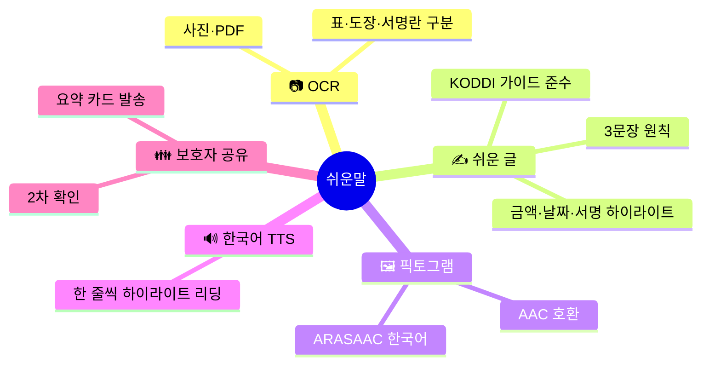
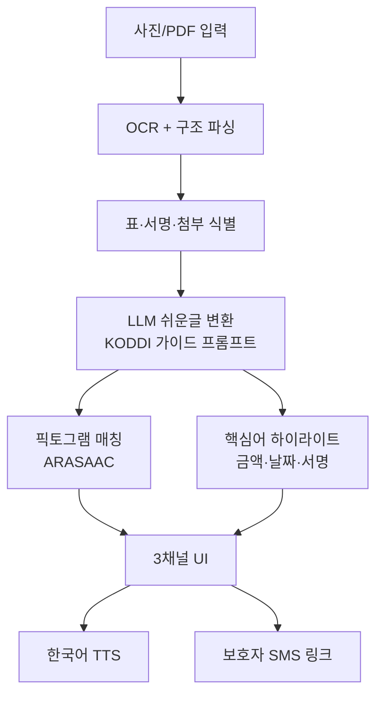

# 쉬운말 (Easy-Read)
## 행정 안내문을 "쉬운 문장 + 그림 + 음성"으로 바꿔주는 AI 변환기

> 발달장애인·저문해 노인·한글 미숙 다문화 가정을 위한 공공문서 쉬운말 동반앱

| 항목 | 내용 |
|---|---|
| 콘테스트 | 2026 현대오토에버 배리어프리 앱 개발 콘테스트 |
| 카테고리 | 정보 접근 · 권익신장 |
| 타깃 | 등록 발달장애인 약 25만 명 + 저문해 인구 + 한글 미숙 다문화 가정 [^1][^2] |
| 핵심 차별점 | **"쉬운 글" 공식 가이드라인 준수** + **금액·날짜·서명 자동 하이라이트** + **픽토그램 3채널(문장·그림·음성)** |
| 핵심 기술 | OCR · LLM 쉬운말 요약 · 한국어 TTS · 픽토그램 매칭 |
| 작성일 | 2026.04.21 |

---

## 목차

1. [사업 배경·문제 정의](#1-사업-배경문제-정의)
2. [시장 분석·경쟁 환경](#2-시장-분석경쟁-환경)
3. [해외 모범사례 비교](#3-해외-모범사례-비교)
4. [타깃 페르소나](#4-타깃-페르소나)
5. [솔루션 개요](#5-솔루션-개요)
6. [핵심 기능 5종](#6-핵심-기능-5종)
7. [시스템 아키텍처](#7-시스템-아키텍처)
8. [기술 스택](#8-기술-스택)
9. [기대 효과·사회적 임팩트](#9-기대-효과사회적-임팩트)
10. [정책 정합성](#10-정책-정합성)
11. [위험 관리](#11-위험-관리)
12. [근거자료·출처](#12-근거자료출처)

---

## 1. 사업 배경·문제 정의

### 1.1 핵심 수치 (모두 1차 출처 기반)

| 영역 | 지표 | 수치 | 출처 |
|---|---|---|---|
| 인구 | 등록 발달장애인 (지적+자폐성, 2023) | **약 25만 명** | 보건복지부 등록장애인 통계 [^1] |
| 문해 | OECD PIAAC 성인 문해 — 한국 최저 수준 구간 | 일정 비율 | OECD PIAAC [^2] |
| 문해 | 국립국어원 「국민의 언어 의식」·일상 이해 곤란 영역 | 행정용어 다수 | 국립국어원 [^3] |
| 법제 | 「발달장애인 권리보장 및 지원법」 시행 | **2015** | 국가법령정보센터 [^4] |
| 가이드 | 한국장애인개발원 「쉬운 글 작성 가이드」 | 공식 발간 | KODDI [^5] |
| 표준 | 픽토그램 국제표준(ARASAAC / ISO 7001) | 공개·무료 | ARASAAC·ISO [^6][^7] |
| 다문화 | 결혼이민자·한국어 학습자 | 수십만 명 | 여성가족부 / 법무부 [^8] |

### 1.2 문제 정의

#### ① 행정 문서는 '설계상' 이해하기 어렵다.
국립국어원·국민권익위원회는 반복해서 공공 문서의 **전문용어·한자어·수동태** 남용을
지적한다 [^3]. 「행정 기본법」과 「공공언어 가이드」가 존재하나 [^9], 실제 안내문은
여전히 **법령 조문·전문용어**가 포함된 채로 발송된다.

#### ② 발달장애인은 '스스로' 안내문을 이해하기 어렵다.
「발달장애인 권리보장 및 지원법」은 **자기결정권·이해 가능한 정보 접근권**을 보장한다
[^4]. 그러나 현실에서 발달장애인은 계약·병원·복지 안내문을 **보호자·사회복지사**
도움 없이는 해석하지 못하는 경우가 많다. 한국장애인개발원은 **쉬운 글** 작성을
가이드하지만 [^5], 모든 발신기관이 이를 지키지는 않는다.

#### ③ 저문해 고령자·다문화 가정에게도 동일 장벽.
OECD 국제성인역량조사(PIAAC)는 한국의 성인 중 일정 비율이 **긴 행정 문서 이해에
어려움**을 가진다고 지적한다 [^2]. 결혼이민자·한국어 학습자 수십만 명 [^8]도 동일
장벽을 겪는다. 즉, 쉬운말 도구의 수혜자는 **발달장애인 + 고령 저문해 + 다문화
가정**으로 **광범위**하다.

#### ④ 병원 처방 설명·보험 약관 등 생활 밀착 문서의 오독은 위험하다.
약 복용 지시 오독은 생명과 직결된다. 금융 약관 오독은 피해로 이어진다. **쉬운 문장
+ 그림 + 음성** 3채널로 핵심을 재전달하는 도구가 필요하다.

### 1.3 본 사업의 통찰

> "읽기 쉬운 문서"는 선의가 아니라 **법적 권리**다.
> 우리 앱은 사용자를 위해 원문을 **3채널**로 번역한다.

---

## 2. 시장 분석·경쟁 환경

### 2.1 국내 기존 서비스

| 서비스 | 운영 주체 | 기능 | 쉬운말 자동 변환 |
|---|---|---|---|
| 국립국어원 「쉬운 공공언어」 [^3] | 공공 | 용어 가이드 | ❌ (사람이 씀) |
| 한국장애인개발원 「쉬운 글 가이드」 [^5] | 공공 | 기관 대상 가이드 | ❌ |
| 네이버·카카오 번역 | 민간 | 외국어 | ❌ (쉬운말 없음) |
| 최근 LLM 기반 요약 앱 | 민간 | 일반 요약 | ⚠️ (쉬운글 전용 아님) |
| **▶ 쉬운말 (제안)** | 본 사업 | **OCR + 쉬운글 + 픽토그램 + 음성** | **✅ (특화)** |

### 2.2 시장 갭

| 축 | 기존 | 쉬운말 |
|---|---|---|
| 원문 입력 | 텍스트 중심 | **사진·PDF·스캔** |
| 변환 | 일반 요약 | **"쉬운 글" 가이드 준수** |
| 출력 | 텍스트 | **문장 + 픽토그램 + 음성** |
| 보호자 연계 | 없음 | **요약 공유 카드** |

---

## 3. 해외 모범사례 비교

| 국가 | 서비스/표준 | 특징 |
|---|---|---|
| 🇪🇺 EU | **Easy-to-Read 표준** [^10] | 발달장애인 정보접근 EU 공통 지침 |
| 🇩🇪 독일 | **Leichte Sprache (쉬운말)** 법적 표준 [^11] | 관공서 문서 쉬운말 병기 의무 |
| 🇸🇪 스웨덴 | **LL(Lättläst) 책·뉴스** [^12] | 쉬운말 출판 생태계 |
| 🇬🇧 영국 | **NHS Easy Read** [^13] | 병원 안내문 쉬운말 버전 의무화 |
| 🇰🇷 한국 | **쉬운말 (제안)** | **AI로 자동 변환**, 어느 기관 문서든 수용 |

### 3.1 UN CRPD 제21조·제9조 정합

UN 장애인권리협약 제21조(표현·정보 접근)·제9조(접근성)는 **알기 쉬운 형식** 제공
의무를 명문화한다 [^14]. 본 사업은 이를 기술로 구현.

---

## 4. 타깃 페르소나

### Persona 1 — 이○○ (27세, 지적장애 2급, 1인 독립 생활)
- 구청에서 주거급여 재심사 안내문 수령.
- **🔥 PAIN** 안내문 대부분 이해 불가, 마감 시한 놓칠 위험.
- **🎯 NEED** "○월 ○일까지 OO주민센터에 오세요. 통장 사본 한 장 가져오세요" 같은
  2줄·그림·음성.

### Persona 2 — 김○○ (73세, 독거 노인, 저문해)
- 병원 처방 설명서 받음.
- **🔥 PAIN** 복용 방법·부작용 어려움.
- **🎯 NEED** "하루 세 번 / 밥 먹고 / 한 알"의 픽토그램 + 음성.

### Persona 3 — Nguyen Thi (32세, 결혼이민자, 한국어 중급)
- 자녀 학교 가정통신문 수령.
- **🔥 PAIN** 안내 사항·준비물을 정확히 파악하기 어려움.
- **🎯 NEED** 한국어 쉬운말 + 베트남어 보조 자막.

---

## 5. 솔루션 개요

### 5.1 한 줄 정의

> 사진 찍거나 PDF 업로드하면, 중요한 것만 뽑아 **짧은 문장 + 픽토그램 + 음성**으로 다시
> 전달하는 AI 쉬운말 변환기.

### 5.2 핵심 축

---

## 6. 핵심 기능 5종

### 기능 1 · 📷 OCR + 문서 구조 파싱
- 사진·PDF·스캔 수용. 한글 OCR 엔진으로 텍스트 추출 [^15].
- 문서 구조(제목·단락·표·도장·서명란·첨부목록)를 자동 식별.

### 기능 2 · ✍️ 쉬운 글 자동 변환
- **로컬 LLM** (**Ollama `qwen2.5:32b-q4`** 또는 `devstral-2:123b`)에 **KODDI 쉬운 글 가이드** [^5] 프롬프트 주입. 한국어 특화 모델로 쉬운말 품질 확보, 문서 원문을 **서버에 전송하지 않음**.
- 3문장·능동태·짧은 접속·한자어 풀기 원칙.
- 원문 단락 ↔ 쉬운글 단락 **1:1 대응** 유지로 검증 가능.

### 기능 3 · 🖼️ 픽토그램 자동 매칭
- ARASAAC 픽토그램 셋(CC 라이선스) [^6]을 한국어 단어 임베딩으로 매칭.
- AAC 사용자 UX(터치로 문장 재생성) 호환.

### 기능 4 · 🔊 한 줄 리딩·하이라이트
- 한 줄씩 하이라이트하며 한국어 TTS가 천천히 읽어줌.
- 속도·성별 선택 (**Kokoro TTS (로컬, 한국어)** 또는 **Coqui XTTS-v2** [^16]). 네트워크 불필요.

### 기능 5 · 👪 보호자 2차 확인
- 보호자 전화번호 등록 시, 요약 카드를 SMS 웹 링크로 공유.
- 발달장애인 당사자의 "이해했다" 자기 확인 버튼과 함께.

---

## 7. 시스템 아키텍처

---

## 8. 기술 스택

| 계층 | 기술 | 선정 근거 |
|---|---|---|
| Mobile | Flutter 3.x | iOS/Android 동시 |
| OCR | PaddleOCR / Tesseract 한글 [^15] | 오픈소스 |
| LLM (로컬) | **Ollama `qwen2.5:32b-q4`** 또는 `devstral-2:123b` [^17] | 한국어 쉬운말 품질, 온디바이스, 문서 서버 전송 없음 |
| 픽토그램 | ARASAAC (CC) [^6] | 공개 라이선스 |
| TTS (로컬) | **Kokoro TTS (한국어)** · fallback **Coqui XTTS-v2** [^16] | 자연스러운 한국어, 오프라인 동작 |
| 공유 | SMS Gateway + 웹 링크 | 보호자 앱 설치 불필요 |
| 가이드 | **KODDI 「쉬운 글 작성 가이드」** [^5] | 공식 출처 |

---

## 9. 기대 효과·사회적 임팩트

### 9.1 정량 목표 (출시 + 1년)

| 지표 | 목표 | 산정 근거 |
|---|---|---|
| 다운로드 | **10만+** | 발달장애인 25만 [^1] + 저문해 + 다문화 |
| 변환 문서 수 | 30만 건 | 복지·병원·학교 안내문 |
| 보호자 공유 링크 | 5만 건 | 발달장애 1인 가구 비중 반영 |
| 처방 오독 예방 사례 | 미확정 (설문) | 병원 협력 시 벤치마크 |

### 9.2 사회 변화

| | BEFORE | AFTER |
|---|---|---|
| 행정 문서 이해 | 보호자 의존 | **앱 1회 변환** |
| 병원 처방 설명 | 오독 위험 | **픽토그램 + 음성** |
| 보호자 부담 | 매번 설명 | **공유 링크로 확인** |
| 정보 접근 권리 | 선언적 [^4][^14] | **실질 구현** |

---

## 10. 정책 정합성

| 정책 | 본 사업 정합 |
|---|---|
| 「발달장애인 권리보장·지원법」 [^4] | 자기결정·정보 접근권 구현 |
| KODDI 「쉬운 글」 가이드 [^5] | 가이드의 AI 자동 적용 |
| 장애인차별금지법 [^18] | 정당한 편의 제공 |
| UN CRPD 제21조·제9조 [^14] | 정보 접근·접근성 구현 |
| 「국어기본법」 공공언어 노력 의무 [^3] | 공공언어 쉬운화 지원 |

---

## 11. 위험 관리

| ID | 위험 | 영향 | 대응 |
|---|---|---|---|
| R1 | LLM 오역·환각 | 致命 | 원문 병기·사용자 확인 배너 의무 |
| R2 | 픽토그램 부적합 | 中 | 매칭 실패 시 아이콘 없음 표시 |
| R3 | OCR 정확도 (손글씨) | 高 | 사용자 편집 단계 필수 |
| R4 | 개인정보 (문서 이미지) | 致命 | 온디바이스 OCR 우선, 서버 저장 기본 OFF |
| R5 | 가이드 해석 논란 | 中 | KODDI·장애인 당사자 단체 자문 |

---

## 12. 근거자료·출처

[^1]: **보건복지부 「등록장애인 현황」** — 지적 + 자폐성 합산 2023년 약 25만 명. [https://www.mohw.go.kr/menu.es?mid=a10712010200](https://www.mohw.go.kr/menu.es?mid=a10712010200)

[^2]: **OECD 「Survey of Adult Skills (PIAAC)」**. [https://www.oecd.org/skills/piaac/](https://www.oecd.org/skills/piaac/)

[^3]: **국립국어원 「국민의 언어 의식」·「공공언어」 자료**. [https://www.korean.go.kr/front/reportData/reportDataList.do?mn_id=207](https://www.korean.go.kr/front/reportData/reportDataList.do?mn_id=207)

[^4]: **「발달장애인 권리보장 및 지원에 관한 법률」 (2015 시행)**. [https://www.law.go.kr/법령/발달장애인권리보장및지원에관한법률](https://www.law.go.kr/법령/발달장애인권리보장및지원에관한법률)

[^5]: **한국장애인개발원(KODDI) 「쉬운 글 작성 가이드」**. [https://www.koddi.or.kr/data/research_01.jsp](https://www.koddi.or.kr/data/research_01.jsp)

[^6]: **ARASAAC 픽토그램 세트 (CC-BY-NC-SA)**. [https://arasaac.org/](https://arasaac.org/)

[^7]: **ISO 7001:2023 Graphical symbols — Public information symbols**. [https://www.iso.org/standard/74849.html](https://www.iso.org/standard/74849.html)

[^8]: **여성가족부 「다문화가족 지원정책 기본계획」·법무부 체류외국인 통계**. [https://www.mogef.go.kr/](https://www.mogef.go.kr/) / [https://www.moj.go.kr/moj/2412/subview.do](https://www.moj.go.kr/moj/2412/subview.do)

[^9]: **「행정 기본법」·「국어기본법」**. [https://www.law.go.kr/법령/행정기본법](https://www.law.go.kr/법령/행정기본법)

[^10]: **European Commission "Information for all — Easy-to-Read Standards"**. [https://easy-to-read.eu/european-standards/](https://easy-to-read.eu/european-standards/)

[^11]: **독일 Leichte Sprache (연방 사회복지부 공개 자료)**. [https://www.bmas.de/DE/Service/Medien/Publikationen/a752-leichte-sprache-ratgeber.html](https://www.bmas.de/DE/Service/Medien/Publikationen/a752-leichte-sprache-ratgeber.html)

[^12]: **스웨덴 MTM — Lättläst (쉬운 읽기) 기관**. [https://www.mtm.se/](https://www.mtm.se/)

[^13]: **UK NHS — Easy Read Information**. [https://www.england.nhs.uk/learning-disabilities/about/resources/easy-read/](https://www.england.nhs.uk/learning-disabilities/about/resources/easy-read/)

[^14]: **UN CRPD Articles 9 & 21**. [https://www.un.org/development/desa/disabilities/convention-on-the-rights-of-persons-with-disabilities/article-9-accessibility.html](https://www.un.org/development/desa/disabilities/convention-on-the-rights-of-persons-with-disabilities/article-9-accessibility.html)

[^15]: **PaddleOCR / Tesseract OCR (한글 지원)**. [https://github.com/PaddlePaddle/PaddleOCR](https://github.com/PaddlePaddle/PaddleOCR)

[^16]: **Kokoro TTS (한국어 로컬 합성)**. [https://github.com/hexgrad/kokoro](https://github.com/hexgrad/kokoro) / **Coqui XTTS-v2 (fallback)**. [https://github.com/coqui-ai/TTS](https://github.com/coqui-ai/TTS)

[^17]: **Ollama — 로컬 LLM 실행 런타임** (`qwen2.5:32b`, `devstral-2:123b` 등). [https://ollama.com/library](https://ollama.com/library) / **Qwen2.5 Model Card (한국어 성능)**. [https://huggingface.co/Qwen/Qwen2.5-32B-Instruct](https://huggingface.co/Qwen/Qwen2.5-32B-Instruct)

[^18]: **「장애인차별금지 및 권리구제 등에 관한 법률」**. [https://www.law.go.kr/법령/장애인차별금지및권리구제등에관한법률](https://www.law.go.kr/법령/장애인차별금지및권리구제등에관한법률)

---

*쉬운말 · 제안서.md · 2026.04.21*
