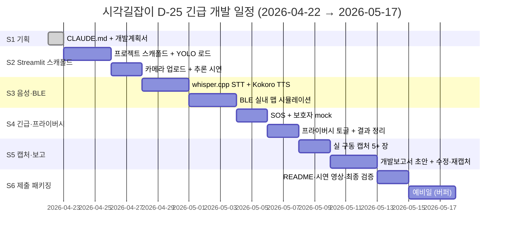

# 시각길잡이 (Sight Guide) — 개발계획서

> 본 문서는 `_여분_공유/templates/개발계획서.md` 템플릿에서 생성됐습니다.
> `last_updated` 헤더를 매 갱신 시 수정합니다. 제안서.md §6·§8 을 규격으로 삼습니다.

**last_updated**: 2026-04-22
**진척도**: 4% (1 / 25 완료 — S1 작업 중)
**제출 마감**: 2026-05-17 (D-25)

---

## 1. 기술 스택

제안서 §8 기술 스택을 그대로 구현 규격으로 채택한다. 클라우드 TTS (Clova Voice 등)
언급은 루트 `CLAUDE.md §7.4 로컬 대체 매핑표` 에 따라 **Kokoro TTS (로컬)** 로 치환한다.

| 계층 | 기술 | 버전 | 선정 사유 |
|---|---|---|---|
| 데모 프레임워크 (Phase 1) | **Streamlit** | 1.39+ | 웹 데모 + 캡처 용이, 심사용 PoC |
| 모바일 프레임워크 (Phase 2) | **Flutter** | 3.22+ | iOS·Android 동시 배포, BLE·카메라 플러그인 성숙 |
| 객체 인식 | **Ultralytics YOLO v8n** | 8.2+ | 경량·온디바이스, CoreML·TFLite·ONNX 익스포트 |
| 모델 포맷 | ONNX / CoreML (iOS) / TFLite (Android) | - | 온디바이스 추론, Metal·NNAPI 가속 |
| OCR (잔여시간·표지) | PaddleOCR 또는 Apple Vision | 2.7+ | 숫자·한글 검출, 오프라인 |
| 실내 측위 | **BLE 비콘 + IMU 센서 융합 Kalman** | - | 지하철 환승 보정 (제안서 §6 기능2) |
| STT | **whisper.cpp (small/medium)** | latest | 한국어 음성 명령, 오프라인, 저전력 |
| TTS | **Kokoro TTS (한국어)** (fallback Coqui XTTS-v2) | latest | 자연스러운 한국어, 오프라인, 저지연 |
| LLM (보조) | Ollama `small` → **qwen2.5:7b** | latest | 음성 명령 의도 파싱 (예: "강남역 2번 출구") |
| 구조화 출력 | outlines / llama.cpp grammar | - | 의도 슬롯 JSON 강제 |
| 접근성 | VoiceOver · TalkBack | OS native | 국제 표준 (제안서 §8 [^16]) |
| 데이터 | **BF 인증시설** (한국장애인개발원) + **서울교통공사 지하철 POI** | 공공 | 한국 특화 (제안서 §8 [^4]) |
| 상태 관리 (Flutter) | Riverpod | 2.x | - |
| 시연 배포 | 로컬 Streamlit + 시연 영상 | - | 오프라인 심사 대비 |

> **주력은 비전·음성 파이프라인**이고 LLM 은 보조. 배포 요금 $0.

---

## 2. 개발 일정 (Gantt)

| 스프린트 | 시작 | 종료 | 산출물 | 상태 |
|---|---|---|---|---|
| S1 | 2026-04-22 | 2026-04-22 | CLAUDE.md, 개발계획서 v1 | 🟡 진행중 |
| S2 | 2026-04-23 | 2026-04-27 | Streamlit 스캐폴드 + YOLO 추론 데모 | ⬜ 예정 |
| S3 | 2026-04-28 | 2026-05-03 | STT/TTS + BLE 실내 맵 시뮬 | ⬜ 예정 |
| S4 | 2026-05-04 | 2026-05-07 | 긴급 SOS + 프라이버시 토글 | ⬜ 예정 |
| S5 | 2026-05-08 | 2026-05-12 | 실 구동 캡처 5+, 개발보고서 초안 | ⬜ 예정 |
| S6 | 2026-05-13 | 2026-05-14 | README·시연 영상·제출 패키지 | ⬜ 예정 |
| 버퍼 | 2026-05-15 | 2026-05-17 | 예비·최종 검증 | ⬜ 예정 |

상태값: `✅ 완료 / 🟡 진행중 / ⬜ 예정 / ⚠️ 지연`

---

## 3. 마일스톤

| 일자 | 산출물 | 검증 방법 | 달성 |
|---|---|---|---|
| 2026-04-22 | CLAUDE.md + 개발계획서 v1 | 파일 존재 + Markdown lint | 🟡 |
| 2026-04-27 | Streamlit + YOLO 객체 인식 데모 | `streamlit run app.py` → 이미지 업로드 → 감지 박스 | ⬜ |
| 2026-05-03 | 음성 기동 + 한국어 TTS 응답 + BLE 맵 시뮬 | whisper.cpp → Kokoro 음성 파일 재생 | ⬜ |
| 2026-05-07 | 5 기능 최소 완주 세트 동작 | 각 기능 단독 데모 | ⬜ |
| 2026-05-12 | 캡처 5+, 개발보고서 초안 | 파일 존재 + 검토 체크리스트 | ⬜ |
| 2026-05-14 | 제출 패키지 (README·시연 영상) | 오프라인 재현 테스트 | ⬜ |
| 2026-05-17 | **최종 제출** | 공모전 플랫폼 업로드 | ⬜ |

---

## 4. 스프린트 진척

### S1 — 기획 (2026-04-22)
- [x] CLAUDE.md 작성 및 커밋
- [ ] 개발계획서 v1 작성 및 커밋 (본 문서)
- [ ] docs/captures/ 디렉터리 확보

### S2 — Streamlit 스캐폴드 + YOLO (2026-04-23 ~ 04-27)
- [ ] `src/sight-guide/` pyproject.toml + uv 환경
- [ ] Ultralytics YOLO v8n ONNX 모델 로드
- [ ] Streamlit 카메라/이미지 업로드 UI
- [ ] 점자블록·횡단보도·계단 라벨 검출 시연 (혼합 라벨 fine-tune 전에는 COCO 사전학습 + 라벨 매핑)
- [ ] Mock fixture: `crosswalk_sample.jpg`, `braille_block_sample.jpg`
- [ ] 확신도 낮음 시 경고 표시 (위험 R1 대응)

### S3 — 음성·BLE (2026-04-28 ~ 05-03)
- [ ] whisper.cpp small 모델 번들 + 한국어 음성 인식
- [ ] Kokoro TTS 한국어 음성 합성 파이프라인
- [ ] 음성 명령 의도 파싱: qwen2.5:7b + outlines JSON 슬롯
- [ ] BLE 비콘 시뮬레이터 (서울 지하철 1곳 실내 맵 정적 JSON)
- [ ] IMU 센서 데이터 mock + Kalman 필터 프로토타입
- [ ] 음성-only 동선 스크립트 (화면 탭 0 회)

### S4 — 긴급·프라이버시 (2026-05-04 ~ 05-07)
- [ ] 음성 "도움 요청" → SMS mock (실제 발송 X, 로그 출력)
- [ ] 사전 지정 보호자 연락처 설정 UI
- [ ] 프라이버시 토글: 영상 저장 ON/OFF (기본 OFF)
- [ ] 온디바이스 처리 표기 배너

### S5 — 캡처·보고서 (2026-05-08 ~ 05-12)
- [ ] Streamlit 실 구동 → 주요 화면 캡처 5+ 장
- [ ] 캡처 한글 깨짐·에러 화면 점검
- [ ] 개발보고서 구조 (구현 범위·환경·실행 방법·캡처·검증·미흡사항)
- [ ] 검토 체크리스트 7항목 ✅

### S6 — 제출 패키징 (2026-05-13 ~ 05-14)
- [ ] README.md 갱신 (실행·시연 절차)
- [ ] 시연 영상 녹화 (OBS, 3~5분, 자막)
- [ ] 오프라인 재현 테스트 (Wi-Fi 끄고 시연)
- [ ] 최종 커밋·푸시 (Co-Authored-By: Claude 금지)

### 버퍼 (2026-05-15 ~ 05-17)
- [ ] 예비일: 회귀 점검·폼 제출

---

## 5. 현재 상황

**last_updated: 2026-04-22 15:10**

현재 진행 중: **S1 — 기획 문서 작성**

완료:
- 저장소 구조 확인 및 `docs/captures/` 생성
- `CLAUDE.md` 작성 및 커밋 (`docs(시각길잡이): add CLAUDE.md 작업 지침`)

진행:
- 개발계획서 v1 초안 작성 (본 문서 커밋 직전)

다음 작업:
- S2.1 `src/sight-guide/` pyproject.toml + Ultralytics YOLO 로드
- S2.2 Streamlit 카메라 업로드 UI 스캐폴드

블로커: 없음.

---

## 6. 위험·이슈

제안서 §11 위험 관리에서 식별된 항목 + 개발 관점 추가 항목.

| ID | 발생일 | 위험 | 영향 | 대응 |
|---|---|---|---|---|
| R1 | 2026-04-22 | **YOLO 객체 오인식** — 점자블록·횡단보도 사전학습 라벨 부재 | 高 | COCO 사전학습 + 라벨 매핑, 확신도 < 0.6 시 "확신도 낮음" TTS 경고 선행, 시연용 정적 샘플 사전 큐레이션 |
| R2 | 2026-04-22 | **BLE 비콘 미설치 지방역** — 실제 측위 불가 | 中 | 서울 주요 환승역 1곳만 Phase 1 대상, IMU 단독 보정 폴백, Mock JSON 맵으로 데모 |
| R3 | 2026-04-22 | **배터리 소모** — YOLO + BLE + IMU 동시 구동 | 中 | 30분 제한 모드, 저전력 모델 (v8n), 프레임 스킵 (3fps) |
| R4 | 2026-04-22 | **프라이버시 (카메라 영상)** | 致命 | 온디바이스 원칙, 저장 기본 OFF, 네트워크 미전송 명시 배너 |
| R5 | 2026-04-22 | **D-25 마감 압박** — Flutter Phase 2 완성 불가 가능성 | 高 | Streamlit PoC 를 심사 주력으로 고정, Flutter 는 시간 여유 시만 |
| R6 | 2026-04-22 | **whisper.cpp 한국어 small 정확도** | 中 | medium 모델 옵션 제공, 잡음 환경 샘플 테스트 |
| R7 | 2026-04-22 | **심사 환경 네트워크 차단** | 高 | 완전 오프라인 시연 영상 사전 녹화, 로컬 Streamlit 번들 |
| R8 | 2026-04-22 | **사용자 피드백 수집 난이도** (제안서 §11 R5) | 中 | 음성 피드백, 시각장애인 협회 사전 컨택 |

---

## 7. 자원 사용

M4 Max · 128GB 기준. 모든 추론 로컬, 요금 $0.

| 자원 | 예상치 | 비고 |
|---|---|---|
| YOLO v8n 파일 크기 | ~12 MB (ONNX) | 온디바이스 번들 |
| whisper.cpp small | ~466 MB | 한국어 |
| whisper.cpp medium (옵션) | ~1.5 GB | 정확도 우선 시 |
| Kokoro TTS | ~330 MB | 한국어 경량 |
| qwen2.5:7b (Ollama) | ~4.7 GB | 의도 파싱 보조 |
| 동시 실행 RAM | ~8 GB | Streamlit + Ollama + whisper |
| 디스크 스토리지 | ~7 GB | 모델 + POI 데이터 |
| API 요금 | **$0** | 전부 로컬 |
| 네트워크 | 개발 시 모델 다운로드만 | 시연 시 오프라인 |

---

## 8. 제안서·설계 근거 인덱스

- 5 기능 정의: 제안서 §6 (실외 도보 / 실내 BLE / 음성 only / 긴급·보호자 / 프라이버시)
- 기술 스택 근거: 제안서 §8 + 각주 [^4][^15][^16]
- 정책 정합성: 제안서 §10 (교통약자법·BF·장차법·UN CRPD·디지털플랫폼정부)
- 위험 관리 기원: 제안서 §11

---

*`_여분_현대오토에버_시각길잡이/docs/개발계획서.md` · v1 · 2026-04-22*
