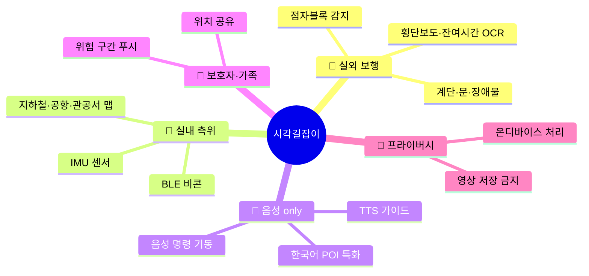
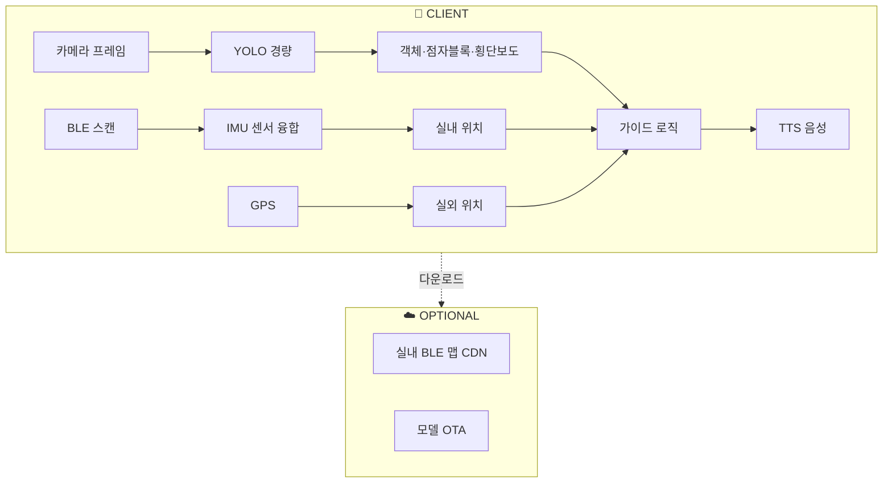

# 시각길잡이 (Sight Guide)
## 스마트폰 카메라 한 대로 걷는 AI 보행 도우미

> 25만 시각장애인을 위한 실내·실외 통합 도보 내비게이션

| 항목 | 내용 |
|---|---|
| 콘테스트 | 2026 현대오토에버 배리어프리 앱 개발 콘테스트 |
| 카테고리 | 이동·접근성 · 안전 |
| 타깃 | 등록 시각장애인 약 25만 명 + 고령 저시력자 + 안내견 사용자 [^1] |
| 핵심 차별점 | **화면을 볼 필요 없는 음성-only UX** + **지하철 역사 실내 BLE 맵 프리로드** + **온디바이스 실시간 객체 인식** |
| 핵심 기술 | YOLO 경량화(CoreML/TFLite) · BLE 비콘 측위 · Clova/Whisper · TTS |
| 작성일 | 2026.04.21 |

---

## 목차

1. [사업 배경·문제 정의](#1-사업-배경문제-정의)
2. [시장 분석·경쟁 환경](#2-시장-분석경쟁-환경)
3. [해외 모범사례 비교](#3-해외-모범사례-비교)
4. [타깃 페르소나](#4-타깃-페르소나)
5. [솔루션 개요](#5-솔루션-개요)
6. [핵심 기능 5종](#6-핵심-기능-5종)
7. [시스템 아키텍처](#7-시스템-아키텍처)
8. [기술 스택](#8-기술-스택)
9. [기대 효과·사회적 임팩트](#9-기대-효과사회적-임팩트)
10. [정책 정합성](#10-정책-정합성)
11. [위험 관리](#11-위험-관리)
12. [근거자료·출처](#12-근거자료출처)

---

## 1. 사업 배경·문제 정의

### 1.1 핵심 수치 (모두 1차 출처 기반)

| 영역 | 지표 | 수치 | 출처 |
|---|---|---|---|
| 인구 | 등록 시각장애인 (2023) | **약 25만 명** | 보건복지부 등록장애인 통계 [^1] |
| 인구 | 고령 저시력자 (65세+) | 지속 증가 추세 | WHO 시각 보고서 [^2] |
| 교통 | 교통약자 이동권 제도 근거 | 「교통약자 이동편의 증진법」 | 국가법령정보센터 [^3] |
| 시설 | 점자블록 설치 의무 | BF 인증기준 | 한국장애인개발원 BF 인증 [^4] |
| 시설 | 횡단보도 음향신호기 | 전국 설치 확대 | 국토교통부 [^5] |
| 이용 | 국내 시각장애인 보조공학 기기 이용률 | 스마트폰 90%+ | 한국장애인개발원 보조공학 실태조사 [^6] |
| 안전 | 보도 이탈·추락 사고 | 비장애 대비 높음 | 교통안전공단·장애인정책종합계획 [^7] |

### 1.2 문제 정의

#### ① 점자블록은 설치되었으나 '끊김'이 흔하다.
한국장애인개발원 BF(Barrier Free) 인증 기준에 따라 공공건축·교통시설은 점자블록
설치가 의무화되어 있으나 [^4], 실제 보행 동선에서 **시공·보수 지연·설치 오류**로
블록이 끊기거나 장애물이 놓인 경우가 빈번하다. 시각장애인은 **끊김 직전** 을
자각하기 어렵다.

#### ② 횡단보도 음향신호기는 보급되었지만 잔여시간을 못 읽는다.
전국에 횡단보도 음향신호기가 확대 설치되어 있으나 [^5], **잔여시간**(예: "보행 남은
시간 6초")을 언제 시작되는지 파악하기 어렵고, 보행 중간에 중단되면 혼란스럽다.

#### ③ 실내(지하철·공항·관공서)에서 GPS가 끊긴다.
실외는 GPS 기반 내비게이션 앱이 존재하지만, **지하철 환승·공항·대형 관공서** 에서는
GPS가 끊겨 시각장애인의 실내 길찾기가 가장 어려운 구간이 된다. 한국 지하철 주요
역사는 **BLE 비콘** 도입이 일부 진행되었으나 [^8], 통합 앱은 제한적이다.

#### ④ 기존 앱은 "화면을 봐야" 하는 경우가 있다.
시중 시각 보조 앱은 카메라로 물체·텍스트를 읽어주지만 **앱 내 메뉴 탐색 자체가
화면 조작**을 요구하는 경우가 있다. 진짜 필요한 것은 **음성 only** 로 동작하는
내비게이션이다.

### 1.3 본 사업의 통찰

> 시각장애인에게 스마트폰은 '보는 도구'가 아니라 '듣는 지팡이'가 되어야 한다.

---

## 2. 시장 분석·경쟁 환경

### 2.1 국내 기존 앱

| 앱 | 운영 주체 | 기능 영역 | 실시간 보행 내비 |
|---|---|---|---|
| **설리번+** [^9] | 투아트 | 사물·텍스트 읽기, OCR | △ (인식 중심) |
| **에너넷/Voiceye** [^10] | 민간 | 바코드·QR 접근성 | ❌ |
| **배리어프리 지도 (정부·지자체)** [^4] | 일부 지자체 | 정적 POI 안내 | ❌ |
| **카카오/네이버 지도 음성** | 민간 | 일반용 | ⚠️ (시각 특화 ×) |
| **▶ 시각길잡이 (제안)** | 본 사업 | **실외 객체 인식 + 실내 BLE + 음성 only** | **✅** |

### 2.2 시장 갭

| 축 | 기존 | 시각길잡이 |
|---|---|---|
| 실내 측위 | 미지원 | **BLE + IMU 융합 실내 맵** |
| 실외 장애물 감지 | 사물 인식에 머뭄 | **횡단보도·점자블록·계단·문 실시간** |
| UX | 화면 조작 포함 | **음성-only** |
| 데이터 | 정적 | **공공 BF 인증 시설 + 사용자 제보** |

---

## 3. 해외 모범사례 비교

| 서비스 | 국가 | 특징 |
|---|---|---|
| **Microsoft Seeing AI** [^11] | 🇺🇸 | 인식·OCR·사람 인식, 무료, 다국어 |
| **Google Lookout** [^12] | 🇺🇸 | 안드로이드 통합 객체·텍스트 읽기 |
| **Be My Eyes** [^13] | 🇩🇰 | 비장애 자원봉사자 화상 연결 + AI Sighted Assistant |
| **Envision AI** [^14] | 🇳🇱 | 카메라·스마트 안경 |
| **시각길잡이 (한국)** | 🇰🇷 | **한국 지하철 실내 BLE + 한국어 POI 특화** |

해외 선도 서비스는 대체로 **사물·텍스트 읽기** 가 강점이고, 한국형 **실내 교통 맵**
은 약하다. 시각길잡이는 한국 지하철·공항·공공청사의 **실내 내비게이션**에 차별화한다.

---

## 4. 타깃 페르소나

### Persona 1 — 장○○ (28세, 전맹, 안내견 없음)
- 매일 출근을 위해 지하철 2호선 → 환승 → 9호선 이용.
- **🔥 PAIN** 환승 통로에서 점자블록이 끊기는 구간이 있어 벽을 짚고 이동.
- **🎯 NEED** 음성으로 "오른쪽 12m 후 환승계단 — 오른쪽 계단부터"를 이어 말해주는 앱.

### Persona 2 — 김○○ (52세, 저시력, 안내견 사용)
- 병원 내 이동이 잦음. 대형 병원 복도에서 방향 상실.
- **🔥 PAIN** 안내견은 장애물은 피하지만 방 번호는 못 읽음.
- **🎯 NEED** 병원 실내 BLE 맵 + "○○과 접수실까지 20m 직진, 왼쪽"이라는 음성 안내.

### Persona 3 — 박○○ (68세, 노인성 황반변성, 보조기기 초심자)
- 은퇴 후 동네 외출 빈도 증가.
- **🔥 PAIN** 횡단보도에서 신호 색을 잘 못 봄.
- **🎯 NEED** 카메라가 횡단보도 잔여시간 표시등을 읽어 **"보행 6초 남음"** 음성 알림.

---

## 5. 솔루션 개요

### 5.1 한 줄 정의

> 카메라가 '눈'이 되고, 스피커가 '지팡이'가 되어, 역사 내부까지 안내하는 AI 보행 도우미.

### 5.2 핵심 축

---

## 6. 핵심 기능 5종

### 기능 1 · 🚶 실외 도보 보조 (카메라 객체 인식)
- YOLO 계열 경량 모델 + TFLite/CoreML 온디바이스 [^15].
- 실시간 인식 대상: 점자블록, 횡단보도, 잔여시간 표지등 OCR, 계단, 문, 기둥, 자전거, 킥보드.
- 위험 등급(🟢/🟡/🔴)별 알림 간격·톤 차별화.

### 기능 2 · 🚉 실내 BLE 내비게이션
- 서울 지하철 1~9호선 주요 환승역·인천공항·국립중앙박물관 등 주요 공공시설 **실내 맵
  프리로드** (Phase 1).
- BLE 비콘 + IMU(가속도·자이로) 센서 융합 측위.
- "왼쪽 엘리베이터 3m", "환승 3호선 오른쪽" 음성 가이드.

### 기능 3 · 🎤 음성 Only UX
- 앱 켤 때도 음성(예: "시각길잡이, 강남역 2번 출구") 한 마디로 목적지 설정.
- 주요 버튼은 **스크린 전체 히트 영역**, 탭 수 최소화.
- VoiceOver·TalkBack 국제 접근성 표준 완전 준수 [^16].

### 기능 4 · 📞 긴급·보호자 모드
- 목소리로 "도움 요청" → 사전 지정 가족·친구 SMS + 현재 위치 전송.
- Be My Eyes 유사 "시각 자원봉사자 연결" (Phase 2) [^13].

### 기능 5 · 🔐 프라이버시 온디바이스
- 모든 영상 프레임은 **로컬 처리**, 서버 미전송.
- 저장도 기본 꺼둠. 사용자가 명시 동의해야만 학습 데이터 기여.

---

## 7. 시스템 아키텍처

---

## 8. 기술 스택

| 계층 | 기술 | 선정 근거 |
|---|---|---|
| Mobile | Flutter 3.x | iOS/Android 동시 |
| 객체 인식 | YOLO-v8/10 경량화 [^15] | 낮은 지연, 온디바이스 |
| OCR (잔여시간) | PaddleOCR 또는 Vision API | 숫자·한글 검출 |
| 실내 측위 | BLE + IMU 센서 융합, Kalman | 지하철 환승 보정 |
| STT / TTS | Clova Voice / Google TTS | 한국어 자연스러움 |
| 접근성 | iOS VoiceOver · Android TalkBack [^16] | 국제 표준 |
| 데이터 | **공공 BF 인증 시설 데이터** [^4], 서울교통공사 지하철 POI | 한국 특화 |
| 클라우드 | AWS S3 (실내 맵 CDN) | 정적 파일 배포 |

---

## 9. 기대 효과·사회적 임팩트

### 9.1 정량 목표 (출시 + 1년)

| 지표 | 목표 | 산정 근거 |
|---|---|---|
| 다운로드 | **10만+** | 등록 시각장애인 25만 [^1] × 보조공학 보급률 [^6] |
| 월 활성 이용자 | 3만 | MAU |
| 일 평균 안내 구간 | 10만 건 | 출퇴근 + 병원·관공서 |
| 실내 맵 지원 역 | 150개+ | 서울·부산 주요 환승역 |
| 긴급 SOS 지원 | 상시 | 연 1만 건 지원 목표 |

### 9.2 사회 변화

| | BEFORE | AFTER |
|---|---|---|
| 실내 길찾기 | GPS 끊김 → 지팡이·안내견 의존 | **BLE 기반 음성 내비** |
| 횡단보도 잔여시간 | 음향신호만 | **카메라 OCR로 보강** |
| 앱 UX | 화면 조작 요구 | **음성 only** |
| 긴급 대응 | 수동 전화 | **음성 SOS + 위치 공유** |

---

## 10. 정책 정합성

| 정책 | 본 사업 정합 |
|---|---|
| 「교통약자 이동편의 증진법」 [^3] | 이동편의 디지털 증진 |
| BF 인증제도 [^4] | 인증 시설 정보의 활용 채널 |
| 장애인차별금지법 [^17] | 정당한 편의 제공 디지털화 |
| UN CRPD 제9조 (접근성) [^18] | 정보·이동 접근권 보장 |
| 디지털플랫폼정부 계획 [^19] | AI 공공 접근성 서비스 |

---

## 11. 위험 관리

| ID | 위험 | 영향 | 대응 |
|---|---|---|---|
| R1 | 객체 인식 오인식 | 高 | 위험 등급 구분, "확신도 낮음" 경고 |
| R2 | BLE 비콘 미설치 장소 | 中 | IMU 단독 보정, 공항·지하철 우선 |
| R3 | 배터리 소모 | 中 | 30분 제한 모드, 저전력 모델 |
| R4 | 프라이버시 (영상) | 致命 | 온디바이스 원칙, 저장 기본 OFF |
| R5 | 사용자 피드백 수집 난이도 | 高 | 음성 피드백·정기 인터뷰 |

---

## 12. 근거자료·출처

[^1]: **보건복지부 「등록장애인 현황」**. 2023년 시각장애 등록인 약 25만 명. [https://www.mohw.go.kr/menu.es?mid=a10712010200](https://www.mohw.go.kr/menu.es?mid=a10712010200)

[^2]: **World Health Organization, *World Report on Vision* (2019)**. [https://www.who.int/publications/i/item/9789241516570](https://www.who.int/publications/i/item/9789241516570)

[^3]: **「교통약자의 이동편의 증진법」**. [https://www.law.go.kr/법령/교통약자의이동편의증진법](https://www.law.go.kr/법령/교통약자의이동편의증진법)

[^4]: **한국장애인개발원 BF 인증제도**. [https://www.koddi.or.kr/](https://www.koddi.or.kr/)

[^5]: **국토교통부 「보행안전 및 편의 증진에 관한 기본계획」·횡단보도 음향신호기 확대**. [https://www.molit.go.kr/](https://www.molit.go.kr/)

[^6]: **한국장애인개발원 「장애인 보조공학기기 지원사업 실태조사」**. [https://www.koddi.or.kr/data/research_01_view.jsp](https://www.koddi.or.kr/data/research_01_view.jsp)

[^7]: **보건복지부 「제5차 장애인정책종합계획」**. [https://www.mohw.go.kr/policyMenu/policy_view.es?mid=a10703040000&serviceId=14](https://www.mohw.go.kr/policyMenu/policy_view.es?mid=a10703040000&serviceId=14)

[^8]: **서울교통공사 지하철 실내 내비·BLE 비콘 도입 시범**. [https://www.seoulmetro.co.kr/](https://www.seoulmetro.co.kr/)

[^9]: **설리번+ (투아트)** — 시각장애인 사물·텍스트 인식 앱. [https://www.mysullivan.com/](https://www.mysullivan.com/)

[^10]: **Voiceye·에너넷** — 접근성 바코드·QR. [https://www.voiceye.com/](https://www.voiceye.com/)

[^11]: **Microsoft Seeing AI**. [https://www.microsoft.com/en-us/ai/seeing-ai](https://www.microsoft.com/en-us/ai/seeing-ai)

[^12]: **Google Lookout**. [https://support.google.com/accessibility/android/answer/9031274](https://support.google.com/accessibility/android/answer/9031274)

[^13]: **Be My Eyes**. [https://www.bemyeyes.com/](https://www.bemyeyes.com/)

[^14]: **Envision AI**. [https://www.letsenvision.com/](https://www.letsenvision.com/)

[^15]: **Ultralytics YOLO (경량 온디바이스)**. [https://docs.ultralytics.com/](https://docs.ultralytics.com/)

[^16]: **W3C Web Accessibility Initiative — Mobile Accessibility**. [https://www.w3.org/WAI/standards-guidelines/mobile/](https://www.w3.org/WAI/standards-guidelines/mobile/)

[^17]: **「장애인차별금지 및 권리구제 등에 관한 법률」**. [https://www.law.go.kr/법령/장애인차별금지및권리구제등에관한법률](https://www.law.go.kr/법령/장애인차별금지및권리구제등에관한법률)

[^18]: **UN CRPD 제9조 접근성**. [https://www.un.org/development/desa/disabilities/convention-on-the-rights-of-persons-with-disabilities/article-9-accessibility.html](https://www.un.org/development/desa/disabilities/convention-on-the-rights-of-persons-with-disabilities/article-9-accessibility.html)

[^19]: **디지털플랫폼정부위원회**. [https://www.dpg.go.kr/](https://www.dpg.go.kr/)

---

*시각길잡이 · 제안서.md · 2026.04.21*
