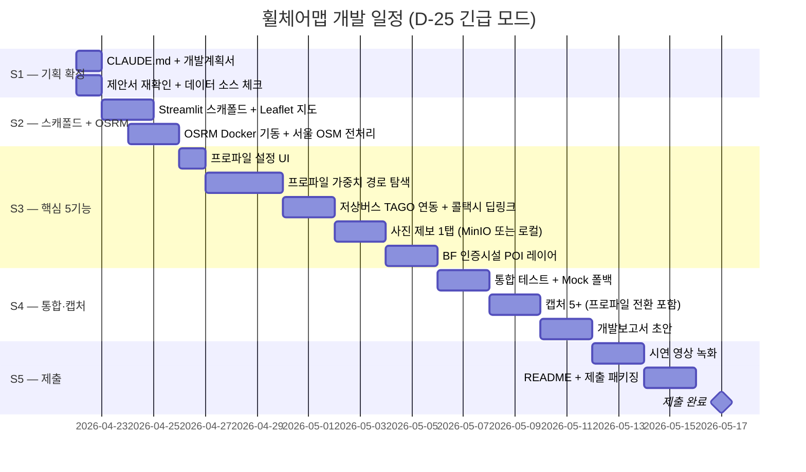

# 휠체어맵 (WheelMap KR) — 개발계획서

> 본 문서는 `_여분_공유/templates/개발계획서.md` 템플릿을 본 프로젝트 규격(AI 없음 · 그래프 엔진 중심)에 맞춰 재구성한 v1 초안이다.
> 매 갱신 시 §5 `last_updated` 헤더를 반드시 수정한다.

**last_updated**: 2026-04-22
**제출 마감**: 2026-05-17 (**D-25 긴급 모드**)
**진척도**: 5% (1 / 20 완료 — 기획 문서 착수)

---

## 1. 기술 스택

| 계층 | 기술 | 버전 | 선정 사유 |
|---|---|---|---|
| 프론트 PoC | **Streamlit** + `streamlit-folium` | 1.35+ | 지도·컨트롤 빠른 시연, Python 단일 스택 |
| 지도 | **Leaflet** (Folium 경유) + OSM 타일 | 1.9+ | 경량, 커스텀 오버레이·마커 |
| 경로 엔진 | **OSRM self-host** (Docker) + 프로파일 가중치 후처리 | 5.27+ | 그래프 엣지 커스텀 가중치 가능 |
| 탐색 알고리즘 | **A\*** `cost = distance + α·(1 − accessibility)` | - | 휠체어 프로파일 특화 (제안서 §6 기능2) |
| 그래프 데이터 | OpenStreetMap (Geofabrik 서울 추출) | - | 오픈 라이선스, 보도·횡단보도·경사로 포함 |
| BF POI | **KODDI Barrier Free 인증시설** CSV | - | 공식 출처 (제안서 §8) |
| 저상버스 | **TAGO 저상버스 도착정보 Open API** | v1 | 국가 표준 실시간 (제안서 §6 기능3) |
| 장애인콜택시 | 서울시 콜택시 API + `tel:` 딥링크 폴백 | - | 지자체별 파편화 대응 (제안서 R3) |
| 사진 제보 저장 | 로컬 **MinIO** (S3 호환) or 로컬 FS | - | 오프라인 시연 가능 |
| 메타 DB | SQLite 3.x (PoC) | 3.x | 경량, 의존성 최소 |
| 언어 | Python | 3.11+ | 저장소 표준 (루트 §3.1) |
| 배포 | 로컬 + 시연 영상 | - | 오프라인 시연 가능 |
| **AI / LLM** | **사용 안 함** | - | 그래프 엔진·규칙 기반으로 해결 (CLAUDE.md §1) |

**주의**: 본 프로젝트는 저장소의 다른 여분 프로젝트와 달리 로컬 LLM조차 기본적으로 쓰지 않는다.
만약 후속 확장으로 제보 분류가 필요해지면 Ollama `qwen2.5:7b` (small) 한정으로 선택 도입한다.

---

## 2. 개발 일정 (Gantt)

| 스프린트 | 시작 | 종료 | 산출물 | 상태 |
|---|---|---|---|---|
| S1 | 2026-04-22 | 2026-04-22 | CLAUDE.md, 개발계획서 v1 | 🟡 진행중 |
| S2 | 2026-04-23 | 2026-04-25 | Streamlit 스캐폴드 + OSRM 기동 | ⬜ 예정 |
| S3 | 2026-04-26 | 2026-05-05 | 핵심 5기능 PoC | ⬜ 예정 |
| S4 | 2026-05-06 | 2026-05-11 | 캡처·보고서 | ⬜ 예정 |
| S5 | 2026-05-12 | 2026-05-17 | 시연 영상·제출 | ⬜ 예정 |

상태값: `✅ 완료 / 🟡 진행중 / ⬜ 예정 / ⚠️ 지연`

---

## 3. 마일스톤

| 일자 | 산출물 | 검증 방법 | 달성 |
|---|---|---|---|
| 2026-04-22 | CLAUDE.md + 개발계획서 v1 | Markdown lint · 커밋 2건 | 🟡 |
| 2026-04-25 | OSRM 로컬 서빙 + Streamlit 지도 렌더 | `curl localhost:5000/route/...` 200 | ⬜ |
| 2026-04-30 | 프로파일 3종 (수동/전동/유모차) 경로 차이 | 동일 OD에 대해 경로 hash 상이 | ⬜ |
| 2026-05-05 | 저상버스·콜택시·제보·BF POI 전 5기능 | 수동 E2E 5건 | ⬜ |
| 2026-05-11 | 캡처 5+ & 개발보고서 초안 | 파일 존재 + 체크리스트 | ⬜ |
| 2026-05-17 | 최종 제출 패키지 | README + 시연 영상 + 커밋 푸시 | ⬜ |

---

## 4. 스프린트 진척 — 제안서 §6 5기능 매핑

### S1 · 기획
- [x] 제안서·아이디어 확정 (2026-04-21)
- [ ] CLAUDE.md 작성 및 커밋
- [ ] 개발계획서 v1 작성 및 커밋 (본 문서)

### S2 · 스캐폴드 + 그래프 엔진
- [ ] `src/wheelmap-kr/` Streamlit 스캐폴드
- [ ] `streamlit-folium`으로 Leaflet 지도 렌더
- [ ] Geofabrik에서 서울 OSM `.osm.pbf` 추출
- [ ] OSRM Docker 3-step 전처리 (extract → partition → customize)
- [ ] OSRM MLD 알고리즘 서빙 (`osrm-routed --algorithm mld`)
- [ ] Mock fixture 준비 (OSRM 미기동 환경 대응)

### S3 · 5기능 구현 (제안서 §6)

**기능 1 · 🦽 휠체어 프로파일 설정**
- [ ] 프로파일 프리셋 6종 (수동/전동/스포츠/어린이용/유모차/실버카트)
- [ ] 폭·회전반경·경사 허용치 세부 조정 UI
- [ ] 세션 상태에 프로파일 저장

**기능 2 · 🛣️ 프로파일 기반 경로 탐색**
- [ ] OSM 엣지에 접근성 속성 오버레이 (경사·단차·폭·포장면)
- [ ] 프로파일 → 통행 불가 엣지 제거 로직
- [ ] A\* 비용 함수 `distance + α·(1 − accessibility)` 구현
- [ ] 경로 결과를 Leaflet 폴리라인으로 표시 + 위험 구간 하이라이트

**기능 3 · 🚌 저상버스·장애인콜택시 실시간**
- [ ] TAGO 저상버스 도착정보 API 클라이언트 + 캐시
- [ ] 서울시 장애인콜택시 연결 번호·예약 딥링크 통합
- [ ] `tel:` 스킴 폴백 (지자체 API 부재 시)
- [ ] 지하철 엘리베이터 위치 POI 레이어

**기능 4 · 📷 사용자 사진 제보 1탭**
- [ ] 사진 업로드 + EXIF 지오태그 추출
- [ ] MinIO(로컬 S3) 또는 로컬 FS에 저장 + 해시
- [ ] SQLite에 제보 메타 저장
- [ ] 24시간 동안 해당 엣지 경로 제외 로직
- [ ] (선택) 지자체 리포트 CSV 자동 생성

**기능 5 · 🏛️ 배리어프리 POI**
- [ ] KODDI BF 인증시설 CSV 로더
- [ ] 화장실·주차장·병원·지하철·관공서 카테고리 필터
- [ ] 지도 마커 + 팝업 상세 정보

### S4 · 통합·캡처·보고
- [ ] Mock 모드 전체 플로우 E2E
- [ ] 캡처: 홈 / 프로파일 / 경로(수동 vs 전동 비교) / 저상버스 / 제보 / POI 최소 6장
- [ ] 개발보고서 초안 (루트 §2.3 증거 원칙 준수)

### S5 · 제출
- [ ] 시연 영상 3~5분
- [ ] README 갱신 (실행 방법 포함)
- [ ] 최종 커밋·태그

---

## 5. 현재 상황

**last_updated: 2026-04-22**

| 항목 | 상태 |
|---|---|
| 현재 진행 | S1 — 기획 문서 작성 (CLAUDE.md ✅, 개발계획서 🟡) |
| 직전 완료 | 제안서.md v1 (2026-04-21) |
| 다음 작업 | S2.1 Streamlit 스캐폴드 + Leaflet 지도 렌더 |
| 차단 사항 | 없음 |
| D-Day | **D-25** (제출 2026-05-17) |

---

## 6. 위험·이슈

| ID | 발생일 | 위험 | 영향 | 대응 |
|---|---|---|---|---|
| R1 | - | 경사·단차 OSM 데이터 불완전 | 高 | **서울 도심 3~5개 구 우선 커버**, 시연 경로 사전 확정 + 사용자 제보로 보완 |
| R2 | - | 사용자 제보 신뢰성 | 中 | 사진 + 지오태그 + 다중 제보 가중치 |
| R3 | - | 장애인콜택시 지자체별 API 상이 | 中 | 어댑터 레이어 + **`tel:` 전화 딥링크 폴백** (제안서 R3) |
| R4 | - | 제보 PII (위치·얼굴·번호판) | 高 | EXIF 외 메타 제거, 로그 익명화, 30일 파기 |
| R5 | - | 제보 스팸 | 中 | 계정 + 레이팅 + 신고 기능 |
| R6 | - | TAGO API 키 발급 지연 | 中 | Mock fixture (`mock-fixtures/tago_bus.json`) 폴백 상시 |
| R7 | - | OSRM Docker 빌드 시간·디스크 | 低 | 서울 한정 추출(≈100MB) + 사전 캐시 |
| R8 | - | D-25 일정 타이트 | 高 | 5기능 MVP 우선, 고도화는 포기 가능 (경로 비교 1장이라도 확보) |

---

## 7. 자원 사용

| 자원 | 예상치 | 비고 |
|---|---|---|
| LLM 호출 | **0** | 본 프로젝트는 AI 미사용 |
| API 요금 | **0원** | TAGO·KODDI 모두 무료 공공 API |
| 로컬 RAM (OSRM + Streamlit) | 4~8 GB | 서울 한정 그래프 |
| 디스크 (OSM + OSRM 전처리) | 3~5 GB | `.osm.pbf` + `.osrm.*` |
| 네트워크 (시연) | 오프라인 가능 | Mock 모드 폴백 |

---

## 8. 제안서와의 정합성 체크

| 제안서 섹션 | 본 계획서 반영 |
|---|---|
| §6 기능1 프로파일 설정 | §4 S3 기능1 |
| §6 기능2 경로 탐색 (A\*) | §1 · §4 S3 기능2 |
| §6 기능3 저상버스·콜택시 | §4 S3 기능3 + R3 폴백 |
| §6 기능4 사진 제보 | §4 S3 기능4 |
| §6 기능5 BF POI | §4 S3 기능5 |
| §8 기술 스택 | §1 표와 1:1 대응 |
| §11 위험 R1~R5 | §6 위험 표 동기화 |

제안서가 규격이며, 본 계획서가 제안서와 괴리되면 **제안서를 먼저 갱신**한다 (CLAUDE.md §8).

---

*`_여분_현대오토에버_휠체어맵/docs/개발계획서.md` · v1 · 2026-04-22*
