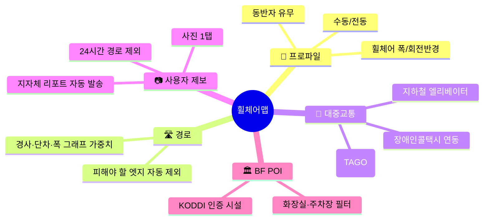
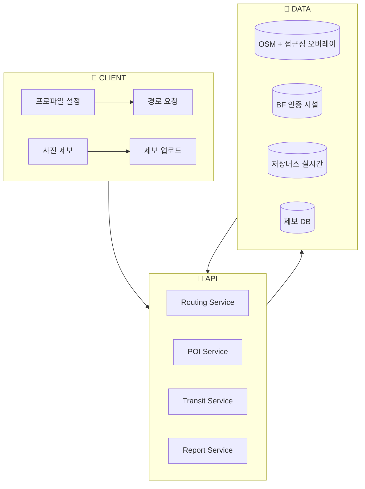

# 휠체어맵 (WheelMap KR)
## "턱 5cm 이상은 피하는" 진짜 배리어프리 내비게이션

> 휠체어 사용자 + 유모차·실버카트·무릎 환자를 위한 휠체어 프로파일 기반 경로 앱

| 항목 | 내용 |
|---|---|
| 콘테스트 | 2026 현대오토에버 배리어프리 앱 개발 콘테스트 |
| 카테고리 | 이동·접근성 |
| 타깃 | 등록 지체·뇌병변 장애인 + 유모차 보호자 + 실버카트 사용 고령자 [^1] |
| 핵심 차별점 | **휠체어 프로파일(수동/전동/폭/회전반경) 경로 가중치** + **사진 제보 1탭 경로 제외** + **저상버스·장애인콜택시 실시간 연동** |
| 핵심 기술 | 그래프 가중치 편집 · 크라우드소싱 · TAGO 저상버스 API · BF 인증시설 |
| 작성일 | 2026.04.21 |

---

## 목차

1. [사업 배경·문제 정의](#1-사업-배경문제-정의)
2. [시장 분석·경쟁 환경](#2-시장-분석경쟁-환경)
3. [해외 모범사례 비교](#3-해외-모범사례-비교)
4. [타깃 페르소나](#4-타깃-페르소나)
5. [솔루션 개요](#5-솔루션-개요)
6. [핵심 기능 5종](#6-핵심-기능-5종)
7. [시스템 아키텍처](#7-시스템-아키텍처)
8. [기술 스택](#8-기술-스택)
9. [기대 효과·사회적 임팩트](#9-기대-효과사회적-임팩트)
10. [정책 정합성](#10-정책-정합성)
11. [위험 관리](#11-위험-관리)
12. [근거자료·출처](#12-근거자료출처)

---

## 1. 사업 배경·문제 정의

### 1.1 핵심 수치 (모두 1차 출처 기반)

| 영역 | 지표 | 수치 | 출처 |
|---|---|---|---|
| 인구 | 등록 지체·뇌병변 장애인 (2023) | **약 140만 명 이상** (등록장애 최대 카테고리) | 보건복지부 [^1] |
| 법제 | 「교통약자 이동편의 증진법」 | 시행 중 | 국가법령정보센터 [^2] |
| 법제 | 「장애인·노인·임산부 등의 편의증진에 관한 법률」 | 시행 중 | 국가법령정보센터 [^3] |
| 시설 | BF(Barrier Free) 인증 시설 | 공공·민간 확대 | 한국장애인개발원 [^4] |
| 교통 | 저상버스 보급률(2024) | **40%대** 도달 | 국토교통부 [^5] |
| 교통 | 전국 장애인콜택시 운영 | 지자체 운영 | 지방자치단체 / 교통약자이동편의증진법 [^2] |
| 편의 | 편의시설 실태조사 — 법정 설치 의무 이행률 격차 | 지역·시설별 격차 | 보건복지부 [^6] |

### 1.2 문제 정의

#### ① "배리어프리 시설"과 "배리어프리 경로"는 다르다.
현행 BF 인증제도는 **개별 시설**의 접근성을 인증하지만 [^4], 사용자가 실제로 **A에서
B까지 이동**할 때는 **보도 턱·경사·폭·계단·출입문** 같은 경로 전 구간의 배리어프리
여부가 중요하다. 기존 지도 앱은 이를 경로 탐색에 반영하지 못한다.

#### ② 경사·턱 5cm는 수동 휠체어에게 치명적이다.
휠체어 관련 규격 및 국제 가이드는 **경사도·단차·폭·문턱**이 이동의 핵심 제약임을
일관되게 강조한다. 특히 **단차 5cm 이상** 에서는 수동 휠체어 사용자가 단독으로
통과하기 어렵다 (재활공학 가이드) [^7].

#### ③ 저상버스·장애인콜택시는 정보가 파편화되어 있다.
국토교통부는 저상버스 40%대 도입을 발표했으나 [^5], 사용자 관점에서 "**지금 여기,
저상버스 언제 오는가**" 를 지도와 결합해 보여주는 앱은 제한적이다. 장애인콜택시는
지자체별 개별 운영 [^2]이라 **광역 이동** 시 앱·전화를 여러 번 돌려야 한다.

#### ④ "정보 불일치"가 헛걸음을 만든다.
엘리베이터 고장·경사로 공사·보도턱 신규 설치 같은 **일시적 장애물** 이 반영되지 않아
이용자가 도착 후에야 "갈 수 없음"을 인지한다. 즉각 반영되는 **사용자 제보** 채널이
필요하다.

### 1.3 본 사업의 통찰

> 휠체어 사용자가 원하는 것은 BF 인증 스티커가 아니라 **"지금 이 시점 이 길로 갈 수
> 있는가"** 에 대한 신뢰 가능한 답이다.

---

## 2. 시장 분석·경쟁 환경

### 2.1 국내 기존 서비스

| 서비스 | 운영 주체 | 기능 | 휠체어 프로파일 |
|---|---|---|---|
| **복지로 BF 지도** [^4] | 공공 | 인증 시설 표시 | ❌ |
| **카카오/네이버 지도** | 민간 | 저상버스 일부·장애인 주차장 | ⚠️ (경로 가중치 ×) |
| **각 지자체 배리어프리 지도** | 지자체 | 정적 POI | ❌ (업데이트 느림) |
| **국립공원 무장애 지도** | 환경부 | 무장애 코스 | ⚠️ (공원 한정) |
| **▶ 휠체어맵 (제안)** | 본 사업 | **프로파일 + 사진 제보 + 저상버스 실시간** | **✅** |

### 2.2 시장 갭

| 축 | 기존 | 휠체어맵 |
|---|---|---|
| 경로 탐색 | BF 시설 나열 | **프로파일 기반 가중치 경로** |
| 변경 감지 | 정적 | **사용자 사진 제보 24h 반영** |
| 교통 연동 | 분리 | **저상버스·콜택시 통합** |
| 프로파일 | 단일 | **수동/전동·폭·회전반경·동반자** |

---

## 3. 해외 모범사례 비교

| 서비스 | 국가 | 특징 |
|---|---|---|
| **Wheelmap.org** [^8] | 🇩🇪 | OSM 기반 크라우드소싱 접근성 지도 |
| **AccessNow** [^9] | 🇨🇦 | 스마트폰 접근성 제보·지도 |
| **Jaccede** [^10] | 🇫🇷 | 접근성 POI 커뮤니티 |
| **Google Maps Accessible Places** [^11] | 🌐 | 휠체어 접근 속성 표시 |
| **휠체어맵 (한국)** | 🇰🇷 | **프로파일 가중치 경로 + 저상버스 실시간** |

해외는 **POI 속성 표시** 위주이고, 한국형은 **경로 가중치**와 **대중교통 실시간**을
결합해 차별화한다.

---

## 4. 타깃 페르소나

### Persona 1 — 최○○ (38세, 수동 휠체어, 사무직)
- 출근길 버스 환승 1회. 지하철은 엘리베이터 환승 시간 변동이 큼.
- **🔥 PAIN** 도착해서 엘리베이터 고장 발견 → 10분 지연 → 지각.
- **🎯 NEED** "이 역 엘리베이터 오늘 고장" 실시간 반영 지도.

### Persona 2 — 박○○ (30대, 아기 동반 유모차 보호자)
- 주말 도심 외출. 지하철 환승·계단에 민감.
- **🔥 PAIN** 계단만 있는 출구로 안내되면 우회 시간이 배로 든다.
- **🎯 NEED** "엘리베이터 있는 출구로" 안내 + 환승 통로 경사·폭 반영.

### Persona 3 — 정○○ (72세, 실버카트 사용)
- 병원 정기 방문. 짧은 오르막에도 힘겨움.
- **🔥 PAIN** 지도가 '직선 최단'으로 계단 포함 경로를 줌.
- **🎯 NEED** "경사 약함 + 휴게 벤치" 포함 경로.

---

## 5. 솔루션 개요

### 5.1 한 줄 정의

> 휠체어 프로파일과 사용자 제보로 **턱·경사·폭을 피하는** 경로를 그리고,
> 저상버스·장애인콜택시를 실시간으로 묶어주는 배리어프리 내비게이션.

### 5.2 핵심 축

---

## 6. 핵심 기능 5종

### 기능 1 · 🦽 휠체어 프로파일 설정
- 수동/전동/스포츠/어린이용/유모차/실버카트 선택.
- 폭·회전반경·경사 허용치 자동 프리셋 + 사용자 세부 조정.
- 프로파일에 따라 동일 목적지도 경로·시간이 달라진다.

### 기능 2 · 🛣️ 프로파일 기반 경로 탐색
- OSM 그래프 [^8]에 한국 보도·횡단보도·계단·경사로 데이터 결합.
- 단차·경사·폭·포장면을 엣지 속성으로 모델링 → 프로파일 필터로 **통행 불가 엣지 제거**.
- A* 비용 함수: 거리 + (1 - 접근성)·α.

### 기능 3 · 🚌 저상버스·장애인콜택시 실시간
- **TAGO(국가대중교통정보센터) 저상버스 API** [^12] 연동 — 도착시간.
- 지자체 장애인콜택시 연결 번호·예약 딥링크 통합.
- 지하철 엘리베이터 위치 · 고장 제보 반영.

### 기능 4 · 📷 사용자 사진 제보 1탭
- 고장·공사·장애물 사진 1탭 업로드 → 24시간 경로 제외.
- 지자체(시설관리공단·도로관리청)에 리포트 자동 발송.

### 기능 5 · 🏛️ 배리어프리 POI
- 한국장애인개발원 **BF 인증 시설** [^4] + 공중 장애인화장실·전용 주차장 필터.
- 병원·지하철·관공서·공원별 상세 접근성 정보.

---

## 7. 시스템 아키텍처

---

## 8. 기술 스택

| 계층 | 기술 | 선정 근거 |
|---|---|---|
| Mobile | Flutter 3.x | iOS/Android 동시 |
| 지도·그래프 | OSM + OSRM (self-host) | 가중치 커스텀 가능 |
| 경로 엔진 | 프로파일 가중치 후처리 | 휠체어 특화 |
| 저상버스 | **TAGO API** [^12] | 국가 표준 |
| BF POI | **KODDI BF 인증 시설** [^4] | 공식 데이터 |
| 이미지 저장 | S3 + 해시 | 제보 신뢰성 |
| 인증 | OAuth 2.0 | 장애인콜택시 본인 확인 |
| 배포 | AWS + CloudFront | 지도 타일 캐시 |

---

## 9. 기대 효과·사회적 임팩트

### 9.1 정량 목표 (출시 + 1년)

| 지표 | 목표 | 산정 근거 |
|---|---|---|
| 다운로드 | **20만+** | 지체·뇌병변 140만 [^1] × 15% + 유모차 보호자 |
| 월 제보 수 | 5만 건 | 주요 구간 커버 |
| 경로 탐색 세션 | 80만/월 | 출퇴근·병원 방문 |
| BF 시설 커버리지 | **수도권 80%** | 지자체·KODDI 협력 |

### 9.2 사회 변화

| | BEFORE | AFTER |
|---|---|---|
| 경로 탐색 | 거리 최단 | **프로파일 기반 배리어프리 최단** |
| 시설 정보 신뢰성 | 정적·오래됨 | **사용자 제보 24시간 반영** |
| 교통 통합 | 버스·택시 분리 | **저상버스·콜택시 통합** |
| 지자체 환류 | 사용자 민원 수동 | **제보 리포트 자동 발송** |

---

## 10. 정책 정합성

| 정책 | 본 사업 정합 |
|---|---|
| 「교통약자 이동편의 증진법」 [^2] | 이동편의 디지털 증진 |
| 「편의증진법」 [^3] | 편의시설 정보의 실사용 연계 |
| BF 인증제도 [^4] | 인증 데이터의 경로 활용 |
| 장애인차별금지법 [^13] | 정당한 편의 제공 |
| UN CRPD 제9조 [^14] | 접근성 보장 |
| 디지털플랫폼정부 [^15] | 공공 API 연계 모범 |

---

## 11. 위험 관리

| ID | 위험 | 영향 | 대응 |
|---|---|---|---|
| R1 | 경로 데이터(경사·단차) 불완전 | 高 | 주요 도심부터 우선 보완, 사용자 제보 |
| R2 | 제보 신뢰성 | 中 | 사진 + 지오태그 + 다중 제보 가중 |
| R3 | 장애인콜택시 지자체별 API 상이 | 中 | 어댑터 레이어 + 전화 딥링크 폴백 |
| R4 | PII (경로 기록) | 高 | 로그 익명화, 30일 자동 파기 |
| R5 | 사용자 제보 스팸 | 中 | 계정 + 레이팅 + 신고 |

---

## 12. 근거자료·출처

[^1]: **보건복지부 「등록장애인 현황」**. 지체+뇌병변 2023년 합계 약 140만 명 이상. [https://www.mohw.go.kr/menu.es?mid=a10712010200](https://www.mohw.go.kr/menu.es?mid=a10712010200)

[^2]: **「교통약자의 이동편의 증진법」**. [https://www.law.go.kr/법령/교통약자의이동편의증진법](https://www.law.go.kr/법령/교통약자의이동편의증진법)

[^3]: **「장애인·노인·임산부 등의 편의증진 보장에 관한 법률」**. [https://www.law.go.kr/법령/장애인·노인·임산부등의편의증진보장에관한법률](https://www.law.go.kr/법령/장애인·노인·임산부등의편의증진보장에관한법률)

[^4]: **한국장애인개발원(KODDI) Barrier Free 인증**. [https://www.koddi.or.kr/](https://www.koddi.or.kr/)

[^5]: **국토교통부 「저상버스 보급 현황」**. [https://www.molit.go.kr/](https://www.molit.go.kr/)

[^6]: **보건복지부 「장애인 편의시설 실태 전수조사」**. [https://www.mohw.go.kr/](https://www.mohw.go.kr/)

[^7]: **국립재활원 재활공학 가이드 · Wheelchair Foundation guidelines**. [https://www.nrc.go.kr/nrc/main/main.do](https://www.nrc.go.kr/nrc/main/main.do)

[^8]: **Wheelmap.org — OSM 기반 접근성 지도**. [https://wheelmap.org/](https://wheelmap.org/)

[^9]: **AccessNow** (Canada). [https://accessnow.com/](https://accessnow.com/)

[^10]: **Jaccede** (France). [https://www.jaccede.com/](https://www.jaccede.com/)

[^11]: **Google Maps Accessible Places**. [https://support.google.com/maps/answer/6396990](https://support.google.com/maps/answer/6396990)

[^12]: **국가대중교통정보센터(TAGO) — 저상버스·도착정보 Open API**. [https://www.data.go.kr/tcs/dss/selectDataSetList.do?keywords=저상버스](https://www.data.go.kr/tcs/dss/selectDataSetList.do?keywords=저상버스)

[^13]: **「장애인차별금지 및 권리구제 등에 관한 법률」**. [https://www.law.go.kr/법령/장애인차별금지및권리구제등에관한법률](https://www.law.go.kr/법령/장애인차별금지및권리구제등에관한법률)

[^14]: **UN CRPD 제9조 — 접근성**. [https://www.un.org/development/desa/disabilities/convention-on-the-rights-of-persons-with-disabilities/article-9-accessibility.html](https://www.un.org/development/desa/disabilities/convention-on-the-rights-of-persons-with-disabilities/article-9-accessibility.html)

[^15]: **디지털플랫폼정부위원회**. [https://www.dpg.go.kr/](https://www.dpg.go.kr/)

---

*휠체어맵 · 제안서.md · 2026.04.21*
