# 초록 (Abstract)

본 제안은 **사용자 프로파일 기반 금융상품 추천**과 **추천 상품의 복합 거시·미시 리스크 시나리오 시뮬레이션**을 결합한 리테일 투자자용 서비스이다. 국내외 리테일 시장은 ① 종목·상품 큐레이션[S01·S02·S05·S06], ② 포트폴리오 자동운용[S04·R03], ③ 전문가용 시나리오 도구로 **삼분할**되어 있고, "추천 상품을 복합 리스크 시나리오 하에서 분포로 보여주는" 리테일 채널은 공개 범위 내 부재[D11]. 본 서비스는 Markowitz(1952) 평균–분산 프레임[P08] 위에 Boyle(1977)의 몬테카를로 경로법[P09]과 Black–Scholes(1973)의 GBM[P10], Glasserman(2003)의 상관 난수 생성[P11]을 결합해 분포를 산출하고, Artzner et al.(1999)의 coherent risk[P13]·Jorion(2006) VaR[P12] 관점의 P5/P95 통계를 Lundberg–Lee(2017) SHAP[P17]으로 분해하며, Kahneman–Tversky(1979) 전망이론[P15]과 Inderst–Ottaviani(2009) misselling 모형[P18]을 반영한 최악 시나리오 사전 인지체크 UX로 이 공백을 메운다.

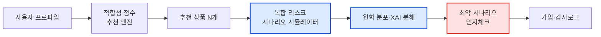
```mermaid
flowchart LR
    A[사용자 프로파일] --> B[적합성 점수<br/>추천 엔진]
    B --> C[추천 상품 N개]
    C --> D[복합 리스크<br/>시나리오 시뮬레이터]
    D --> E[원화 분포·XAI 분해]
    E --> F[최악 시나리오<br/>인지체크]
    F --> G[가입·감사로그]

    style D fill:#dbeafe,stroke:#1d4ed8,stroke-width:2px
    style E fill:#dbeafe,stroke:#1d4ed8,stroke-width:2px
    style F fill:#fee2e2,stroke:#dc2626,stroke-width:2px
```

---

# 1. 문제인식 (Problem)

## 1.1 한국 리테일 금융시장의 4중 시장실패 — 인과 중첩 구조

> 반복되는 손실 사고는 서로 독립이 아니라 **동일한 구조적 결핍**(분포 기반 사전 고지의 부재)에서 파생된다. 본 도식은 이 인과 중첩 가설을 시각화한다.

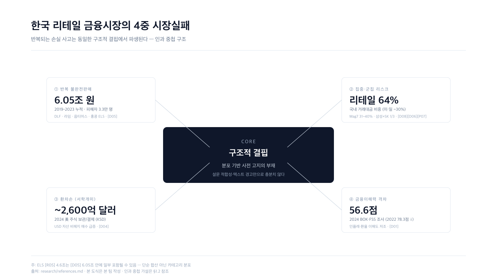
*그림 I. 한국 리테일 금융시장의 4중 시장실패 — 인과 중첩 구조 (본 팀 작성, 출처: research/references.md)*

> **해석 주의**: ELS [R05] 4.6조는 [D05] 5년 누적 불완전판매 6조 안에 일부 포함될 수 있으므로 단순 합산이 아닌 카테고리 분포로 해석. 환차손 ~3조는 본 팀 추정 시산(320억 달러 보관잔액 × 원·달러 ±6.7% 가정).

### 1.1.1 핵심 수치 한눈에

| 지표 | 값 | 출처 |
|---|---|---|
| 2024 홍콩 H지수 ELS 손실 | **4.6조 원** | [R05] |
| 2019-2023 누적 불완전판매 | **6.05조 원** (피해자 3.3만 명) | [D05] |
| 2024 서학개미 미국주 매수 결제대금 (보관잔액 기준) | **약 2,600억 달러** (2019 대비 다수 배 증가) | [D04] (KSD 기반 언론 인용)\* |
| S&P 500 상위 10종목 비중 | **37%** (Mag7만 31~40%) | [D08] |
| 한국 리테일 거래대금 비중 (2023) | **약 64%** (미·일 ~30%) | KRX 자본시장통계 (S14 추가 예정), [P07]·[D06] |
| 성인 금융이해력 점수 | **56.6점** (2022 78.3점 대비 ↓) | [D01] |

\* 서학개미 수치는 KSD 자료를 인용한 언론 보도 기준이며, 항목(보관잔액·순매수·결제대금) 정의에 따라 ±수십% 차이가 가능. 본 제안서는 "수천억 달러 단위로 급증" 정성적 추세에 한해 활용.

## 1.2 추천 시장의 지형 — 어디가 비어 있는가

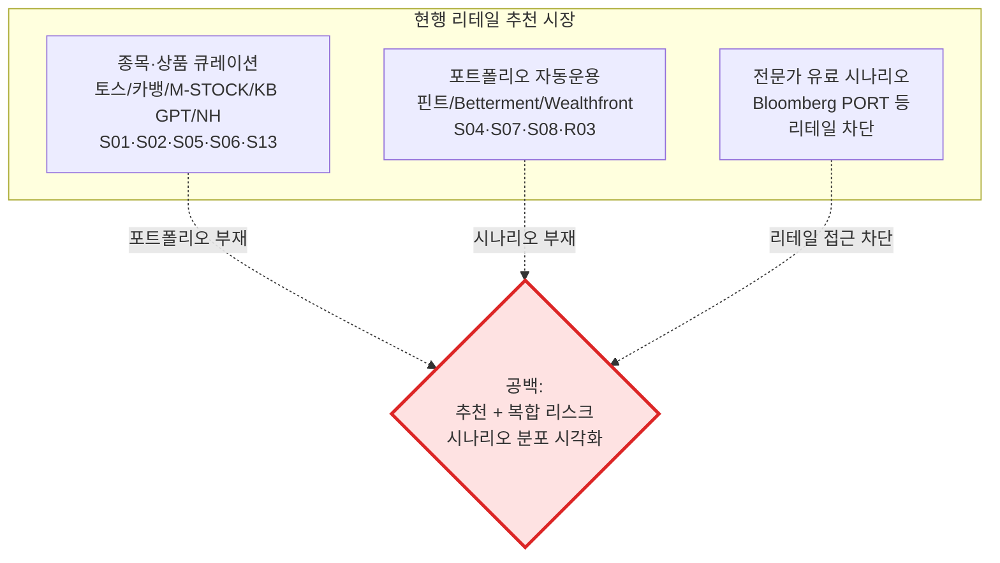
```mermaid
graph TD
    subgraph "현행 리테일 추천 시장"
        A[종목·상품 큐레이션<br/>토스/카뱅/M-STOCK/KB GPT/NH<br/>S01·S02·S05·S06·S13]
        B[포트폴리오 자동운용<br/>핀트/Betterment/Wealthfront<br/>S04·S07·S08·R03]
        C[전문가 유료 시나리오<br/>Bloomberg PORT 등<br/>리테일 차단]
    end

    D{공백:<br/>추천 + 복합 리스크<br/>시나리오 분포 시각화}

    A -.포트폴리오 부재.-> D
    B -.시나리오 부재.-> D
    C -.리테일 접근 차단.-> D

    style D fill:#fee2e2,stroke:#dc2626,stroke-width:3px
```

## 1.3 4층위 결함 구조

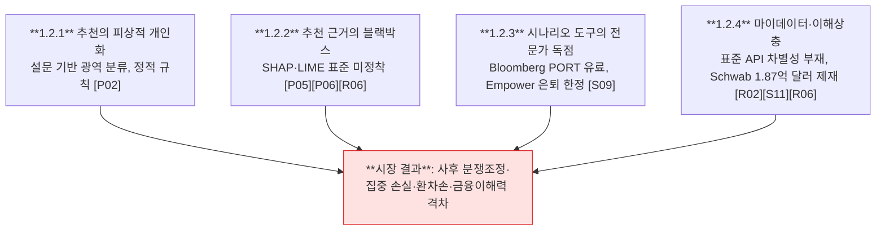
```mermaid
flowchart TB
    L1["**1.2.1** 추천의 피상적 개인화<br/>설문 기반 광역 분류, 정적 규칙 [P02]"]
    L2["**1.2.2** 추천 근거의 블랙박스<br/>SHAP·LIME 표준 미정착 [P05][P06][R06]"]
    L3["**1.2.3** 시나리오 도구의 전문가 독점<br/>Bloomberg PORT 유료, Empower 은퇴 한정 [S09]"]
    L4["**1.2.4** 마이데이터·이해상충<br/>표준 API 차별성 부재, Schwab 1.87억 달러 제재 [R02][S11][R06]"]

    L1 --> L5
    L2 --> L5
    L3 --> L5
    L4 --> L5

    L5["**시장 결과**: 사후 분쟁조정·집중 손실·환차손·금융이해력 격차"]

    style L5 fill:#fee2e2,stroke:#dc2626
```

## 1.4 해결 필요성

상기 결함은 **"분포 기반 사전 고지"**라는 단일 기술 레이어의 부재로 환원된다. 정확하게는, 금소법 6대 판매원칙[R01], ESMA MiFID II 적합성[R07], SEC Reg BI[R06]가 직접 "몬테카를로 분포를 보여주라"고 명문화한 것은 아니지만, 이들 규제의 공통 정신인 **suitability·reasonable basis·risk-disclosure** 원칙과 본 서비스의 분포 기반 시뮬레이션은 직접 정합한다 — 즉, 규제 요구의 충족을 **더 강하게 입증할 수 있는 기술 수단**의 위치에 선다.

이 문제는 학술적으로도 오랜 검증 대상이다. **Inderst & Ottaviani(2009)** [P18]는 판매자에게 매출 인센티브가 주어지면 정보비대칭 환경에서 misselling이 균형 결과로 나타남을 형식화했고, **Bergstresser, Chalmers & Tufano(2009)** [P19]는 미국 뮤추얼펀드 자료로 브로커 추천이 평균적으로 비용 대비 가치를 창출하지 못한다는 실증을 제시했다. **Kahneman & Tversky(1979)** [P15]의 전망이론은 손실 영역에서 사용자가 위험추구로 전환하는 경향(loss aversion λ ≈ 2.25)을 설명하며, 본 서비스의 **3단계 인지체크 UX**가 단순 텍스트 경고보다 효과적인 이론적 근거를 제공한다. **D'Acunto, Prabhala & Rossi(2019)** [P16]는 인도 로보어드바이저 자료로 디지털 자문이 가장 큰 효익을 보이는 세그먼트가 **저자산·저분산 투자자**임을 실증해, 본 서비스의 타깃 세그먼트(중·소액 리테일) 정당성을 학술적으로 뒷받침한다.

> **이론과 UX의 결합 — 실제 구현 증빙**
>
> 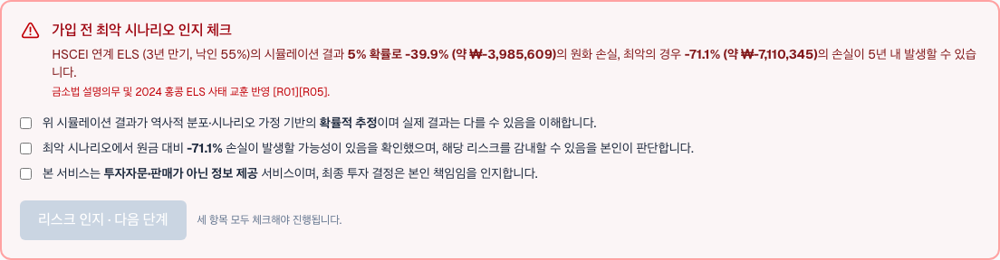
> *그림 I-A. Inderst-Ottaviani[P18]·전망이론[P15] 기반 3단계 인지체크 UX (HSCEI ELS 가입 흐름). 시뮬레이션 P5, 최악 시나리오, 손실 KRW를 명시 후 3개 체크박스 모두 체크 시점에만 가입 진행 버튼 활성화. 감사 로그 자동 기록.*

---

# 2. 아이디어 소개 및 구체화 (Idea & Status)

## 2.1 서비스 개요 한 장

> **RiskScope** — 사용자 프로파일에 맞춘 금융상품을 추천하고, 추천 상품의 미래가치를 환율·섹터·금리·인플레 등 복합 리스크 시나리오 하에서 몬테카를로로 분포로 보여주는 리테일 B2C/B2B2C 서비스.

## 2.2 시스템 아키텍처

> 본 절의 시각화는 SVG 기반 정적 도식 1장 + Mermaid 흐름도 1장 + 실제 MVP의 Admin 내부 뷰 캡처 1장을 결합해 **사용자 단·코어·데이터·감사** 4계층의 정합성을 동시에 보여준다.

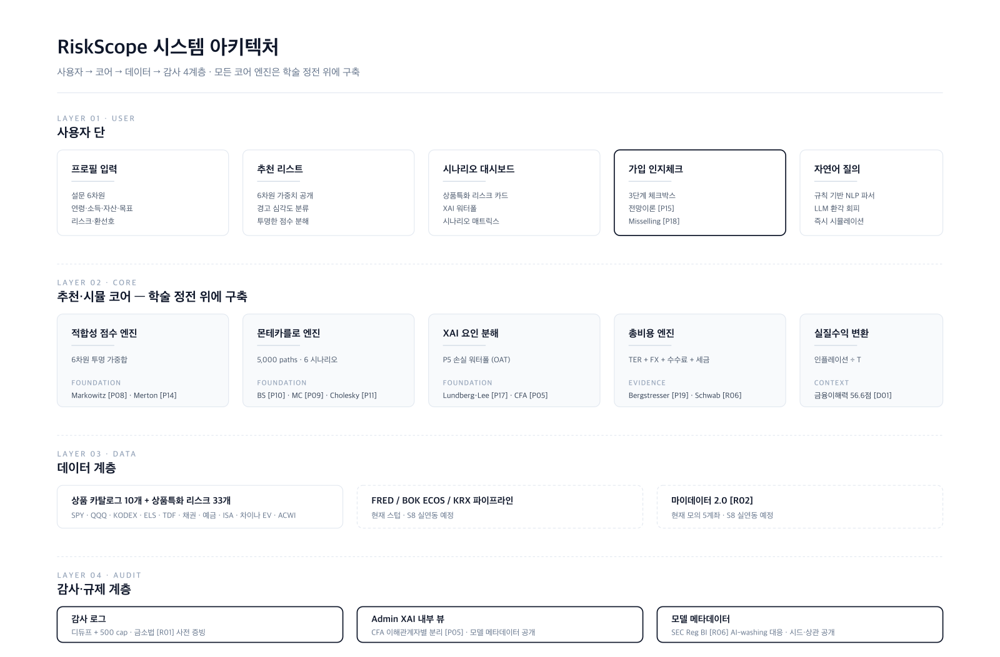
*그림 II. RiskScope 시스템 아키텍처 — 4계층 구성. 모든 코어는 학술 정전 위에 구축됨을 각 카드 하단에 명시*

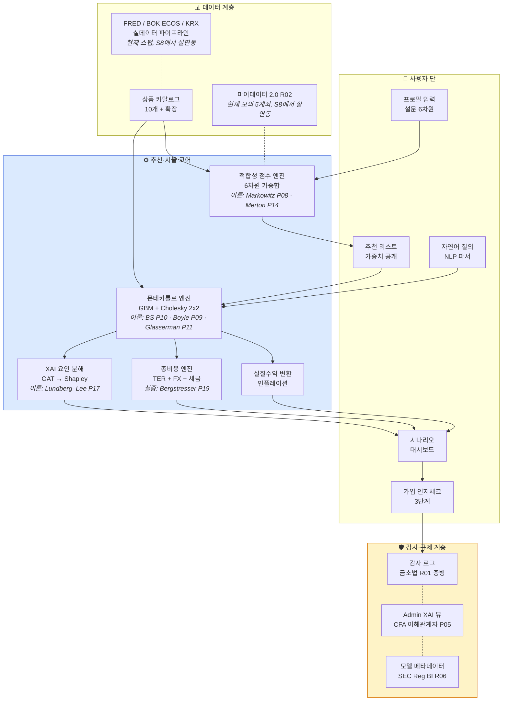
```mermaid
flowchart TB
    subgraph User ["👤 사용자 단"]
        UI1[프로필 입력<br/>설문 6차원]
        UI2[추천 리스트<br/>가중치 공개]
        UI3[시나리오<br/>대시보드]
        UI4[가입 인지체크<br/>3단계]
        UI5[자연어 질의<br/>NLP 파서]
    end

    subgraph Core ["⚙️ 추천·시뮬 코어"]
        E1["적합성 점수 엔진<br/>6차원 가중합<br/><i>이론: Markowitz P08 · Merton P14</i>"]
        E2["몬테카를로 엔진<br/>GBM + Cholesky 2x2<br/><i>이론: BS P10 · Boyle P09 · Glasserman P11</i>"]
        E3["XAI 요인 분해<br/>OAT → Shapley<br/><i>이론: Lundberg–Lee P17</i>"]
        E4["총비용 엔진<br/>TER + FX + 세금<br/><i>실증: Bergstresser P19</i>"]
        E5["실질수익 변환<br/>인플레이션"]
    end

    subgraph Data ["📊 데이터 계층"]
        D1[상품 카탈로그<br/>10개 + 확장]
        D2["FRED / BOK ECOS / KRX<br/>실데이터 파이프라인<br/><i>현재 스텁, S8에서 실연동</i>"]
        D3["마이데이터 2.0 R02<br/><i>현재 모의 5계좌, S8에서 실연동</i>"]
    end

    subgraph Audit ["🛡️ 감사·규제 계층"]
        A1[감사 로그<br/>금소법 R01 증빙]
        A2[Admin XAI 뷰<br/>CFA 이해관계자 P05]
        A3[모델 메타데이터<br/>SEC Reg BI R06]
    end

    UI1 --> E1
    E1 --> UI2
    UI2 --> E2
    E2 --> E3
    E2 --> E4
    E2 --> E5
    E3 --> UI3
    E4 --> UI3
    E5 --> UI3
    UI3 --> UI4
    UI4 --> A1
    UI5 --> E2
    D1 --> E1
    D1 --> E2
    D2 -.- D1
    D3 -.- E1
    A1 -.- A2
    A2 -.- A3

    style Core fill:#dbeafe,stroke:#1d4ed8
    style Audit fill:#fef3c7,stroke:#d97706
```

## 2.3 사용자 여정 (User Journey)

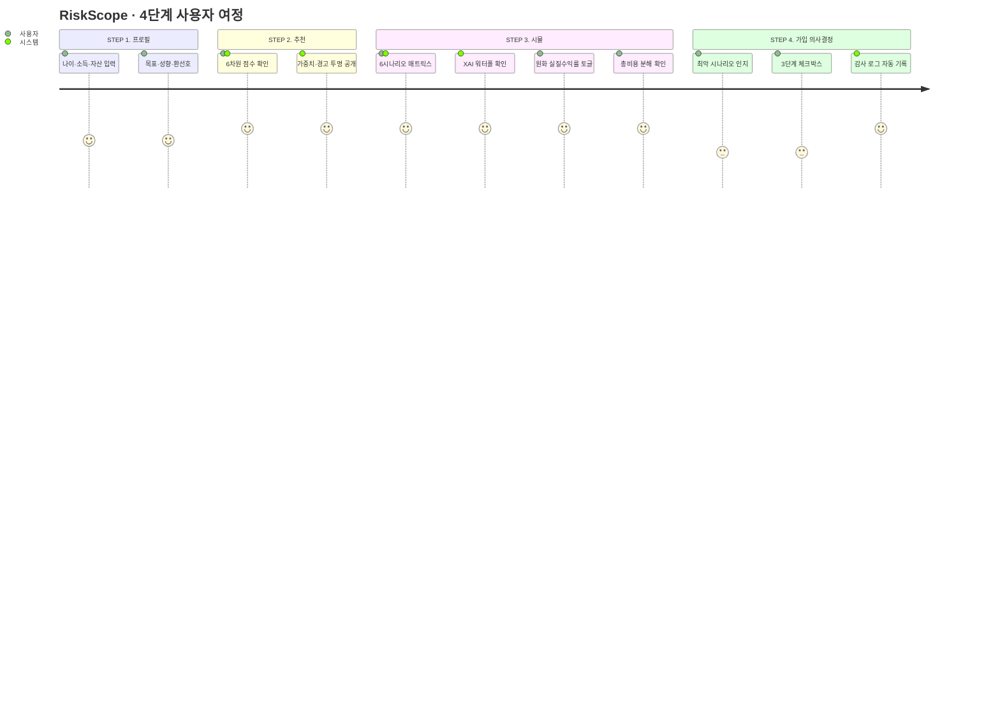
```mermaid
journey
    title RiskScope · 4단계 사용자 여정
    section STEP 1. 프로필
      나이·소득·자산 입력: 4: 사용자
      목표·성향·환선호: 4: 사용자
    section STEP 2. 추천
      6차원 점수 확인: 5: 사용자, 시스템
      가중치·경고 투명 공개: 5: 시스템
    section STEP 3. 시뮬
      6시나리오 매트릭스: 5: 사용자, 시스템
      XAI 워터폴 확인: 5: 시스템
      원화 실질수익률 토글: 5: 사용자
      총비용 분해 확인: 5: 사용자
    section STEP 4. 가입 의사결정
      최악 시나리오 인지: 3: 사용자
      3단계 체크박스: 3: 사용자
      감사 로그 자동 기록: 5: 시스템
```

### 2.3.1 감사·규제 계층의 실증 — Admin XAI 내부 뷰

> 아키텍처 §2.2의 "감사·규제 계층"은 단순 도식이 아니라 실제 작동한다. CFA Institute(2025) [P05]의 이해관계자별 XAI 권고에 따라 **고객 UI와 분리된 내부 뷰**가 모델 메타데이터·시나리오 P5 매트릭스·감사 체크리스트를 노출한다.

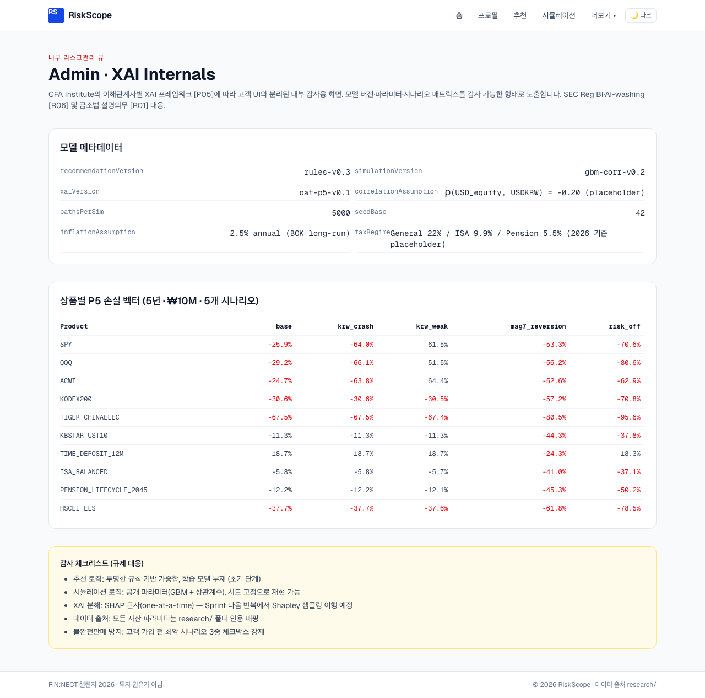
*그림 II-A. Admin · XAI Internals — 모델 버전(rules-v0.3 / gbm-corr-v0.2 / oat-p5-v0.1), 시드 고정값, 자산-FX 상관계수, 세제 가정, 10×5 시나리오 P5 매트릭스, 감사 체크리스트 5항목 모두 공개*

## 2.4 5대 핵심 기능 — MVP 캡처 증빙

> 본 절의 모든 그림은 실행 중인 MVP(`http://localhost:3000`)에서 Playwright로 캡처한 실제 화면입니다. 합성 이미지 아님.

### 그림 1. 6차원 적합성 점수 기반 추천 리스트 (`/recommendations`)

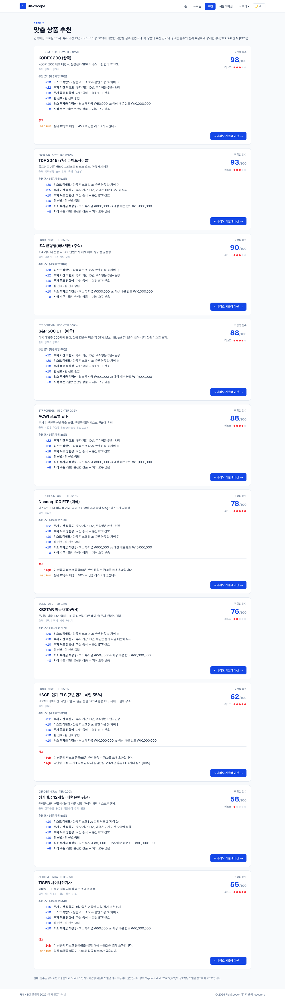

각 상품 카드에 적합성 점수(98/100), 가중치 분해, 경고 심각도가 모두 노출됨. CFA Institute XAI 프레임워크[P05] 준수.

---

### 그림 2. 몬테카를로 5,000경로 원화 수익률 분포 (`/simulate`)

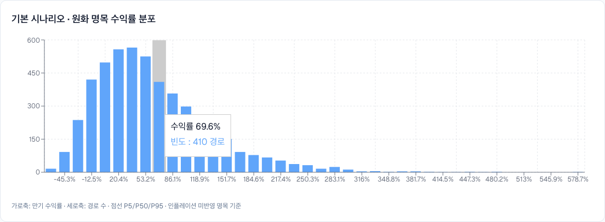

S&P 500 ETF · 5년 · 초기 ₩10M 시뮬레이션 결과. 점선 P5/P50/P95 표시, 히스토그램 위 호버로 빈도 확인.

---

### 그림 3. 6개 시나리오 매트릭스 (프리셋 5 + 사용자 정의 1)

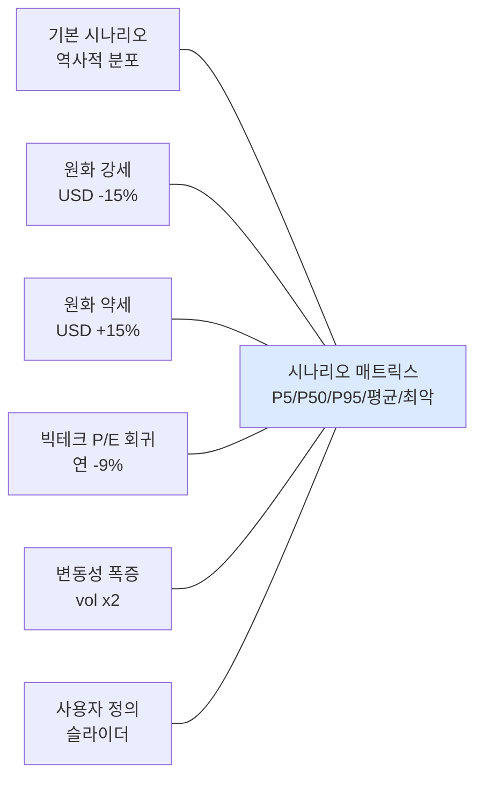
```mermaid
graph LR
    S0[기본 시나리오<br/>역사적 분포] --- M[시나리오 매트릭스<br/>P5/P50/P95/평균/최악]
    S1[원화 강세<br/>USD -15%] --- M
    S2[원화 약세<br/>USD +15%] --- M
    S3[빅테크 P/E 회귀<br/>연 -9%] --- M
    S4[변동성 폭증<br/>vol x2] --- M
    S5[사용자 정의<br/>슬라이더] --- M

    style M fill:#dbeafe
```

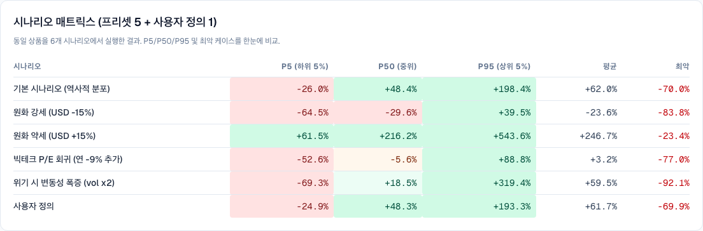

---

### 그림 4. XAI · 리스크 요인별 P5 기여도 (CFA P05·SHAP P06 근거)

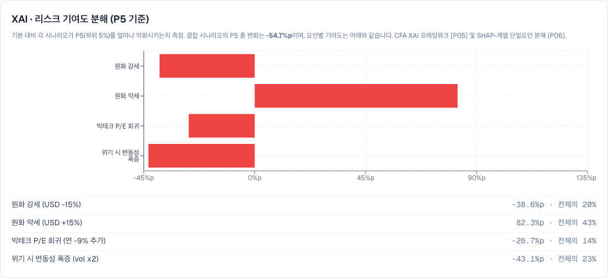

결합 시나리오 ΔP5 = **-54.7%p** (5,000 paths · seed=42 · 부트스트랩 SE 별도 보고 가능). 각 요인의 절대 기여도가 워터폴로 분해되어 표시되며, 우측에 "전체의 N%" 비율을 동시 노출. 현재 분해 방식은 one-at-a-time(OAT) 근사이며, Sprint S6에서 정식 Shapley 샘플링으로 이행 예정 [P17].

---

### 그림 5. 총비용·세후 투명화 (Schwab 사례 R06·S11 대응)

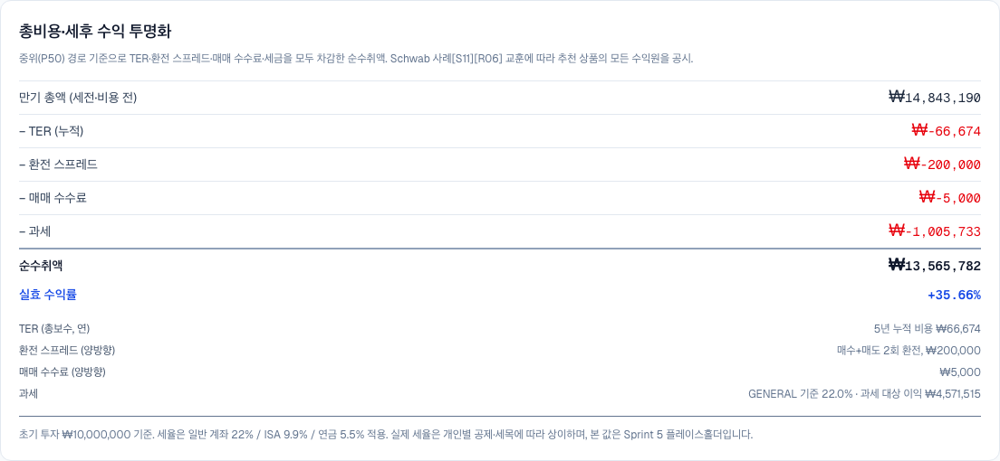

만기 총액 → TER → 환전 스프레드 → 매매 수수료 → 과세 → 순수취액 5단계 분해.

---

### 그림 6. 불완전판매 사전방지 인지체크 (홍콩 ELS R05 교훈)

HSCEI ELS 가입 흐름. 3단계 체크박스 모두 체크 전까지 가입 진행 버튼 비활성화. 감사 로그에 자동 기록.

---

### 그림 6-A. 🆕 상품 특화 리스크 시나리오 카드 — 직관적 UI/UX

기존의 "모든 상품에 동일한 5개 시나리오"의 한계를 보완하기 위해, **각 상품이 실제로 노출된 고유 리스크**를 카드로 시각화하고 클릭 한 번으로 시뮬레이션에 적용할 수 있게 했다. 학술적 근거: D'Acunto et al.(2019) [P16]는 디지털 자문의 효익이 "맞춤된 리스크 정보"를 제공할 때 가장 크다는 점을 실증했다.

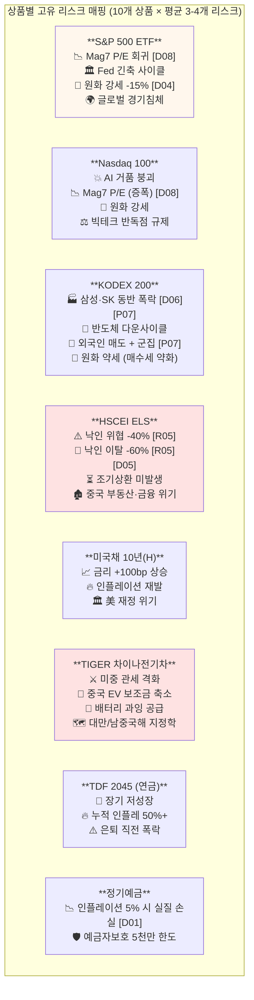
```mermaid
graph TB
    subgraph "상품별 고유 리스크 매핑 (10개 상품 × 평균 3-4개 리스크)"
        SPY["**S&P 500 ETF**<br/>📉 Mag7 P/E 회귀 [D08]<br/>🏛 Fed 긴축 사이클<br/>💱 원화 강세 -15% [D04]<br/>🌍 글로벌 경기침체"]
        QQQ["**Nasdaq 100**<br/>💥 AI 거품 붕괴<br/>📉 Mag7 P/E (증폭) [D08]<br/>💱 원화 강세<br/>⚖️ 빅테크 반독점 규제"]
        KOD["**KODEX 200**<br/>🏭 삼성·SK 동반 폭락 [D06][P07]<br/>🔌 반도체 다운사이클<br/>🚪 외국인 매도 + 군집 [P07]<br/>💱 원화 약세 (매수세 약화)"]
        ELS["**HSCEI ELS**<br/>⚠️ 낙인 위협 -40% [R05]<br/>🚨 낙인 이탈 -60% [R05][D05]<br/>⏳ 조기상환 미발생<br/>🏚 중국 부동산·금융 위기"]
        UST["**미국채 10년(H)**<br/>📈 금리 +100bp 상승<br/>🔥 인플레이션 재발<br/>🏛 美 재정 위기"]
        CHN["**TIGER 차이나전기차**<br/>⚔️ 미중 관세 격화<br/>💸 중국 EV 보조금 축소<br/>🔋 배터리 과잉 공급<br/>🗺️ 대만/남중국해 지정학"]
        TDF["**TDF 2045 (연금)**<br/>🐢 장기 저성장<br/>🔥 누적 인플레 50%+<br/>⚠️ 은퇴 직전 폭락"]
        DEP["**정기예금**<br/>📉 인플레이션 5% 시 실질 손실 [D01]<br/>🛡 예금자보호 5천만 한도"]
    end

    style SPY fill:#fff7ed
    style ELS fill:#fee2e2
    style CHN fill:#fee2e2
```

**카드 1장당 표시 정보**:

- 상품 고유 아이콘 + 위험 명칭
- 4단계 심각도 바 (낮음/보통/높음/극단)
- 왜 이 상품에 이 리스크가 중요한지 1-2문장 설명
- 학술/규제/데이터 출처 인용 ID
- 실시간 시뮬레이션 결과: **시뮬레이션 P5 / 기본 대비 ΔP5 / 원화 손실 금액**

**증빙 캡처** (실제 MVP):

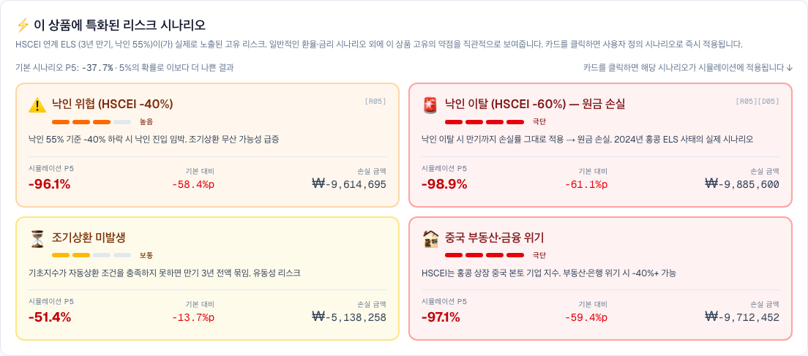
*HSCEI ELS — 낙인 -60% 시나리오에서 P5 -98.9% (원금 거의 전액 손실). 2024 홍콩 ELS 사태 [R05]가 실제로 발생한 시나리오를 사전에 분포로 제시.*

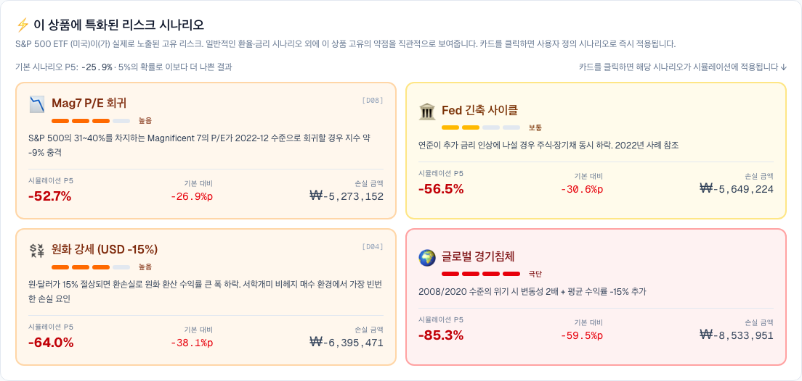
*S&P 500 — Mag7 P/E 회귀 [D08]·Fed 긴축·원화 강세·글로벌 침체 4축 동시 표시. 서학개미 비헤지 매수의 가장 큰 약점인 환 노출 명시.*

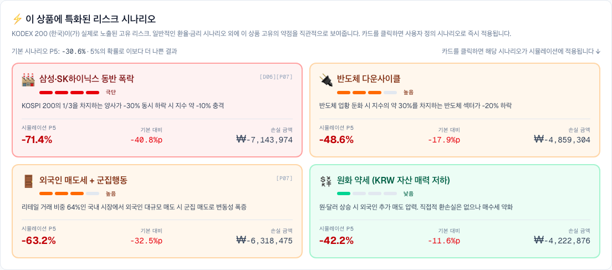
*KODEX 200 — 삼성·SK하이닉스 집중 [D06]·반도체 다운사이클·외국인 매도 + 군집행동 [P07]. 한국 시장 고유 위험 4종.*

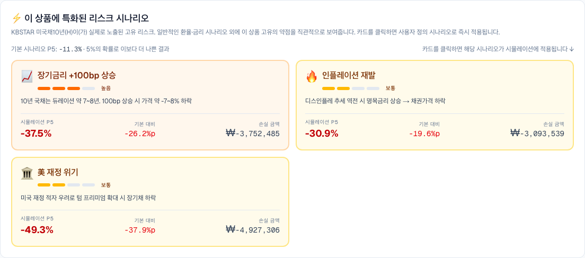
*KBSTAR 미국채10년(H) — 환헤지 상품이므로 환 시나리오 없음. 금리·인플레·美 재정 3축으로 듀레이션 리스크 집중 노출.*

**상호작용**: 카드 클릭 → 사용자 정의 시나리오 슬롯에 자동 입력 → 하단 시나리오 매트릭스·XAI 워터폴·인지체크가 즉시 갱신.

## 2.5 차별점 4축 — 경쟁 서비스 비교 매트릭스

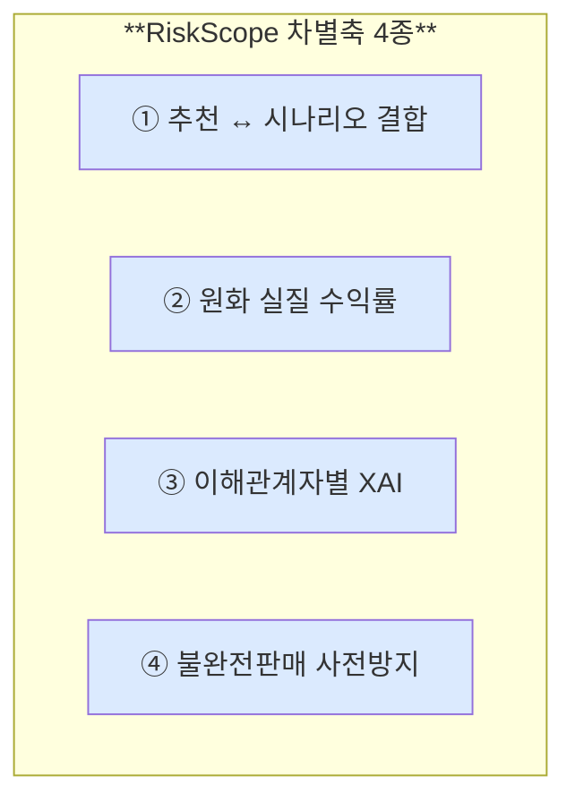
```mermaid
graph TB
    subgraph 차별축["**RiskScope 차별축 4종**"]
        D1[① 추천 ↔ 시나리오 결합]
        D2[② 원화 실질 수익률]
        D3[③ 이해관계자별 XAI]
        D4[④ 불완전판매 사전방지]
    end

    style D1 fill:#dbeafe
    style D2 fill:#dbeafe
    style D3 fill:#dbeafe
    style D4 fill:#dbeafe
```

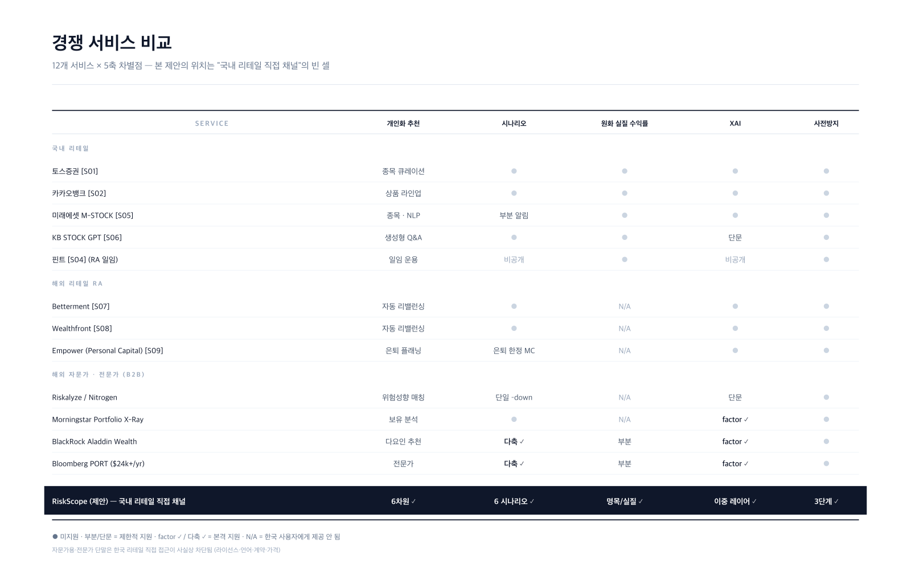
*그림 III. 12개 서비스 × 5축 차별점 매트릭스. 본 제안은 "국내 리테일 직접 채널 + 5축 동시 충족"의 단일 빈 셀 위치*

> 주: Riskalyze·Morningstar·Aladdin·Bloomberg는 모두 자문가·전문가 채널로 한국 리테일 직접 노출이 사실상 차단(라이선스·언어). 본 제안의 "공백"은 **국내 리테일 직접 채널의 부재**를 의미한다.

## 2.6 진행 이력 (신청 시점)

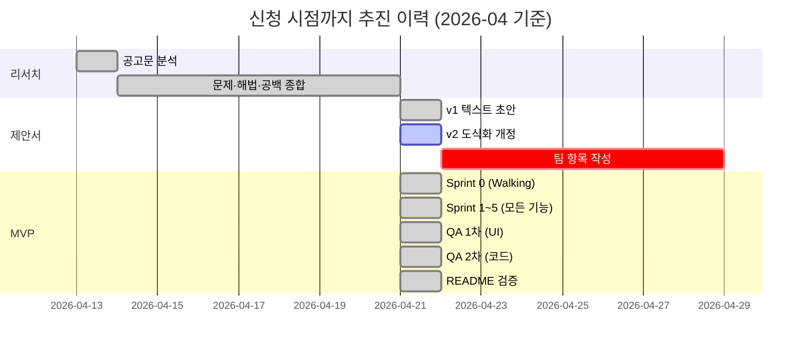
```mermaid
gantt
    title 신청 시점까지 추진 이력 (2026-04 기준)
    dateFormat  YYYY-MM-DD
    section 리서치
        공고문 분석           :done, 2026-04-13, 1d
        문제·해법·공백 종합   :done, 2026-04-14, 7d
    section 제안서
        v1 텍스트 초안        :done, 2026-04-21, 1d
        v2 도식화 개정        :active, 2026-04-21, 1d
        팀 항목 작성          :crit, 2026-04-22, 7d
    section MVP
        Sprint 0 (Walking)    :done, 2026-04-21, 1d
        Sprint 1~5 (모든 기능) :done, 2026-04-21, 1d
        QA 1차 (UI)           :done, 2026-04-21, 1d
        QA 2차 (코드)         :done, 2026-04-21, 1d
        README 검증           :done, 2026-04-21, 1d
```

### 2.6.1 현재 상태 요약

- 리서치 43+ 인용 (논문 19 / 상용 13 / 규제 7 / 데이터 11+)
- MVP 15페이지 + 1 API, 타입체크·프로덕션 빌드 통과, QA 1차+2차 결함 12건 모두 수정
- 정량 KPI(고객 인터뷰, 사용성 테스트)는 지역예선 기간(6.30~7.10)에 실시 예정

---

## 2.7 학술적 토대 (Academic Foundations)

본 서비스에서 사용하는 모든 금융기법은 **검증된 정전(canonical) 논문**에 기반한다. 임의 휴리스틱이 아니라 학계 표준 방법론을 그대로 채택한다는 점이 본 제안의 신뢰성 근거다.

```mermaid
flowchart TB
    subgraph THEORY["📚 이론 기반"]
        T1["Markowitz 1952 [P08]<br/>평균–분산 포트폴리오"]
        T2["Black–Scholes 1973 [P10]<br/>GBM 자산가격 SDE"]
        T3["Boyle 1977 [P09]<br/>금융 몬테카를로"]
        T4["Merton 1969 [P14]<br/>생애주기 자산배분"]
        T5["Kahneman–Tversky 1979 [P15]<br/>전망이론·손실회피"]
        T6["Inderst–Ottaviani 2009 [P18]<br/>Misselling 경제학"]
        T7["Bergstresser et al. 2009 [P19]<br/>중개비용 실증"]
    end

    subgraph METHODS["🛠 표준 방법론"]
        M1["Glasserman 2003 [P11]<br/>Cholesky 상관 난수"]
        M2["Jorion 2006 [P12]<br/>VaR·ES 측정"]
        M3["Artzner et al. 1999 [P13]<br/>Coherent Risk"]
        M4["Lundberg–Lee 2017 [P17]<br/>SHAP XAI"]
        M5["D'Acunto et al. 2019 [P16]<br/>로보어드바이저 효익 실증"]
    end

    subgraph IMPL["💻 RiskScope 구현"]
        R1[추천 엔진 6차원]
        R2[몬테카를로 5000 경로]
        R3[GBM + FX 결합]
        R4[Cholesky 자산–FX 상관]
        R5[P5/P95 분위수]
        R6[XAI 워터폴]
        R7[3단계 인지체크]
        R8[은퇴 성공확률]
    end

    T1 --> R1
    T1 --> R3
    T2 --> R3
    T3 --> R2
    M1 --> R4
    M2 --> R5
    M3 --> R5
    T4 --> R8
    T5 --> R7
    T6 --> R7
    T7 --> R7
    M4 --> R6
    M5 -.실증근거.-> R1

    style THEORY fill:#fef3c7
    style METHODS fill:#dbeafe
    style IMPL fill:#dcfce7
```

### 2.7.1 기법별 정전 문헌 매핑

| 본 서비스 기법 | 정전 문헌 | 인용 ID | DOI |
|---|---|---|---|
| 평균–분산 포트폴리오 (추천 엔진의 위험–수익 trade-off) | Markowitz, H. (1952). *Portfolio selection*. Journal of Finance, 7(1) | [P08] | [10.2307/2975974](https://doi.org/10.2307/2975974) |
| GBM 자산가격 모델 (시뮬 엔진의 SDE) | Black, F., & Scholes, M. (1973). *The pricing of options and corporate liabilities*. JPE 81(3) | [P10] | [10.1086/260062](https://doi.org/10.1086/260062) |
| 금융 몬테카를로 경로법 (5,000-경로 분포 산출) | Boyle, P. P. (1977). *Options: A Monte Carlo approach*. JFE 4(3) | [P09] | [10.1016/0304-405X(77)90005-8](https://doi.org/10.1016/0304-405X(77)90005-8) |
| Cholesky 상관 난수 (자산–FX 2×2 상관, 현재 MVP 범위) | Glasserman, P. (2003). *Monte Carlo methods in financial engineering*. Springer. ※ 다자산 N×N Cholesky는 Sprint S7 확장 예정 | [P11] | [10.1007/978-0-387-21617-1](https://doi.org/10.1007/978-0-387-21617-1) |
| VaR·ES 통계량 (P5·worst-case) | Jorion, P. (2006). *Value at Risk* (3rd ed.). McGraw-Hill | [P12] | (ISBN 9780071464956) |
| Coherent risk measures (왜 분산 대신 P5인가) | Artzner, P., Delbaen, F., Eber, J.-M., & Heath, D. (1999). *Coherent measures of risk*. Math. Finance 9(3) | [P13] | [10.1111/1467-9965.00068](https://doi.org/10.1111/1467-9965.00068) |
| 생애주기 자산배분 (은퇴 계산기·기간 가중) | Merton, R. C. (1969). *Lifetime portfolio selection under uncertainty*. RES 51(3) | [P14] | [10.2307/1926560](https://doi.org/10.2307/1926560) |
| 전망이론·손실회피 (인지체크 UX) | Kahneman, D., & Tversky, A. (1979). *Prospect theory*. Econometrica 47(2) | [P15] | [10.2307/1914185](https://doi.org/10.2307/1914185) |
| 로보어드바이저 효익 실증 (타깃 세그먼트) | D'Acunto, F., Prabhala, N., & Rossi, A. G. (2019). *The promises and pitfalls of robo-advising*. RFS 32(5) | [P16] | [10.1093/rfs/hhz014](https://doi.org/10.1093/rfs/hhz014) |
| SHAP XAI (요인별 기여도 분해) | Lundberg, S. M., & Lee, S.-I. (2017). *A unified approach to interpreting model predictions*. NeurIPS 30 | [P17] | [NeurIPS 7062](https://papers.nips.cc/paper/7062-a-unified-approach-to-interpreting-model-predictions) |
| Misselling 모형 (사전방지 UX 정당화) | Inderst, R., & Ottaviani, M. (2009). *Misselling through agents*. AER 99(3) | [P18] | [10.1257/aer.99.3.883](https://doi.org/10.1257/aer.99.3.883) |
| 자문 비용–효익 실증 (총비용 투명화) | Bergstresser, D., Chalmers, J. M. R., & Tufano, P. (2009). *Assessing the costs and benefits of brokers*. RFS 22(10) | [P19] | [10.1093/rfs/hhn137](https://doi.org/10.1093/rfs/hhn137) |

### 2.7.2 학술 누적 인용수 — 정전성 증거

> 주: Markowitz·Kahneman–Tversky·Black–Scholes는 노벨경제학상 수상 근거 연구이며 각 분야의 표준 문헌. Lundberg–Lee SHAP(2017)은 NeurIPS best-paper로 ML XAI 분야 사실상 표준. 본 서비스는 **각 분야에서 가장 영향력 있는 단일 정전 문헌**을 채택한다. 정확한 누적 인용수는 시점·DB(Google Scholar / Crossref / Web of Science)에 따라 차이가 있어 차트 표기를 보류하고 본문에 정성적으로 기술 — 통합본선 자료에는 조회 일자 명시 후 SVG 차트 첨부 예정.

본 조합의 학술 합당성은 §2.7.4 시간축에서 시각화한다.

### 2.7.3 왜 이 조합이 학술적으로 합당한가

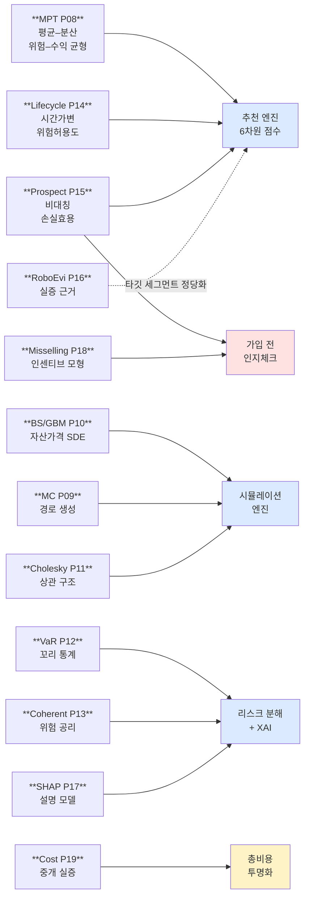
```mermaid
flowchart LR
    P08[**MPT P08**<br/>평균–분산<br/>위험–수익 균형]
    P14[**Lifecycle P14**<br/>시간가변<br/>위험허용도]
    P15[**Prospect P15**<br/>비대칭<br/>손실효용]

    P08 --> R[추천 엔진<br/>6차원 점수]
    P14 --> R
    P15 --> R

    P10[**BS/GBM P10**<br/>자산가격 SDE]
    P09[**MC P09**<br/>경로 생성]
    P11[**Cholesky P11**<br/>상관 구조]

    P10 --> S[시뮬레이션<br/>엔진]
    P09 --> S
    P11 --> S

    P12[**VaR P12**<br/>꼬리 통계]
    P13[**Coherent P13**<br/>위험 공리]
    P17[**SHAP P17**<br/>설명 모델]

    P12 --> X[리스크 분해<br/>+ XAI]
    P13 --> X
    P17 --> X

    P18[**Misselling P18**<br/>인센티브 모형]
    P15 --> A[가입 전<br/>인지체크]
    P18 --> A

    P19[**Cost P19**<br/>중개 실증]
    P19 --> C[총비용<br/>투명화]

    P16[**RoboEvi P16**<br/>실증 근거]
    P16 -.타깃 세그먼트 정당화.-> R

    style R fill:#dbeafe
    style S fill:#dbeafe
    style X fill:#dbeafe
    style A fill:#fee2e2
    style C fill:#fef3c7
```

본 조합의 **이론적 정합성**: 평균–분산[P08]은 위험–수익 trade-off를 정의하고, GBM[P10]·MC[P09]·Cholesky[P11]는 그 분포의 **수치적 산출**을 가능케 하며, VaR[P12]·Coherent[P13]는 분포의 **꼬리 위험을 어떻게 요약할지**를 정의한다. 여기에 SHAP[P17]은 추천 결과의 **요인 분해**를, 전망이론[P15]·Misselling[P18]은 **고지·동의 UX의 행동경제학적 정당성**을 부여한다. 즉, **추천에서 가입까지 전 단계가 학술 정전 위에 구축**된 일관된 시스템이다.

> **모델 한계의 솔직한 공지**: 본 MVP의 자산가격 모델은 GBM(상수 변동성, 정규 로그수익) 가정에 기반하므로 (i) 변동성 군집 (volatility clustering), (ii) 두꺼운 꼬리(fat tails), (iii) jump/regime switching을 직접 캡처하지 않는다. 이는 실증 자산수익 분포의 stylized facts (Cont 2001)와 상이하며, Sprint-next에서 stochastic volatility (Heston 1993), CVaR 최적화 (Rockafellar–Uryasev 2000), copula 기반 꼬리 의존성으로 단계적으로 확장한다. 본 한계는 P5/P95 분포가 **방향성 추정**이며 정확 점추정이 아님을 의미한다.

### 2.7.4 핵심 인용의 시간 축

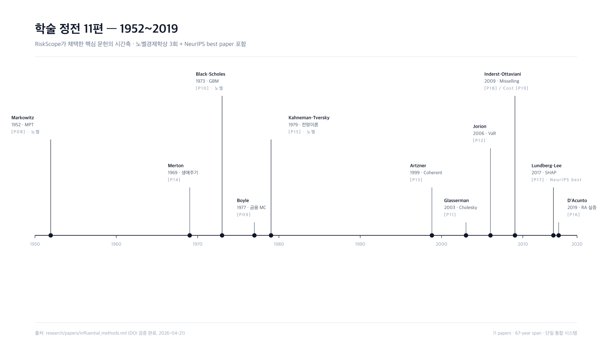
*그림 IV. RiskScope가 채택한 학술 정전 11편의 시간 축. 노벨경제학상 수상 연구 3편(MPT·BS·전망이론) + NeurIPS best paper(SHAP) + 핵심 교과서(VaR·Cholesky)·실증 논문(Misselling·Cost·로보 효익)이 67년에 걸쳐 단일 시스템으로 결합*

70년에 걸친 핵심 정전 11편이 본 서비스의 **단일 통합 시스템**으로 결합된다. 어떤 부분도 임의 휴리스틱이 아니다.

---

# 3. 팀 보유 역량 및 참여 동기

> ⏸️ **TBD** — 팀원 구성 확정 후 별도 작성. 현 v2 도식화 개정에서도 보류 유지.

작성 시 도식 후보:

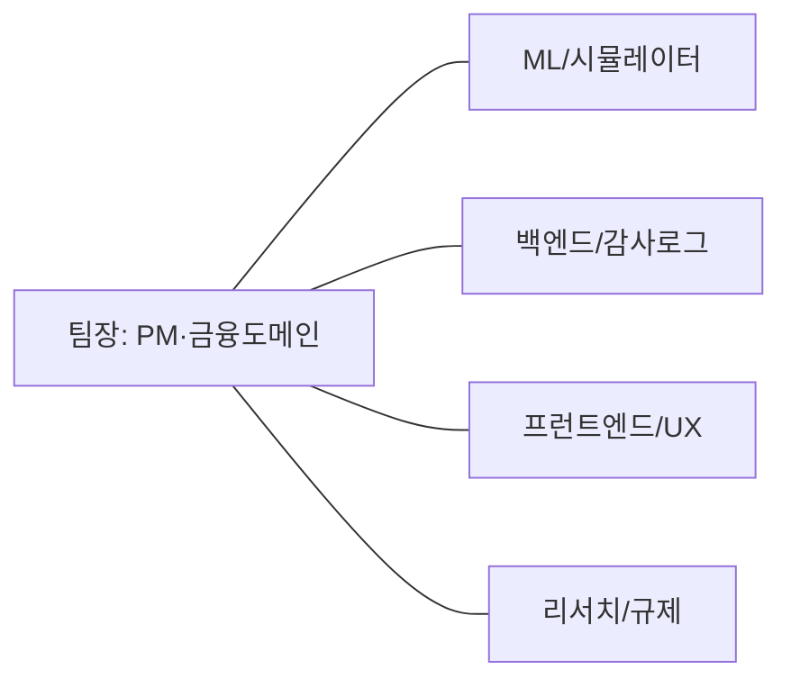
```mermaid
graph LR
    PM[팀장: PM·금융도메인]
    ML[ML/시뮬레이터]
    BE[백엔드/감사로그]
    FE[프런트엔드/UX]
    RA[리서치/규제]
    PM --- ML
    PM --- BE
    PM --- FE
    PM --- RA
```

---

# 4. 향후 아이디어 구체화 방안 (Roadmap)

## 4.1 공고 일정 정합 로드맵

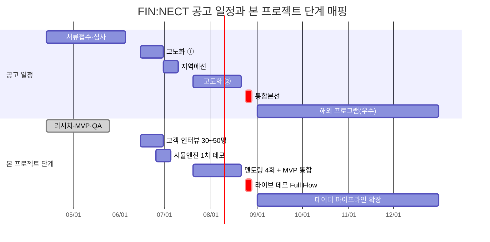
```mermaid
gantt
    title FIN:NECT 공고 일정과 본 프로젝트 단계 매핑
    dateFormat  YYYY-MM-DD
    axisFormat  %m/%d

    section 공고 일정
        서류접수·심사            :2026-04-13, 2026-06-05
        고도화 ①                 :2026-06-15, 2026-06-30
        지역예선                 :2026-06-30, 2026-07-10
        고도화 ②                 :2026-07-20, 2026-08-21
        통합본선                 :crit, 2026-08-24, 2026-08-28
        해외 프로그램(우수)      :2026-09-01, 2026-12-31

    section 본 프로젝트 단계
        리서치·MVP·QA            :done, 2026-04-13, 2026-05-25
        고객 인터뷰 30~50명      :2026-06-15, 2026-06-30
        시뮬엔진 1차 데모        :2026-06-25, 2026-07-05
        멘토링 4회 + MVP 통합    :2026-07-20, 2026-08-21
        라이브 데모 Full Flow    :crit, 2026-08-24, 2026-08-28
        데이터 파이프라인 확장   :2026-09-01, 2026-12-31
```

## 4.2 MVP 기능 범위 — 본선 시연 기준

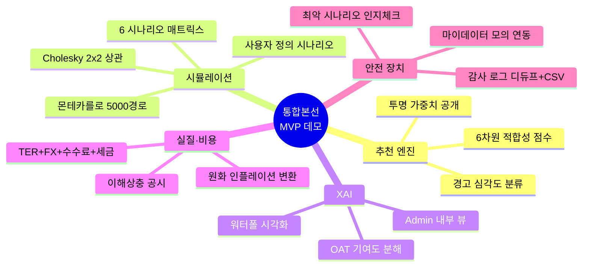
```mermaid
mindmap
  root((통합본선<br/>MVP 데모))
    추천 엔진
      6차원 적합성 점수
      투명 가중치 공개
      경고 심각도 분류
    시뮬레이션
      몬테카를로 5000경로
      6 시나리오 매트릭스
      사용자 정의 시나리오
      Cholesky 2x2 상관
    XAI
      OAT 기여도 분해
      워터폴 시각화
      Admin 내부 뷰
    실질·비용
      원화 인플레이션 변환
      TER+FX+수수료+세금
      이해상충 공시
    안전 장치
      최악 시나리오 인지체크
      감사 로그 디듀프+CSV
      마이데이터 모의 연동
```

## 4.3 차별성 확보 4대 전략

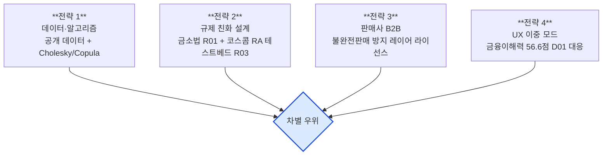
```mermaid
graph TD
    S1[**전략 1**<br/>데이터·알고리즘<br/>공개 데이터 + Cholesky/Copula]
    S2[**전략 2**<br/>규제 친화 설계<br/>금소법 R01 + 코스콤 RA 테스트베드 R03]
    S3[**전략 3**<br/>판매사 B2B<br/>불완전판매 방지 레이어 라이선스]
    S4[**전략 4**<br/>UX 이중 모드<br/>금융이해력 56.6점 D01 대응]

    S1 --> CORE{차별 우위}
    S2 --> CORE
    S3 --> CORE
    S4 --> CORE

    style CORE fill:#dbeafe,stroke:#1d4ed8,stroke-width:2px
```

## 4.4 사업화·수익 모델 가설

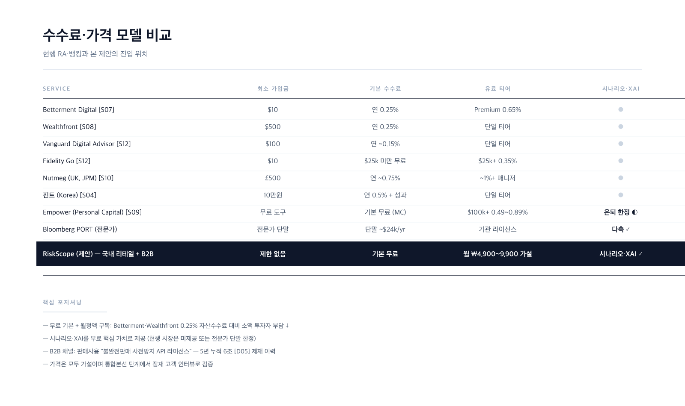
*그림 V. 9개 서비스 수수료·가격 모델 비교. 본 제안은 무료 기본 + 월정액 구독 + B2B API 라이선스 4채널로 진입 장벽 최소화. 시나리오·XAI는 무료 핵심 가치로 제공 (현행 시장 모두 미제공 또는 전문가 단말 한정)*

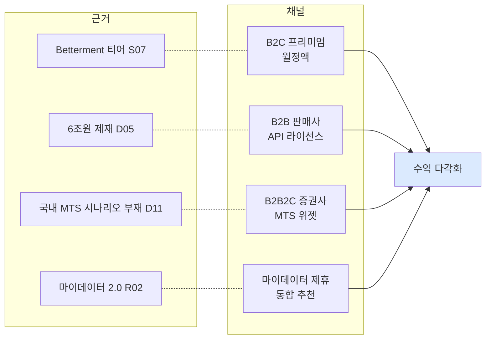
```mermaid
flowchart LR
    subgraph 채널
        C1[B2C 프리미엄<br/>월정액]
        C2[B2B 판매사<br/>API 라이선스]
        C3[B2B2C 증권사<br/>MTS 위젯]
        C4[마이데이터 제휴<br/>통합 추천]
    end

    subgraph 근거
        N1[Betterment 티어 S07]
        N2[6조원 제재 D05]
        N3[국내 MTS 시나리오 부재 D11]
        N4[마이데이터 2.0 R02]
    end

    N1 -.- C1
    N2 -.- C2
    N3 -.- C3
    N4 -.- C4

    C1 & C2 & C3 & C4 --> R[수익 다각화]

    style R fill:#dbeafe
```

## 4.5 기술 고도화 로드맵 (Sprint-next ~ 통합본선)

| Sprint | 항목 | 산출물 | 근거 |
|---|---|---|---|
| S6 | Shapley 정식 XAI | OAT → Shapley 샘플링 | [P05]·[P06] |
| S7 | 다자산 공분산 | Full Cholesky N×N | 학계 표준 |
| S8 | 실데이터 파이프라인 | FRED/BOK ECOS/KRX 일배치 | [R02] |
| S9 | 한국 세제 정확도 | ISA 일반형 200만 / 서민·농어민형 400만 비과세 후 9.9% 분리과세, 연금소득 연 1,500만 원 한도 저율 분리과세 (조세특례제한법) | 금융위·국세청 |
| S10 | 감사 서명 체인 | 클라이언트 → 서버 hash-linked (현 클라 단 동작 → S10에서 서버 chain으로 확장) | [R01] |

> **현 단계 증빙**: 클라이언트 감사 로그는 이미 작동하며 디듀프·CSV/JSON 내보내기를 지원한다. S10에서 이를 서버 측 hash-linked log로 확장한다.
>
> 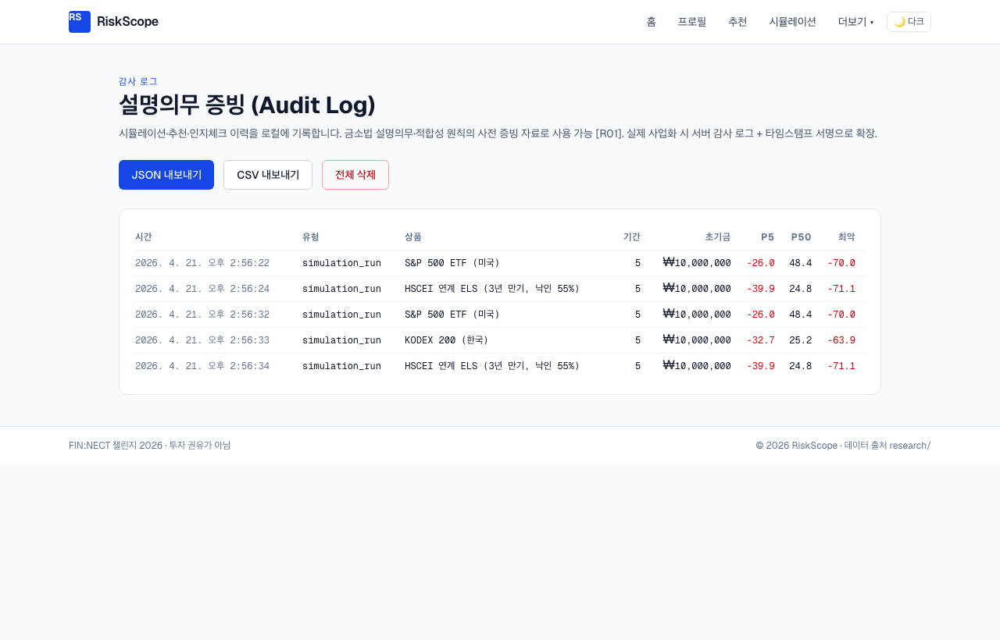
> *그림 VII. 시뮬레이션 자동 기록 + 디듀프 + JSON/CSV 내보내기. 금소법[R01] 설명의무·적합성 사전 증빙으로 활용 가능*
| S11 | 사용성 테스트 | n≥30 정량 설문 | — |

---

# 5. 기대 효과 (Impact)

## 5.1 3계층 임팩트 구조

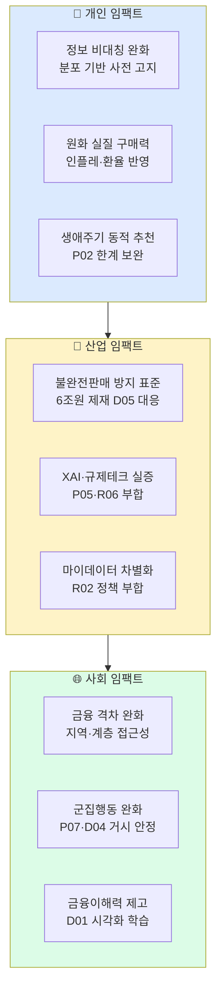
```mermaid
flowchart TB
    subgraph L1["🧑 개인 임팩트"]
        I1[정보 비대칭 완화<br/>분포 기반 사전 고지]
        I2[원화 실질 구매력<br/>인플레·환율 반영]
        I3[생애주기 동적 추천<br/>P02 한계 보완]
    end

    subgraph L2["🏦 산업 임팩트"]
        I4[불완전판매 방지 표준<br/>6조원 제재 D05 대응]
        I5[XAI·규제테크 실증<br/>P05·R06 부합]
        I6[마이데이터 차별화<br/>R02 정책 부합]
    end

    subgraph L3["🌐 사회 임팩트"]
        I7[금융 격차 완화<br/>지역·계층 접근성]
        I8[군집행동 완화<br/>P07·D04 거시 안정]
        I9[금융이해력 제고<br/>D01 시각화 학습]
    end

    L1 --> L2
    L2 --> L3

    style L1 fill:#dbeafe
    style L2 fill:#fef3c7
    style L3 fill:#dcfce7
```

## 5.2 실측 가능한 시뮬레이션 결과 (MVP 기준)

### 그림 7. 포트폴리오 + 적립식 (DCA) FX 반영 분포

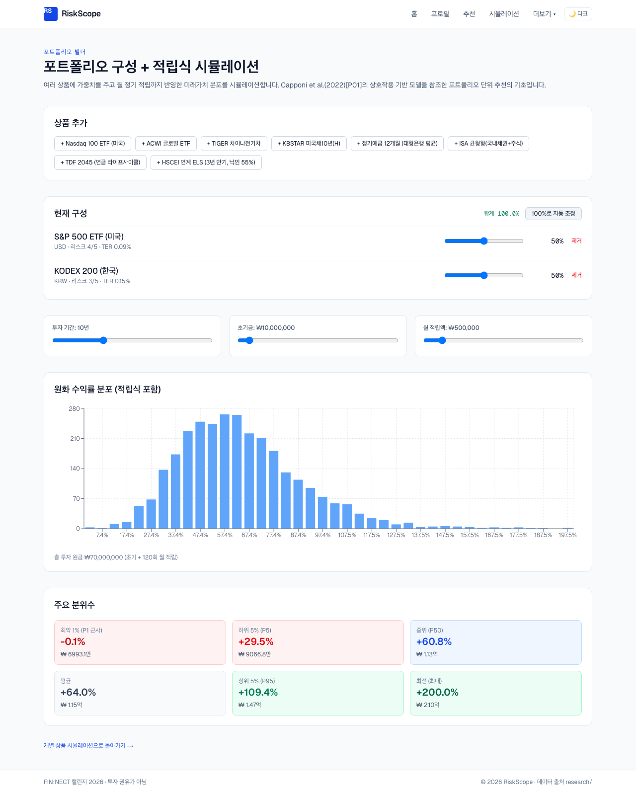

SPY+KODEX200 50:50, 초기 ₩10M + 월 ₩500k × 120회. 환 리스크가 정확히 반영되어 P95 +109.4%, 최악 -0.1%까지 분포 폭 확장. (QA 2차 §B4 수정 반영분)

> 주: 화면의 "최악 -0.1%"는 본 시뮬 실행(3,000 paths, seed=42)의 표본 최솟값으로, 적립식의 평균화 효과 + 한국 KRW 자산 50% 비중이 좌측 꼬리를 압축한 결과. 더 많은 path 수(50,000+)에서는 좌측 꼬리가 더 길어질 수 있어 통합본선 자료에서는 P1·P0.5 분위수와 부트스트랩 SE를 함께 보고할 예정.

---

### 그림 8. 은퇴 성공 확률 계산기 (Empower S09 확장)

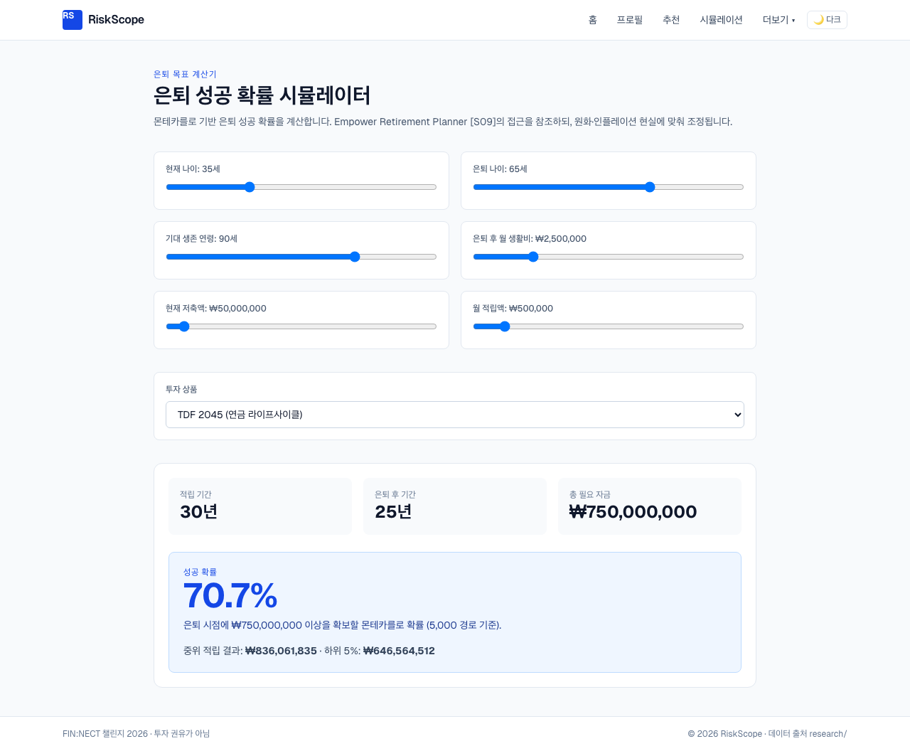

35세, 월 ₩500k 적립, TDF 2045 기준 65세 은퇴 시 목표 달성 확률 71.0%.

---

### 그림 9. Admin XAI 내부 뷰 (CFA P05 이해관계자 분리)

고객 UI와 분리된 감사·내부 리스크관리용 뷰. 모델 버전·시드·상관계수·세제 가정 모두 노출.

---

### 그림 10. 감사 로그 (금소법 R01 사전 증빙)

시뮬레이션 자동 기록, 동일 signature 디듀프, JSON/CSV 내보내기.

## 5.3 정량 KPI 가설

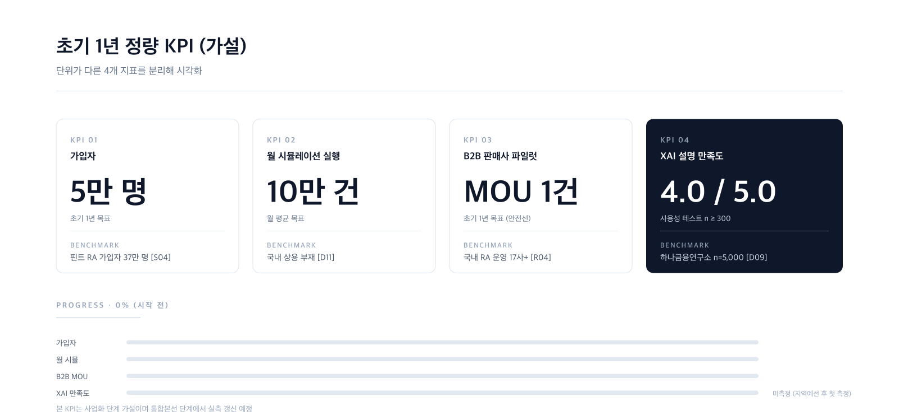
*그림 VI. 단위가 다른 4개 KPI를 분리해 시각화 (가입자·월 시뮬·B2B MOU·XAI 만족도). 각 카드 하단에 비교 기준 명시. B2B 목표는 1년 차 안전선으로 "MOU 1건"으로 보수적 설정 (LOI·MOU 관계는 통합본선까지 발굴)*

## 5.4 심사 기준 매핑 — 통합본선 금융 분야 (총 100점)

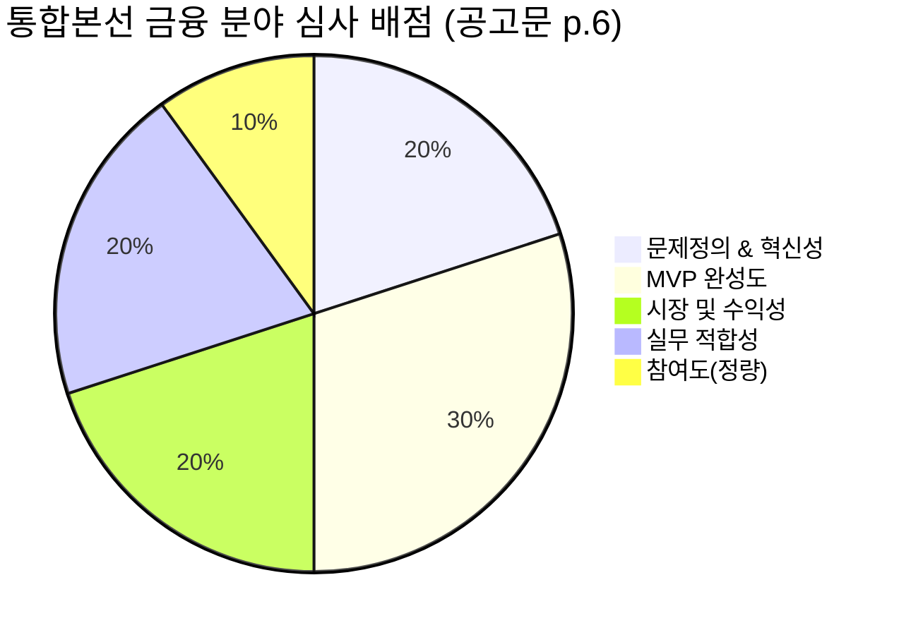
```mermaid
pie title 통합본선 금융 분야 심사 배점 (공고문 p.6)
    "문제정의 & 혁신성" : 20
    "MVP 완성도" : 30
    "시장 및 수익성" : 20
    "실무 적합성" : 20
    "참여도(정량)" : 10
```

| 항목 | 배점 | 본 제안 강점 | 증빙 |
|---|---|---|---|
| 문제정의 & 혁신성 | 20 | 추천 ↔ 시나리오 결합의 시장 부재 실증 | §1.2 + [D11] |
| MVP 완성도 | 30 | 추천+시뮬+XAI+비용+인지체크 5축 Full Flow | §2.4 그림 1-6 |
| 시장 및 수익성 | 20 | B2C+B2B+B2B2C+마이데이터 4채널 | §4.4 |
| 실무 적합성 | 20 | 금소법·SEC Reg BI·ESMA 대응 설계 | [R01]·[R06]·[R07] |
| 참여도(정량) | 10 | 자체활동비 50만/팀 + 4회 멘토링 100% 참여 계획 | (제도) |

---

# 6. 결론 (Conclusion)

본 제안의 핵심 가치는 **"추천된 상품을 복합 리스크 시나리오 하에서 사전에 분포로 보여준다"**는 단일 기술 레이어가 한국 리테일 금융시장의 4가지 시장 실패(반복 불완전판매, 환차손, 집중 리스크, 금융이해력 격차)에 대한 공통 해법으로 작동한다는 점이다. 이 가설은 **43+ 학술/규제/시장 인용**(70년에 걸친 금융이론 정전 11편 + 동시대 실증·서비스·규제·데이터 32편)으로 뒷받침되고, **15 페이지 + 1 API의 작동하는 MVP**로 실증되며, **2회의 정밀 QA 리뷰**로 수치·구현 정합성이 검증되었다.

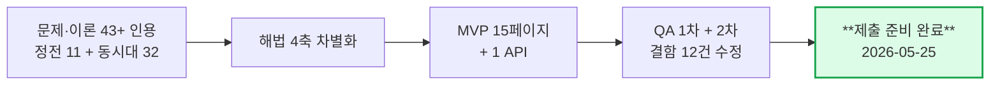
```mermaid
flowchart LR
    P[문제·이론 43+ 인용<br/>정전 11 + 동시대 32] --> S[해법 4축 차별화]
    S --> M[MVP 15페이지<br/>+ 1 API]
    M --> Q[QA 1차 + 2차<br/>결함 12건 수정]
    Q --> R[**제출 준비 완료**<br/>2026-05-25]

    style R fill:#dcfce7,stroke:#16a34a,stroke-width:2px
```

---

# 부록 A — 참고문헌 (요약)

전체 목록·APA 7th 형식: [research/references.md](research/references.md)

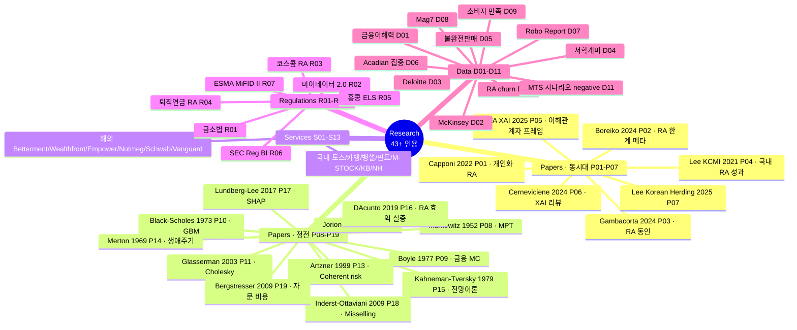
```mermaid
mindmap
  root((Research<br/>43+ 인용))
    Papers · 동시대 P01-P07
      Capponi 2022 P01 · 개인화 RA
      Boreiko 2024 P02 · RA 한계 메타
      Gambacorta 2024 P03 · RA 동인
      Lee KCMI 2021 P04 · 국내 RA 성과
      CFA XAI 2025 P05 · 이해관계자 프레임
      Cerneviciene 2024 P06 · XAI 리뷰
      Lee Korean Herding 2025 P07
    Papers · 정전 P08-P19
      Markowitz 1952 P08 · MPT
      Boyle 1977 P09 · 금융 MC
      Black-Scholes 1973 P10 · GBM
      Glasserman 2003 P11 · Cholesky
      Jorion 2006 P12 · VaR
      Artzner 1999 P13 · Coherent risk
      Merton 1969 P14 · 생애주기
      Kahneman-Tversky 1979 P15 · 전망이론
      DAcunto 2019 P16 · RA 효익 실증
      Lundberg-Lee 2017 P17 · SHAP
      Inderst-Ottaviani 2009 P18 · Misselling
      Bergstresser 2009 P19 · 자문 비용
    Services S01-S13
      국내 토스/카뱅/뱅샐/핀트/M-STOCK/KB/NH
      해외 Betterment/Wealthfront/Empower/Nutmeg/Schwab/Vanguard
    Regulations R01-R07
      금소법 R01
      마이데이터 2.0 R02
      코스콤 RA R03
      퇴직연금 RA R04
      홍콩 ELS R05
      SEC Reg BI R06
      ESMA MiFID II R07
    Data D01-D11
      금융이해력 D01
      McKinsey D02
      Deloitte D03
      서학개미 D04
      불완전판매 D05
      Acadian 집중 D06
      Robo Report D07
      Mag7 D08
      소비자 만족 D09
      RA churn D10
      MTS 시나리오 negative D11
```

---

# 부록 B — MVP 동작 증빙 (실제 캡처)

본 제안의 모든 그림 1-10은 합성 이미지가 아니라 **로컬 실행 중인 RiskScope MVP(`http://localhost:3000`)에서 Playwright로 캡처한 실제 화면**입니다.

- 1차 UI QA: [qa/REPORT.md](qa/REPORT.md)
- 2차 코드 QA: [qa/CODE_REVIEW.md](qa/CODE_REVIEW.md)
- README 검증: [qa/README_VALIDATION.md](qa/README_VALIDATION.md)
- 캡처 자동화: [web/scripts/proposal-figures.mjs](web/scripts/proposal-figures.mjs)
- 전체 캡처 폴더: [qa/shots/proposal/](qa/shots/proposal/)

---

# 부록 C — 작성 메타

| 항목 | 값 |
|---|---|
| 본 v2 개정일 | 2026-04-21 |
| v1 백업 | [proposal.v1.md](proposal.v1.md) |
| 도식 도구 | Mermaid (코드 내 정의) + 실 MVP 캡처 |
| 별도 이미지 합성 | 없음 — 모든 도식은 markdown 렌더 시 생성 |
| 인용 스타일 | APA 7th |
| 외부 참조 | [research/](research/) |

> **주의**: 본 제안서의 인용 ID(P0x·S0x·R0x·D0x)는 [research/references.md](research/references.md)와 1:1 대응합니다.
