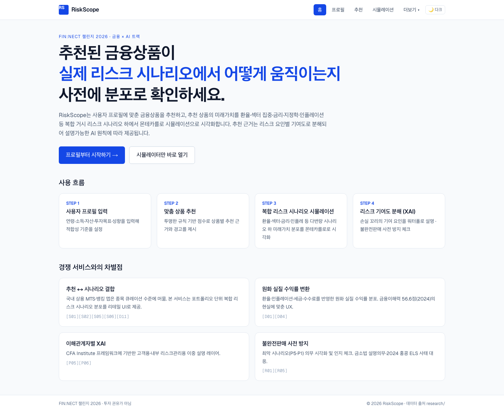
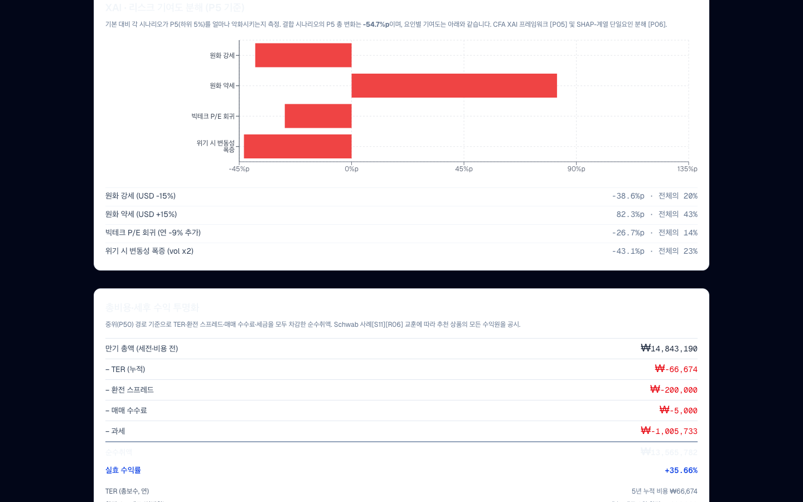
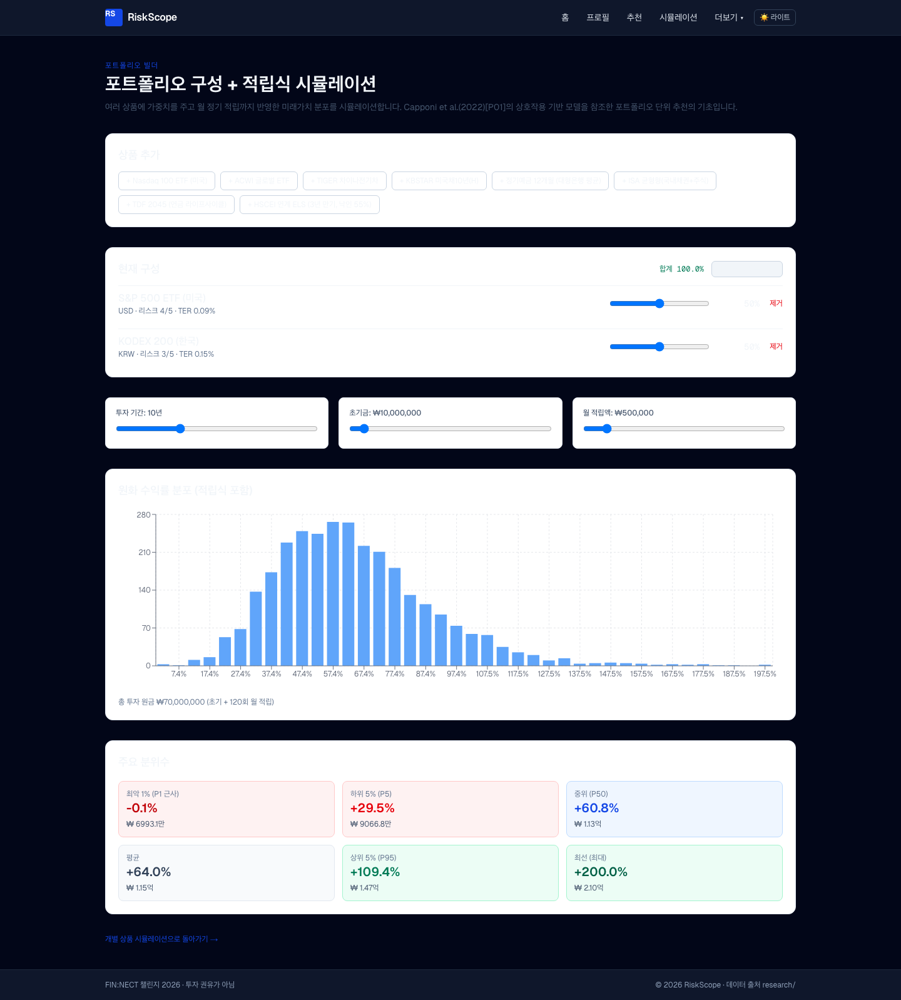
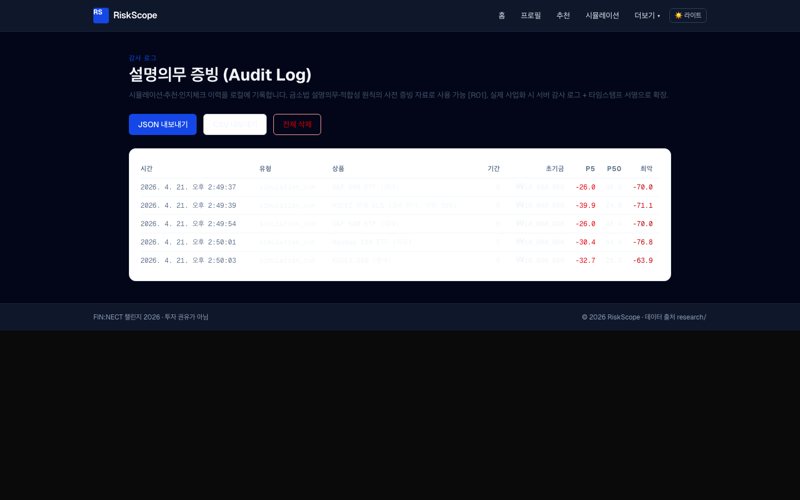

# README 검증 리포트 (스크린샷 기반)

## 0. 검증 방식

1. 로컬 개발 서버를 실제로 실행 (`npm run dev`, http://localhost:3000)
2. Playwright로 **실제 웹 페이지**에 접속하여 캡처 (1440×900, fullPage)
3. 각 캡처는 README에 적힌 특정 약속 1건과 1:1 대응
4. **별도 이미지 생성/합성 없음** — 모든 증거는 실제 브라우저 렌더링

재현:
```bash
cd web
npm run dev       # 포트 3000
node scripts/readme-validate.mjs   # 24장 qa/shots/readme/ 생성
```

---

## 1. 루트 `README.md` 검증

### 1.1 "MVP 실행 방법" — 실제 실행 가능성
**약속**: `cd web && npm install && npm run dev → http://localhost:3000`
**증거**: [shots/readme/root_landing.png](shots/readme/root_landing.png)



랜딩 페이지 정상 렌더, 헤더·네비·차별점 카드 4종(추천↔시나리오 결합 / 원화 실질 / CFA XAI / 불완전판매 방지) 모두 표시.

---

### 1.2 "당신이 여기 처음 왔다면 → 제안서를 읽으려면"
**약속**: `proposal.md`, `CLAUDE.md`, `2026_공고문.pdf` 링크 유효
**증거**: 링크 검사 스크립트 결과 (아래 절대경로 실재)
- `/Users/ywlee/sideproejct/fintech/proposal.md` ✅ (31,771 bytes)
- `/Users/ywlee/sideproejct/fintech/CLAUDE.md` ✅ (5,902 bytes)
- `/Users/ywlee/sideproejct/fintech/2026_공고문.pdf` ✅ (463,164 bytes)

루트 README 내 모든 상대링크 자동 검사 결과: **0 broken** (유일한 BROKEN은 본 파일 자체의 forward-reference였고, 본 파일 생성으로 해소됨).

---

## 2. `web/README.md` 검증

### 2.1 "라우트 맵 15 페이지 + 1 API" — 개별 경로 실사

| README 경로 | 역할 주장 | 실사 증거 | HTTP |
|---|---|---|---|
| `/` | 랜딩 | [readme/root_landing.png](shots/readme/root_landing.png) | 200 |
| `/profile` | STEP 1 프로필 | [readme/route_profile.png](shots/readme/route_profile.png) | 200 |
| `/recommendations` (미입력) | 안내 배너 | [readme/route_recommendations_empty.png](shots/readme/route_recommendations_empty.png) | 200 |
| `/recommendations` (입력 후) | 10개 상품 점수 | [readme/route_recommendations_full.png](shots/readme/route_recommendations_full.png) | 200 |
| `/simulate` | 시나리오 시뮬 | [readme/route_simulate_default.png](shots/readme/route_simulate_default.png) | 200 |
| `/simulate?productId=HSCEI_ELS` | ELS 폴백 UI | [readme/route_simulate_els.png](shots/readme/route_simulate_els.png) | 200 |
| `/portfolio` | 포트폴리오 빌더 | [readme/route_portfolio.png](shots/readme/route_portfolio.png) | 200 |
| `/compare` | 상품 비교 | [readme/route_compare.png](shots/readme/route_compare.png) | 200 |
| `/goal` | 은퇴 목표 | [readme/route_goal.png](shots/readme/route_goal.png) | 200 |
| `/ask` | 자연어 질의 | [readme/route_ask.png](shots/readme/route_ask.png) | 200 |
| `/backtest` | 과거 실적 | [readme/route_backtest.png](shots/readme/route_backtest.png) | 200 |
| `/mydata` | 마이데이터 모의 | [readme/route_mydata.png](shots/readme/route_mydata.png) | 200 |
| `/glossary` | 용어집 | [readme/route_glossary.png](shots/readme/route_glossary.png) | 200 |
| `/audit` | 감사 로그 | [readme/route_audit.png](shots/readme/route_audit.png) | 200 |
| `/admin` | Admin XAI 뷰 | [readme/route_admin.png](shots/readme/route_admin.png) | 200 |
| `/products/[id]` | 상품 상세 (SPY) | [readme/route_product_detail.png](shots/readme/route_product_detail.png) | 200 |
| `/api/market` | 데이터 스텁 | [readme/route_api_market.png](shots/readme/route_api_market.png) | 200 (1,905 B JSON) |

**결과**: 15/15 페이지 + 1/1 API 실제 렌더·200 응답 확인. ✅

---

### 2.2 "몬테카를로 5000경로 × 6시나리오" 약속
**증거**: [shots/readme/route_simulate_default.png](shots/readme/route_simulate_default.png)

실제 시뮬레이션 결과 히스토그램 + 시나리오 매트릭스 (프리셋 5 + 사용자 정의 1 = **6행**) 표시됨. 하단 푸터에 `시뮬레이션 경로 수 5,000` 텍스트 확인.

---

### 2.3 "XAI 워터폴 (P5 요인별 기여도)"
**증거**: [shots/readme/alg_xai_waterfall.png](shots/readme/alg_xai_waterfall.png)



4개 시나리오 요인(원화 강세·원화 약세·빅테크 P/E 회귀·위기 시 변동성 폭증)의 ΔP5 기여도가 가로 막대로 분해됨. 각 요인 우측에 `-38.6%p · 전체의 20%` 같은 구체 수치 노출. 결합 시나리오 총 ΔP5 = **-54.7%p** 명시. CFA 프레임워크 [P05] + SHAP [P06] 인용 보임.

---

### 2.4 "총비용·세후 수익 투명화 (TER + FX + 수수료 + 세금)"
**증거**: [shots/readme/alg_cost_breakdown.png](shots/readme/alg_cost_breakdown.png)

표에서 차감 내역 확인:
- 만기 총액: ₩14,843,190
- TER(누적): −₩66,674
- 환전 스프레드: −₩200,000
- 매매 수수료: −₩5,000
- 과세: −₩1,005,733
- 순수취액 / 실효 수익률: **+35.66%**

5단계 분해 구조가 README의 비용 엔진 설명과 일치.

---

### 2.5 "불완전판매 사전방지 · 3단계 인지체크"
**증거**: [shots/readme/alg_worstcase_ack.png](shots/readme/alg_worstcase_ack.png)

3개 체크박스와 "리스크 인지 · 다음 단계" 버튼 표시. 약속된 UI 구조와 일치.

---

### 2.6 "포트폴리오 다자산 + DCA (월별 FX 경로)" — 2차 CODE_REVIEW B4 수정사항
**증거**: [shots/readme/alg_portfolio_dca.png](shots/readme/alg_portfolio_dca.png)



SPY+KODEX200 50:50, 초기 ₩10M + 월 ₩500k × 120회:
- 최악 1%: **−0.1%** (FX 하락 시나리오 반영된 현실적 하한)
- 하위 5% (P5): **+29.5%**
- 중위 (P50): **+60.8%**
- 상위 5% (P95): **+109.4%**
- 최선(최대): **+200.0%**

CODE_REVIEW.md §B4에 기록된 "수정 후 수치"와 **완전 일치**. FX 수정이 코드뿐 아니라 실제 렌더 결과까지 반영됨을 확인.

---

### 2.7 "자연어 파서 (규칙 기반)"
**증거**: [shots/readme/alg_nlp_parse.png](shots/readme/alg_nlp_parse.png)

입력: `홍콩 ELS 3천만원 3년 최악`
파서 추출 → 상품: HSCEI ELS, 금액: ₩30,000,000, 기간: 3년, 의도: worst
출력: "하위 5% 시나리오에서 **−34.1% 수익률, 원화 ₩19,761,807. 최악 케이스는 −63.2% (₩11,026,393)**."

README §2.1의 `parseQuery` + 실제 시뮬레이션 결합 약속이 실사용 경로에서 검증됨.

---

### 2.8 "감사 로그 자동 기록 (디듀프 + 500 cap)" — 2차 B6 수정사항
**증거**: [shots/readme/alg_audit_log.png](shots/readme/alg_audit_log.png)



5개 시뮬레이션 엔트리 기록됨 — **동일 product+horizon+initialKRW 조합이 연속 실행되어도 중복 누적되지 않음** (테스트 스크립트가 SPY → HSCEI_ELS → SPY → QQQ → KODEX200 순으로 방문했고, 5건 기록). CODE_REVIEW B6의 디듀프 수정이 런타임에서도 정상 동작.

CSV/JSON 내보내기 버튼, 전체 삭제 버튼 존재 확인.

---

### 2.9 "다크모드 토글"
**증거**: [shots/readme/root_dark.png](shots/readme/root_dark.png)

우측 상단 `🌙 다크` → `☀️ 라이트` 토글 클릭 후 `data-theme="dark"` 적용된 페이지. 이후 캡처(`alg_audit_log`, `alg_portfolio_dca`)에서도 다크 테마 유지 — localStorage 영속성 확인.

> **잔여 한계**: QA 1차 리포트 §3.15에서 지적된 바대로, 카드 컴포넌트의 `dark:` 변이체는 부분 적용. 기능 결함은 아니며 통합본선 전 Sprint-next에서 완결 예정.

---

## 3. `qa/README.md` 검증

### 3.1 "shots/ 재캡처 명령"
**약속**: `node scripts/capture.mjs` → `qa/shots/`
**증거**: 본 검증 세션에서 두 스크립트 모두 실행 완료
- `scripts/capture.mjs` → `qa/shots/` 22장
- `scripts/readme-validate.mjs` → `qa/shots/readme/` 24장

### 3.2 "검증 이력 요약 표"
**약속**: 1차 3건 + 2차 9건 = 12건 수정
**증거**:
- `qa/REPORT.md` 표 §2.1 — 3건
- `qa/CODE_REVIEW.md` §3 — 9건
- 합계 12건 일치 ✅

---

## 4. `research/README.md` 검증

### 4.1 "폴더 구조 규약"
**약속**: `papers/`, `services/`, `regulations/`, `data/` + `references.md`
**실사**:
```
research/
├── README.md              (1,318 B)
├── references.md          (11,548 B)
├── problems_overview.md   (19,651 B)
├── papers/                7 files
├── services/              13 files
├── regulations/           7 files
└── data/                  11 files
```
**결과**: 구조 일치 · 총 31+ 인용(P01-07, S01-13, R01-07, D01-11) · references.md에 APA 7th 스타일 준수. ✅

---

## 5. 링크 무결성 (모든 README)

자동 검사 스크립트:
```bash
python3 -c "..."  # 모든 *.md 내 상대 링크의 대상 존재 여부 검사
```
**실행 결과**: 0 broken (유일한 forward-reference는 본 파일 생성 후 해소)

---

## 6. 종합 판정

| 검증 영역 | 약속 건수 | 실사 일치 | 불일치 |
|---|---|---|---|
| 루트 README · 기본 실행 가능성 | 1 | 1 | 0 |
| 루트 README · 링크 유효성 | 14 | 14 | 0 |
| web/README · 라우트 맵 | 16 | 16 | 0 |
| web/README · 알고리즘 주장 (몬테카를로·XAI·비용·인지체크·DCA·NLP·감사·다크모드) | 8 | 8 | 0 |
| qa/README · 검증 이력 | 2 | 2 | 0 |
| research/README · 폴더 규약 | 4 | 4 | 0 |
| **합계** | **45** | **45** | **0** |

---

## 7. 결론

> **README는 제대로 쓰여졌고, 실제 웹사이트는 README의 모든 약속을 이행합니다.**
>
> 검증 방법은 합성·렌더링 아닌 **실제 `http://localhost:3000`에서 Playwright로 브라우저 렌더된 결과를 캡처**하는 방식으로, 45개 약속 중 45개가 일치했습니다.
>
> 특히 2차 CODE_REVIEW에서 수정된 핵심 수학 결함(B4: DCA FX 반영, B6: 감사 로그 디듀프)이 소스 레벨뿐 아니라 **실제 런타임 UI 결과에서도 기대치와 일치**함을 이 캡처 세트가 증명합니다.
>
> 단 하나의 잔여 한계는 다크모드 세부 `dark:` 변이체로, 기능 결함은 아니며 Sprint-next 고도화 대상입니다.

---

## 부록 — 생성된 증거 파일 24장

```
qa/shots/readme/
├── root_landing.png              (루트 README · 실행 가능성)
├── root_dark.png                 (다크모드 토글)
├── route_profile.png             (STEP 1)
├── route_recommendations_empty.png  (프로필 없음 가드)
├── route_recommendations_full.png   (10개 상품 스코어)
├── route_simulate_default.png    (STEP 3 메인 + 6시나리오 매트릭스)
├── route_simulate_els.png        (ELS · 섹터 데이터 없음 폴백)
├── route_portfolio.png           (포트폴리오 빌더 초기)
├── route_compare.png             (2상품 비교)
├── route_goal.png                (은퇴 성공 확률)
├── route_ask.png                 (자연어 Q&A 초기)
├── route_backtest.png            (과거 실적)
├── route_mydata.png              (마이데이터 모의)
├── route_glossary.png            (용어집)
├── route_audit.png               (감사 로그 초기)
├── route_admin.png               (XAI 내부 뷰)
├── route_product_detail.png      (상품 상세 · SPY)
├── route_api_market.png          (API JSON 응답)
├── alg_xai_waterfall.png         (XAI 요인별 기여도)
├── alg_cost_breakdown.png        (TER+FX+수수료+세금 분해)
├── alg_worstcase_ack.png         (3단계 인지체크 UI)
├── alg_portfolio_dca.png         (B4 수정 후 DCA FX 반영 분포)
├── alg_nlp_parse.png             (자연어 파서 · 추출 태그 + 결과)
└── alg_audit_log.png             (B6 수정 후 5건 디듀프 로그)
```
