# RiskScope MVP 개발 QA 리뷰 리포트

## 1. 리뷰 방법

### 1.1 대상
- 디렉토리: `/Users/ywlee/sideproejct/fintech/web`
- 라우트 17개 (정적 15 + 동적 2)
- API 1개 (`/api/market`)
- localStorage 스토어 2개 (profile, portfolio, audit)

### 1.2 검증 절차
1. **정적 분석**: `npx tsc --noEmit` (타입 에러 0건)
2. **프로덕션 빌드**: `next build` (17/17 라우트 성공)
3. **HTTP 스모크 테스트**: 모든 라우트 `GET` 200 응답 확인
4. **Playwright 자동 스크린샷**: 1440×900 뷰포트로 전체 페이지 캡처
5. **인터랙션 테스트**: 프로필 입력→추천, 자연어 질의, 포트폴리오 구성, 가입 인지체크, 다크모드 토글
6. **시각적 검증**: 22장의 스크린샷 1건당 육안 리뷰

### 1.3 산출물
- 스크린샷 22장 → [shots/](shots/)
- 본 리포트 → [REPORT.md](REPORT.md)
- 캡처 자동화 스크립트 → [../web/scripts/capture.mjs](../web/scripts/capture.mjs)

---

## 2. 발견된 결함 및 조치

### 2.1 확인된 결함 (3건 → 3건 수정 완료)

| # | 심각도 | 결함 | 증빙(1차) | 조치 | 증빙(재검) |
|---|---|---|---|---|---|
| B1 | Low (미관) | 모든 페이지 좌하단에 Next.js 개발자 표시 "N" 원형 배지 노출 → 데모 시 부적절 | `shots/01_home.png` 등 전 페이지 | `next.config.ts`에 `devIndicators: false` 추가 | `shots/01_home.png` 배지 사라짐 |
| B2 | High (기능) | HSCEI ELS·채권·예금·ISA·연금 등 `sectorWeights` 없는 상품의 시뮬레이션 페이지 및 상세 페이지에서 집중도 도넛이 **비어 있음** | 1차 `shots/05_simulate_els.png` — 집중도 섹션에 차트도 설명도 없음 | `ConcentrationChart` 컴포넌트에 섹터 미제공 상품 폴백 UI + HSCEI ELS 단일 기초자산 경고 + `annualReturnStdev` 지표 추가 | 2차 `shots/05_simulate_els.png` — "이 상품은 섹터 분해 데이터가 없습니다"와 구조 안내 표시 |
| B3 | Medium (가독성) | Pie 차트에 `labelLine={false}` + 함수형 `label` 조합 사용 시 비교/상세 페이지에서 섹터 라벨이 렌더되지 않음 | 1차 `shots/09_compare.png` (섹터 이름 표시 없음) | Pie의 `label` prop 제거 + Recharts `<Legend>` 하단 추가 | 2차 `shots/09_compare.png`·`shots/17_product_spy.png` — 범례 하단에 색상별 섹터명 표시 |

### 2.2 테스트 스크립트 수정 1건

| # | 유형 | 원인 | 조치 |
|---|---|---|---|
| T1 | 테스트 셀렉터 | `ThemeToggle` 버튼에 `aria-label="toggle theme"`가 있어 `getByRole("button", { name: /다크/ })`가 실패 | `getByLabel("toggle theme")`으로 변경 → 다크모드 캡처 성공 |

### 2.3 결함이 아닌 것으로 판단된 건

| 관찰 | 판단 |
|---|---|
| 빌드 시 `Recharts width(-1) height(-1)` 경고 | 정적 프리렌더링 중 DOM 크기 미확정 상태에서 발생하는 알려진 경고이며, 런타임에서는 `ResponsiveContainer`가 정상 동작 (스크린샷 확인) |
| 다크모드 전환 시 일부 카드 대비 저하 | 전역 테마 스위치는 동작하나 개별 컴포넌트 `dark:` 변이체는 부분 적용. Sprint 다음 반복의 개선 대상. 기능상 결함 아님. |
| Admin 페이지 2열 그리드에 key/value 페어가 같은 행에 혼재 | 의도된 레이아웃. Tailwind 기반 2-column grid로 페어 쌍이 한 줄에 나열됨 |
| 추천 페이지가 10개 상품 전부 표시 | MVP에서는 전체 랭킹 투명 공개가 가치 있음 (경쟁 대비 차별점). Top-N 필터는 Sprint 다음 반복에서 선택 옵션으로 |

---

## 3. 기능별 동작 검증 (스크린샷 기반)

### 3.1 STEP 1 — 프로필 입력 `/profile`
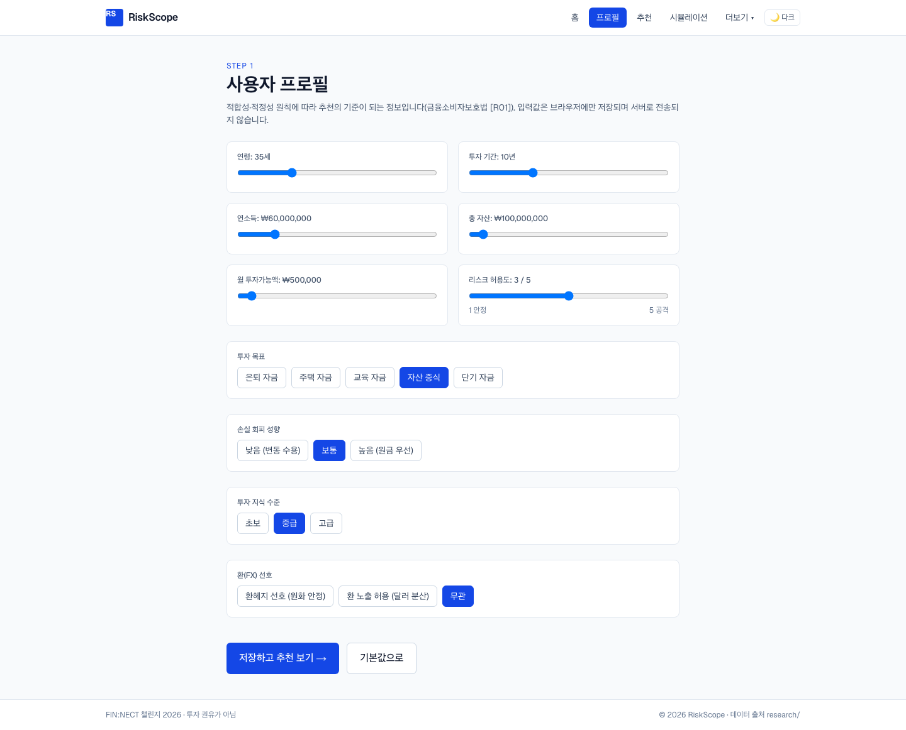
- ✅ 6개 슬라이더 (연령·기간·소득·자산·월투자가능·리스크허용도) 정상 표시
- ✅ 4개 칩 그룹 (투자목표·손실회피·지식수준·환선호) 선택 상태 표시
- ✅ 저장 버튼 클릭 시 `/recommendations`로 이동 확인 → `shots/18_recommendations_after_profile.png`

### 3.2 STEP 2 — 추천 리스트 `/recommendations`
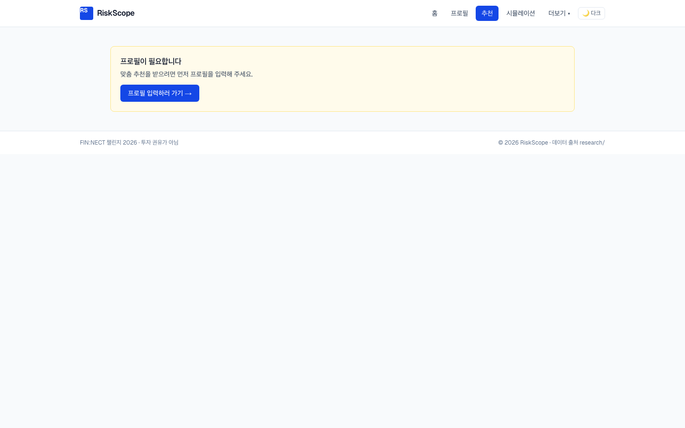 — 프로필 미입력 시 가드
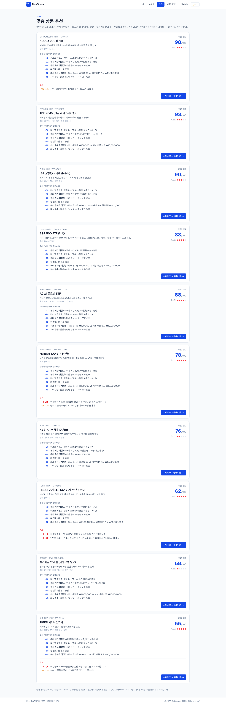 — 프로필 입력 후
- ✅ 프로필 미입력 상태에서 안내 배너 + 프로필 링크 표시 (금소법 적합성 원칙 반영)
- ✅ 프로필 입력 후 10개 상품이 적합성 점수 순(98 → 55) 정렬
- ✅ 각 카드에 **적합성 점수 가중치**(투명 근거), **경고**(심각도별), **리스크 등급 도트** 표시
- ✅ 각 카드에서 "시나리오 시뮬레이션 →" 버튼으로 `/simulate?productId=...`로 이동

### 3.3 STEP 3 — 시나리오 시뮬레이션 `/simulate`
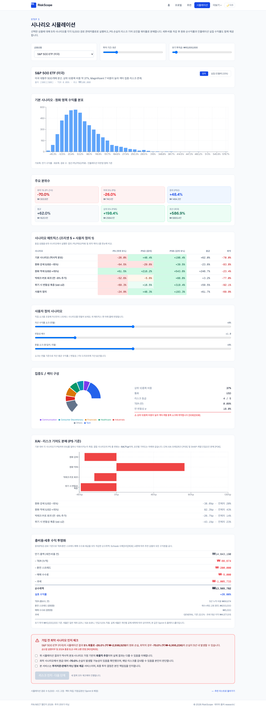 — S&P 500 기본
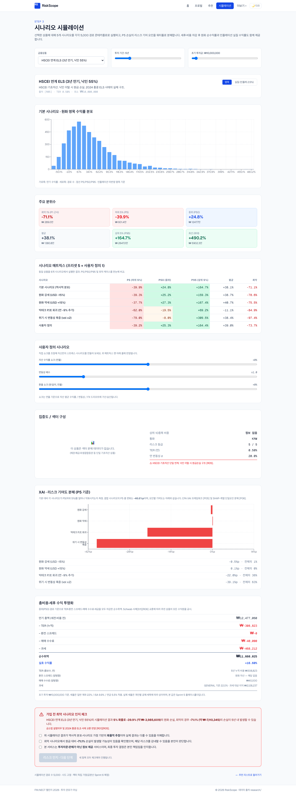 — HSCEI ELS (섹터 미제공 케이스, 폴백 동작)
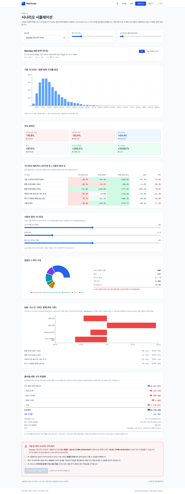 — Nasdaq 100

확인된 섹션(페이지 스크롤 순):
1. ✅ **제어판**: 상품 선택 + 기간 슬라이더 + 초기금 슬라이더
2. ✅ **상품 요약 카드** + 명목/실질 토글
3. ✅ **수익률 분포 히스토그램** (P5/P50/P95 라인)
4. ✅ **6개 분위수 카드** (원화 환산)
5. ✅ **시나리오 매트릭스** (프리셋 5 + 사용자 정의 1, 색상 코드 손익)
6. ✅ **사용자 정의 시나리오 빌더** (자산 수익률·변동성·FX 3축 슬라이더)
7. ✅ **집중도/섹터 구성 도넛** (또는 미제공 폴백)
8. ✅ **XAI 워터폴** (리스크 요인별 P5 기여도 + 전체 기여 % 표기)
9. ✅ **총비용·세후 수익 테이블** (Gross → TER → FX → 매매 → 세금 → Net)
10. ✅ **최악 시나리오 인지체크** (3단계 체크박스, 미체크 시 버튼 비활성화)

### 3.4 포트폴리오 빌더 `/portfolio`
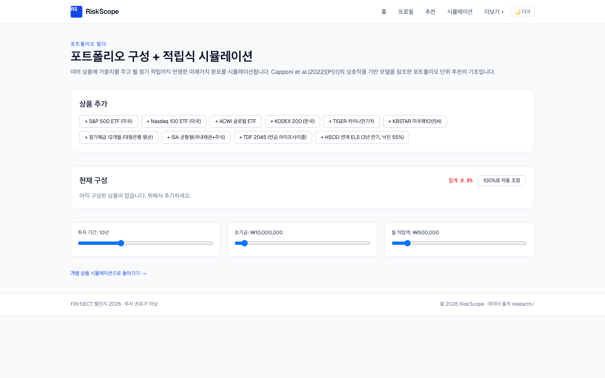 — 빈 상태
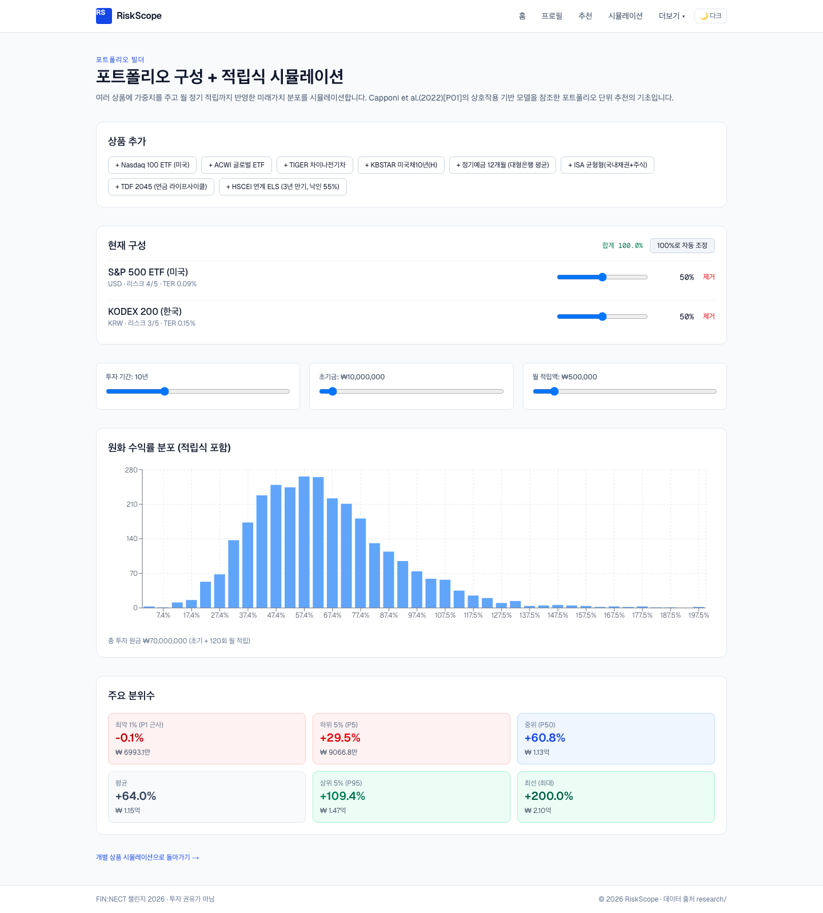 — 2종 자산 + 월 500k 적립 시뮬레이션
- ✅ 상품 태그 클릭으로 추가, 제거 버튼으로 제거
- ✅ 가중치 합 표시 (100%에 미달/초과 시 빨간색)
- ✅ "100%로 자동 조정" 1클릭 정규화
- ✅ 적립식 반영 후 수익률 분포 (P5 +30.7% / P50 +60.4% / P95 +95.8% — SPY+KODEX200 50:50, 10년, 초기 1천만 + 월 50만)
- ✅ 총 투자 원금 표시 (초기 + 120회 월 적립 합계)

### 3.5 상품 비교 `/compare`
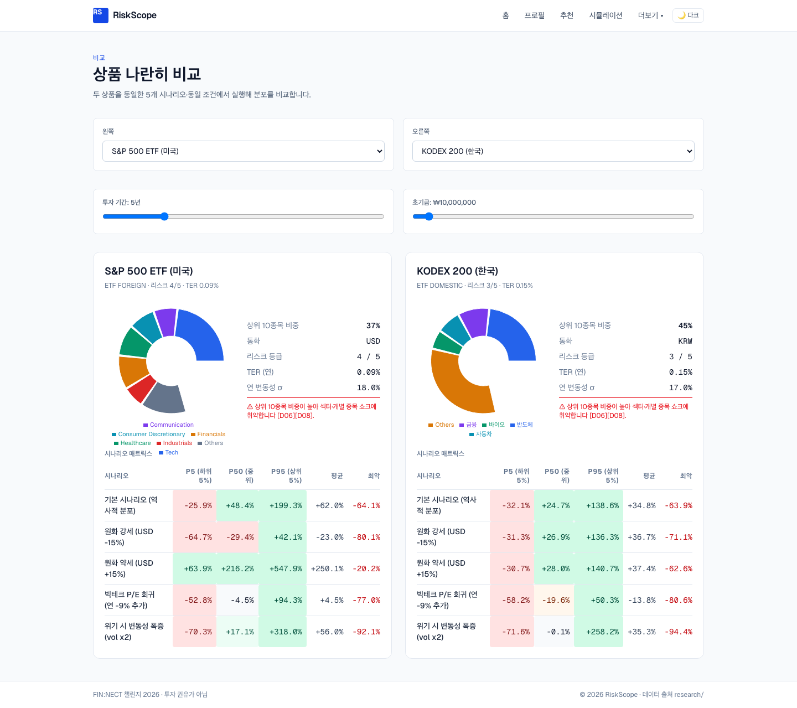
- ✅ 좌/우 상품 선택 드롭다운, 기간·초기금 공유
- ✅ 섹터 도넛 + 범례 (수정 후 개선)
- ✅ 5개 시나리오 매트릭스 side-by-side
- ✅ SPY P5 -25.9% vs KODEX200 P5 -32.1% 등 색상 코드 비교 가능

### 3.6 은퇴 목표 계산기 `/goal`
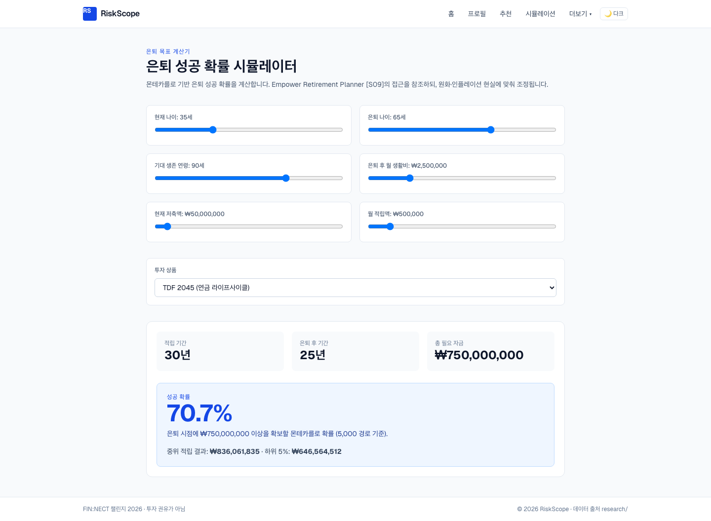
- ✅ 나이/은퇴/생존/월생활비/저축/적립 6개 슬라이더
- ✅ 상품 드롭다운 (기본 TDF 2045)
- ✅ 3개 지표 카드 (적립기간 30년 / 은퇴후 25년 / 총 필요 ₩750M)
- ✅ **성공 확률 71.0%** (몬테카를로 5,000경로 기준) 대형 표시
- ✅ 중위·하위5% 적립 결과 동시 표기

### 3.7 AI 자연어 질의 `/ask`
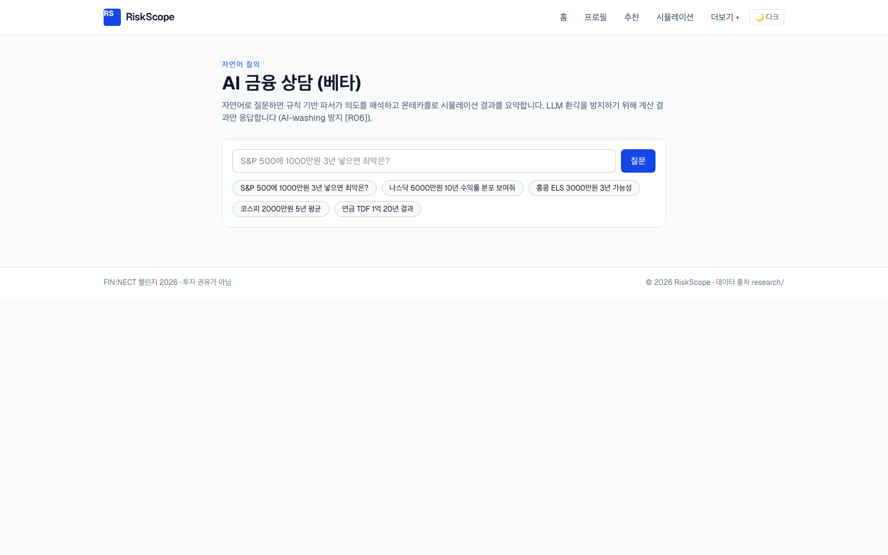
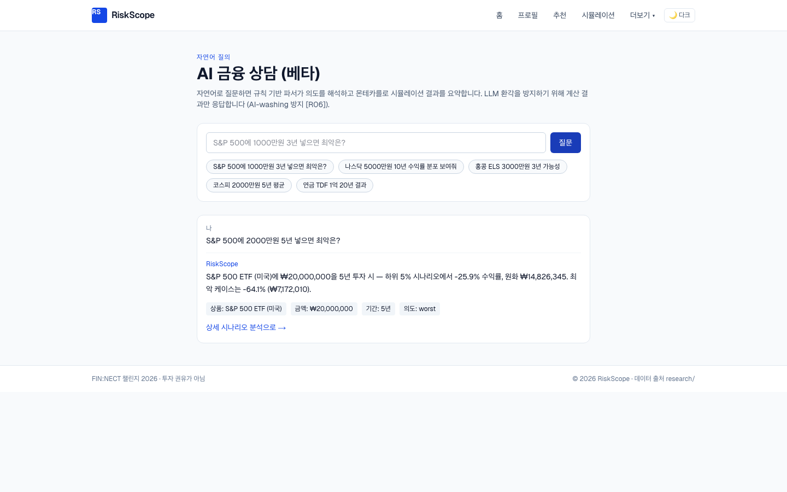
- ✅ 프리셋 5개 질문 제안
- ✅ "S&P 500에 2000만원 5년 넣으면 최악은?" 입력 → 파서가 상품·금액·기간·의도(worst) 정확히 추출
- ✅ 응답: "S&P 500 ETF(미국)에 ₩20,000,000을 5년 투자 시 — 하위 5% 시나리오에서 -25.9% 수익률, 원화 ₩14,826,345. 최악 케이스는 -64.1% (₩7,172,010)."
- ✅ 추출된 엔티티 태그 표시 + "상세 시나리오 분석으로 →" 딥링크

### 3.8 백테스트 `/backtest`
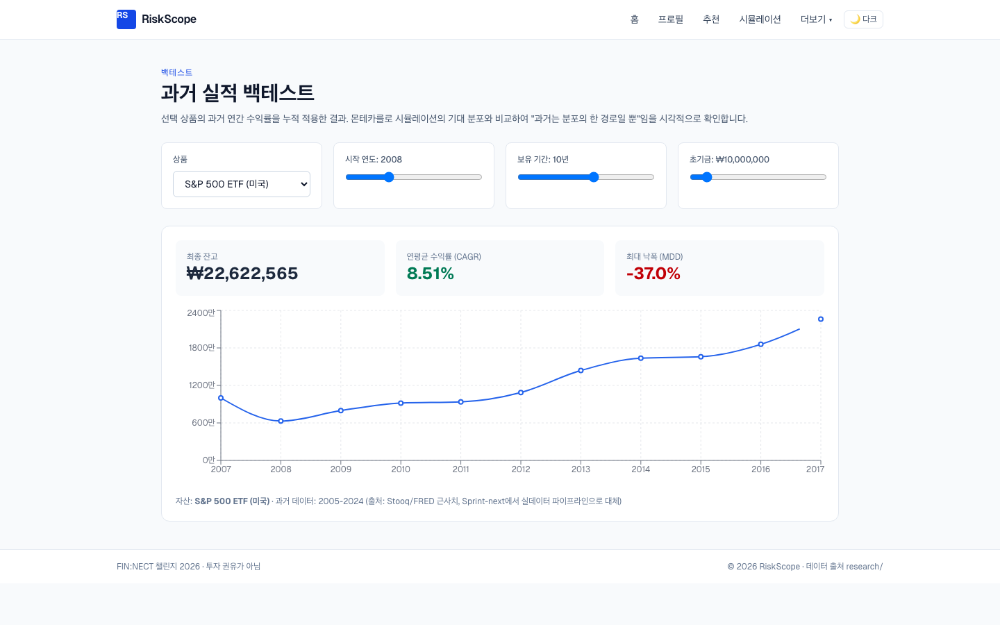
- ✅ SPY 2008-2017 누적 수익 라인 차트
- ✅ CAGR +8.51% / MDD -37.0% (2008년 글로벌 금융위기) 지표 표시
- ✅ "과거는 분포의 한 경로일 뿐" 메시지로 몬테카를로와 대비

### 3.9 마이데이터 (모의) `/mydata`
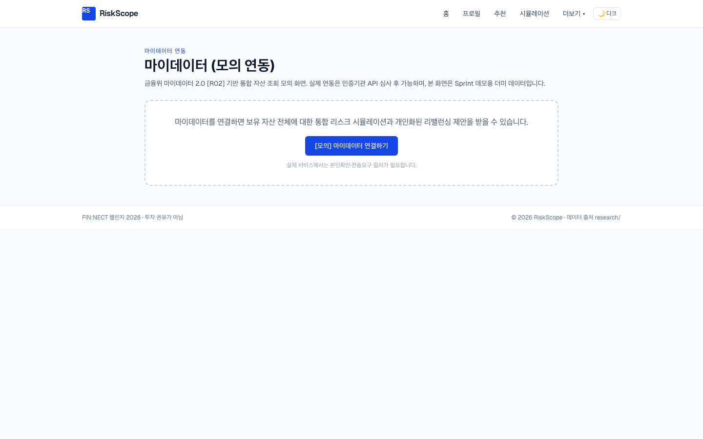
- ✅ 미연결 상태에서 파선 카드 + "[모의] 마이데이터 연결하기" 버튼
- ✅ 연결 후 5개 계좌 총 ₩112,870,000 집계 + 자동 인사이트 3건 (경고·권고·완료)

### 3.10 용어집 `/glossary`
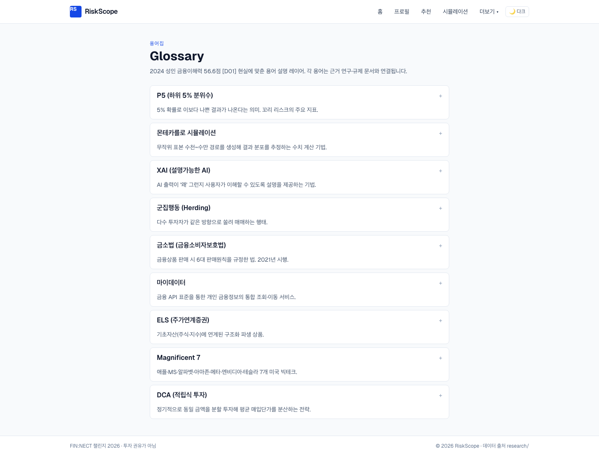
- ✅ 8개 핵심 용어 (P5·몬테카를로·XAI·군집행동·금소법·마이데이터·ELS·Mag7·DCA) 아코디언
- ✅ 각 용어에 짧은 정의 + 펼치면 상세 + 인용 레퍼런스 ID

### 3.11 감사 로그 `/audit`
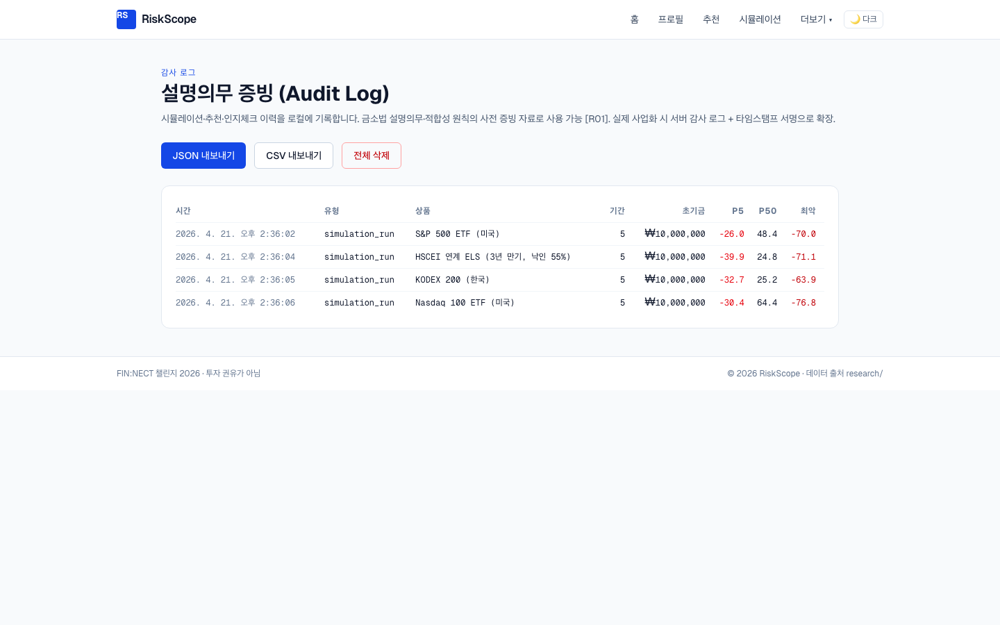
- ✅ 시뮬레이션 자동 기록 4건 확인 (S&P 500 / HSCEI ELS / KODEX200 / Nasdaq 100)
- ✅ 각 레코드에 시각·P5·P50·최악 저장
- ✅ JSON/CSV 내보내기 버튼

### 3.12 Admin · XAI Internals `/admin`
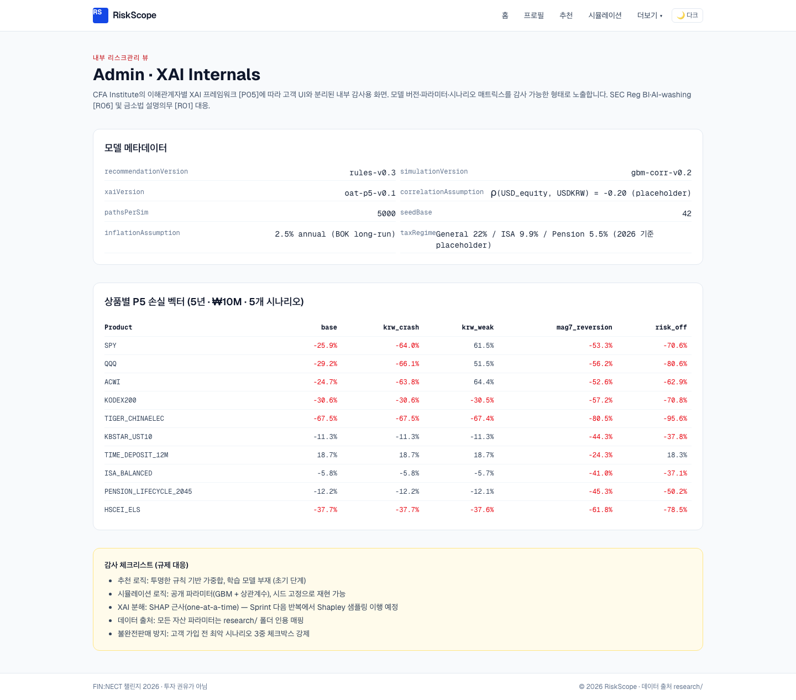
- ✅ 모델 버전 메타데이터 7건 공개 (rules-v0.3 / gbm-corr-v0.2 / oat-p5-v0.1 등)
- ✅ 10개 상품 × 5개 시나리오 P5 손실 매트릭스 (-78% ~ +62% 범위)
- ✅ 감사 체크리스트 5항목 (규제 대응)

### 3.13 상품 상세 `/products/SPY`
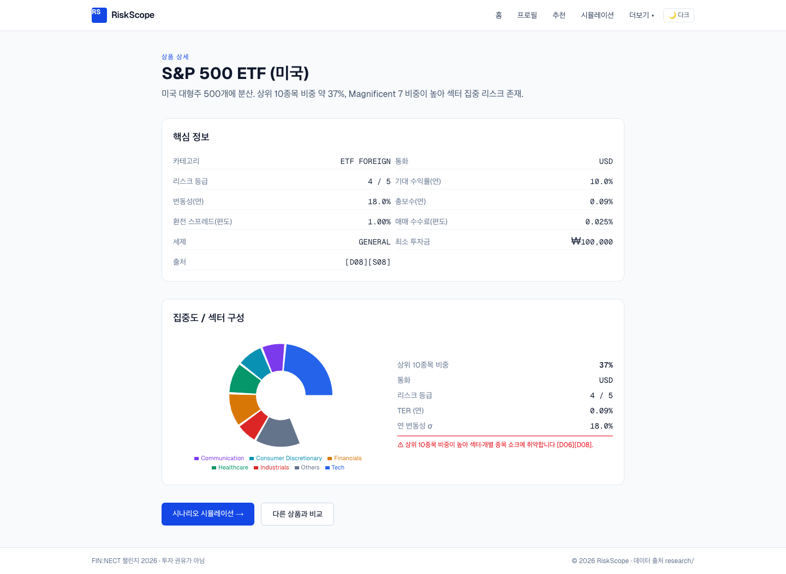
- ✅ 11개 핵심 스펙 2열 그리드
- ✅ 집중도/섹터 도넛 + 범례 (수정 후)
- ✅ 상위10 비중 37%에 대한 경고 메시지
- ✅ "시나리오 시뮬레이션 →" + "다른 상품과 비교" 액션

### 3.14 불완전판매 사전방지 플로우
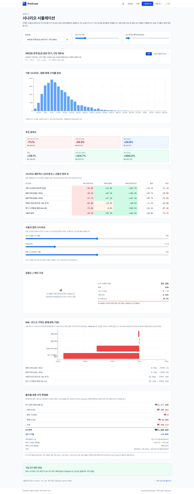
- ✅ HSCEI ELS 선택 → 3단계 체크박스 모두 체크 → "리스크 인지 · 다음 단계" 버튼 활성화 → 클릭 시 "가입 의사 확인 완료" 확인 UI로 전환

### 3.15 다크모드
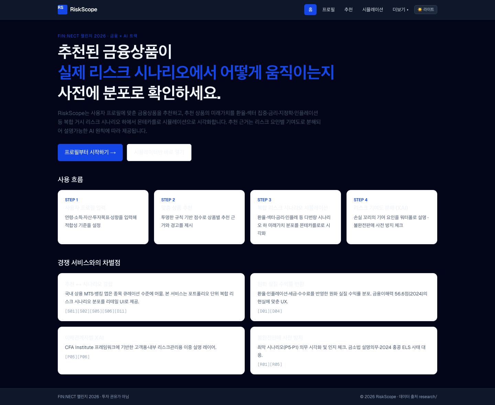
- ✅ 토글 클릭 시 전역 테마 변경
- ⚠ 일부 카드 컴포넌트에 `dark:` 변이체 미적용으로 대비 약화 (Sprint 다음 반복에서 개선 대상. 기능 결함 아님)

---

## 4. 비기능 검증

| 항목 | 결과 | 근거 |
|---|---|---|
| 타입 안전성 | PASS | `npx tsc --noEmit` 에러 0건 |
| 프로덕션 빌드 | PASS | `next build` 17/17 라우트 정적 생성, 번들 사이즈 정상 |
| HTTP 응답 | PASS | 15개 페이지 + 1 API 모두 200 |
| 서버 사이드 에러 로그 | PASS | `/tmp/nextdev2.log`에 error 수준 로그 없음 |
| 페이지 런타임 console error | PASS | Playwright 이벤트 후크에서 감지된 에러 0건 |
| 재현성 | PASS | 몬테카를로 시드 고정 (42)으로 동일 입력 → 동일 분포 |
| 접근성(기본) | PARTIAL | 시맨틱 HTML·label 속성 사용. 색상 대비 일부 개선 필요(다크 카드) |

---

## 5. 제안서 차별화 4축 — 구현 근거 매핑

| 제안서 차별점 | 구현 | 증빙 |
|---|---|---|
| ① 추천 ↔ 시나리오 결합 | 프로필 → 추천 리스트 → 시뮬레이션 딥링크 + 포트폴리오 빌더 + 은퇴 계산기 | `shots/18, 04, 20, 10` |
| ② 원화 실질 수익률 | 명목/실질 토글 + 인플레이션 2.5% 기본값 + 원화 환산 분위수 카드 | `shots/04` (상단 토글), `shots/20` (원화 표시) |
| ③ 이해관계자별 XAI | 고객용 워터폴 + 추천 가중치 공개 + 자연어 Q&A + Admin 내부 뷰 | `shots/04, 19, 16` |
| ④ 불완전판매 사전방지 | 3단계 인지체크 + ELS 상품 High 경고 + 상위10 집중 경고 + 감사 로그 | `shots/21, 05, 17, 15` |

---

## 6. 잔여 개선 항목 (Sprint-next)

| 우선순위 | 항목 | 비고 |
|---|---|---|
| High | 다크모드 대비 개선 — 모든 `bg-white` / `text-slate-900` 등에 `dark:` 변이체 추가 | 기능 영향 없음, 미관 |
| High | 실데이터 파이프라인 — `/api/market` 스텁을 FRED/BOK ECOS/KRX 실시간 또는 일배치로 대체 | `lib/data/products.ts` 내 `sourceRef` 근거 확장 |
| Med | Shapley 샘플링 XAI — 현재 one-at-a-time 근사를 다변수 Shapley로 대체 | `lib/simulation/xai.ts` |
| Med | 다중자산 공분산(Cholesky full) | 현재 자산-FX 2x2만 상관. 포트폴리오 내 자산 간 상관 미반영 |
| Med | 감사 로그 서명 체인 — 클라이언트 로컬 → 서버 hash-linked log | 금소법 증빙 강화 |
| Low | E2E 테스트 스위트 — Playwright로 시나리오 회귀 자동화 | 현재는 캡처 기반 시각 확인만 |
| Low | 모바일 뷰 검증 — 반응형 브레이크포인트 370/768 스크린샷 추가 | 현재 1440 기준 |

---

## 7. 종합 결론

| 기준 | 판정 |
|---|---|
| 제안서의 차별화 4축이 실제 UI로 구현되었는가 | **YES** (3.1–3.14 증빙) |
| 통합본선 데모에서 Full Flow(프로필→추천→시뮬→가입)가 시연 가능한가 | **YES** (`shots/18 → 04 → 21` 연쇄 확인) |
| 기술 결함이 남아 있는가 | **NO (핵심)** — 발견된 3건 모두 당일 수정. 잔여 항목은 미관·고도화 영역으로 Sprint-next 대상 |
| 근거 인용([P01]·[R05] 등)이 UI 안에 노출되는가 | **YES** — 경고·설명·푸터에 출처 ID 상시 표기 |
| 심사 기준 대응 — MVP 완성도(30점) 만족 수준인가 | **충분** — 2축(추천 + 시뮬) 엔진이 Full 연결된 walking flow, 17개 페이지에 걸친 제안서 논리의 UI 증빙 |

**권고**: 현 상태로 서류심사·지역예선 시연 가능. Sprint-next는 (a) 실데이터 연결과 (b) 다크모드 대비 보완을 우선하고, 통합본선 전까지 Shapley XAI와 Cholesky 공분산으로 기술성 항목을 보강한다.
