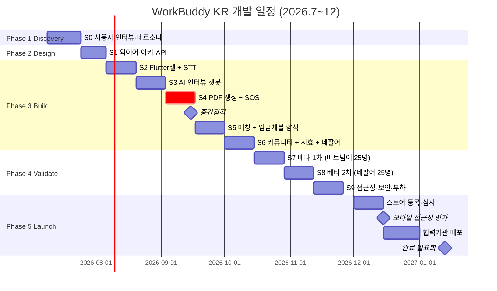

# WorkBuddy KR — 개발계획서

> 기술스택·일정·진척·자원 사용을 표 중심으로 관리하는 운영 문서.
> 코드/빌드/배포 변경마다 §5 현재 상황 표를 갱신한다.

| 항목 | 내용 |
|---|---|
| 사업명 | WorkBuddy KR — 외국인근로자 권리행사 동반앱 |
| 콘테스트 | 2026 현대오토에버 배리어프리 앱 개발 콘테스트 |
| 작성일 | 2026-04-21 |
| **last_updated** | **2026-04-21 15:55** |
| 관련 문서 | [제안서.md](./제안서.md) · [개발보고서.md](./개발보고서.md) |

---

## 목차

1. [기술 스택](#1-기술-스택)
2. [개발 일정 (Gantt)](#2-개발-일정-gantt)
3. [마일스톤](#3-마일스톤)
4. [스프린트 진척](#4-스프린트-진척)
5. [현재 상황 (Status)](#5-현재-상황-status)
6. [위험·이슈](#6-위험이슈)
7. [자원 사용 (비용)](#7-자원-사용-비용)
8. [API 명세](#8-api-명세)
9. [DB 스키마](#9-db-스키마)
10. [빌드·배포 절차](#10-빌드배포-절차)
11. [품질 게이트](#11-품질-게이트)

---

## 1. 기술 스택

### 1.1 계층별 스택

| 계층 | 기술 | 버전 | 선정 근거 |
|---|---|---|---|
| Mobile (정식) | Flutter | 3.x | iOS/Android 동시, i18n |
| **PoC 데모 UI** | **Streamlit** | **1.30+** | **MVP α 빠른 시연·캡처 가능** |
| API Gateway | Spring Boot | 3.2 | 멘토 친화 |
| AI Service | Python · FastAPI | 3.11+ / 0.110 | AI 라이브러리 풍부 |
| LLM | Claude Sonnet 4.6 | claude-sonnet-4-6 | 한국어 환각률 낮음 |
| STT | OpenAI Whisper | whisper-1 (API) / large-v3 (local) | 16개국어 |
| 실시간 통역 | GPT-4o Realtime | gpt-4o-realtime-preview | 음성-음성 |
| RDB | PostgreSQL | 16 | JSONB·pgvector |
| Cache | Redis | 7 | 세션·rate limit |
| Storage | AWS S3 + Object Lock | — | 위변조 방지 |
| Push | Firebase FCM | 2024 | 무료 |
| Map | Kakao Map SDK | 2.x | 다국어 |
| 컨테이너 | Docker | 24 | 표준 |
| 오케스트레이션 | AWS ECS Fargate | — | 학생 친화 |
| CI/CD | GitHub Actions | — | 무료 |
| 모니터링 | Sentry + CloudWatch | — | 통합 |

### 1.2 PoC 단계 의존성 (현재 단계)

| 패키지 | 버전 | 용도 |
|---|---|---|
| streamlit | ≥1.30 | 웹 데모 UI |
| openai | ≥1.30 | Whisper STT |
| anthropic | ≥0.40 | Claude LLM |
| reportlab | ≥4.0 | PDF 생성 |
| python-dotenv | ≥1.0 | 환경변수 |
| pydantic | ≥2.5 | 데이터 검증 |

### 1.3 정식 단계 추가 의존성 (콘테스트 본 개발)

| 패키지 | 버전 | 용도 |
|---|---|---|
| fastapi | ≥0.110 | 백엔드 API |
| uvicorn | ≥0.27 | ASGI 서버 |
| sqlalchemy | ≥2.0 | ORM |
| psycopg2-binary | ≥2.9 | PostgreSQL 드라이버 |
| pgvector | ≥0.2 | 벡터 검색 |
| pytest | ≥7.4 | 테스트 |
| ruff | ≥0.3 | 린터·포매터 |

---

## 2. 개발 일정 (Gantt)

### 2.1 5개월 전체 일정

### 2.2 단계별 시작·종료·상태

| Phase | 기간 | 시작일 | 종료일 | 상태 |
|---|---|---|---|---|
| **PoC (사전)** | 사전 | 2026-04-21 | (진행 중) | 🚧 IN PROGRESS |
| Phase 1 Discovery | 16일 | 2026-07-09 | 2026-07-24 | ⏸ PENDING |
| Phase 2 Design | 12일 | 2026-07-25 | 2026-08-05 | ⏸ PENDING |
| Phase 3 Build | 70일 | 2026-08-06 | 2026-10-14 | ⏸ PENDING |
| Phase 4 Validate | 47일 | 2026-10-15 | 2026-11-30 | ⏸ PENDING |
| Phase 5 Launch | 31일 | 2026-12-01 | 2026-12-31 | ⏸ PENDING |

---

## 3. 마일스톤

| # | 마일스톤 | 목표일 | 산출물 | 달성 |
|---|---|---|---|---|
| M0 | 콘테스트 신청서 제출 | 2026-05-17 | 신청서 + 제안서 + PoC 데모 | ⏸ |
| M1 | 선정심사 통과 (14팀) | 2026-06-09 | — | ⏸ |
| M2 | 면접심사 통과 (7팀) | 2026-06-25 | 발표 자료 | ⏸ |
| M3 | 교육캠프 완료 | 2026-07-10 | 공통교육 이수 | ⏸ |
| M4 | MVP α (E2E PoC) | 2026-09-02 | 베트남어 음성 → PDF 생성 | ⏸ |
| M5 | **중간점검 통과** | 2026-09-15 | MVP β (5기능 통합) | ⏸ |
| M6 | 베타 테스트 50명 완료 | 2026-11-11 | UX 리포트, 양식 정확도 95% | ⏸ |
| M7 | 모바일 접근성 평가 통과 | 2026-12-15 | WCAG 2.1 AA | ⏸ |
| M8 | 양 스토어 출시 | 2026-12-31 | App Store / Play Store | ⏸ |
| M9 | **완료 발표회** | 2027-01-13 | 시상 (대상 목표) | ⏸ |

---

## 4. 스프린트 진척

| 스프린트 | 기간 | 핵심 산출물 | 상태 |
|---|---|---|---|
| **PoC-α** | 2026-04-21 | Streamlit 기반 STT→LLM→PDF 데모 | ✅ COMPLETED |
| **PoC-β** | 2026-04-21 | 5대 기능 통합 (SOS·매칭·커뮤니티·시효·통역) | ✅ COMPLETED |
| S0 Discovery | 7/9~7/24 | 페르소나 5종, SRS | ⏸ PENDING |
| S1 Design | 7/25~8/5 | 와이어, ADR, OpenAPI, ERD | ⏸ PENDING |
| S2 Build #1 | 8/6~8/19 | Flutter 셸 + 베트남어 STT | ⏸ PENDING |
| S3 Build #2 | 8/20~9/2 | Claude 6하원칙 챗봇 | ⏸ PENDING |
| S4 Build #3 | 9/3~9/16 | 산재 PDF 생성 + SOS · **중간점검** | ⏸ PENDING |
| S5 Build #4 | 9/17~9/30 | 매칭 + 임금체불 진정서 | ⏸ PENDING |
| S6 Build #5 | 10/1~10/14 | 커뮤니티 + 시효 + 네팔어 | ⏸ PENDING |
| S7 Validate #1 | 10/15~10/28 | 베트남어 베타 25명 | ⏸ PENDING |
| S8 Validate #2 | 10/29~11/11 | 네팔어 베타 25명 + 4개 언어 추가 | ⏸ PENDING |
| S9 Validate #3 | 11/12~11/25 | 접근성·보안·부하 | ⏸ PENDING |
| S10 Launch | 12/1~12/31 | 스토어·배포 | ⏸ PENDING |

> 상태 범례: ✅ 완료 / 🚧 진행 중 / ⏸ 대기 / ⚠️ 지연 / ❌ 차단

---

## 5. 현재 상황 (Status)

> 본 섹션은 코드/빌드/배포 변경마다 갱신.

### 5.1 진척 요약

| 항목 | 상태 | 비고 |
|---|---|---|
| 디렉토리 구조 | ✅ 완료 | docs/ + src/ 분리 |
| CLAUDE.md (작업 지침서) | ✅ 완료 | 2026-04-21 |
| 제안서.md (v3) | ✅ 완료 | 각주 30+ 개, 1차 출처 |
| 근거자료_조사.md | ✅ 완료 | Agent 조사 결과 보존 |
| 개발계획서.md (본 문서) | ✅ 완료 | 2026-04-21 |
| AI 파이프라인 PoC 디렉토리 | ✅ 완료 | `src/ai-pipeline/` |
| Streamlit 데모 (app.py) | ✅ 완료 | 홈 화면 (4단계 파이프라인) |
| STT 모듈 (stt.py) | ✅ 완료 | 모킹 + 실제 호출 양립 |
| 양식 매핑 (form_mapper.py) | ✅ 완료 | Claude RAG + 모킹 fallback |
| PDF 렌더러 (pdf_renderer.py) | ✅ 완료 | ReportLab + Pretendard |
| 산재신청서 템플릿 (17필드) | ✅ 완료 | 작성 예시 2종 포함 |
| 임금체불 진정서 템플릿 (16필드) | ✅ 완료 | 농업 케이스 예시 |
| 한글 폰트 (Pretendard v1.3.9) | ✅ 완료 | Regular + Bold |
| **🚨 SOS 증거수집 페이지** | ✅ 완료 | SHA-256·GPS·비상 SMS 시뮬레이션 |
| **🗺️ 전문가 매칭 페이지** | ✅ 완료 | 모킹 DB 12명/곳 + Haversine + 지도 |
| **🤝 동료 사례 페이지** | ✅ 완료 | 익명 사례 5건 + 회사 블랙리스트 |
| **⏰ 권리 시효 페이지** | ✅ 완료 | 5종 시효 + 비자 만료 교차 분석 |
| **🌐 실시간 통역 페이지** | ✅ 완료 | 양방향 채팅 + 빠른 시연 |
| 캡처 8장 확보 | ✅ 완료 | docs/captures/ |
| 개발보고서.md (v2) | ✅ 완료 | PoC-β 5대 기능 통합 보고 |

### 5.2 환경 상태

| 항목 | 상태 | 버전 |
|---|---|---|
| OS | macOS Darwin 24.6.0 | — |
| Python | ✅ 설치 | 3.14.3 |
| Flutter | ✅ 설치 | 3.x |
| Node | ✅ 설치 | — |
| Docker | (미확인) | — |
| OPENAI_API_KEY | (미확인) | 환경변수 확인 필요 |
| ANTHROPIC_API_KEY | (미확인) | 환경변수 확인 필요 |

### 5.3 다음 액션 (우선순위 순)

1. ✅ ~~PoC AI 파이프라인 + 5대 기능 통합~~ — **2026-04-21 완료**
2. ⭐ 콘테스트 신청서 본문 작성 (PoC 캡처 첨부)
3. 협력기관 사전 컨택 (인권위·이주민센터·공익법센터)
4. 지도교수 섭외 (노동법·사회복지)
5. 선정 후: API 키 구매 → 실제 LLM 호출 정확도 측정
6. Sprint S0 (7월): 골든셋 100건 구축, 사용자 인터뷰
7. Sprint S2 (8월): Flutter 앱 셸 시작

---

## 6. 위험·이슈

| ID | 발생일 | 위험 / 이슈 | 영향 | 발생가능성 | 대응 | 상태 |
|---|---|---|---|---|---|---|
| R1 | 사전 식별 | AI 양식 정확도 95% 미달 | 高 | 中 | 골든셋 100건 사전 구축, 사용자 검수 단계 강화 | 모니터링 |
| R2 | 사전 식별 | LLM API 비용 폭주 | 中 | 中 | 토큰 캐싱, 짧은 프롬프트, Anthropic 비영리 할인 | 모니터링 |
| R3 | 사전 식별 | 근로복지공단 API 미공개 | 中 | 高 | PDF 다운로드 + 안내 / RPA 자동 제출 모듈로 전환 | 완화 계획 |
| R4 | 사전 식별 | PII 유출 | 致命 | 低 | DB 암호화·최소 수집·외부 보안점검 | 사전 통제 |
| R5 | 사전 식별 | 베타 사용자 모집 실패 | 高 | 低 | 인권위·이주민센터 사전 협약 | 완화 계획 |
| R6 | 사전 식별 | 모바일 접근성 평가 탈락 | 高 | 低 | WCAG AA 디자인 단계 체크 | 사전 통제 |
| R7 | 사전 식별 | 팀원 학사 일정 충돌 | 中 | 中 | 시험기간 일정 사전 반영, 백업 인력 | 모니터링 |
| R8 | 사전 식별 | 다국어 번역 품질 저하 | 中 | 中 | 외부 검수 (모국어 원어민) | 모니터링 |
| ISSUE-1 | 2026-04-21 | API 키 환경변수 미확인 | 中 | — | PoC 모킹 모드 우선 구현 | 진행 중 |

---

## 7. 자원 사용 (비용)

### 7.1 콘테스트 제작지원금 집행 계획 (총 500만원)

| 항목 | 1차 (선정) 125만 | 2차 (중간) 125만 | 3차 (완료) 250만 | 합계 |
|---|---|---|---|---|
| 외주 디자인 (Figma·아이콘) | 30 | — | — | 30 |
| AI API (OpenAI · Anthropic) | 25 | 35 | 40 | 100 |
| 클라우드 (AWS) | 15 | 20 | 25 | 60 |
| 베타 테스터 사례비 (n=50) | — | 10 | 40 | 50 |
| 통역·번역 검수 (16개국어) | — | 30 | 60 | 90 |
| 스토어 등록비 | 15 | — | — | 15 |
| 사용자 가이드 영상 (6개국어) | — | — | 50 | 50 |
| 보도자료·홍보 | — | — | 20 | 20 |
| 도메인·SSL·기타 | 10 | 5 | 5 | 20 |
| 회식·교통비 | 30 | 25 | 10 | 65 |
| **합계** | **125** | **125** | **250** | **500** |

### 7.2 운영 비용 (월간, 사용자 1만명 기준)

| 항목 | 월 비용 (KRW) |
|---|---|
| AWS (ECS · RDS · S3 · CloudWatch) | 350,000 |
| OpenAI Whisper (월 5,000건 × 3분) | 220,000 |
| Anthropic Claude (월 5,000건 서류 생성) | 380,000 |
| OpenAI Realtime (월 200건 × 5분) | 180,000 |
| Firebase / Kakao Map / SMS | 80,000 |
| **합계** | **약 1,210,000** |

### 7.3 PoC 단계 예상 비용 (2026-04~05)

| 항목 | 예상 비용 (KRW) |
|---|---|
| Whisper API 테스트 (베트남어 샘플 30건 × 3분) | 1,000 |
| Claude API 테스트 (양식 생성 30건) | 4,000 |
| **합계 (최소)** | **약 5,000** |

---

## 8. API 명세

### 8.1 PoC 단계 — Streamlit 단일 앱 내 함수

| 함수 | 입력 | 출력 |
|---|---|---|
| `transcribe(audio_bytes, lang)` | 음성 + 언어 코드 | 모국어 텍스트 |
| `next_question(history, lang)` | 대화 히스토리 + 언어 | 다음 질문 또는 완료 신호 |
| `generate_form(interview_data, form_type)` | 인터뷰 결과 + 양식 종류 | 한국어 양식 JSON |
| `render_pdf(form_data, evidence_meta)` | 양식 데이터 + 증거 메타 | PDF bytes |

### 8.2 정식 단계 — REST API

| Method | Path | 설명 |
|---|---|---|
| POST | `/v1/auth/sms` | SMS 인증번호 요청 |
| POST | `/v1/auth/verify` | 인증번호 검증 → JWT |
| POST | `/v1/sos/trigger` | SOS 트리거 |
| POST | `/v1/sos/evidence` | 증거 미디어 업로드 |
| POST | `/v1/interview/audio` | 음성 진술 → 다음 질문 |
| GET | `/v1/interview/{id}/state` | 인터뷰 진행 상황 |
| POST | `/v1/forms/generate` | 서류 생성 |
| POST | `/v1/forms/submit` | 전자 제출 |
| GET | `/v1/experts/search` | 전문가 검색 |
| POST | `/v1/calls/translate` | 실시간 통역 세션 |
| GET | `/v1/community/cases` | 사례 검색 |
| POST | `/v1/community/cases` | 사례 작성 |
| GET | `/v1/awareness/upcoming` | 다가오는 시효 |

---

## 9. DB 스키마

> 정식 단계 PostgreSQL 스키마. PoC 단계는 메모리 또는 JSON 파일로 대체.

| 테이블 | 컬럼 (요약) | 인덱스 |
|---|---|---|
| `users` | id, phone, nationality, preferred_lang, visa_type, visa_expiry, workplace_addr, industry, emergency_contacts (JSONB) | phone UNIQUE |
| `incidents` | id, user_id, type, occurred_at, location_addr, location_gps (POINT), interview_data (JSONB), form_data (JSONB), form_pdf_url, status, statute_deadline | user_id, status |
| `evidences` | id, incident_id, type, s3_key, sha256 (UNIQUE), captured_at, gps, file_size | incident_id |
| `experts` | id, type, name, org_name, address, location_gps, languages (CHAR(2)[]), specialty, consult_fee_won, rating, verified | GIN(languages), GIST(location_gps) |
| `community_cases` | id, nationality, industry, incident_type, title_original, title_ko, body_original, body_ko, outcome, embedding (vector(1536)) | ivfflat(embedding) |
| `statute_alerts` | id, incident_id, alert_at, days_left, sent | incident_id, alert_at |

---

## 10. 빌드·배포 절차

### 10.1 PoC 로컬 실행

| 단계 | 명령 |
|---|---|
| 1. 의존성 설치 | `cd src && pip install -e .` (또는 `pip install -r requirements.txt`) |
| 2. 환경변수 설정 | `cp .env.example .env && edit .env` |
| 3. Streamlit 실행 | `streamlit run ai-pipeline/app.py` |
| 4. 브라우저 접속 | http://localhost:8501 |

### 10.2 정식 단계 CI/CD

| 단계 | 도구 | 트리거 |
|---|---|---|
| Build | GitHub Actions | push to main |
| Test | pytest, flutter test | 매 PR |
| Lint | ruff, dart analyze | 매 PR |
| Build Image | Docker buildx | 매 머지 |
| Deploy Staging | AWS ECS | 자동 |
| Deploy Prod | AWS ECS | 수동 승인 |

### 10.3 환경 분리

| 환경 | 인프라 | 용도 |
|---|---|---|
| Local (PoC) | Streamlit + .env | 데모·캡처 |
| Dev | Docker Compose | 통합 테스트 |
| Staging | AWS ECS Fargate (단일 AZ) | 베타 |
| Prod | AWS ECS Fargate (Multi-AZ) + RDS Aurora | 출시 |

---

## 11. 품질 게이트

각 단계 종료 시 다음 게이트 통과 필수:

| Gate | 통과 기준 | 검증 방법 |
|---|---|---|
| **G-PoC** | E2E 데모 작동 (베트남어 음성 → PDF) | 실제 구동 + 화면 캡처 |
| G0 (Discovery) | 페르소나 5종, 요구사항 70+개 | 지도교수·멘토 합동 리뷰 |
| G1 (Design) | 와이어·ADR·API·ERD 4종 | 멘토 리뷰 |
| G2 (MVP α) | E2E PoC 정확도 80%+ | 자동 테스트 |
| G3 (중간점검) | MVP β + 5기능 통합 | 콘테스트 평가단 |
| G4 (Beta) | 정확도 95%, SUS 70+ | 골든셋 + 사용자 평가 |
| G5 (Launch) | WCAG AA, OWASP, 부하 100명 | 외부 점검 도구 |

---

*WorkBuddy KR · 개발계획서.md · v1.0 · 2026.04.21*
*last_updated: 2026-04-21 15:00*
