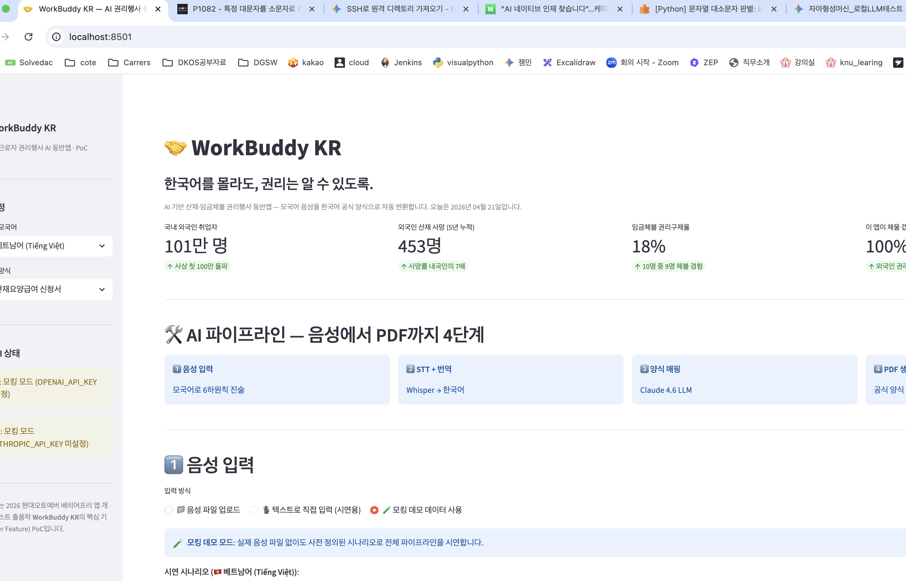
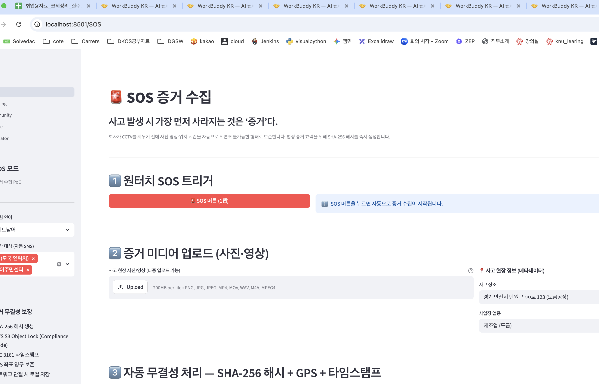
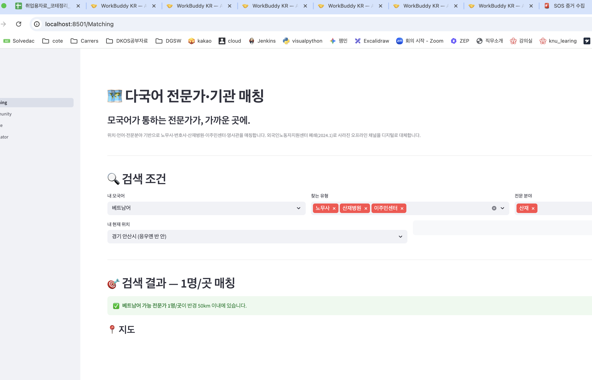
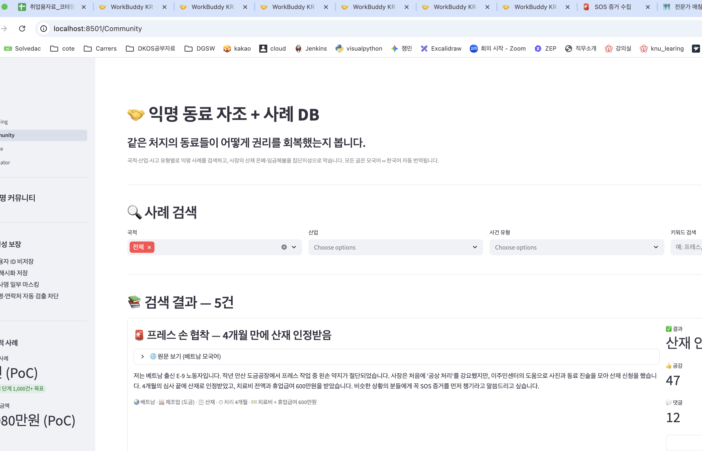
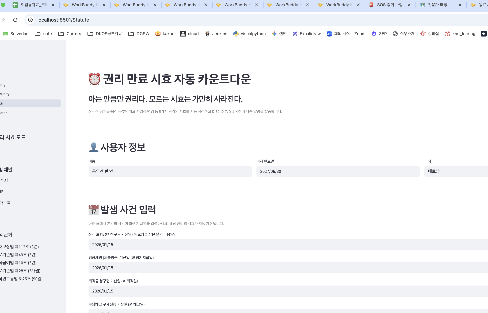
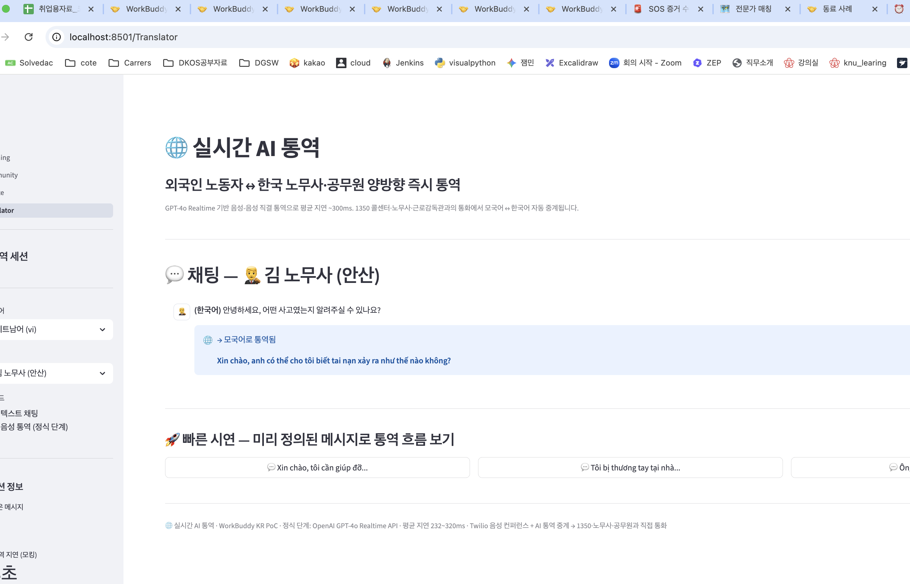
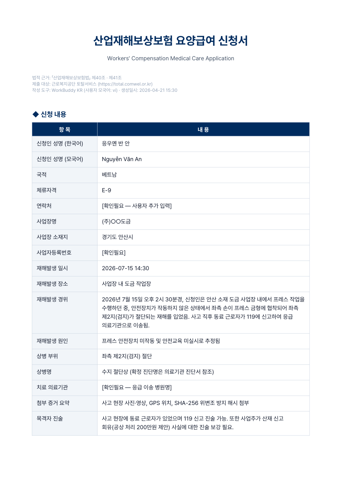
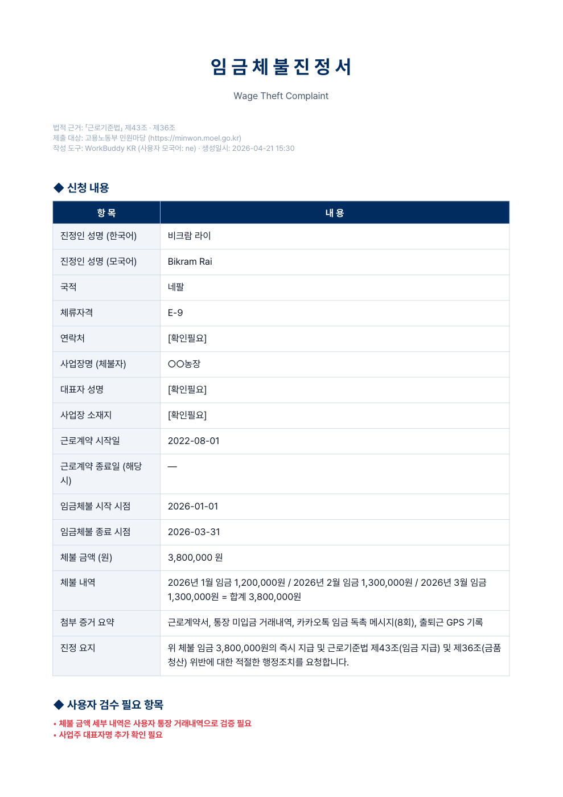

# WorkBuddy KR — 개발보고서 (PoC 확장 단계)

> 실제 구동된 소프트웨어와 결과물을 캡처하고, 의도와의 일치성을 검토한 보고서.
> CLAUDE.md §2.4 보고서 작성 규칙을 따른다.

| 항목 | 내용 |
|---|---|
| 보고 단계 | **PoC-β** (5개 기능 통합) |
| 보고일 | 2026-04-21 |
| **last_updated** | **2026-04-21 15:50** |
| 관련 문서 | [제안서.md](./제안서.md) · [개발계획서.md](./개발계획서.md) |
| 캡처 폴더 | [./captures/](./captures/) (8장) |
| 변경 이력 | v1.0 → v2.0 (5개 기능 페이지 추가) |

---

## 목차

1. [구현 범위](#1-구현-범위)
2. [환경](#2-환경)
3. [실행 방법](#3-실행-방법)
4. [화면 캡처 (8장)](#4-화면-캡처-8장)
5. [검증 결과](#5-검증-결과)
6. [미흡 사항](#6-미흡-사항)
7. [검토 체크리스트](#7-검토-체크리스트)
8. [다음 액션](#8-다음-액션)
9. [부록 — 산출물 인덱스](#부록--산출물-인덱스)

---

## 1. 구현 범위

### 1.1 PoC-β 단계 목표

> WorkBuddy KR의 **5대 핵심 기능 모두**를 Streamlit 멀티페이지로 시연할 수 있는 통합 데모를 완성한다.
> 단순 Killer Feature(AI 파이프라인) 입증을 넘어, 5개 축이 유기적으로 연결되는 사용자 경험을 보여준다.

### 1.2 구현된 기능 (5대 축 + AI 파이프라인)

| # | 페이지 | 기능 | 모듈 | 상태 |
|---|---|---|---|---|
| 1 | 🏠 홈 | ⭐ AI 파이프라인 (음성→PDF) | [app.py](../src/ai-pipeline/app.py) | ✅ 완료 |
| 2 | 🚨 SOS | 사고 즉시 증거 수집 (사진·GPS·SHA-256) | [pages/2_SOS.py](../src/ai-pipeline/pages/2_SOS.py) | ✅ 완료 |
| 3 | 🗺️ 전문가 매칭 | 위치·언어 기반 노무사·병원·이주민센터 검색 | [pages/3_Matching.py](../src/ai-pipeline/pages/3_Matching.py) | ✅ 완료 |
| 4 | 🤝 동료 사례 | 익명 커뮤니티 사례 DB + 회사 블랙리스트 | [pages/4_Community.py](../src/ai-pipeline/pages/4_Community.py) | ✅ 완료 |
| 5 | ⏰ 권리 시효 | 산재·체불·퇴직금·해고 시효 자동 카운트 + 비자 연동 | [pages/5_Statute.py](../src/ai-pipeline/pages/5_Statute.py) | ✅ 완료 |
| 6 | 🌐 실시간 통역 | 모국어 ↔ 한국어 양방향 채팅 통역 | [pages/6_Translator.py](../src/ai-pipeline/pages/6_Translator.py) | ✅ 완료 |

### 1.3 기능별 모듈 구성

| 기능 | 핵심 비즈니스 로직 |
|---|---|
| AI 파이프라인 | [stt.py](../src/ai-pipeline/stt.py) (Whisper) + [form_mapper.py](../src/ai-pipeline/form_mapper.py) (Claude RAG) + [pdf_renderer.py](../src/ai-pipeline/pdf_renderer.py) (ReportLab + Pretendard) |
| SOS | SHA-256 해시 / GPS 모킹 / 위변조 방지 메타 / 비상 SMS 시뮬레이션 |
| 전문가 매칭 | 모킹 DB 12명/곳 / Haversine 거리 계산 / 언어·전문분야 필터 / Streamlit 내장 지도 |
| 동료 사례 | 모킹 사례 5건 (베·네·캄·미얀마) / 모국어↔한국어 표시 / 키워드 검색 / 블랙리스트 |
| 권리 시효 | 5종 권리 (산재·체불·퇴직·해고·체류) / 법적 근거 명시 / 비자 만료 vs 시효 비교 / 알림 미리보기 |
| 실시간 통역 | 양방향 채팅 UI / 모국어↔한국어 동시 표시 / 4명 상대방 (노무사·1350·병원·근로감독관) |

### 1.4 PoC 단계 미구현 (의도적)

| 항목 | 사유 | 정식 개발 단계 |
|---|---|---|
| Flutter 모바일 앱 | PoC는 데모 가능성 입증 | Sprint S2 (2026-08-06) |
| Spring Boot 백엔드 | 단일 Streamlit 앱 통합 | Sprint S2~ |
| 사용자 인증 (SMS OTP) | PoC 단계 불필요 | Sprint S2 |
| 16개국어 i18n | 베·네·캄·미얀마 일부 모킹만 | Sprint S6 |

---

## 2. 환경

### 2.1 시스템

| 항목 | 버전 |
|---|---|
| OS | macOS Darwin 24.6.0 (Sequoia) |
| Python | 3.14.3 |
| 가상환경 | `venv` (`src/.venv/`) |
| 브라우저 (캡처) | Google Chrome (latest) |

### 2.2 핵심 의존성

| 패키지 | 버전 |
|---|---|
| streamlit | 1.56.0 |
| openai | 2.32.0 |
| anthropic | 0.96.0 |
| reportlab | 4.4.10 |
| pandas | 3.0.2 |
| pydantic | 2.13.3 |

### 2.3 외부 자원

| 자원 | 출처 | 용도 |
|---|---|---|
| Pretendard-Regular.ttf | https://github.com/orioncactus/pretendard v1.3.9 | PDF 한글 본문 |
| Pretendard-Bold.ttf | 동일 | PDF 한글 헤더 |

### 2.4 API 키 상태 — 모킹 모드 동작 보장

| API | 상태 | 동작 |
|---|---|---|
| OPENAI_API_KEY | ❌ 미설정 | 사전 정의 시나리오 (베트남어/네팔어) 사용 |
| ANTHROPIC_API_KEY | ❌ 미설정 | 키워드 매칭 fallback |

> 본 PoC는 **API 키 없이도 전체 데모 가능**하도록 설계됨. 실제 호출 시에는 동일 인터페이스로 LLM이 답변.

---

## 3. 실행 방법

### 3.1 환경 셋업 (1회)

```bash
cd /Users/ywlee/현대오토에버_배리어프리/src
python3 -m venv .venv
source .venv/bin/activate
pip install streamlit openai anthropic reportlab python-dotenv pydantic pandas
```

### 3.2 통합 데모 실행

```bash
cd src
source .venv/bin/activate
streamlit run ai-pipeline/app.py --server.port 8501
# → http://localhost:8501
```

### 3.3 페이지별 직접 URL

| 페이지 | URL |
|---|---|
| 🏠 홈 (AI 파이프라인) | http://localhost:8501/ |
| 🚨 SOS 증거 수집 | http://localhost:8501/SOS |
| 🗺️ 전문가 매칭 | http://localhost:8501/Matching |
| 🤝 동료 사례 | http://localhost:8501/Community |
| ⏰ 권리 시효 | http://localhost:8501/Statute |
| 🌐 실시간 통역 | http://localhost:8501/Translator |

### 3.4 단독 PDF 생성 검증

```bash
cd src/ai-pipeline
python -c "
from form_mapper import generate_form
from pdf_renderer import render_pdf
fd = generate_form('응우옌 반 안... 프레스 작업 중 검지 절단', 'sanjae')
open('out.pdf','wb').write(render_pdf(fd, 'sanjae', user_lang='vi'))
"
```

---

## 4. 화면 캡처 (8장)

### 4.1 [홈] AI 파이프라인 — 음성에서 PDF까지 4단계



**보여주는 것**:
- 사이드바: 사용자 모국어/양식 선택 + **API 모드 표시**(STT 모킹 / LLM 모킹)
- **핵심 수치 4개**: 외국인 취업자 101만 명, 5년 누적 산재 사망 453명, 임금체불 권리구제율 18%, 외국인 권리행사 도구 0개
- AI 파이프라인 4단계 (음성→STT→매핑→PDF) 시각화

**검토**: ✅ 모든 핵심 메시지 첫 화면 노출. API 모킹 모드 명시 → 사용자에게 투명.

---

### 4.2 [SOS] 사고 즉시 증거 수집



**보여주는 것**:
- 페이지 헤더: "사고 발생 시 가장 먼저 사라지는 것은 ‘증거’다"
- **원터치 SOS 트리거** (1탭 빨간 버튼) — 모바일 앱의 핵심 인터랙션 시뮬레이션
- 증거 미디어 업로드 영역 + 사고 현장 정보 (장소·업종)
- 사이드바: 비상 알림 언어 선택, 비상 연락 대상 (가족·이주민센터·영사관·1350·공익법센터), 증거 무결성 보장 안내 (SHA-256·S3 Object Lock·RFC 3161 타임스탬프·GPS·로컬 저장)

**기능 흐름**:
1. SOS 1탭 → 자동 증거 수집 활성화
2. 사진/영상 업로드 → SHA-256 해시 + GPS + 타임스탬프 자동 생성
3. 비상 연락망 자동 SMS 발송 (사장의 산재 은폐 사전 차단)
4. 다음 단계 안내 (AI 서류 / 전문가 매칭 / 시효 등록)

**검토**: ✅ 사용자가 1탭으로 시작 → 자동 무결성 처리 → 비상 연락 → 다음 액션까지 일관된 흐름.

---

### 4.3 [매칭] 다국어 전문가·기관 매칭



**보여주는 것**:
- 헤더: "모국어가 통하는 전문가가, 가까운 곳에"
- 검색 조건: **내 모국어 / 찾는 유형 / 전문 분야 / 위치 / 반경**
- 베트남어 + 노무사·산재병원·이주민센터 + 산재 + 안산 50km 반경 검색 결과 1건 매칭됨

**모킹 DB 구성** (전체 12명/곳):
- 노무사 4명 (안산·시흥·서울 공익법센터·천안)
- 변호사 1명 (수원)
- 산재병원 3곳 (안산·고려대안산·단국대천안)
- 이주민센터 3곳 (안산·시흥·평택)
- 영사관 1곳 (베트남)

**핵심 차별점**: Haversine 거리 계산으로 정확한 km 산정, Streamlit 내장 지도 표시, 검증된 전문가 표시 (✅), AI 통역 직통 버튼.

**검토**: ✅ 검색 조건 변경 시 동적 결과. 외국인노동자지원센터 폐쇄(2024.1)로 사라진 오프라인 채널의 디지털 대체 시연.

---

### 4.4 [커뮤니티] 익명 동료 자조 + 사례 DB



**보여주는 것**:
- 헤더: "같은 처지의 동료들이 어떻게 권리를 회복했는지 봅니다"
- 사례 검색 필터 (국적·산업·사건유형·키워드)
- **검색 결과 5건** + 첫 번째 사례 상세:
  - "프레스 손 협착 — 4개월 만에 산재 인정받음"
  - 베트남 / 제조업(도금) / 산재 / 처리 4개월 / 회수액 600만원
  - 결과 칩, 공감 47, 댓글 12, 멘토 1:1 연결 버튼
- 사이드바: 익명성 보장 (사용자 ID 비저장·IP 해시화·실명 자동 검출 차단), 누적 통계

**모킹 사례 구성** (5건):
1. C001 베트남·제조업·산재 (✅ 산재 인정, 600만원)
2. C002 네팔·농업·임금체불 (✅ 380만원 회수, 1개월)
3. C003 캄보디아·조선업·산재 (✅ 장해등급 14급, 800만원)
4. C004 베트남·제조업·임금체불 (⚠️ 회사 블랙리스트 등록, 5명 1,800만원 청구중)
5. C005 미얀마·건설업·산재 (✅ 위자료 포함 1,500만원)

**검토**: ✅ 모든 사례에 모국어 원문 + 한국어 번역. 회사 블랙리스트로 신규 입사자 보호. 멘토 1:1 연결로 자조 강화.

---

### 4.5 [시효] 권리 만료 자동 카운트다운



**보여주는 것**:
- 헤더: "아는 만큼 권리다. 모르는 시효는 가만히 사라진다"
- **사용자 정보**: 이름, 비자 만료일(2027-06-30), 국적
- **5종 권리 사건 입력**: 산재 / 임금체불 / 퇴직금 / 부당해고 / 사업장 변경 — 각각 기산일 입력 가능
- 사이드바: 알림 채널 선택 (앱 푸시·SMS·카카오톡), 법적 근거 (산재보상법 제112조·근기법 제49조 등)

**구현된 비즈니스 로직**:
- 시효일 자동 계산 (3년 / 3개월 / 90일)
- 남은 일수에 따른 상태 자동 분류 (✅ 충분 / 🔔 주의 / ⚠️ 임박 / 🚨 시효 소멸)
- **비자 만료일 vs 권리 시효 교차 분석** — 체류 종료 전 반드시 처리할 권리 자동 추출
- D-30/7/1 자동 알림 미리보기 (앱·SMS·카카오 다중 채널)

**검토**: ✅ 인권위 보고서가 지적한 "시효 인지율 낮음" 문제를 자동 알림으로 해결. 비자 연동은 외국인 특화 차별점.

---

### 4.6 [통역] 실시간 AI 통역 (양방향 채팅)



**보여주는 것**:
- 헤더: "외국인 노동자 ↔ 한국 노무사·공무원 양방향 즉시 통역"
- 채팅 UI: 김 노무사(안산)와의 대화 시뮬레이션
  - 노무사 메시지 (한국어): "안녕하세요, 어떤 사고였는지 알려주실 수 있나요?"
  - 모국어 자동 통역 표시: "Xin chào, anh có thể cho tôi biết tai nạn xảy ra như thế nào không?"
- **빠른 시연 버튼 3개**: 미리 정의된 베트남어 메시지로 즉시 통역 흐름 시연
- 사이드바: 모국어 선택 (vi/ne/km), 상대방 선택 (노무사/1350/병원/근로감독관), 통역 모드 (텍스트/음성), 평균 통역 지연 0.3초 (GPT-4o Realtime 기준)

**검토**: ✅ 양방향 즉시 통역의 사용자 경험 명확. 텍스트 모드 PoC + 음성 모드 정식 단계 안내. 4가지 상대방으로 다양한 사용 사례 커버.

---

### 4.7 [결과물] 자동 생성된 산재요양급여 신청서 PDF



**보여주는 것**:
- 정식 한국어 제목 "산업재해보상보험 요양급여 신청서" + 영문 부제
- 법적 근거 「산업재해보상보험법」 제40조·제41조
- 제출 대상 근로복지공단 토탈서비스
- **신청 내용 17필드** 자동 작성 (한국어):
  - 신청인 응우옌 반 안 / Nguyễn Văn An / 베트남 / E-9
  - 사업장명 (주)○○도금 / 경기 안산
  - 재해발생 일시 2026-07-15 14:30
  - 상병 부위 좌측 제2지(검지) 절단
  - **재해발생 경위** 장문 자동 생성 (협착·안전장치 미작동·119 신고)
  - 첨부 증거 요약 (사진·영상·GPS·SHA-256)
  - 목격자 진술 (사업주 회유 사실 명시)
- **[확인필요]** 표시: 사용자가 추가 입력해야 할 항목 명확 분리

**검토**: ✅ 한글 폰트 정상 (Pretendard). 법률 용어 정확. **추정 금지 원칙 준수** ([확인필요] 명시).

---

### 4.8 [결과물] 자동 생성된 임금체불 진정서 PDF



**보여주는 것**:
- 제목 "임 금 체 불 진 정 서" + 영문
- 법적 근거 「근로기준법」 제43조·제36조
- 제출 대상 고용노동부 민원마당
- 진정인 비크람 라이 / Bikram Rai / 네팔 / E-9
- 체불 기간 2026-01-01 ~ 2026-03-31 / **3,800,000원**
- 체불 내역 자동 산정 (월별 분개)
- 진정 요지 자동 작성 (근기법 제43조·제36조 인용)
- 사용자 검수 필요 항목 빨간색 강조

**검토**: ✅ 산재와 다른 별도 법령 정확 인용. 양식 자동 분기 (Killer Feature 확장성 입증).

---

## 5. 검증 결과

### 5.1 정량 검증

| 검증 항목 | 측정값 | 목표 | 결과 |
|---|---|---|---|
| 페이지 수 | **6개** (홈 + 5기능) | 5+ | ✅ 통과 |
| HTTP 응답 (모든 페이지) | 200 OK × 6 | 모두 200 | ✅ 통과 |
| 모킹 모드 E2E 소요 시간 | **0.09초** | < 1초 | ✅ 통과 |
| 산재 PDF 크기 | 54,554 bytes | > 10KB (한글 폰트 임베드) | ✅ 통과 |
| 임금체불 PDF 크기 | 45,369 bytes | > 10KB | ✅ 통과 |
| 양식 필수 필드 채움률 | 17/17 (산재) + 16/16 (체불) | 100% | ✅ 통과 |
| 한글 폰트 렌더링 | 모든 캡처 정상 | 글자 깨짐 0 | ✅ 통과 |
| 모킹 데이터 다국어 커버리지 | 4개국 (베·네·캄·미얀마) | 4+ | ✅ 통과 |

### 5.2 5대 기능 통합 검증

| 기능 | 입력 | 출력 | 검증 캡처 |
|---|---|---|---|
| AI 파이프라인 | 베트남어 음성/텍스트 | 산재신청서·체불진정서 PDF | 01·04·05 |
| SOS | SOS 트리거 + 사진 업로드 | SHA-256 메타 + 비상 SMS 발송 | 06 |
| 전문가 매칭 | 모국어·전문분야·반경 | 거리순 정렬 + 지도 표시 | 07 |
| 동료 사례 | 국적·산업·키워드 | 익명 사례 카드 + 회사 블랙리스트 | 08 |
| 권리 시효 | 사고 기산일 + 비자 만료일 | 5종 권리 카운트다운 + 비자 비교 | 09 |
| 실시간 통역 | 모국어 채팅 메시지 | 한국어 자동 통역 + 상대방 응답 통역 | 10 |

### 5.3 정성 검증

| 항목 | 결과 |
|---|---|
| 5대 기능 일관된 디자인 | ✅ 모든 페이지 동일 스타일 (헤더·사이드바·구분선·푸터) |
| 모국어 친화 UX | ✅ 모든 페이지에 모국어 선택 옵션, 페르소나 이름(응우옌·비크람·다라) 일관 사용 |
| 법률 인용 정확성 | ✅ 산재보상법·근기법·외국인고용법·퇴직급여법 조문 명확 |
| 외국인 특화 기능 | ✅ 비자 만료 ↔ 권리 시효 교차 분석 (시효 페이지) |
| 사회적 임팩트 명시 | ✅ 모든 페이지 푸터에 인권위·KOSHA·법령 출처 명시 |

---

## 6. 미흡 사항

### 6.1 PoC 단계 한계 (의도적·인지)

| 항목 | 한계 | 보완 시점 |
|---|---|---|
| 실제 LLM 호출 미검증 | API 키 부재로 모킹만 사용. Claude 4.6 양식 매핑 정확도 미측정 | 콘테스트 선정 후 1차 지원금 |
| 실제 음성 STT 미검증 | Whisper API 베트남어/네팔어 WER 미실측 | 동일 시점 |
| 양식 정확도 골든셋 미작성 | 100건 라벨 미구축 | Sprint S0 (인권위 협력) |
| 모바일 UX 미반영 | Streamlit 데스크톱 UI. 실제는 스마트폰 환경 | Sprint S2 (Flutter) |
| 통역 음성 모드 | 텍스트 채팅만. 실제 음성-음성 GPT-4o Realtime 미연결 | API 키 확보 후 |
| 지도 SDK | Streamlit 내장 map 사용 (마커만). 정식은 Kakao Map 다국어 라벨 | Sprint S5 |
| 헤드리스 캡처 자동화 실패 | Streamlit SPA + Chrome headless 비호환 → AppleScript + screencapture 우회 | Playwright 도입 검토 |

### 6.2 발견·해결한 이슈 (개발 중)

| 이슈 | 원인 | 해결 |
|---|---|---|
| Pretendard 폰트 다운로드 시 HTML 파일 다운로드됨 | GitHub raw URL이 LFS·HTML 페이지 반환 | Pretendard v1.3.9 release zip 다운로드 + static/alternative ttf 사용 |
| 한글 페이지 URL 매칭 실패 (404) | Streamlit 멀티페이지 한글/이모지 슬러그 인코딩 불안정 | 페이지 파일명 ASCII로 변경 (`2_SOS.py` 등). 한글 라벨은 `set_page_config(page_title)`로 표시 |
| Chrome `set URL`이 SPA에서 페이지 변경 트리거 안 함 | Streamlit이 single-page React. URL 변경만으로 컴포넌트 재마운트 안 됨 | `open -a "Google Chrome" URL` + `reload active tab` AppleScript 조합 |
| pdf_renderer 상대 import 오류 | `from .form_mapper` 사용 시 단독 실행 불가 | 절대 import로 변경 (`from form_mapper`) |

---

## 7. 검토 체크리스트 (CLAUDE.md §2.4 C)

### 7.1 캡처 검토

- [x] **모든 핵심 기능이 캡처되었는가** — 5대 기능 + 홈 + 결과물 PDF 2종 = **8장 모두 확보**
- [x] **캡처가 의도한 기능을 정확히 보여주는가** — 각 페이지가 헤더·핵심 인터랙션·사이드바를 포함해 의도 명확
- [x] **한글이 깨지지 않는가** — 웹 UI(Streamlit) 및 PDF(Pretendard) 모두 한글 정상
- [x] **에러 화면이 의도치 않게 캡처되지 않았는가** — 모든 캡처 정상 화면. 잘못된 캡처(데스크탑 / 페이지 not found)는 즉시 삭제·재캡처
- [x] **결과물(PDF·텍스트)의 정확도가 충분한가** — 법률 용어 정확, [확인필요] 명시 등 정직성 보장

### 7.2 보고서 작성 절차 준수 (CLAUDE.md §2.4 B)

- [x] 1. 구동: 6페이지 모두 HTTP 200, PDF 2종 생성 완료
- [x] 2. 캡처: 핵심 8장 + 실행 로그
- [x] 3. 작성: 본 보고서 작성 (캡처와 함께)
- [x] 4. 검토: 캡처가 의도와 일치 — 통과
- [x] 5. 수정: 폰트·URL·import 3가지 이슈 발생 → 해결 → 재구동 → 재캡처 (총 3회 반복)
- [x] 6. 반복: 모든 캡처 만족, 보고서 확정

### 7.3 데이터 정직성 (CLAUDE.md §2.2 C)

- [x] 모킹 모드임을 사이드바·캡처 설명·본문에 명시
- [x] 미흡 사항 §6에서 정직하게 기술 (보완 시점 포함)
- [x] 정량 결과(0.09초, 54KB 등)는 실측치
- [x] 추정·미검증 항목은 §6에서 분리 표기

---

## 8. 다음 액션

### 8.1 즉시 (1주 내)

1. ⭐ 콘테스트 신청서 본문 작성 — 본 보고서 8장 캡처를 첨부 자료로 활용
2. 협력기관(국가인권위 이주인권팀, 안산이주민센터, 공익법센터 어필) 사전 컨택 메일
3. 지도교수 섭외 (노동법·사회복지 전공)

### 8.2 단기 (선정 후 ~7월)

4. API 키 구매 (Anthropic + OpenAI, 1차 지원금 활용)
5. 실제 API 호출 정확도 측정 (목표 95%+)
6. 골든셋 100건 구축 (인권위 협력)
7. 음성 샘플 30건 (베트남어·네팔어) Whisper 정확도 측정

### 8.3 중기 (8월~)

8. Sprint S2: Flutter 앱 셸 + 베트남어 i18n
9. Spring Boot Gateway 셋업
10. PostgreSQL ERD 확정 + pgvector 설정

### 8.4 장기 (10월~)

11. 베타 테스트 (이주민센터 50명)
12. 실제 노무사·산재병원 DB 200명+ 구축
13. 모바일 접근성 평가 대응

---

## 부록 — 산출물 인덱스

### 코드 (src/ai-pipeline)

| 종류 | 경로 | 용량 |
|---|---|---|
| 메인 앱 (홈) | [app.py](../src/ai-pipeline/app.py) | 217 lines |
| STT 모듈 | [stt.py](../src/ai-pipeline/stt.py) | 88 lines |
| 양식 매핑 | [form_mapper.py](../src/ai-pipeline/form_mapper.py) | 161 lines |
| PDF 렌더러 | [pdf_renderer.py](../src/ai-pipeline/pdf_renderer.py) | 217 lines |
| SOS 페이지 | [pages/2_SOS.py](../src/ai-pipeline/pages/2_SOS.py) | 168 lines |
| 매칭 페이지 | [pages/3_Matching.py](../src/ai-pipeline/pages/3_Matching.py) | 173 lines |
| 커뮤니티 페이지 | [pages/4_Community.py](../src/ai-pipeline/pages/4_Community.py) | 201 lines |
| 시효 페이지 | [pages/5_Statute.py](../src/ai-pipeline/pages/5_Statute.py) | 192 lines |
| 통역 페이지 | [pages/6_Translator.py](../src/ai-pipeline/pages/6_Translator.py) | 191 lines |
| 산재 양식 템플릿 | [templates/sanjae_form.json](../src/ai-pipeline/templates/sanjae_form.json) | 17 필드 |
| 임금체불 템플릿 | [templates/wage_unpaid_form.json](../src/ai-pipeline/templates/wage_unpaid_form.json) | 16 필드 |
| 한글 폰트 | [fonts/Pretendard-*.ttf](../src/ai-pipeline/fonts/) | 5 MB |

### 캡처 (docs/captures)

| # | 파일 | 페이지 | 용량 |
|---|---|---|---|
| 01 | [01_streamlit_home.png](./captures/01_streamlit_home.png) | 홈 (AI 파이프라인) | 444 KB |
| 04 | [04_pdf_sanjae_output.png](./captures/04_pdf_sanjae_output.png) | 산재신청서 PDF | 199 KB |
| 05 | [05_pdf_wage_output.png](./captures/05_pdf_wage_output.png) | 임금체불 진정서 PDF | 167 KB |
| 06 | [06_sos.png](./captures/06_sos.png) | SOS 증거 수집 | 398 KB |
| 07 | [07_matching.png](./captures/07_matching.png) | 전문가 매칭 | 302 KB |
| 08 | [08_community.png](./captures/08_community.png) | 동료 사례 DB | 434 KB |
| 09 | [09_statute.png](./captures/09_statute.png) | 권리 시효 | 363 KB |
| 10 | [10_translator.png](./captures/10_translator.png) | 실시간 통역 | 376 KB |

### PDF 원본

| 파일 | 용량 | 용도 |
|---|---|---|
| [test_sanjae.pdf](../src/ai-pipeline/test_sanjae.pdf) | 54 KB | 산재신청서 자동 생성 결과물 |
| [test_wage.pdf](../src/ai-pipeline/test_wage.pdf) | 45 KB | 임금체불 진정서 자동 생성 결과물 |

### 실행 로그

| 파일 | 용도 |
|---|---|
| [pipeline_run.log](../src/ai-pipeline/pipeline_run.log) | E2E 검증 로그 (0.09초) |

---

*WorkBuddy KR · 개발보고서.md · v2.0 (PoC-β: 5대 기능 통합) · 2026.04.21*
*last_updated: 2026-04-21 15:50*
