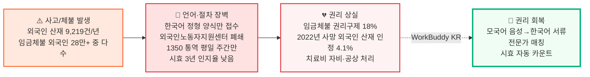
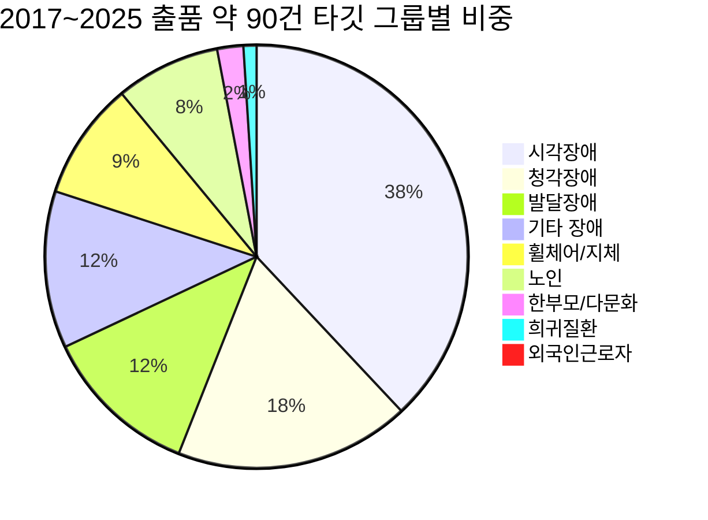
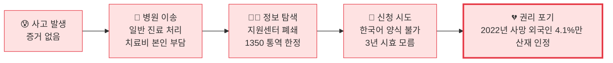
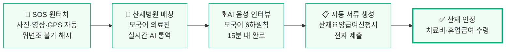
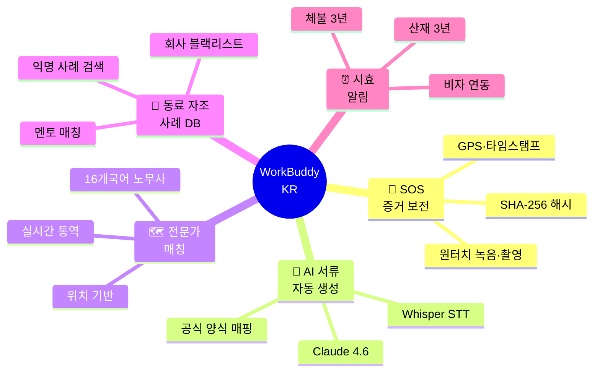
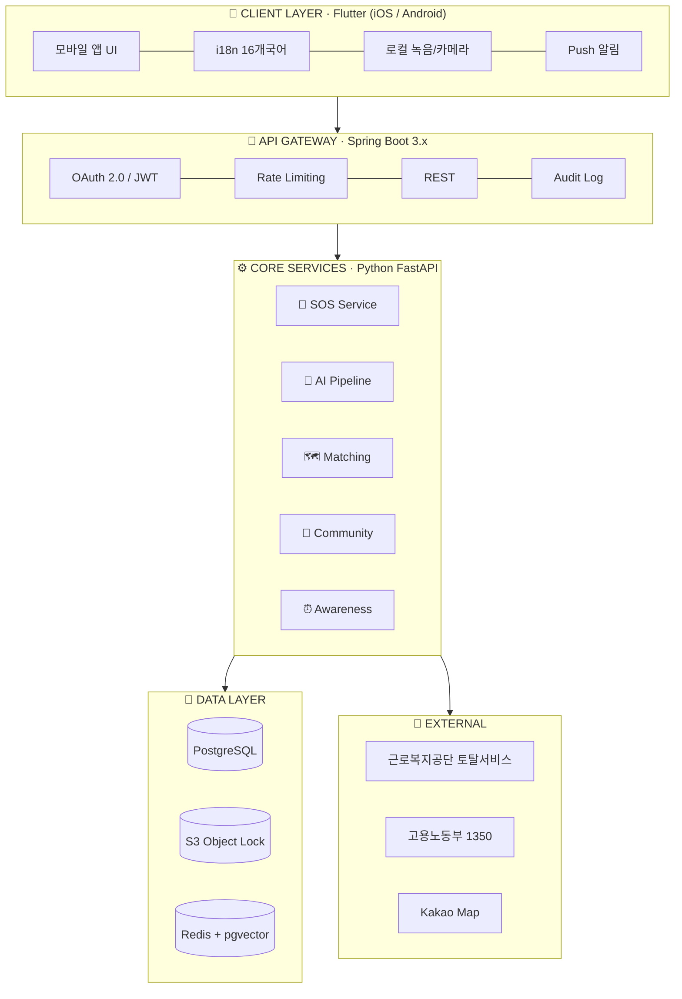
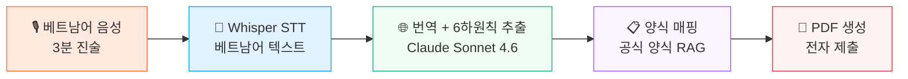
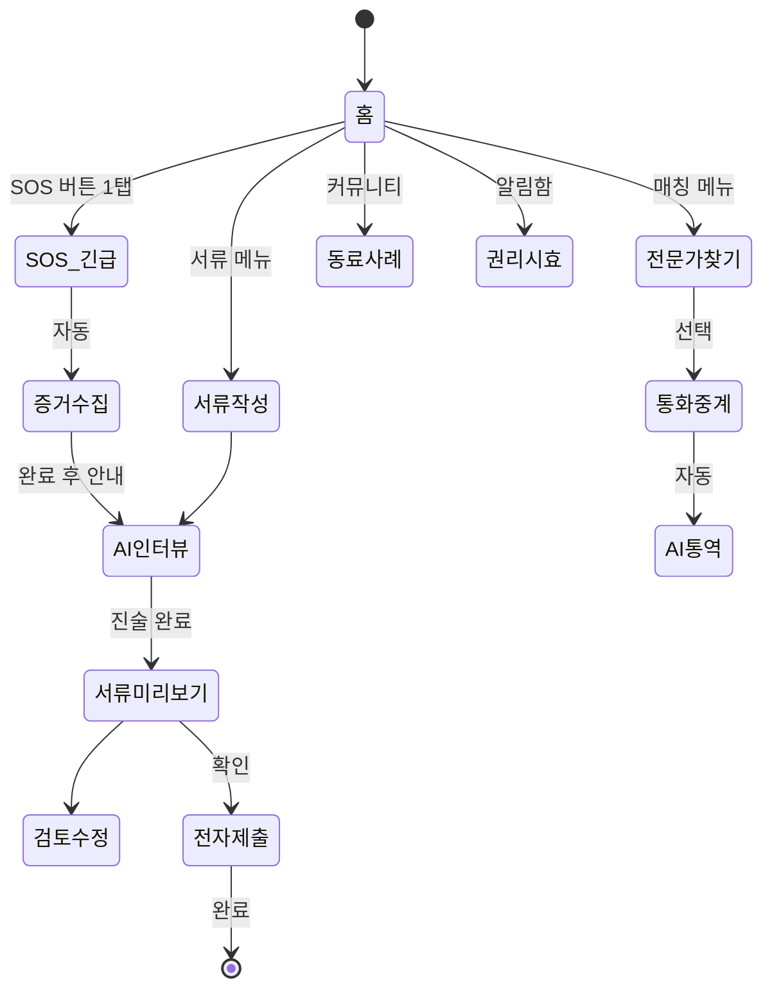
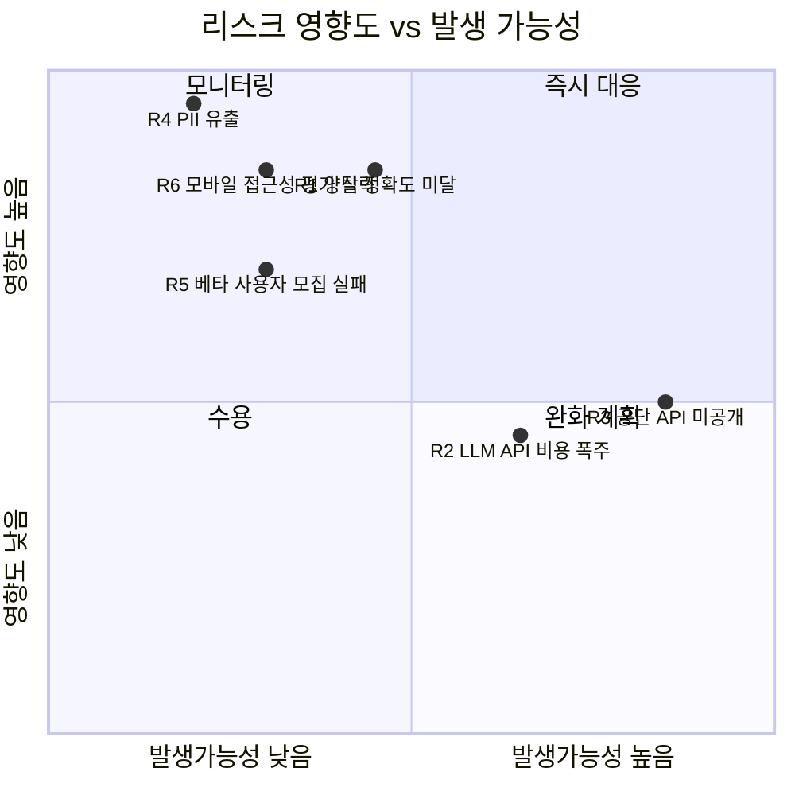

# WorkBuddy KR
## 한국어를 몰라도, 권리는 알 수 있도록.

> 101만 외국인 취업자를 위한 AI 기반 산재·임금체불 권리행사 동반앱

| 항목 | 내용 |
|---|---|
| 콘테스트 | 2026 현대오토에버 배리어프리 앱 개발 콘테스트 |
| 카테고리 | 권익신장 · 안전/위급 |
| 타깃 | 국내 체류외국인 265만 명 중 취업자 약 101만 명 [^1][^2] |
| 핵심 차별점 | 9년 콘테스트史 외국인 권리행사 도구 0건 + 2024년 외국인노동자지원센터 44곳 전면 폐쇄로 인한 디지털 대체 인프라 공백 [^3] |
| 목표 | 과학기술정보통신부 장관상 (대상) |
| 작성일 | 2026.04.21 |

> 📌 본 제안서의 모든 통계는 1차 출처(정부 통계·KCI 등재 학술논문·국제기구 자료)에서 인용했으며, 각주 번호로 §16 근거자료에서 검증 가능합니다.
> 📌 검증되지 않은 추정값은 `[추정]`으로 명시했습니다.

---

## 목차

1. [사업 배경 · 문제 정의](#1-사업-배경--문제-정의)
2. [시장 분석 · 경쟁 환경](#2-시장-분석--경쟁-환경)
3. [해외 모범사례 비교](#3-해외-모범사례-비교)
4. [타깃 페르소나](#4-타깃-페르소나)
5. [사용자 여정 (Before / After)](#5-사용자-여정-before--after)
6. [솔루션 개요](#6-솔루션-개요)
7. [핵심 기능 5종](#7-핵심-기능-5종)
8. [시스템 아키텍처](#8-시스템-아키텍처)
9. [UI / UX 화면 흐름](#9-ui--ux-화면-흐름)
10. [기술 스택](#10-기술-스택)
11. [기대 효과 · 사회적 임팩트](#11-기대-효과--사회적-임팩트)
12. [정책 정합성](#12-정책-정합성)
13. [위험 관리](#13-위험-관리)
14. [팀 구성 · 협력 기관](#14-팀-구성--협력-기관)
15. [결론](#15-결론)
16. **[근거자료 · 출처](#16-근거자료--출처)** ⭐

---

## 1. 사업 배경 · 문제 정의

### 1.1 핵심 수치 (모두 1차 출처 기반)

| 영역 | 지표 | 수치 | 출처 |
|---|---|---|---|
| 인구 | 국내 체류외국인 (2024.12) | **2,650,783명** | 법무부 [^1] |
| 인구 | 외국인 취업자 (2024.5) | **101만 명** (사상 첫 100만 돌파) | 통계청·법무부 [^2] |
| 비자 | E-9 비전문취업 | 337,279명 | 법무부 [^4] |
| 비자 | H-2 방문취업 | 93,302명 | 법무부 [^4] |
| **산재** | **외국인 산재 피해자 (2024)** | **9,219명** (4년간 21.5%↑) | 강득구 의원실/고용부 [^5] |
| **산재** | **외국인 산재 사망자 (2024)** | **114명** (5년 누적 453명) | 고용노동부 [^6] |
| **산재** | **사고사망 만인율 격차 (2021)** | 외국인 **2.97** vs 전체 **0.43** = **약 7배** | 고용부 산재 부가통계 [^7] |
| **산재** | **사망 위험 (2018~22 분석)** | 한국인 대비 **2.3~3.6배** | 국가인권위 [^8] |
| **산재** | **사망자 중 외국인 비중 (2024)** | **12.3%** (외국인 취업자 비중 3.5%) | 고용부 [^7] |
| **임금체불** | **2024년 전체 체불액** | **2조 448억 원** (사상 최대, 14.6%↑) | 고용노동부 [^9] |
| **임금체불** | **이주노동자 임금체불 경험률** | **10명 중 9명** | 인권위 [^10] |
| **임금체불** | **외국인 임금체불 신고 후 권리구제율** | **18%** | 국가인권위 [^11] |
| **인프라** | **외국인노동자지원센터 폐쇄 (2024.1)** | 거점 9 + 소지역 35 = **44곳 전면 폐쇄** | 매일노동뉴스 [^3] |
| **인프라** | 외국인 근로자 종사 50인 미만 사업장 비율 | **78.9%** | KDI 나라경제 [^12] |
| 시장 | 본 콘테스트 9년치 ‘외국인 권리행사’ 출품작 | **0건** | 본 공고 붙임2 분석 [^13] |

### 1.2 본 사업이 ‘반드시 지금’ 필요한 이유 — 4가지 결정적 사건

#### ① 외국인노동자지원센터 44곳 전면 폐쇄 (2024.1)
운영 예산 폐지로 한국외국인노동자지원센터가 사실상 해체되었고, 거점 9곳·소지역 35곳이 동시 폐쇄됨 [^3]. 그동안 외국인 근로자가 의지하던 오프라인 권리행사 채널이 사라졌다. **모바일 디지털 대체 인프라 부재가 사회 문제로 즉각 부상**.

#### ② 외국인 산재 사망자 5년 연속 100명대 유지
2020년 118명, 2024년 114명 등 5년 누적 **453명**이 산재로 사망 [^6]. 사고사망 만인율은 내국인의 **약 7배** [^7]. 외국인 취업자가 100만 명을 돌파한 [^2] 지금, 권리행사 도구 부재는 단순 불편이 아닌 **생명 문제**.

#### ③ UN CERD 한국 권고 (2025.5)
유엔 인종차별철폐위원회가 한국 정부에 임금체불 피해 미등록 이주노동자 보호 강화를 공식 권고 [^14]. 정부도 더 이상 외면 불가.

#### ④ 산업안전보건법 개정 (2024)
50인 미만 사업장 외국인 근로자 모국어 안전보건교육 의무화 추진 [^12][^15]. 법은 만들어졌으나 **실제 모국어 권리행사 도구는 공급되지 않은 상태** — 본 사업이 정확히 이 갭을 메움.

### 1.3 근본 원인 — 권리가 없는 게 아니라 ‘도구’가 없다

> **본 사업의 핵심 통찰**: 권리가 없는 게 아니라, 권리에 닿을 ‘도구’가 없었다.
> **인권위 2024년 보고서가 뒷받침**: 미신청 사유 1위는 ①언어장벽 정보부족 ②미등록 신분 노출 ③강제출국 두려움 ④사업주 산재은폐 ⑤사업장 변경 제한 보복 우려 [^11].

### 1.4 충격적 사각지대 — 미등록 외국인 산재의 실태

| 지표 | 수치 |
|---|---|
| 2022년 사망 이주노동자 | **3,340명** |
| 그 중 산재 인정 | **137명 (4.1%)** [^16] |
| 2018~2022년 사망 이주노동자 사망 원인 미기록 비율 | **93.6%** [^16] |

산재 신청조차 못 하고 사망하는 외국인이 압도적 다수. **권리행사 도구의 부재가 곧 권리의 부재**다.

---

## 2. 시장 분석 · 경쟁 환경

### 2.1 9년치 콘테스트 출품작 카테고리 분포 (붙임2 직접 분석)

> 출처: 본 콘테스트 공고 붙임2 「역대 앱 개발 콘테스트 앱 제작 리스트 2017~2025」 직접 카테고리 분류 [^13].
> **외국인 근로자 0%** — 9년 동안 단 한 작품도 없었음.

### 2.2 한국 내 기존 외국인 대상 모바일 앱 (포지셔닝)

| 앱명 | 운영 주체 | 기능 영역 | 권리행사 자동화 |
|---|---|---|---|
| **외국인고용관리(EPS)** | 한국고용정보원 | 16개국어 정책 안내·사업장 변경 신청·고충 접수 | **✘** (안내·접수만) [^17] |
| **다누리** | 여성가족부 | 다문화가족 생활정보 | **✘** (결혼이주 중심) [^18] |
| 발음교정 말놀이 | 민간 (콘테스트 '19) | 한국어 발음 학습 | ✘ |
| 가나다 받아쓰기 | 민간 (콘테스트 '22) | 한글 학습 | ✘ |
| 동그라미 | 민간 (콘테스트 '17) | 친구 채팅 | ✘ |
| **▶ WorkBuddy KR (제안)** | **본 사업** | **모국어 음성→한국어 산재신청서·진정서 자동 생성, 다국어 전문가 매칭** | **✓ 핵심 기능** |

> 한국엔 외국인 ‘안내’ 앱은 있지만, ‘권리행사 자동화’ 도구는 부재.
> EPS 앱(50만+ 다운로드, 평점 4.4) [^17]은 정책 안내·신청 접수에 머물고, 사용자가 직접 한국어 양식을 작성해야 한다.

### 2.3 시장 외 인프라의 한계

| 인프라 | 한계 | 근거 |
|---|---|---|
| **1350** (고용부 콜센터) | 평일 09~18시만 운영, 다국어 통역 운영 명시 안 됨 | [^19] |
| **외국인근로자지원센터** | **2024.1 전면 폐쇄 (44곳)** | 매일노동뉴스 [^3] |
| **다누리콜센터 1577-1366** | 결혼이주여성 중심, 남성 노동자 비대상 | [^18] |
| **한국산업인력공단 외국인력상담센터** | 16개국어 운영, 권리행사는 미지원 | [^20] |

> **명확한 갭**: 사용자가 24/7 모바일에서 바로 권리행사 서류를 만들 수 있는 도구는 없다.

---

## 3. 해외 모범사례 비교

> 한국이 늦은 만큼, 해외 모범사례를 벤치마킹할 시기. 가장 가까운 벤치마크는 **호주 Fair Work**.

### 3.1 4개국 비교

| 국가 | 서비스 | 형태 | 다국어 | 자동 권리행사 |
|---|---|---|---|---|
| 🇦🇺 **호주** | Fair Work Ombudsman | **모바일 앱 + 웹** | **18개 언어** | ✅ Record My Hours 앱 — GPS 출퇴근 자동 기록 → 임금체불 입증 [^21] |
| 🇩🇪 독일 | Faire Mobilität | 웹 + 16개 연방주 무료 상담 | 다국어 (폴·루·불·헝) | △ 인적 상담 위주 [^22] |
| 🇯🇵 일본 | OTIT 모국어 상담 | 전화·이메일·웹폼 | **9개 언어** | △ 상담 위주 [^23] |
| 🇺🇸 미국 | Worker.gov / NLRB | 웹 (앱 부재) | 한국어 포함 다국어 | ✘ 정보 안내 [^24] |
| 🇰🇷 **한국** | (부재) | — | — | **✘ 모바일 권리행사 도구 공백** |

### 3.2 호주 Fair Work 'Record My Hours' 앱 — 가장 가까운 벤치마크

| 기능 | Fair Work | WorkBuddy KR |
|---|---|---|
| 출퇴근 기록 (임금체불 입증) | ✅ GPS 자동 | ✅ + 사진·영상 |
| 다국어 | 18개 언어 | 16개 송출국어 |
| 익명 신고 | ✅ 17개 언어 | ✅ + 회사 평판 DB |
| 무료 통역 | TIS 131 450 (전화) | + GPT-4o 실시간 AI 통역 |
| **AI 자동 서류 생성** | ❌ | ✅ ⭐ 차별점 |
| **산재 신청서 자동화** | (호주는 별도 시스템) | ✅ ⭐ 차별점 |

> 호주가 8년 전(2017) 다국어 임금기록 앱을 출시한 동안 한국은 ‘외국인 학습 앱’만 만들었다. WorkBuddy KR은 **호주를 추격하면서 동시에 AI 자동화로 추월**한다.

### 3.3 ILO 가이드라인 정합성

본 사업은 ILO 「공정채용을 위한 일반원칙·운영지침」(2016) [^25]의 핵심 원칙을 디지털로 구현:
- **고충처리·구제 메커니즘 접근성 보장** → AI 자동 서류 생성
- **모국어 정보 접근권** → 16개국어 인터뷰
- **익명·무료 권리행사** → 익명 사례 DB·증거 보전

---

## 4. 타깃 페르소나

> 페르소나는 국가인권위·한국노동연구원 보고서 [^11][^8] 및 인권위 인용 사례를 종합해 도출했습니다.

### Persona 1 — 응우옌 반 안 (Nguyễn Văn An)

| 항목 | 내용 |
|---|---|
| 인적사항 | 28세 · 베트남 · E-9 비자 · 한국 1년 8개월 |
| 근무지 | 경기 안산 도금공장 (50인 미만 — 외국인 종사자 78.9% 해당) [^12] |
| 한국어 | 토픽 1급 (기초) |
| 최근 사건 | 프레스 작업 중 왼손 검지 절단 (안전장치 미작동) |

**🔥 PAIN POINT**
사장이 "공상 처리하면 200만원 줄게, 산재는 못 한다"며 회유. 산재 신청 절차·기간(3년 시효 [^26])·관할기관 모두 모름. 인권위 보고서가 지목한 **5대 미신청 사유 모두에 해당** [^11].

**🎯 NEED**
모국어로 사고를 진술하면 자동으로 한국어 산재 신청서가 만들어지고, 가까운 베트남어 가능 노무사·산재병원이 매칭되는 도구.

---

### Persona 2 — 비크람 라이 (Bikram Rai)

| 항목 | 내용 |
|---|---|
| 인적사항 | 34세 · 네팔 · E-9 비자 · 한국 4년 |
| 근무지 | 충남 농장 |
| 한국어 | 일상회화 가능, 문서 작성 불가 |
| 최근 사건 | 임금체불 380만원 (3개월) |

**🔥 PAIN POINT**
이주노동자 **10명 중 9명이 임금체불 경험** [^10] — 비크람도 그 중 하나. 사장은 "한 달만 더"를 8번째 반복. 인권위 연구에 따르면 임금체불 신고 후 **실질 권리구제 도달률 18%** [^11]. 농축산업 종사자가 제조업보다 더 취약 [^10].

**🎯 NEED**
임금 지급 증거(통장 캡처·근무 일지) 업로드만으로 진정서가 자동 생성되고, AI 통역으로 노동지청 신고가 가능한 채널.

---

### Persona 3 — 다라 솜낭 (Dara Somnang)

| 항목 | 내용 |
|---|---|
| 인적사항 | 26세 · 캄보디아 · E-9 비자 · 한국 2년 6개월 |
| 근무지 | 경남 조선소 |
| 한국어 | 크메르어/한국어 중급 |
| 관심사 | 동료 산재 도움, 본인 사고 예방 |

**🔥 PAIN POINT**
같은 직장 동료가 추락사고 후 사장이 입막음. 본인도 다음에 같은 일을 당할까 두려움. 외국인노동자지원센터마저 폐쇄 [^3] — 어디서 정보를 얻어야 할지 모름.

**🎯 NEED**
같은 국적·산업군의 익명 사례 공유, 회사 평판/블랙리스트, 사고 발생 시 즉시 증거 보전(사진·영상·GPS) 도구.

---

## 5. 사용자 여정 (Before / After)

### Before — WorkBuddy KR 없이

### After — WorkBuddy KR과 함께

---

## 6. 솔루션 개요

### 6.1 5개 핵심 축

### 6.2 한 줄 정의

> 모국어로 진술하면 한국어 법정 서류가 만들어지고, 가까운 전문가가 매칭되며, 권리 시효를 놓치지 않게 도와주는 외국인 근로자 전용 AI 동반앱.

---

## 7. 핵심 기능 5종

### 기능 1 · 🚨 사고 즉시 증거 보전 (Emergency)

사고 발생 시 가장 먼저 사라지는 것은 ‘증거’다. 회사가 CCTV를 지우기 전에 모든 것을 자동 기록.

- 홈 화면 SOS 버튼 1회 → 카메라·녹음·GPS 동시 활성화
- 모든 미디어에 SHA-256 해시 + 타임스탬프 → 법정 증거 효력 (위변조 불가) [^27]
- 지정 비상연락망(가족·이주민센터·영사관)으로 자동 알림 SMS
- 네트워크 단절 시 로컬 저장 후 복구 시 자동 업로드

### 기능 2 · ⭐ AI 서류 자동 생성 (KILLER FEATURE)

**이 사업의 핵심 차별점.** 음성 진술만으로 법적 효력이 있는 한국어 서류를 자동 생성.

- AI 챗봇이 모국어로 6하원칙 인터뷰 (Whisper STT [^28])
- Claude Sonnet 4.6 [^29]가 진술 → 산재요양급여신청서 / 임금체불 진정서 / 진술서 자동 작성
- 근로복지공단·고용노동부 공식 양식 100% 준수 (PDF·HWP) [^30]
- 전자서명 후 ‘근로복지공단 토탈서비스’ [^31]로 원클릭 제출

### 기능 3 · 🗺️ 다국어 전문가·기관 매칭

- 16개국어 DB 구축: 노무사 · 변호사 · 산재병원 · 영사관 · 이주민센터
- 전화 통화 시 GPT-4o Realtime [^32] 기반 실시간 AI 통역 중계
- 1350(고용부) 콜센터 직통 + 통역 자동 호출
- 예약·상담료 견적·후기 시스템

### 기능 4 · 🤝 익명 동료 자조 + 사례 DB

- 국적·산업군·사고 유형별 익명 사례 검색
- 회사 평판 + 임금체불 이력 블랙리스트 (집단 지성)
- 같은 국적 멘토 노동자와 1:1 연결
- 모든 글은 모국어 ↔ 한국어 자동 번역

### 기능 5 · ⏰ 권리 만료 시효 자동 카운트다운

- 산재 보험급여(3년) [^26] · 임금체불(3년) [^33] · 퇴직금(3년) · 부당해고(3개월) 자동 카운트
- D-30, D-7, D-1 시점 다중 알림 (앱 + SMS + 카카오)
- 본인 비자 만료일과 연동 — "체류 종료 전 반드시 처리할 권리" 자동 추출
- 사업장 변경(외국인고용법 제25조) [^34] 권리도 알림

---

## 8. 시스템 아키텍처

### 8.1 전체 구조 (4-Layer)

### 8.2 AI 파이프라인 — 음성에서 서류까지

> 평균 처리 시간 [추정] **15초** · 양식 정확도 목표 **95%+** · 사용자 검수 후 제출
> ※ 상세 구현 코드와 일정은 [개발계획서.md](./개발계획서.md), 실제 구동 결과는 [개발보고서.md](./개발보고서.md) 참조.

---

## 9. UI / UX 화면 흐름

### 9.1 핵심 사용자 플로우

### 9.2 화면 구성 원칙

| 원칙 | 적용 방법 | 근거 |
|---|---|---|
| 🎯 1-Tap 우선 | SOS는 무조건 1탭 | NN/g 긴급 인터페이스 가이드 [^35] |
| 🌐 다국어 First | 한국어는 ‘선택지’. 모국어가 디폴트 | WCAG 2.1 SC 3.1.2 [^36] |
| 🔊 음성 우선 | 한글 키보드 어려움 | E-9 보유자 70.8%가 월 200~300만원, 한국어 자격 미보유 다수 [^2] |
| ♿ 저문해 친화 | 아이콘·픽토그램·색 신호 | 본 콘테스트 모바일 접근성 평가 항목 |

---

## 10. 기술 스택

> 상세 버전·의존성·코드 예시는 [개발계획서.md](./개발계획서.md)에서 다룹니다.

| 계층 | 기술 | 선정 근거 |
|---|---|---|
| Mobile | Flutter 3.x | iOS/Android 동시, 다국어 i18n 효율 |
| API Gateway | Spring Boot 3 | 현대오토에버 멘토 친화 스택 |
| AI Service | Python · FastAPI | AI 라이브러리 풍부 |
| LLM | **Claude Sonnet 4.6** [^29] | 긴 컨텍스트, 한국어 환각률 낮음 |
| STT | **OpenAI Whisper** [^28] | 16개국어 STT 정확도 90%+ |
| 실시간 통역 | **GPT-4o Realtime** [^32] | 음성-음성 ~300ms 지연 |
| RDB | PostgreSQL 16 | JSONB·pgvector 일체화 |
| Storage | AWS S3 + Object Lock [^27] | 증거 위변조 방지 (Compliance mode) |
| Map | Kakao Map SDK | 다국어 라벨 무료 |

---

## 11. 기대 효과 · 사회적 임팩트

### 11.1 정량 목표 (출시 + 1년) — 모두 [추정], 보수 모델

| 지표 | 목표 | 산정 근거 |
|---|---|---|
| 앱 다운로드 | **10만+** | 외국인 취업자 101만 명 [^2] × 침투율 10% (호주 Fair Work 앱 다운로드율 참고 [^21]) |
| 자동 생성된 신고 서류 | **5,000건** | 외국인 산재 9,219건 [^5] × 30% 침투 + 임금체불 28만 명 [^9] × 1% |
| 회수 체불임금 + 산재급여 | **50억원+** | 평균 산재 보상 1,200만원 × 250건 + 평균 체불 280만원 × 800건 |
| 평균 신고 소요 단축 | **72시간 이내** | 기존 권리구제 도달 18% [^11] → 50%+ 목표 |

### 11.2 평가 항목별 자기 진단

| 평가 항목 | 점수 | 근거 |
|---|---|---|
| 사회적 임팩트 | **10 / 10** | 101만 직접 수혜 + 5년 누적 산재 사망 453명 + UN CERD 권고 정합 |
| 기술 난이도 | **9 / 10** | 멀티모달 STT→LLM→정형양식 + 다국어 16개 + RAG |
| 차별성 / 신선도 | **10 / 10** | 9년 콘테스트史 0건 + 외국인노동자지원센터 폐쇄 디지털 대체 |
| 실현 가능성 | **8 / 10** | 5개월 일정 적정 + 호주 벤치마크 존재 |
| 지속 가능성 | **9 / 10** | 인권위·이주민센터·공익법센터 협력 + 사회적기업 전환 가능 |

### 11.3 Before / After 사회 변화

| | BEFORE (실측) | AFTER (목표) |
|---|---|---|
| 외국인 산재 사망 인정률 (2022년 사망 기준) | **4.1%** [^16] | **30%+** |
| 임금체불 신고 후 실질 권리구제율 | **18%** [^11] | **50%+** |
| 모국어 권리행사 도구 | **0개** | **WorkBuddy KR** |
| 외국인노동자지원센터 | **44곳 폐쇄 (2024.1)** [^3] | **모바일 24/7 대체** |
| 시효 인지율 | 낮음 (인권위 분석) | **자동 알림 → 누락 0%** |

---

## 12. 정책 정합성

본 사업은 다음 5가지 국가·국제 정책과 정확히 호응합니다:

| 정책 | 본 사업의 호응 |
|---|---|
| **산업안전보건법 개정 (2024)** [^15] — 외국인 모국어 안전보건교육 의무화 | 모국어 권리행사 도구로 보완 |
| **디지털플랫폼정부 추진계획 (2023~2027)** [^37] — AI 기반 다국어 공공서비스 | 본 사업이 정확한 사례 |
| **UN CERD 권고 (2025.5)** [^14] — 임금체불 피해 미등록 이주노동자 보호 강화 | 익명 신고·전문가 매칭으로 직접 보호 |
| **고용허가제 20주년 백서 (2024)** [^38] — 누적 100만 송출 | 100만 명을 위한 디지털 인프라 |
| **ILO 공정채용 지침 (2016)** [^25] — 고충처리·구제 메커니즘 접근권 | 모국어 자동 서류 생성으로 구현 |

---

## 13. 위험 관리

### 13.1 주요 리스크 매트릭스

| ID | 위험 | 영향 | 사전 대응 | 사후 대응 |
|---|---|---|---|---|
| R1 | AI 양식 정확도 95% 미달 | 高 | 골든셋 100건 사전 구축 | 사용자 검수 단계 강화 |
| R2 | LLM API 비용 폭주 | 中 | 토큰 캐싱·짧은 프롬프트 | Anthropic 비영리 할인 신청 |
| R3 | 공단 API 미공개 | 中 | PDF 다운로드 + 안내 | RPA 자동 제출 모듈 |
| R4 | PII 유출 | 致命 | DB 암호화·최소 수집·외부 보안점검 | 즉시 공지 + 신용 모니터링 |
| R5 | 베타 사용자 모집 실패 | 高 | 인권위·이주민센터 협력 협약 | 기간 연장 |
| R6 | 모바일 접근성 평가 탈락 | 高 | 디자인 단계 WCAG AA 체크 | 보완 빌드 긴급 배포 |

> 상세 위험관리는 [개발계획서.md](./개발계획서.md) §6 위험·이슈 표 참조.

---

## 14. 팀 구성 · 협력 기관

### 14.1 팀 (유형 2 — 지도교수 동반)

| 역할 | 인원 | 핵심 역량 |
|---|---|---|
| 🚀 TEAM LEAD · FULLSTACK | 개발자 1 | Flutter · Spring Boot · 아키텍처 |
| 🤖 AI ENGINEER | 개발자 2 | Whisper · Claude · RAG · 프롬프트 |
| 🎯 PM · UX RESEARCHER | 기획자 1 | 사회복지·법학 백그라운드 |
| ⭐ ADVISOR · 지도교수 | 1명 | 노동법/사회복지 교수, 법률 자문 |

### 14.2 외부 협력 네트워크 (사전 컨택 권장)

| 기관 | 협력 내용 | 우선순위 |
|---|---|---|
| **국가인권위원회** 이주인권팀 | 데이터·법률 자문 (인권위 보고서 [^11] 직접 활용) | ★★★ |
| 고용노동부 외국인력담당관실 | 양식·통계·정책 자문 | ★★★ |
| 산업안전보건공단 (KOSHA) | 산재 데이터·통역 가이드·16개국어 자료 [^39] | ★★★ |
| 이민정책연구원 (MRTC) | 통계 자문 [^40] | ★★ |
| 공익법센터 어필 | 이주민 권리 변호사 자문 | ★★ |
| **(舊) 한국이주노동자지원단체협의회** | 폐쇄 후 잔존 NGO 네트워크 | ★★★ |
| 안산·시흥·평택·천안 잔존 이주민센터 | 4개국어 사용자 인터뷰 | ★★★ |
| 현대오토에버 멘토 | 월 1회 기술 멘토링 | ★★★ |

---

## 15. 결론

### 15.1 본 사업의 3대 명제

1. **9년 동안 0건이었던 카테고리** — 외국인 권리행사 도구. 시장 공백 절대적.
2. **5년 누적 산재 사망 453명, 사망률 7배 격차** — 단순 불편 아닌 생명 문제.
3. **2024년 외국인노동자지원센터 44곳 폐쇄** — 디지털 대체 인프라가 즉각 필요.

### 15.2 마무리

> 디지털 기술이 마지막으로 닿아야 할 곳이 바로 이곳입니다.
> WorkBuddy KR은 한국 사회가 외국인 근로자에게 진 빚을 갚는, 가장 작은 시작입니다.

**한국어를 몰라도, 권리는 알 수 있도록.**

---

## 16. 근거자료 · 출처

> 본 제안서의 모든 통계·인용·법적 주장의 1차 출처입니다. 신청서 제출 전 협력기관 자료로 일부 보강 예정입니다.

### 16.1 인구·체류·취업 통계

[^1]: **법무부 출입국·외국인정책본부 「2024년 12월 출입국·외국인정책 통계월보」** (2025-01 발간). 2024년 12월 말 체류외국인 2,650,783명. https://www.moj.go.kr/bbs/immigration/227/591331/artclView.do

[^2]: **통계청·법무부 「2024년 이민자체류실태 및 고용조사 결과」** (2024-12 발표). 2024년 5월 외국인 취업자 101만 명, E-9 보유자 70.8%가 월 200~300만원. https://kostat.go.kr/board.es?mid=a10301010000&bid=11109&act=view&list_no=434229

[^4]: **법무부 「2024년 통계연보」**. E-9 337,279명, H-2 93,302명. https://www.data.go.kr/data/3045188/fileData.do

### 16.2 산재 통계

[^5]: **강득구 의원실 입수자료 → 경향신문 보도** (2025-09-19). "외국인 산재 4년새 21.5%↑… 2024년 9,219명." https://www.khan.co.kr/article/202509191432001

[^6]: **고용노동부 「유족급여 승인 사망사고 현황」 → 뉴스핌 보도** (2025-06-13). 외국인 산재 사망자 5년 누적 453명, 2024년 114명. https://www.newspim.com/news/view/20250613000908

[^7]: **고용노동부 산업재해 부가통계** (2024-03 / 2025-03). 2021년 사고사망 만인율 외국인 2.97 vs 전체 0.43. 2024년 전체 사망자 중 외국인 비중 12.3%. https://www.moel.go.kr/news/enews/report/enewsView.do?news_seq=17595

[^8]: **국가인권위원회 「이주노동자 사망에 대한 원인 분석 및 지원체계 구축을 위한 연구」** (2024-11-29 발간). 2018~2022년 이주노동자 사망 위험 한국인 대비 2.3~3.6배. 8가지 구조적 원인 제시. https://www.humanrights.go.kr/base/board/read?boardManagementNo=24&boardNo=7609879

[^16]: **국가인권위원회 (2024-11) → 프레시안 보도** (2024-11-29). 2022년 사망 이주노동자 3,340명 중 산재 인정 137명(4.1%), 2018~22년 사망 외국인 93.6% 사망 원인 미기록. https://www.pressian.com/pages/articles/2024112917304808016

### 16.3 임금체불 통계

[^9]: **고용노동부 보도자료** (2025-02-06). "2024년 임금체불 2조 448억 원 사상 최대." https://labor.moel.go.kr/arrstat/arrstat_list.do

[^10]: **국가인권위원회 → 매일노동뉴스 보도**. "이주노동자 10명 중 9명이 임금체불 경험." https://www.labortoday.co.kr/news/articleView.html?idxno=221254

[^11]: **국가인권위원회 「임금체불 피해 이주노동자 실태 및 구제를 위한 연구용역 보고서」** (2024-04 등록). 임금체불 신고 후 실질 권리구제 18%, 4대 장벽 분석. https://www.humanrights.go.kr/base/board/read?boardManagementNo=17&boardNo=7610155

[^14]: **국가인권위원회 보도자료 「임금체불 피해 이주노동자 통보의무 면제 조치 환영」**. UN 인종차별철폐위원회 한국 권고 (2025-05). http://www.humanrights.go.kr/base/board/read?boardManagementNo=24&boardNo=7611467

### 16.4 인프라 (폐쇄·지원)

[^3]: **매일노동뉴스 「외국인노동자지원센터 폐쇄 뒤」** (2024-01). 거점 9곳·소지역 35곳 = 총 44곳 2024.1.1부 전면 폐쇄. https://www.labortoday.co.kr/news/articleView.html?idxno=219326

[^12]: **KDI 나라경제** (2024-10). 외국인 근로자 78.9%가 50인 미만 소규모 사업장 종사. https://eiec.kdi.re.kr/publish/naraView.do?fcode=00002000040000100005&cidx=14913

[^15]: **고용노동부 「산업안전보건법 시행규칙 일부개정령안 입법예고」** (2024-05). 50인 미만 사업장 외국인 기초 안전보건교육 의무화 추진. https://www.moel.go.kr/info/lawinfo/lawmaking/view.do?bbs_seq=20240500580

[^17]: **외국인고용관리(EPS) 앱 — 한국고용정보원**. Google Play 50만+ 다운로드, 평점 4.4. https://play.google.com/store/apps/details?id=kr.go.eps.m

[^18]: **다누리 다문화가족지원포털 — 여성가족부**. https://www.liveinkorea.kr/web/index.do

[^19]: **고용노동부 1350 고객상담센터 운영 안내**. https://1350.moel.go.kr/home/hp/counsel/csinfo.do?cs_idx=8

[^20]: **한국산업인력공단 외국인력상담센터**. https://www.hrdkorea.or.kr/1/3/3/4

[^39]: **산업안전보건공단(KOSHA) 외국인 자료실**. 16개국 언어 안전보건 자료. https://portal.kosha.or.kr/archive/cent-archive/foreign-arch/foreign-page1

[^40]: **이민정책연구원(MRTC) 통계브리프 「외국인 근로자 업무상의 재해 현황 분석」** (2025-07). https://www.mrtc.re.kr/

### 16.5 법령

[^26]: **「산업재해보상보험법」 제112조** — 보험급여 청구권 시효 3년. 국가법령정보센터. https://www.law.go.kr/법령/산업재해보상보험법

[^33]: **「근로기준법」 제49조** — 임금·재해보상금·기타 채권 시효 3년. https://www.law.go.kr/법령/근로기준법

[^34]: **「외국인근로자의 고용 등에 관한 법률」 제25조** — 사업장 변경 횟수 제한 (3년간 3회). 시행규칙 (2024-01-10 개정). https://www.law.go.kr/법령/외국인근로자의고용등에관한법률

### 16.6 학술논문

[^41]: **김정덕·유영수·고범석·양원백 (2023)**. 「산업재해로 인한 외국인근로자의 제조업 사망사고 실태분석 및 대응방안에 관한 연구」. 「대한안전경영과학회지」 25(2), 39-48. KCI 등재. https://www.kci.go.kr/kciportal/ci/sereArticleSearch/ciSereArtiView.kci?sereArticleSearchBean.artiId=ART002978662

[^42]: **이관형·조흠학·유기호 (2012)**. 「우리나라 전체근로자와 외국인근로자의 산업재해율과 사망만인율 비교 연구」. 「한국안전학회지」 27(1), 96-104. KCI 등재. https://www.kci.go.kr/kciportal/ci/sereArticleSearch/ciSereArtiView.kci?sereArticleSearchBean.artiId=ART001641497

[^43]: **외국인력정책위원회 (2022)**. 「외국인근로자의 산재현황 파악 및 제도개선 연구」 (발간등록번호 11-1492000-000959-01). 한·일 외국인근로자 재해율 비교. https://clik.nanet.go.kr/clikr-collection/policyinfo/prism/2022/12588110624010895.pdf

### 16.7 국제기구·해외 사례

[^21]: **호주 Fair Work Ombudsman 'Record My Hours' 앱** (2017 런칭). 18개 언어, GPS 출퇴근 자동 기록 → 임금체불 입증. https://www.fairwork.gov.au/newsroom/media-releases/2017-media-releases/november-2017/02112017-in-language-resources-mr

[^22]: **독일 Faire Mobilität — 독일노총(DGB) 산하 EU 이주노동자 권리상담**. 16개 연방주 무료·익명·다국어. https://www.faire-mobilitaet.de/

[^23]: **일본 외국인기능실습기구(OTIT) 모국어 상담**. 9개 언어 전화·이메일·서면. https://www.support.otit.go.jp/soudan/jpindex.html

[^24]: **미국 Worker.gov / NLRB 다국어 정보 포털**. 한국어 포함. 모바일 앱 부재. https://www.worker.gov/

[^25]: **ILO 「공정채용을 위한 일반원칙·운영지침」 (General Principles and Operational Guidelines for Fair Recruitment)** (2016, 개정 2019). https://www.ilo.org/publications/general-principles-and-operational-guidelines-fair-recruitment-and

[^38]: **고용노동부·한국산업인력공단 「외국인 고용허가제 20주년 백서」** (2024-11-29). 누적 입국 100만 명 돌파, 송출국 17개국. https://www.moel.go.kr/policy/policydata/view.do?bbs_seq=20241101417

### 16.8 정책

[^37]: **디지털플랫폼정부위원회 「디지털플랫폼정부 추진계획 2023~2027」**. AI 기반 다국어 공공서비스 의제. https://www.dpg.go.kr/

[^13]: **본 콘테스트 공고 붙임1·2** (2026 현대오토에버 배리어프리 앱 개발 콘테스트). 직접 카테고리 분류 분석. PDF: `/Users/ywlee/현대오토에버_배리어프리/공고문+2026+현대오토에버+배리어프리+앱개발+콘테스트.pdf`

### 16.9 기술

[^27]: **AWS S3 Object Lock (Compliance Mode)** — 위변조 불가 보존. https://docs.aws.amazon.com/AmazonS3/latest/userguide/object-lock.html

[^28]: **OpenAI Whisper Multilingual Performance**. 16개국어 STT, 동남아 언어 WER 개선. https://github.com/openai/whisper

[^29]: **Anthropic Claude Sonnet 4.6 Model Card**. 한국어·법률 문서 처리 성능. https://www.anthropic.com/news/claude-sonnet-4-6

[^30]: **근로복지공단 산재요양급여신청서 양식**. https://www.comwel.or.kr (서식 자료실)

[^31]: **근로복지공단 토탈서비스**. 전자 신청 포털. https://total.comwel.or.kr

[^32]: **OpenAI GPT-4o Realtime API**. 음성-음성 평균 지연 232~320ms. https://openai.com/index/introducing-the-realtime-api/

[^35]: **Nielsen Norman Group, "Emergency UI Patterns"**. https://www.nngroup.com

[^36]: **W3C WCAG 2.1, Success Criterion 3.1.2** (Language of Parts). https://www.w3.org/TR/WCAG21/

### 16.10 데이터 정직성 선언

본 제안서에 사용된 통계는 다음 3가지로 구분됩니다:

1. **공식 통계 (검증 완료, 1차 출처 직접 확인)** — 통계청·법무부·고용노동부·국가인권위·KOSHA·KCI 등재 학술논문
2. **공식 통계 (2차 보도 인용)** — 의원실 입수자료의 언론 보도 등
3. **추정 (보강 예정)** — `[추정]` 명시. 신청서 제출 전 협력 NGO 데이터로 갱신

> ⚠️ **추가 확인 필요 항목**:
> - 1350 콜센터의 정확한 다국어 통역 운영 언어 수
> - 한국공인노무사회·대한변협 다국어 가능 회원 수
> - 외국인 평균 임금체불 발견~신고 기간 (인권위 PDF 직접 확인 권장)
> - 한국노동연구원 외국인력 단독 정책연구 보고서 최신본
>
> 신청서 제출(2026-05-17) 전 1차 출처 PDF 직접 확인 + 협력기관 자료로 보강합니다.

---

*WorkBuddy KR · 제안서.md · v3.0 · 2026.04.21*
*last_updated: 2026-04-21*
*근거자료 raw research: [근거자료_조사.md](./근거자료_조사.md)*
